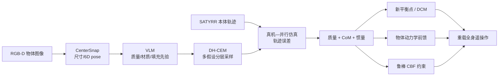

# Whole-Body Bilateral Teleoperation：带多阶段物体参数估计的轮式人形遥操作

**Whole-Body Bilateral Teleoperation with Multi-Stage Object Parameter Estimation for Wheeled Humanoid Locomanipulation**（[arXiv:2508.09846](https://arxiv.org/abs/2508.09846)）由 UIUC 团队提出，把未知负载惯性在线估计接入 SATYRR 轮式人形的全身双边遥操作、平衡点更新和柔顺操作控制。

## 一句话定义

**该框架先用 RGB-D 与 VLM 缩小未知物体质量/质心/惯量搜索空间，再以 DH-CEM 在高保真并行仿真中用真机本体轨迹在线修正参数，使轮式人形能柔顺搬运约自重三分之一的负载。**

## 英文缩写速查

| 缩写 | 英文全称 | 简要说明 |
|------|----------|----------|
| VLM | Vision-Language Model | 根据尺寸、材质与填充状态给惯性参数先验 |
| DH-CEM | Decoupled Hierarchical Cross-Entropy Method | 先质量/质心、后惯量的多假设采样估计器 |
| DCM | Divergent Component of Motion | 人—机器人动态同步与平衡点跟踪状态 |
| HMI | Human-Machine Interface | 采集人体运动/力并回传全身触觉的驾驶界面 |
| CBF | Control Barrier Function | 在模型不确定下执行碰撞避免的安全过滤器 |
| CoM | Center of Mass | 物体与机器人平衡补偿需要的质心 |

## 为什么重要

- **重物不能当小扰动：** 未知质量与质心会移动轮式人形平衡点，未知惯量会破坏手臂跟踪和力反馈解释。
- **不用专门激励或腕部 F/T：** 操作员自然举升轨迹与本体状态即可驱动在线估计，更接近真实遥操作。
- **语义先验接上动力学闭环：** VLM 不直接控制机器人，只负责缩小采样空间；物理交互再纠错。
- **共享自治分工清晰：** 人负责路径和任务意图，机器人负责平衡、负载补偿与安全约束。

## 核心信息

| 项 | 内容 |
|----|------|
| 机构 | 伊利诺伊大学厄巴纳-香槟分校（UIUC） |
| 平台 | SATYRR，12 kg 轮式人形、双 4-DoF 臂、1-DoF 夹爪 |
| 估计 | CenterSnap 尺寸 → VLM 先验 → DH-CEM + Isaac Gym |
| 控制 | DCM 动态同步、平衡点更新、低增益 PD + 逆动力学前馈、robust CBF |
| 负载 | 3.3 kg 水瓶，约机器人自重 1/3 |
| 实时性 | 估计触发后硬件约 0.8–1.0 s；仿真动态测试约 0.5 s |
| 开放状态 | **未开源**：arXiv/论文未列官方项目页、仓库或数据 |

## 流程总览

## 核心机制（方法栈）

### 1）三阶段物体惯性估计

CenterSnap 从单帧 RGB-D 估计 cuboid 尺寸，约束 CoM 位于物体内部；VLM 根据外观、材质和填充状态给质量/密度与惯量初值。DH-CEM 以多个假设并行搜索，先估强影响且可观的质量/CoM，再由尺寸约束推惯量，降低十维参数耦合。

### 2）以仿真复现真机轨迹

采样对象注入经 system identification 对齐的 Isaac Gym 模型，对比同一自然举升输入下的关节位置/速度历史。最匹配真机轨迹的仿真对象参数被回写；离线 SysID 先校准摩擦、延迟和控制增益，避免把机器人模型误差归到负载。

### 3）物体感知的双边全身控制

估计质量和末端位置决定新的静态倾角与 DCM 参考；手臂用低 PD 保持柔顺，再以估计惯性做逆动力学前馈。HMI 回传动态差异，让人感知扰动，而机器人自动处理负载引起的平衡偏移。

### 4）安全控制扩展

在独立的仿真自主操作实验中，估计参数进入 forward dynamics 和 acceleration-level CBF；输入到状态安全的鲁棒裕量吸收剩余参数误差。它展示估计器不只服务遥操作，也可更新物体相关安全约束。

## 源码运行时序图

**不适用。** 截至 2026-07-28，论文/arXiv 未提供官方项目页、代码仓库、数据或运行入口；无法把 CenterSnap、VLM、Isaac Gym、SATYRR 控制器拼成可验证的官方复现时序。

## 工程实践与开源状态

| 项 | 建议 / 状态 |
|----|-------------|
| 线程 | 主控制、估计仿真、HMI、尺寸/VLM、夹爪分计算单元，以 UDP 通信 |
| 频率 | SATYRR 主控约 833 Hz；尺寸约 100 Hz；估计更新约 30 Hz |
| 触发 | 仅在静转动检测或机械 trigger 时估计，避免恒定物体重复计算 |
| 先验 | VLM 延迟约 2–3 s，应在接触前运行；不能当安全关键真值 |
| Sim2Real | 先对齐摩擦、时延和增益，再做负载估计，否则参数不可辨识 |
| 安全 | 对估计误差保留鲁棒 margin、扭矩限幅、CBF slack 与急停 |
| 开源状态 | **未开源**；硬件和软件均为定制系统，论文信息不足以直接复现 |

## 与其他工作对比

| 方法 | 先验/观测 | 优势 | 局限 |
|------|-----------|------|------|
| 经典最小二乘 | 激励 + 力矩/加速度 | 理论明确 | 易得非物理解、需激励/传感 |
| VLM-only | 图像 + 语义 | 接触前快速 | 密度/填充判断可能错 |
| 学习式本体估计 | proprioception + 训练集 | 推理快 | 跨动作/几何泛化受限 |
| 本文 DH-CEM | 视觉/VLM + 本体 + 仿真 | 多假设、物理可行、可在线纠错 | 依赖高保真仿真和算力 |

## 实验与评测

- **硬件估计集：** 10 个对象 × 3 条自然举升轨迹，共 30 样本；完整 DH-CEM 在质量、CoM、惯量总体误差上优于消融与优化基线。
- **实时性：** 硬件在线 refinement 约 **0.8–1.0 s**；Isaac Gym → MuJoCo 动态变化测试约 **0.5 s**。
- **手臂跟踪：** 5 个物体平均 MSE，补偿后肩 pitch/roll/yaw、肘 pitch 分别改善 **49.5%/24.2%/76.4%/78.4%**。
- **全身重载：** 搬运 **3.3 kg** 水瓶；无补偿多数尝试失败，补偿使举升—后退—返回—释放与含下蹲序列可完成。
- **安全扩展：** 仅 CBF 而无物体估计仍碰撞；估计 + robust CBF 在仿真中满足安全约束，但未做硬件验证。

## 结论

**未知重载下真正改善遥操作的不是 VLM 猜得多准，而是“语义先验缩域 + 物理交互纠错 + 控制器实时消费参数”的闭环。**

1. **VLM 只适合做先验** — 其质量估计可偏差很大，必须让 DH-CEM 用本体轨迹修正。
2. **先质量/CoM 再惯量更稳定** — 分层估计降低参数耦合并保证物理可行。
3. **估计必须进入控制才有价值** — 平衡点和逆动力学补偿直接带来 24.2%–78.4% 关节 MSE 改善。
4. **触觉反馈依赖正确模型** — 错误负载模型会把不可解释的大力反馈给人，增加疲劳而非帮助。
5. **结论目前限于定制轮式平台** — 未开源、单类重载任务和仿真 CBF 限制泛化判断。

## 局限与风险

- VLM 对物体内容、密度和填充状态的判断无保证；表中部分 CoM/质量 refinement 反而变差。
- 假设物体刚性固定在夹爪，弱化了滑移、柔性物体和复杂接触的不可建模误差。
- 需要 Isaac Gym 并行仿真、离线 SysID 和多计算单元，工程栈较重。
- 重载遥操作主要是一名操作员、SATYRR 与水瓶类任务，缺少成功率、用户样本和疲劳量表。
- CBF 安全结果仅在仿真，尚不能视为真机安全保证。
- 无官方代码/项目页/数据，独立复现与参数核对困难。

## 与其他页面的关系

- 任务入口：[Teleoperation](../tasks/teleoperation.md)、[Loco-Manipulation](../tasks/loco-manipulation.md)
- 控制基础：[Whole-Body Control](../concepts/whole-body-control.md)
- 映射基础：[Motion Retargeting](../concepts/motion-retargeting.md)
- 路线位置：[遥操作纵深 Stage 2](../../roadmap/depth-teleoperation.md)

## 参考来源

- [humanoid_pnb_whole-body-bilateral-teleoperation-with-multi-st.md](../../sources/papers/humanoid_pnb_whole-body-bilateral-teleoperation-with-multi-st.md)
- 论文：<https://arxiv.org/abs/2508.09846>
- 深读笔记：<https://imchong.github.io/Robot_Learning_Paper_Notebooks/papers/07_Teleoperation/Whole-Body_Bilateral_Teleoperation_with_Multi-Stage_Object_Parameter_Estimation/Whole-Body_Bilateral_Teleoperation_with_Multi-Stage_Object_Parameter_Estimation.html>

## 推荐继续阅读

- arXiv HTML：<https://arxiv.org/html/2508.09846>
- [遥操作纵深路线](../../roadmap/depth-teleoperation.md)
