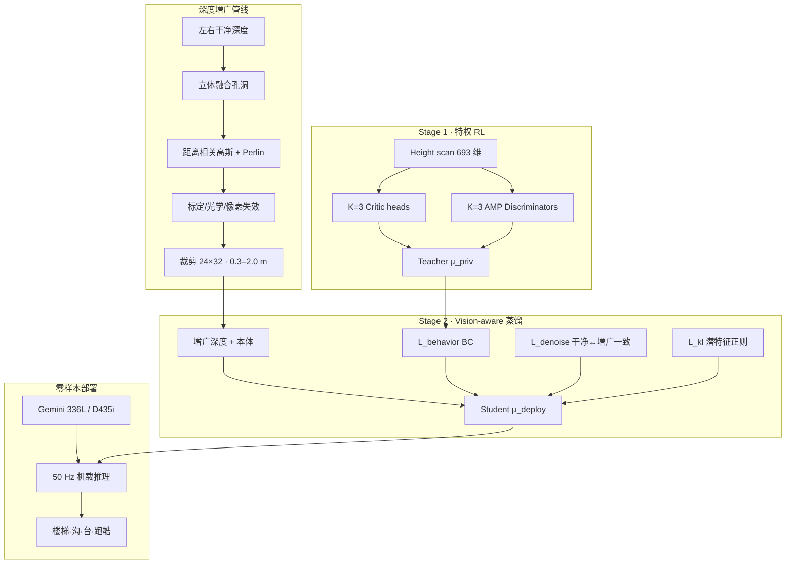

# Now You See That：端到端视觉人形 Locomotion

**Now You See That**（*Learning End-to-End Humanoid Locomotion from Raw Pixels*，哈尔滨工业大学 / HONOR Robotics Team，arXiv:[2602.06382](https://arxiv.org/abs/2602.06382)，[项目页](https://hellod035.github.io/Now_You_See_That/)，RSS 2026）提出 **两阶段** 视觉人形 locomotion 框架：先在 **特权 height scan** 上用 **分地形多 critic + 多 discriminator AMP** 学统一 teacher，再以 **vision-aware DAgger 蒸馏** 把控制知识迁到 **全面建模的立体深度噪声** 上，使 **单策略** 从 **24×32 增广深度** 端到端完成极端跑酷与 **双向长楼梯**；在 **Orbbec Gemini 336L** 定制人形上 **88/90** 真机 trial 成功，并报告 **Unitree G1 + RealSense D435i** 跨平台初步结果。

## 英文缩写速查

| 缩写 | 英文全称 | 简要说明 |
|------|----------|----------|
| RL | Reinforcement Learning | 强化学习范式 |
| PPO | Proximal Policy Optimization | 特权 teacher 阶段的 on-policy 策略优化 |
| AMP | Adversarial Motion Priors | 分地形判别器提供的类人运动风格奖励 |
| DAgger | Dataset Aggregation | 学生在线 rollout、teacher 标注的行为蒸馏框架 |
| BC | Behavior Cloning | 行为克隆；本文仅为蒸馏损失之一 |
| DR | Domain Randomization | 动力学/接触等仿真随机化 |
| Sim2Real | Simulation to Real | 仿真训练、真机零样本部署 |
| SR | Success Rate | 穿越地形不跌倒的 episode 占比 |
| PDR | Power Degradation Ratio | 真实风格噪声下相对干净深度的功率退化比 |
| RDT-Bench | Real-World Depth Transfer Benchmark | 本文提出的 CycleGAN 评测基准 |
| CNN | Convolutional Neural Network | 深度编码器骨干 |
| KL | Kullback–Leibler divergence | 潜特征分布相对标准正态的 KL 正则 |
| PHP | Perceptive Humanoid Parkour | 人形深度跑酷多阶段对照路线 |
| SSR | Scaling Surefooted and Symmetric Humanoid Traversal | 单阶段深度 + 想象落脚对照路线 |

## 为什么重要

- **把「深度传感器本身」当作 sim2real 主战场：** 多数视觉 locomotion 只做简单高斯/ dropout 增广；本文用 **8 步管线** 系统模拟立体孔洞、距离相关噪声、Perlin 结构化干扰与标定漂移，并在 **RDT-Bench** 上相对 Humanoid Parkour Learning 提升 **+27.9% SR**、**−25.1% PDR**。
- **统一多地形 ≠ 单 value 硬扛：** 楼梯/平台、沟壑、粗糙地形动力学与风格冲突；**$K=3$ critic + $K=3$ discriminator** 让单 actor 仍能吃分地形梯度（相对 Single Critic/Disc. **+16.9% SR**）。
- **特权 height → 噪声深度 的可部署蒸馏：** 直接深度 RL 的 PDR 高达 **58.1%**；**DAgger + 去噪一致性 + KL** 把 teacher 迁到增广深度（仅 BC 仅 **86.0% SR**）。
- **人形端到端深度的「精细 + 极端」兼得：** 论文 Table I 自比声称同时覆盖 **长程无漂移楼梯** 与 **极端跑酷**；真机 **30+ 级连续楼梯**、**45 cm 宽沟**、野外/室内跑酷（项目页视频）。

## 流程总览

## 核心机制（归纳）

### 1）Realistic depth sensor simulation（8 步增广）

- **立体融合：** 左右视差一致性阈值 $\tau\in[0.05,0.20]$，失败像素为零 → 再现遮挡/弱纹理 **孔洞**（消融去掉后 SR **−8.5%**，最大单项）。
- **距离相关噪声：** $\sigma(d)=|c_0+c_1 d+c_2 d^2|$ 模拟逆深度放大。
- **结构化 Perlin + 随机卷积 + 标定尺度/内外参漂移 + 死像素 + 延迟 2–4 帧。**
- 输出 **24×32**、**[0.3, 2.0] m** 与真机预处理对齐。

### 2）Privileged multi-critic / multi-discriminator RL

- Teacher 观测：**1.6 m×1.0 m** ego-centric height scan（$21\times33$）+ 本体。
- **三类地形：** 楼梯与平台（上下）、沟壑、粗糙地形；各配 **独立 value head + AMP discriminator** 与 **分地形 reward shaping**。
- 全面 **动力学 DR**（摩擦、质量、COM、执行器、外扰等，Table III）。

### 3）Vision-aware behavior distillation

- **DAgger 式** 在线：student 用增广深度与环境交互，teacher 用 clean height scan 给监督。
- $\mathcal{L}_{total}=\mathcal{L}_{behavior}+\lambda_{denoise}\mathcal{L}_{denoise}+\lambda_{kl}\mathcal{L}_{kl}$（$\lambda=0.1$）。
- **去噪目标** 约束同一帧干净/增广深度的编码一致；**KL** 防表征坍缩。

## 常见误区

1. **「增广 = 普通 DR」** — 本文重点是 **传感器物理与立体几何伪影**，不是只随机化地面摩擦；RDT-Bench 专为 **感知迁移** 设计。
2. **「多 critic = 多策略」** — 仍是 **单 actor 统一策略**；分地形的是 **价值与风格判别**，不是技能切换专家库（对照 [PHP](./paper-hrl-stack-22-perceptive_humanoid_parkour.md)）。
3. **「端到端 = 单阶段 RL」** — 部署端到端，但训练依赖 **特权 height teacher**；直接深度 RL 明显更差（Table IV）。
4. **与 [SSR](./paper-ssr-humanoid-open-world-traversal.md) 混淆** — SSR 强调 **单阶段想象落脚点 + 对称增广 + 户外 1.3 km**；Now You See That 强调 **深度噪声建模 + 特权蒸馏 + 多 critic**，更贴近 **立体深度 sim2real** 与 **跑酷+精细楼梯** 组合。

## 实验与评测（索引）

| 维度 | 论文报告要点 |
|------|----------------|
| RDT-Bench 平均 | **98.9% SR**，**27.7×10¹ W**，**5.8% PDR** |
| vs Humanoid Parkour [60] | **+27.9% SR**，**−25.1% PDR** |
| vs Single Critic/Disc. | **+16.9% SR**，**−15.0% PDR** |
| 增广关键项 | 去 Stereo Fusion **−8.5%**；去 Calibration **−4.4%** |
| 蒸馏关键项 | 去 $\mathcal{L}_{denoise}$ **−5.5%**；BC only **−12.9%** |
| 真机总成功率 | **97.8%**（88/90）；长楼梯 **30+ 级 100%** |
| 下楼弱点 | **86.7%**（重力放大 + 台阶边缘遮挡立体伪影） |
| 跨平台 | G1 + D435i 附录初步验证 |
| 控制频率 | 机载 **50 Hz**，无实机微调 |

## 与其他工作对比

| 路线 | 感知 | 噪声 / 迁移 | 多地形学习 | 阶段 | 精细楼梯 | 极端跑酷 |
|------|------|-------------|------------|------|----------|----------|
| **Now You See That** | **24×32 深度** | **8 步立体增广 + 去噪蒸馏** | **多 critic + 多 disc** | **特权 height → 深度 DAgger** | **✓ 双向长程** | **✓** |
| [SSR](./paper-ssr-humanoid-open-world-traversal.md) | 36×36 深度 | 标准 DR + Warp 深度 | 分地形 AMP | **单阶段 PPO** | ✓ | 户外长程为主 |
| [PHP](./paper-hrl-stack-22-perceptive_humanoid_parkour.md) | 深度 | 标准 DR | motion matching 多技能 | MM 参考 + 专家 + DAgger | ✓ | ✓ 技能链 |
| [Humanoid Parkour Learning](./paper-notebook-humanoid-parkour-learning.md) | 端到端深度 | Moderate DR | 单策略 | 直接/标准管线 | ✗ | ✓ |
| [Extreme Parkour](./extreme-parkour.md) | 四足深度 | scandots 蒸馏 | 单策略 | 两阶段 DAgger | ✗ | ✓ |

## 与其他页面的关系

- 任务挂接：[stair-obstacle-perceptive-locomotion.md](../tasks/stair-obstacle-perceptive-locomotion.md)、[humanoid-locomotion.md](../tasks/humanoid-locomotion.md)
- 方法：[dagger.md](../methods/dagger.md)、[privileged-training.md](../concepts/privileged-training.md)、[sim2real.md](../concepts/sim2real.md)
- 平台：[unitree-g1.md](./unitree-g1.md)（跨平台验证）

## 参考来源

- [now_you_see_that_arxiv_2602_06382.md](../../sources/papers/now_you_see_that_arxiv_2602_06382.md) — 论文全文编译摘录
- [now-you-see-that-github-io.md](../../sources/sites/now-you-see-that-github-io.md) — 项目页结构与 demo 索引
- [now_you_see_that.md](../../sources/repos/now_you_see_that.md) — 官方 GitHub README 与外链
- 论文 PDF：<https://arxiv.org/pdf/2602.06382>
- 深读笔记（姊妹仓）：<https://imchong.github.io/Humanoid_Robot_Learning_Paper_Notebooks/papers/05_Locomotion/Now_You_See_That_Learning_End-to-End_Humanoid_Locomotion_from_Raw_Pixels/Now_You_See_That_Learning_End-to-End_Humanoid_Locomotion_from_Raw_Pixels.html>

## 推荐继续阅读

- [项目页实机视频](https://hellod035.github.io/Now_You_See_That/)（Wild Parkour、上下楼梯、垫脚石、平衡恢复）
- [GitHub 仓库](https://github.com/Hellod035/Now_You_See_That)（Citation、视频链接；代码待发布）
- [YouTube 短视频](https://youtube.com/shorts/hC3Otwjjil8)
