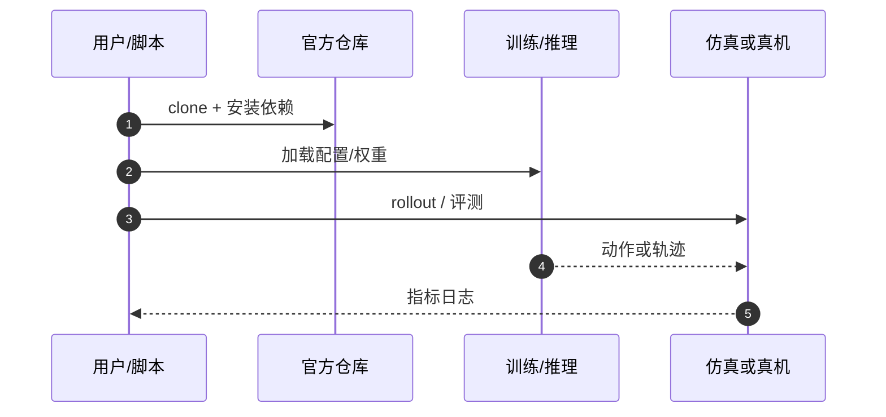

# NowWAM（arXiv:2609.28339）

**Beyond Future Prediction: Denoising as Generative Adaptation for Robot Control**（[代码](https://github.com/xmz111/NowWAM)，[项目页](https://xmz111.github.io/NowWAM/)，[arXiv:2609.28339](https://arxiv.org/abs/2609.28339)）来自 [具身智能小站 · 13 篇盘点](../../sources/blogs/wechat_embodied_13_papers_forgetmimic_2026-09-24.md)（2026-09-24）。

## 一句话定义

**生成式视觉先验不必预测未来画面；沿完整去噪轨迹适配当前观测即可稳定控制，并显著降 token 与步时。**

## 英文缩写速查

| 缩写 | 英文全称 | 简要说明 |
|------|----------|----------|
| VLA | Vision-Language-Action | 视觉–语言–动作策略 |
| RL | Reinforcement Learning | 强化学习 |
| TO | Trajectory Optimization | 轨迹优化 |
| HITL | Human-in-the-Loop | 人在回路 |

## 为什么重要

- VLA/WAM 训练常默认「预测未来帧 = 生成式先验价值」；NowWAM 用受控对照拆出真正贡献在 **去噪轨迹接口** 而非时间方向。
- 纳入 [13 篇技术地图](../overview/embodied-13-papers-technology-map.md) 阅读坐标。
- 开源结论（步骤 2.5，2026-09-24）：**已开源**。

## 核心机制

| 项 | 内容 |
|----|------|
| **arXiv** | [2609.28339](https://arxiv.org/abs/2609.28339) |
| **开源** | **已开源** |
| **要点** | 当前观测 latent 作为生成式目标与动作专家共享；训练采样 DiT 去噪轨迹上的表征，推理在 σ=0 干净端点读控制表征，无需额外视觉 rollout。 |
| **文内指标** | LIBERO-Plus **87.7%**（FLUX2-Klein）；视觉 token **784→392**；步时 **2.85s→1.63s**；RoboCasa 100-shot **64.9%**。 |

## 源码运行时序图

## 实验与评测

- LIBERO-Plus **87.7%**（FLUX2-Klein）；视觉 token **784→392**；步时 **2.85s→1.63s**；RoboCasa 100-shot **64.9%**。
- **读法：** 公众号归纳；逐项 baseline 与协议以 arXiv PDF 为准。

## 与其他工作对比

- 横向索引见 [13 篇技术地图](../overview/embodied-13-papers-technology-map.md)。

## 结论

**去噪轨迹 > 未来预测 > 仅干净端点适配** — 部署前对齐 backbone、扰动集与 token 口径再比成功率。

1. 开源边界：**已开源** — 以项目页/仓库实际链接为准（入库日 2026-09-24）。
2. 核心机制：当前观测 latent 作为生成式目标与动作专家共享；训练采样 DiT 去噪轨迹上的表征，推理在 σ=0 干净端点读控制表征，无需额外视觉 rollout。…
3. 部署前核对任务协议与硬件条件，勿直接横比公众号摘录数字。

## 关联页面

- [Vla](../methods/vla.md)
- [World Action Models](../concepts/world-action-models.md)
- [Manipulation](../tasks/manipulation.md)
- [Embodied 13 Papers Technology Map](../overview/embodied-13-papers-technology-map.md)

## 参考来源

- [13 篇盘点（公众号）](../../sources/blogs/wechat_embodied_13_papers_forgetmimic_2026-09-24.md)
- [Beyond Future Prediction: Denoising as Generative Adaptation for Robot Control](../../sources/papers/nowwam_arxiv_2609_28339.md)

## 推荐继续阅读

- [arXiv:2609.28339](https://arxiv.org/abs/2609.28339) — 原文
