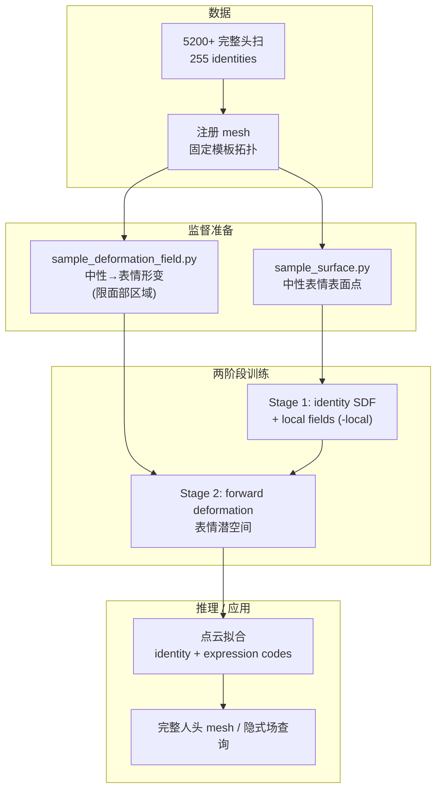
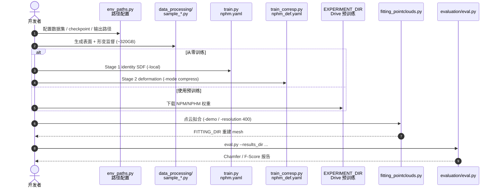

# NPHM（Learning Neural Parametric Head Models）

**NPHM**（*Learning Neural Parametric Head Models*，[arXiv:2212.02761](https://arxiv.org/abs/2212.02761)，[项目页](https://simongiebenhain.github.io/NPHM/)，[代码](https://github.com/SimonGiebenhain/NPHM)，**CVPR 2023**）由 **慕尼黑工业大学（TUM）**、**Synthesia**、**伦敦大学学院（UCL）**（Simon Giebenhain, Tobias Kirschstein, Markos Georgopoulos, Martin Rünz, Lourdes Agapito, Matthias Nießner）提出：用 **混合神经场** 构建 **完整人头**（非仅面部）3D morphable model，在 **解耦潜空间** 中分别建模 **身份几何** 与 **表情形变**，并以 **锚点局部场 ensemble** 保留高保真细节。

## 一句话定义

**在 canonical 空间用 SDF 存身份、用神经形变场驱动表情，再以面部锚点局部神经场补细节，从 5200+ 完整头扫学出可拟合、可泛化的神经参数化人头模型。**

## 英文缩写速查

| 缩写 | 英文全称 | 简要说明 |
|------|----------|----------|
| NPHM | Neural Parametric Head Model | 本文完整人头模型（含局部场） |
| NPM | Neural Parametric Model | 消融：无局部场版本 |
| SDF | Signed Distance Field | 身份在 canonical 空间的隐式几何 |
| 3DMM | 3D Morphable Model | 经典参数化人脸/头模型族 |
| CVPR | Conference on Computer Vision and Pattern Recognition | 发表会议 |
| Chamfer | Chamfer Distance | 点云拟合/评测常用几何误差 |
| F-Score | F-Score @ threshold | 表面重合阈值下的 F 值（@1mm/@5mm） |

## 为什么重要

- **完整人头 vs 传统 3DMM：** 多数 morphable model 偏 **面部** 或拓扑不完整；NPHM 针对 **含颅顶、耳廓等完整几何** 的高精度扫描，平均 **~3.5M faces/scan**。
- **隐式 + 局部场：** 全局 SDF 保拓扑与身份，**local fields** 补毛孔级细节，兼顾 **可变形** 与 **高保真**。
- **解耦身份/表情：** 独立潜码便于 **跨人表情迁移、单扫描拟合、随机采样**，是 telepresence / 数字人 **几何基座** 的常见选型。
- **可复现工程栈：** 官方 GitHub 提供 **两阶段训练、点云拟合、指标脚本** 与 **Drive 预训练**；相对仅论文的隐式头模更易落地验证。
- **后续 MonoNPHM：** 同组将路线扩展到 **单目 RGB 视频 tracking**，形成「参数化头模 → 单目跟踪」演进链。

## 核心信息

| 项 | 内容 |
|----|------|
| **机构** | 慕尼黑工业大学（TUM）；Synthesia；伦敦大学学院（UCL） |
| **Venue** | CVPR 2023 |
| **训练数据** | 自采 **>5200** scans，**255** identities；定制高端 3D 扫描 |
| **测试协议** | 23 identities × 427 expressions；反投影点云拟合 |
| **开源** | **已开源** — 代码 + 预训练 + demo 数据；**全量扫描需申请表** |

## 开源状态

核查日：**2026-09-18**（[项目页](https://simongiebenhain.github.io/NPHM)、[GitHub](https://github.com/SimonGiebenhain/NPHM)）。

| 产物 | 状态 |
|------|------|
| 训练 / 拟合 / 评测代码 | **已开源** |
| 预训练 NPM & NPHM | **Google Drive 已发布** |
| Demo dummy 数据 | **Google Drive 已发布** |
| 全量 5200+ 扫描 | **Google Form 申请**（非公开 torrent/HF） |
| [Hugging Face papers/2212.02761](https://huggingface.co/papers/2212.02761) | 论文卡片，**非**权重托管 |
| License | GitHub `Other`；根目录无标准 SPDX 文件 |

## 流程总览

## 核心原理

### 混合神经参数化表示

| 组件 | 表示 | 作用 |
|------|------|------|
| **Identity** | Canonical **SDF** + 身份潜码 | 中性表情完整人头几何 |
| **Expression** | **Neural deformation field** + 表情潜码 | 身份空间内的形变 |
| **Local detail** | **Ensemble of local fields** @ facial anchors | 高保真局部细节 |
| **NPM 消融** | 无 `-local` / `npm.yaml` | 验证局部场贡献 |

### 训练与监督

- **Stage 1**（`train.py` + `nphm.yaml`）：在中性表情扫描上学习 identity SDF；NPHM 加 `-local` 启用局部场。
- **Stage 2**（`train_corresp.py` + `nphm_def.yaml`）：学习 **forward deformation**（`-mode compress`）；需 Stage 1 checkpoint。
- 监督采样缓存体积大（README 提示约 **320GB**）；形变监督基于 **注册 mesh**，且 **限制在面部区域**。

### 推理协议

- 输入：**反投影单视角点云**（测试集每表情 **2500** 点 + 随机略变 frontal；每身份一次背面）。
- 优化：**联合** identity 与全部 expression codes（`fitting_pointclouds.py`）。
- 评测：Chamfer-L1/L2、Normal Consistency、F-Score @1mm/@5mm（渲染采样点，减轻闭口内腔惩罚）。

## 源码运行时序图

官方仓 [SimonGiebenhain/NPHM](https://github.com/SimonGiebenhain/NPHM) 提供完整 **训练 → 拟合 → 评测** 运行时（归档见 [`sources/repos/simongiebenhain-nphm.md`](../../sources/repos/simongiebenhain-nphm.md)）：

- **最短复现：** conda 环境 → `pip install -e .` → 下载 Drive **预训练** → `fitting_pointclouds.py -demo`。
- **全量训练：** 需申请数据集 + 准备 ~320GB 监督缓存 + 两阶段 GPU 训练。

## 工程实践

| 项 | 建议 |
|----|------|
| 环境 | Python 3.9；GPU PyTorch（README 示例 1.13 / CUDA 11.6） |
| 路径 | 先改 `src/NPHM/env_paths.py`；多机可 `git rm --cached` 本地副本 |
| 选型 NPM vs NPHM | 要细节用 **NPHM**（`-local`）；消融/轻量试 **NPM** |
| 数据 | Demo 用 Drive dummy；研究用 **Form 申请** 全量集 |
| 磁盘 | 监督缓存 ~**320GB**；规划存储再开训练 |
| 下游 | 单目视频跟踪读 **MonoNPHM**（独立仓），勿假设本仓直接支持 RGB 视频 |
| 机器人关联 | 作 **telepresence 数字人头几何基座**，非策略控制输入；与 [SHELLS](./paper-shells-layered-surface-sampling.md) 多视角前馈路线互补 |

## 局限与风险

- **全量数据门槛：** 5200+ 扫描 **非公开批量下载**；复现 SOTA 数字需获批数据集。
- **形变监督范围：** forward deformation **限面部**；非面部区域表情建模可能不足。
- **输入模态：** 默认可跑通路径是 **3D 点云 / 扫描拟合**；单目 RGB 需 **MonoNPHM** 后续工作。
- **许可模糊：** GitHub License 为 Other；商用前需自行确认作者/机构授权。
- **算力与存储：** 两阶段训练 + 320GB 预处理，对小团队不友好。
- **与机器人策略距离：** 输出是 **人头几何资产**，不直接提供 manipulation / locomotion 策略。

## 实验与评测

**协议：** 23 identities × 427 expressions；输入为**反投影单视角点云**（每表情 2500 点 + 随机略变 frontal，每身份一次背面）；拟合时**联合**优化 identity 与全部 expression codes（`fitting_pointclouds.py`）。

| 项 | 内容 |
|----|------|
| 指标 | Chamfer-L1 / L2、Normal Consistency、F-Score @1mm / @5mm（`scripts/evaluation/eval.py`） |
| 采样方式 | 渲染反投影采样点，减轻闭口内腔被过度惩罚 |
| 主消融 | **NPM**（`npm.yaml`，无 `-local`）vs **NPHM**（`-local` 启用局部场）——隔离局部场对细节的贡献 |
| 读法 | 数值须在**原始尺度**下对齐；论文报告优于同期隐式头模基线，逐项表格以 arXiv PDF 为准（本页不搬运具体数字） |

## 与其他工作对比

| 对照 | 差异读法 |
|------|----------|
| **传统 3DMM**（本文要替代的默认做法） | 同为参数化人头，差别在**覆盖范围与表示**：经典 3DMM 多偏面部、拓扑不完整且用线性基；NPHM 覆盖含颅顶/耳廓的完整几何，用 canonical SDF + 神经形变场。代价是拟合要跑优化，不再是一次线性求解 |
| [SHELLS](./paper-shells-layered-surface-sampling.md) | 同为高保真人头几何，**推理形态相反**：SHELLS 是标定多视角一次前馈出固定拓扑，NPHM 是单扫描/点云做迭代拟合。要速度选前者，要可采样可迁移的潜码选后者 |
| **MonoNPHM（同组后续）** | 同一模型族的输入模态延伸：本仓默认可跑通的是 3D 点云 / 扫描拟合，单目 RGB 视频 tracking 属 MonoNPHM 独立仓，勿假设本仓直接支持 |
| [DynHair](./paper-dynhair.md) | 同系但分工不同：DynHair 把头发从 Gaussian 纹理中解耦，NPHM 提供其下的**静态参数化头几何**基座。两者叠用而非二选一 |
| [Face Anything](./paper-face-anything-4d-face-reconstruction.md) | 同为面部几何，NPHM 强调**完整头 + 解耦潜码**，该页强调单目 4D。分界是**是否需要可采样 / 可迁移的参数空间** |
| [策略的视觉表征](../concepts/visual-representation-for-policy.md) | 提醒读法：NPHM 输出是人头几何资产，不是策略输入；与机器人控制的距离见该页与「局限与风险」 |

## 结论

NPHM 是 **完整人头神经 morphable model** 的 CVPR 2023 代表作：用 **SDF 身份 + 形变场表情 + 局部场细节** 在超大规模自采扫描上做到 SOTA 级拟合/重建，并给出 **可运行开源栈**。

- **真影响指标：** 完整几何（非仅脸）+ **解耦潜码** + **局部场细节** 三者同时成立；测试集点云拟合 Chamfer/F-Score 优于 contemporary SOTA。
- **次要代价：** 预处理 **~320GB**、全量数据 **申请制**、License 非标准 SPDX。
- **部署读法：** 需要 **可拟合参数化完整头模** 的数字人 / telepresence 管线 → 优先 NPHM；需要 **标定多视角一次前馈** → 看 [SHELLS](./paper-shells-layered-surface-sampling.md)；需要 **单目视频** → **MonoNPHM**。
- **工程入口：** Drive **预训练 + fitting demo** 即可验证；从零训练先确认数据集审批与磁盘。
- ** lineage：** 同 Nießner 系 [DynHair](./paper-dynhair.md) 把头发从 Gaussian 纹理中解耦——NPHM 提供更早的 **静态参数化头几何** 基座。

## 关联页面

- [Teleoperation](../tasks/teleoperation.md) — telepresence / 数字人上游几何
- [SHELLS](./paper-shells-layered-surface-sampling.md) — 多视角前馈固定拓扑人头（合成→真实）
- [DynHair](./paper-dynhair.md) — 显式发丝动态化身（同作者系）
- [Humanoid 训练数据管线](../queries/humanoid-training-data-pipeline.md) — 面部/化身资产在数据流中的位置
- [Face Anything](./paper-face-anything-4d-face-reconstruction.md) — 单目 4D 面部几何对照

## 参考来源

- [NPHM arXiv 归档](../../sources/papers/nphm_arxiv_2212_02761.md)
- [NPHM 项目页归档](../../sources/sites/nphm-simongiebenhain-github-io.md)
- [SimonGiebenhain/NPHM 仓库归档](../../sources/repos/simongiebenhain-nphm.md)

## 推荐继续阅读

- Giebenhain et al., *Learning Neural Parametric Head Models*, CVPR 2023 / [arXiv:2212.02761](https://arxiv.org/abs/2212.02761)
- [MonoNPHM 项目页](https://simongiebenhain.github.io/MonoNPHM/) — 单目 RGB 视频人头 tracking 后续版
