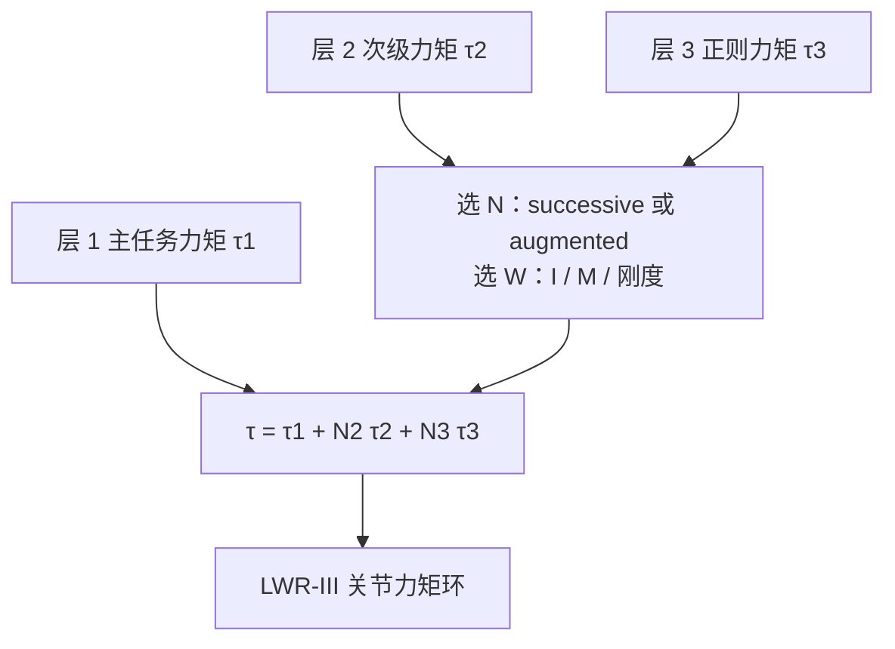

# 零空间投影综述（Dietrich et al., IJRR 2015）

**Dietrich, Ott, Albu-Schäffer** 的 *An overview of null space projections for redundant, torque-controlled robots*（[IJRR 2015](https://doi.org/10.1177/0278364914566516)，开放 PDF：[DLR elib](https://elib.dlr.de/101443/2/NullspaceSurvey.pdf)）把 1980 年代以来的力矩控制冗余解析收成一张选型图：层次怎么叠、投影器怎么加权、以及这些差别在 **7 轴 LWR-III** 上还剩多少。

## 一句话定义

**给力矩控制冗余机器人一本投影器手册：先选 successive 还是 augmented，再选静力学/动力学/刚度一致，最后用真机结果警告「仿真里最优的 $W=M$ 在 LWR 上优势不大」。**

## 英文缩写速查

| 缩写 | 英文全称 | 简要说明 |
|------|----------|----------|
| DOF | Degrees of Freedom | 本文真机为 7 轴 LWR-III |
| TCP | Tool Center Point | 实验主任务坐标系 |
| OSF | Operational Space Formulation | Khatib 动力学一致投影的来源 |
| LWR | Lightweight Robot | DLR/KUKA 轻型臂实验平台 |
| HQP | Hierarchical Quadratic Programming | 综述范围之外的不等式替代路线 |

## 为什么重要

wiki 里 [HQP](../concepts/hqp.md) / [TSID](../concepts/tsid.md) 已经解释「优先级用 QP 表达」。本综述回答更老、但仍在 7 轴阻抗里大量使用的问题： **$N=I-J^\top(J^\#)^\top$ 到底有几种写法、哪种在真机上稳。** 没有这篇，工程师容易把 Khatib 教材里的 $W=M$ 当成唯一正确实现。

## 核心信息

| 项 | 内容 |
|----|------|
| **机构** | 德国航空航天中心（DLR）；慕尼黑工业大学（TUM） |
| **平台** | 仿真 4-DoF 平面臂；真机 **DLR KUKA LWR-III，7 DoF** |
| **开源** | **确认未开源**（无官方仓；实验在封闭硬件上） |
| **对照实现** | [Mayr 笛卡尔阻抗](./paper-cartesian-impedance-controller.md)、[libfranka](../../sources/repos/libfranka.md) |

## 核心原理

### 层次：Successive vs Augmented

- **Successive：** 每层只对**上一层**的 $J$ 投影再左乘 $N_{i-1}$。实现短，多层后不能严格保证对所有更高层静力学解耦。
- **Augmented：** 从第三层起对堆叠雅可比 $J_{1:i-1}$ 一次投影（Siciliano & Slotine 1991）。层次更严，增广矩阵带来算法奇异。

两层时二者相同；争议从第三层开始——7 轴「位置 + 姿态 + 关节」正好是三层。

### 一致性：Static / Dynamic / Stiffness

| 一致性 | 判据 | 典型 $W$ |
|--------|------|----------|
| 静力学 | 稳态下不产生主任务力 | $I$（Moore–Penrose） |
| 动力学 | 不产生主任务加速度 | $M(q)$（Khatib）；文中证明无穷多 $W$ 同类 |
| 刚度 | 高层由机械弹簧维持时不对抗弹簧 | 用刚度矩阵代替惯量加权 |

另有一类「先做加速度层投影再补 $M$」的动力学一致变体（文 §3.3.2）：理论性质接近 Khatib，但 **LWR 实验出现稳定性问题**，不要当默认代码。

### 流程总览

## 实验与评测

仿真（4-DoF、四层）：无投影时下层严重干扰上层；successive + 动力学一致在低层优先级不严；**augmented + 动力学一致**跟踪最好，但稳态构型因 $W$ 不同而不同。

真机（§4.2）三层阻抗：

1. 笛卡尔平移，钉住初始 TCP 位置  
2. 笛卡尔姿态，跟踪大范围旋转  
3. 关节阻抗，维持初始构型  

关键读法：**仿真里 $W=M$ 的优势在真机上明显变小**（惯量、运动学、摩擦误差）。作者明确建议按「有没有可信 $M(q)$」选型，而不是按理论排名。

## 结论

**一句话总判：层次用 augmented 更严，加权在真机上优先选不依赖惯量的静力学一致；动力学一致是仿真特权，不是 7 轴阻抗的必选项。**

1. **两层公式不够用** — 7 轴「位姿 + 关节」已经三层，successive 可能在第 3 层漏优先级。
2. **$W=M$ 不是唯一动力学一致** — Khatib 的惯量加权只是无穷多族里最直观的一个。
3. **真机先验证 $W=I$** — Dietrich 自己的 LWR 实验支持这个顺序。
4. **避开 §3.3.2 那类加速度层变体** — 文中报告不稳定。
5. **需要限位/接触时换 HQP** — 本综述只覆盖等式投影，不等式见 [HQP](../concepts/hqp.md)。
6. **复现代码走开源阻抗仓** — 本篇无官方实现。

## 源码运行时序图

**不适用**（综述 + 封闭 LWR 实验，无官方训练/推理/控制器仓）。复现投影公式见 [Cartesian Impedance Controller](./paper-cartesian-impedance-controller.md) 与 [libfranka](../../sources/repos/libfranka.md) 示例。

## 工程实践

| 检查项 | 建议 |
|--------|------|
| 读本篇的目的 | 选型表，不是抄仿真排名 |
| 7 轴最小层次 | 平移 > 姿态 > 关节构型（与文 §4.2 一致） |
| 开源对照 | Mayr 仓与 libfranka 示例均接近 $W=I$ 静力学一致 |

## 局限与风险

- 范围是**力矩控制 + 等式投影**，不覆盖位置伺服机器人、也不覆盖摩擦锥。
- 真机只有一种 7 轴 LWR，不能外推到所有协作臂减速比/摩擦。
- 「刚度一致」依赖可建模的机械弹簧，多数电子阻抗环用不上。

## 与其他工作对比

| 工作 | 关系 |
|------|------|
| Nakamura 1987 | 速度层任务优先级；本综述把它升到力矩并比较投影结构 |
| Khatib 1987 | 动力学一致特例 $W=M$；本文证明可推广 |
| Albu-Schäffer 2003 | DLR 轻型臂笛卡尔阻抗；$W=I$ 工程路线的来源 |
| Escande / Del Prete HQP | 不等式时代替 $N$；本篇不展开 |
| Mayr 2024 | 开源实现，脚注写明 MP 投影的动态泄漏——与本文静力学一致列一致 |

## 关联页面

- [零空间控制](../concepts/null-space-control.md)
- [HQP](../concepts/hqp.md)
- [阻抗控制](../concepts/impedance-control.md)
- [TSID](../concepts/tsid.md)
- [Cartesian Impedance Controller](./paper-cartesian-impedance-controller.md)
- [Franka Research 3](./franka-research-3.md)

## 参考来源

- [Dietrich IJRR 2015 归档](../../sources/papers/dietrich_null_space_projections_ijrr_2015.md)
- [零空间控制论文簇](../../sources/papers/null_space_control.md)

## 推荐继续阅读

- 开放 PDF：<https://elib.dlr.de/101443/2/NullspaceSurvey.pdf>
- Ott, *Cartesian Impedance Control of Redundant and Flexible-Joint Robots*, Springer 2008
