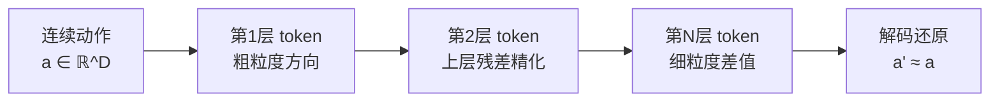
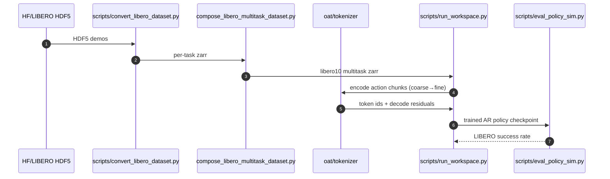

# OAT：有序动作 Tokenization（Ordered Action Tokenization）

**OAT**（*Ordered Action Tokenization*，[arXiv:2602.04215](https://arxiv.org/abs/2602.04215)，Harvard / Stanford，[项目页](https://ordered-action-tokenization.github.io/)，[代码](https://github.com/Chaoqi-LIU/oat)，**RSS 2026 Finalist**）提出以 **三项标准**——高压缩率（high compression）、完全可解码性（total decodability）、左右因果 token 空间（left-to-right causal token space）——为约束，系统化设计 **连续机器人动作的离散 token 表示**，并基于该 tokenization 训练 **自回归（AR）策略**，在 20 余个机器人操作任务上超越此前 tokenization 方案和扩散策略基线。

## 一句话定义

**OAT 将连续动作编码为「粗到细」有序 token 序列——三标准驱动的 tokenization 设计，使 AR 语言模型原生支持高精度机器人动作预测。**

## 英文缩写速查

| 缩写 | 英文全称 | 简要说明 |
|------|----------|----------|
| OAT | Ordered Action Tokenization | 本文方法：三标准驱动的有序动作 token 化 |
| AR | Autoregressive | 自回归；token 逐步左→右预测 |
| VLA | Vision-Language-Action Model | 视觉-语言-动作模型；OAT 可作其动作头 tokenization |
| DP | Diffusion Policy | 扩散策略；OAT 的主要对比基线之一 |
| VQ | Vector Quantization | 向量量化；常见离散 token 基础，与 OAT 对比 |
| FSQ | Finite Scalar Quantization | 有限标量量化；另一类离散编码基线 |
| RSS | Robotics: Science and Systems | 本文投稿顶会；2026 年度 Finalist |

## 为什么重要

- **AR 策略的 tokenization 瓶颈：** 将连续机器人动作离散化为 token 以复用 LLM/VLM 的 AR 生成框架是 VLA 的核心工程挑战——现有方案（均匀量化、VQ、FSQ 等）在压缩率、解码精度、因果结构三者中往往只能顾及一两点。
- **系统化标准框架：** OAT 首次明确提出三标准（high compression / total decodability / left-to-right causal）作为 tokenization 设计评价轴，并从这三项出发推导出「粗到细」层级编码方案，使设计思路可复制。
- **AR 超扩散策略：** 在 20+ 操作任务的严格对比中，OAT 驱动的 AR 策略超越 [Diffusion Policy](../methods/diffusion-policy.md) 基线，表明正确的 tokenization 能弥合离散 AR 与连续扩散之间的精度差距。
- **VLA 可扩展性：** 作者在访谈中提及 **knowledge-insulated token co-training**（知识隔离 token 协同训练）方向，暗示 OAT 可与 VLA 视觉-语言预训练联合优化而不互相干扰。

## 核心原理与方法

### 三标准框架

| 标准 | 含义 | 违背的后果 |
|------|------|-----------|
| 高压缩率 | 用尽量少的 token 编码完整动作 | token 数过多 → AR 序列长 → 推理慢、错误累积 |
| 完全可解码 | 给定 token 序列可精确还原连续动作 | 解码模糊 → 精细操作失败 |
| 左右因果 token 空间 | token 的生成顺序对应动作维度的语义由粗到细 | AR 采样时高频细节先于粗结构出现 → 错误不可纠正 |

### 粗到细有序编码

OAT 采用 **层级残差量化（hierarchical residual quantization）** 思路：

- **左到右因果性**：token 编号越小代表越粗的动作结构（如大方向移动），越大代表越精细的差值调整。
- **完全可解码**：每层量化残差精确，最终重构误差有界。
- **高压缩**：相比均匀量化，层级残差可在同等 token 数下表示更高精度动作。

## 与已有方案对比

| 方案 | 压缩率 | 可解码性 | 左右因果 |
|------|--------|----------|---------|
| 均匀量化（per-dim） | 中 | 高 | 无（顺序无语义） |
| VQ-VAE | 高 | 中（codebook collapse 风险） | 无 |
| FSQ | 高 | 中 | 无 |
| **OAT（本文）** | **高** | **高** | **有（粗→细语义顺序）** |

## 源码运行时序图

官方仓 [`Chaoqi-LIU/oat`](https://github.com/Chaoqi-LIU/oat)（项目页 **OAT Code** 按钮）提供 LIBERO 数据管线与 workspace 训练/评测；姊妹仓 [`praxis-vla`](https://github.com/Chaoqi-LIU/praxis-vla) 对应作者访谈中的 VLA / token co-training 扩展。

关键复现路径：`git clone --recurse-submodules` → `uv sync` →（可选）下载 HF `libero10_N500.zarr` 或本地 convert/compose → `run_workspace.py` 训练 → `eval_policy_sim.py` 评测。

## 工程实践

### 代码开源状态（2026-07-20）

- **已开源：** [Chaoqi-LIU/oat](https://github.com/Chaoqi-LIU/oat)（训练/评测/tokenizer）；项目页并列 **OAT Code** 与 **VLA Code**（[`praxis-vla`](https://github.com/Chaoqi-LIU/praxis-vla)）。
- **数据：** README 提供 Hugging Face 预构建 `libero10_N500.zarr`，或本地从 LIBERO HDF5 转换。

### 部署集成

- OAT tokenization 层可作 **动作头（action head）** 插入现有 [VLA](../methods/vla.md) 架构。
- AR 推理可复用 kv-cache 等 LLM 加速手段，与 [Diffusion Policy](../methods/diffusion-policy.md) 形成选型对照。

## 评测覆盖

- **20+ 机器人操作任务**（含 LIBERO 等）；主指标成功率；基线含 VQ/FSQ tokenization 与 Diffusion Policy。

## 局限与风险

- **层级数与码本大小超参：** 需按任务精度/延迟调参。
- **VQ 训练稳定性：** 层级量化仍可能 codebook 利用率不均。
- **任务域：** 论文主验证偏 manipulation；高动力学 locomotion / 飞行未充分覆盖。
- **VLA 扩展仓独立：** `praxis-vla` 与 OAT 主仓分离，集成成本需自行评估。

## 关联页面

- [VLA 方法页](../methods/vla.md) — OAT 可作 VLA 动作头 tokenization 方案
- [Diffusion Policy](../methods/diffusion-policy.md) — OAT 主要对比基线；AR vs 扩散的核心选型对比
- [Unified Multimodal Tokens](../methods/unified-multimodal-tokens.md) — 统一多模态 token 空间的相关研究
- [Manipulation（操作任务）](../tasks/manipulation.md) — OAT 的主要评测任务域

## 参考来源

- [OAT 论文摘录（arXiv:2602.04215）](../../sources/papers/oat_ordered_action_tokenization_arxiv_2602_04215.md)
- [官方仓库归档](../../sources/repos/oat-ordered-action-tokenization.md)
- [量子位 RSS 2026 颁奖报道](../../sources/blogs/wechat_qbitai_rss2026_awards_2026-07-16.md)

## 推荐继续阅读

- [arXiv:2602.04215](https://arxiv.org/abs/2602.04215) — 原始论文（PDF + HTML）
- [项目页](https://ordered-action-tokenization.github.io/) — 演示与 **OAT Code / VLA Code** 入口
- [GitHub: Chaoqi-LIU/oat](https://github.com/Chaoqi-LIU/oat) — 训练与 LIBERO 评测
- Chi et al., [*Diffusion Policy*](https://arxiv.org/abs/2303.04137) — 主要对比基线
