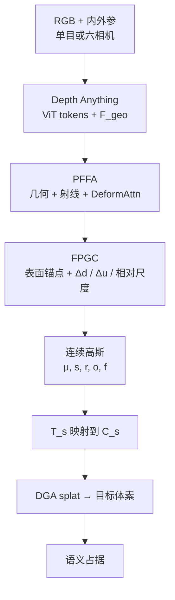

# OccAnyScene（统一室内外 3D 占据预测）

**OccAnyScene**（*Towards Unified Indoor-Outdoor 3D Occupancy Prediction*，[arXiv:2608.08696](https://arxiv.org/abs/2608.08696)，[项目页](https://roboperception.github.io/OccAnyScene/)）由 **南方科技大学 / 上海人工智能实验室 / 哈尔滨工业大学深圳 / 鹏城实验室**（Junjie Liu、Wanshui Gan 等）提出：把 3D 语义占据从「一场景一模型」改写成 **Cross-Scene** 任务——同一套权重在 **室内单目** 与 **户外环视**、不同空间范围 / 体素 / 语义分类下联合预测。方法以 **像素视锥** 为几何单元，在预训练深度基础模型上做 PFFA 聚合与 FPGC 高斯构造，再 splat 到各数据集原生栅格。

## 一句话定义

**别为室内外各养一套占据网络：用像素视锥约束高斯的位置和尺度，让一个模型同时吃房间级细网格和街道级粗网格。**

## 英文缩写速查

| 缩写 | 英文全称 | 简要说明 |
|------|----------|----------|
| OccAnyScene | Occupancy Any Scene | 本文跨室内外统一 3D 语义占据框架 |
| PFFA | Pixel-Aligned Frustum Feature Aggregation | 把几何特征、相机射线与视觉 token 聚成视锥 query |
| FPGC | Frustum-Parameterized Gaussian Construction | 按视锥几何解码高斯中心、深度增量与相对尺度 |
| DAv2 / DAv3 | Depth Anything V2 / V3 | 预训练深度基础模型骨干（ViT-B / ViT-L） |
| mIoU | mean Intersection over Union | 语义占据主指标；另报几何 IoU |
| DGA | Decoupled Gaussian Aggregator | 沿用 SplatSSC：连续高斯 → 目标体素 |

## 为什么重要

- **部署现实是多协议，不是单榜单：** 开放道路要远距粗粒度，室内/停车场要近距细粒度。分训两套模型会在切换、维护和扩展上爆炸。
- **跨场景失败点在 lifting，不在「看起来像不像」：** 稠密体素绑死预定范围；绝对米制高斯偏移在室内外差一个数量级。需要 **度量一致、又随相机与深度自适应** 的几何参照。
- **数字可读：** DAv3 联合训练相对分训只掉 **0.41 / 0.19** mIoU；直接把 SplatSSC 改成跨场景会掉约 **5.03 / 1.19**。差距说明「共享高斯 + 视锥参数化」不是口号。
- **选型提醒：** 截至 **2026-08-13** 官方仓是占位 README——可读方法与表，**不能**当可复现基线。

## 核心信息

| 字段 | 内容 |
|------|------|
| 作者 | Junjie Liu*, Wanshui Gan*, Zitong Dai, Guiping Cao, Yan Li, Ke Chen, Dongmei Jiang, Xiangyuan Lan, Jianguo Zhang |
| 机构 | 南方科技大学（SUSTech）；上海人工智能实验室（Shanghai AI Lab）；哈尔滨工业大学深圳（HITSZ）；鹏城实验室（Peng Cheng Laboratory） |
| 出处 | arXiv:2608.08696（2026-08） |
| 项目 | <https://roboperception.github.io/OccAnyScene/> |
| 输入 | 已知内外参的 RGB：Occ-ScanNet **单目**；SurroundOcc-nuScenes **六相机** |
| 输出 | 各域原生体素上的语义占据（分类空间 \(\mathcal{C}_s\)） |
| 骨干 | DAv2 ViT-B（效率默认）/ DAv3 ViT-L（精度） |
| 开源（截至 2026-08-13） | **部分开源（占位仓）**：[`RoboPerception/OccAnyScene`](https://github.com/RoboPerception/OccAnyScene) 仅 README + `assets/`；徽章写 **release upon acceptance** |

## 方法与核心结构

| 模块 | 作用 |
|------|------|
| **深度基础模型** | ViT tokens + DPT 稠密几何图 \(\mathbf{F}_{\mathrm{geo}}\)（下采样到输入 \(1/8\)） |
| **PFFA** | 像素几何 + 射线方向初始化 query，再 deformable 交叉注意聚合邻域上下文（遮挡推理） |
| **Canonical 深度** | Metric3D v2 式规范相机深度 → 按焦距比还原米制表面锚点 |
| **FPGC** | 每像素 \(K=3\) 高斯：\(\Delta d>0\) 伸进遮挡、\(\Delta\mathbf{u}\in[-1,1]^2\) 亚像素、尺度相对视锥截面 \(b\propto d/f\) |
| **Taxonomy 矩阵** | 共享 32 维语义特征 \(\times\mathbf{T}_s\) → 数据集类别；**仅此矩阵按域分开** |
| **DGA splat** | 连续高斯投到 \(\Omega_s,v_s\)；focal + Lovasz + Probability Scale，加 Huber 深度，**单阶段端到端** |

### 流程总览

跨场景时两套数据 **交替训练**、各域迭代数与单域对齐；共享除 \(\mathbf{T}_s\) 外的全部权重。

## 源码运行时序图

**不适用**（截至 2026-08-13）：项目页 Code 按钮指向 [`RoboPerception/OccAnyScene`](https://github.com/RoboPerception/OccAnyScene)，但 `main` **仅 README + 站点素材**，明确「implementation / pretrained models / training instructions will be released after paper acceptance」。代码放出后应补：数据准备（Occ-ScanNet / SurroundOcc）→ DAv2/DAv3 特征 → PFFA/FPGC → DGA 评测 的 `sequenceDiagram`。

## 工程实践

| 项 | 建议 / 论文设定 |
|----|----------------|
| **何时用** | 需要 **同一套视觉占据** 覆盖房间级细网格与街道级粗网格，且相机内外参已知 |
| **何时不用** | 只需单域最优指标、或必须在线可跑：截至 2026-08-13 无官方实现；单域也可直接上 EmbodiedOcc / SplatSSC / 驾驶侧 GaussianFormer 系 |
| **几何参照** | 不要回归跨场景绝对高斯尺度；用 **视锥截面 \(d/f\)** 当尺度单位 |
| **遮挡** | \(K=1\) 已接近 \(K=3\)；补全靠 **邻像素交替 \(\Delta d\)**，不是同一射线多层分离 |
| **效率参考** | DAv2：98.2 M / 86.4 ms / **670 MiB**（Occ-ScanNet，RTX 4090）；DAv3 时延约 88.4 ms |
| **FOV 外** | 像素视锥盖不住环视相机间隙；论文用少量可学习空间 query 补，指标贡献小 |
| **开源跟进** | 盯占位仓与项目页；放出前勿把 demo 视频当可部署包 |
| **源码运行时序图** | **不适用**（原因见上节） |

## 实验与评测（论文报告摘要）

| 基准 / 设定 | 对照 | 主要结论 |
|-------------|------|----------|
| **Occ-ScanNet（室内）** | EmbodiedOcc++ / RoboOcc / GPOcc / SplatSSC | DAv3 分训 **68.34 IoU / 59.92 mIoU**，超所列基线 |
| **SurroundOcc-nuScenes** | TPVFormer / OccFormer / GaussianFormer-2 / GaussianWorld / VG3S / DLWM | DAv3 分训 **35.97 / 23.06**，超所列基线 |
| **Cross-scene DAv3** | 自身分训 | 室内 **-0.41**、户外 **-0.19** mIoU |
| **SplatSSC† 跨场景** | 自身分训 | 室内 **-5.03**、户外 **-1.19** mIoU（失败对照） |
| **PFFA / FPGC 消融** | 无模块基线 | 联合后室内 IoU **+8.13**、户外 **+4.09**；FPGC 是主增益 |
| **FPGC 细拆** | 去深度残差 / 去视锥尺度 | 去 \(\Delta d\) 室内 IoU **-5.91**；去相对尺度 **-3.03** |
| **效率** | EmbodiedOcc / SplatSSC | DAv2 显存约 **-80%** 量级 |

## 结论

**OccAnyScene 真正值钱的不是「室内外一起训」，而是把像素视锥做成跨相机、跨尺度的几何单位，让高斯位置和尺度跟着焦距与深度走，而不是学一套绝对米制。**

1. **真影响：视锥相对参数化** — 尺度 \(b\propto d/f\) + 表面锚点 \(\Delta d\)，才撑住 0.08 m 房间网格与 0.5 m 街道网格共用一套权重。
2. **真影响：联合训练几乎不掉点** — DAv3 相对分训只掉 0.41 / 0.19 mIoU；对照 SplatSSC† 掉 5 个点，说明失败模式是「绝对高斯绑死单协议」。
3. **真影响：PFFA 要配 FPGC 才值** — 单独加注意力增益有限；有了视锥高斯头，上下文才能变成遮挡后的高斯。
4. **次要代价：\(K=3\) 不是多层深度** — 同视锥三个高斯靠得很近；遮挡补全是邻像素分工，别按「每射线三层」去调。
5. **部署读法：** 需要室内外切换的车/机器人跟这条；只要单域精度，分训 DAv3 仍略高。
6. **工程读法：代码占位** — 今日只能读方法和看 demo；放出前不要排进可复现选型。

## 与其他工作对比

| 对照 | 差异读法 |
|------|----------|
| 稠密体素 / BEV·TPV（OccFormer、SurroundOcc） | 表示绑死预定范围与分辨率；本文用连续高斯再 splat 到各域网格 |
| GaussianFormer / SplatSSC / EmbodiedOcc | 高斯占据强基线，但是 **scene-specific**；直接跨场景会掉点 |
| [GaussianWorld](./paper-sa-2412-04380-gaussianworld-gaussian-world-model-for-streaming.md) | 驾驶侧流式 3D 占据世界模型；本文做 **室内+户外联合前馈预测**，不做时序世界滚动 |
| OccAny（Cao & Vu, CVPR 2026） | 无约束城市场景、测试时重建–渲染–融合；本文是 **单次前馈**、显式跨室内外协议 |
| [Humanoid Occupancy](./paper-notebook-humanoid-occupancy-enabling-a-generalized-multim.md) | 人形软硬件 + 全景数据集；本文是 **视觉 lifting 与跨协议表示**，不解决肢体自遮挡与传感器布局 |
| [Nvblox](./isaac-ros-nvblox.md) | 在线 TSDF/ESDF 融合，服务 Nav2；本文是离线/批式语义占据网络，不是实时距离场 |

## 局限与风险

- **只验证了两个协议：** 作者自陈实验是「两个异构占据协议联合学习」，不是任意未见场景泛化。
- **像素视锥盖不住 FOV 外：** 环视相机间隙靠额外空间 query；大范围相机外补全仍缺机制。
- **开源未落地：** 官方仓为占位；今日无法复现表中数字或接入导航栈。
- **需要标定相机：** 射线与反投影依赖内外参；不要和「无位姿/无内参」的 OccAny 路线混读。
- **语义分类仍分头：** 共享的是高斯特征，不是统一标签空间；新数据集仍要新的 \(\mathbf{T}_s\)。

## 关联页面

- [具身感知六种空间表征](../concepts/embodied-perception-six-spatial-representations.md) — 占据栅格在感知栈第 4 层；本文产出语义占据
- [2D→3D 语义提升 Gap](../concepts/2d-to-3d-semantic-lifting-gap.md) — 本文攻的是跨尺度、跨相机的度量 lifting
- [导航·SLAM 开源栈总览](../overview/navigation-slam-autonomy-stack.md) — 占据输出如何接到规划/代价地图
- [机器人视觉感知栈选型闭环](../queries/robot-perception-stack-selection-loop.md) — 第③层 2D→3D 提升选型
- [Humanoid Occupancy](./paper-notebook-humanoid-occupancy-enabling-a-generalized-multim.md) — 人形占据系统对照
- [Isaac ROS Nvblox](./isaac-ros-nvblox.md) — 可部署 TSDF/ESDF 对照
- [GaussianWorld](./paper-sa-2412-04380-gaussianworld-gaussian-world-model-for-streaming.md) — 驾驶侧高斯占据世界模型索引

## 参考来源

- [occanyscene_arxiv_2608_08696.md](../../sources/papers/occanyscene_arxiv_2608_08696.md) — 论文摘录与开源核查
- [项目页归档](../../sources/sites/roboperception-occanyscene-github-io.md)
- [官方仓归档（占位）](../../sources/repos/occanyscene.md)
- Liu, Gan et al., *OccAnyScene* — <https://arxiv.org/abs/2608.08696>
- 项目页：<https://roboperception.github.io/OccAnyScene/>
- 占位仓：<https://github.com/RoboPerception/OccAnyScene>

## 推荐继续阅读

- 项目页 demo 与遮挡可视化：<https://roboperception.github.io/OccAnyScene/>
- SplatSSC（高斯→体素聚合前作，AAAI 2026）：Qian, Cao, Deng, Yuan, Xie, *Decoupled Depth-guided Gaussian Splatting for Semantic Scene Completion*
- Depth Anything V2 / V3 — 本文骨干：<https://arxiv.org/abs/2406.09414> · <https://arxiv.org/abs/2511.10647>
- OccAny（无约束城市场景占据，CVPR 2026，**已开源**）：<https://github.com/valeoai/OccAny>
