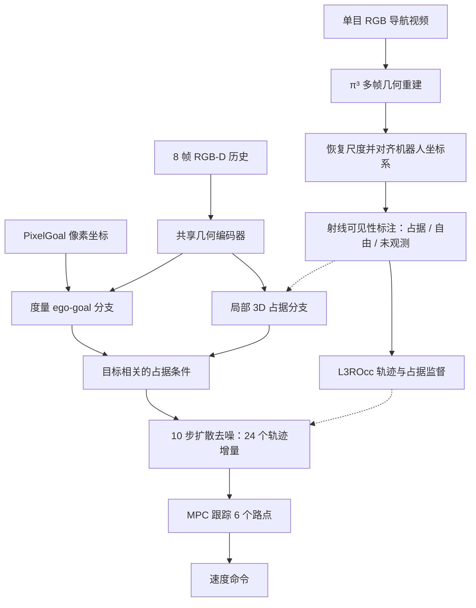

# OccPlanner：占用条件扩散式 PixelGoal 导航

**一句话定义：** OccPlanner 将图像目标接地为机器人局部度量目标，并结合局部 3D 占据特征，条件化扩散模型生成避障轨迹。

## 英文缩写速查

| 缩写 | 英文全称 | 简要说明 |
|------|----------|----------|
| PixelGoal | Pixel Goal Navigation | 用当前相机图像中的目标像素指定导航目标 |
| L3ROcc | Local 3D Reconstruction with Occupancy | 从单目导航视频生成局部占据和轨迹监督 |
| RGB-D | Red Green Blue and Depth | 提供彩色图像与深度的机器人观测 |
| SR | Success Rate | 成功到达目标的回合比例 |
| MPC | Model Predictive Control | 跟踪局部预测路点并输出速度命令 |
| DTG | Distance to Goal | 终点到目标的残余距离指标 |

## 为什么重要

PixelGoal 是高层视觉系统与低层导航规划之间自然的接口：上层只需在画面中指出目标，不必先给出地图坐标。但一个像素既不包含可靠的度量距离，也不描述目标周围哪里可通行。单纯把像素用深度反投影成 PointGoal，在遮挡、深度噪声和障碍绕行中仍会遇到问题。

OccPlanner 的价值在于把两件事放到一个规划器里：一方面学习 PixelGoal 对应的机器人局部度量目标，另一方面预测与规划相关的局部占据结构，再让两者共同约束连续轨迹生成。它不是视觉语言模型，也不是完整的全局导航栈；论文聚焦局部目标接地与轨迹规划。

## 方法栈

### L3ROcc：用单目视频生成占据监督

L3ROcc 将单目 RGB 导航视频转为每个时间步对齐的局部几何监督：

1. 对间隔抽取的视频帧运行 π³，估计多视角点图、置信度和相机位姿，汇成共享场景点云。
2. 用轨迹或有效传感器深度恢复单目重建的全局尺度，再将点云与相机位姿对齐到机器人局部坐标系。
3. 将局部点云体素化，并从各相机视线发射射线：首次命中前为已观测自由空间，命中体素为可见占据，命中之后为未观测。
4. 同步位姿提供轨迹标签；最终得到轨迹与占据相配对的监督数据。

因此，L3ROcc 中的“未观测”不是“自由空间”。训练实现把已观测自由与未观测体素合并为非占据标签；部署时模型仍需从 RGB-D 观测中预测局部几何。

### OccPlanner：目标与占据共同条件化轨迹

模型处理最近 8 帧 224×224 RGB-D 和归一化 PixelGoal 坐标（u, v）。共享几何编码器产生时空特征，两个任务分支学习互补信息：

- **度量目标分支：** 结合 PixelGoal 与时序场景特征，预测机器人局部坐标系中的目标位置及参考轨迹终端朝向，避免把二维目标点直接等同于三维目标。
- **规划占据分支：** 将当前几何特征 lifting 到局部 3D 特征体，预测可见占据；目标查询从占据体中提取与当前目标相关的障碍几何。
- **扩散轨迹分支：** 目标表示和目标相关占据特征共同作为条件，经 10 步去噪生成 24 个局部运动增量。训练同时约束轨迹去噪、轨迹重投影、度量目标和占据预测。

## 方法流程图

虚线表示训练监督；实线表示论文描述的几何数据流和策略执行链。该图总结方法，不代表源码函数调用顺序。

## 实验与对比

### Isaac Sim 闭环导航

v2 使用 Clearpath Dingo，在 NVIDIA Isaac Sim 的 60 个未见场景上闭环评测。场景包含 Home 20 个、Commercial 20 个、Cluttered Easy 10 个和 Cluttered Hard 10 个；距离段为 3–5 m 与 5–8 m。过滤无效仿真输出后，中程和远程分别保留 2,437、2,672 个回合。

| 5–8 m 成功率（%） | Home | Commercial | Cluttered Easy | Cluttered Hard |
|-------------------|-----:|-----------:|---------------:|---------------:|
| NavDP-PixelGoal | 9.46 | 8.62 | 18.45 | 20.12 |
| OccPlanner | 47.83 | 45.81 | 94.78 | 91.44 |
| iPlanner（PointGoal） | 49.70 | 52.16 | 96.11 | 95.88 |

NavDP-PixelGoal 是论文作者基于已发表 PointGoal NavDP 实现的像素目标适配，不是原始 NavDP 的 PointGoal 结果。OccPlanner 在 8 个场景—距离组合中均超过 PixelGoal 对照；远程分段与最强 PointGoal 参考的总体差距在 3.50 个百分点以内。PointGoal 具有直接度量目标输入，PixelGoal 只有图像像素目标，解释时需考虑输入信息差异。

### Unitree Go2 实机闭环

实机使用 Unitree Go2 与 Orbbec Gemini 336L RGB-D 相机，推理运行于 NVIDIA RTX 4090。SAM 3 每秒更新 PixelGoal，Dynamic-VINS 以 20 Hz 估计自运动，MPC 跟踪预测轨迹中的接下来 6 个路点并输出速度命令。目标离开视野时，系统继续执行最近有效轨迹；轨迹耗尽后，用里程计传播最近目标位置并重新规划。

| 训练设置（每组 20 次） | 成功 | 碰撞 |
|------------------------|-----:|-----:|
| 仅仿真训练（zero-shot） | 11/20（55%） | 12/20（60%） |
| 使用 829 个实机样本微调 | 16/20（80%） | 5/20（25%） |

成功与碰撞独立记数，因此成功不等于全程无接触。每组 20 次属于初步实机证据，不足以替代大规模重复验证。

## 结论

**OccPlanner 的核心进展是把 PixelGoal 的度量接地和目标相关的局部 3D 占据统一纳入扩散轨迹规划；它的证据同时包含仿真闭环和小规模 Go2 实机闭环。**

1. 重要设计不是“用了扩散”本身，而是给扩散轨迹提供互补的度量目标和障碍占据条件。
2. L3ROcc 将单目多帧重建、尺度对齐和射线可见性结合，生成占据监督；未观测体素必须与自由空间区分。
3. 5–8 m 场景成功率差异明显：Home / Commercial 约 46–48%，Cluttered Easy / Hard 约 91–95%；不要只摘高分场景。
4. 对比 PointGoal 时需注明其直接拥有度量目标；NavDP-PixelGoal 才是更直接的像素目标对照。
5. Go2 微调后成功率从 55% 增至 80%、碰撞率从 60% 降至 25%，但两组各 20 次，仍是有限样本。
6. 单次 0.104 s 推理时间是在 RTX 4090 上测得，不能外推成边缘设备实时性能或机器人闭环频率。

## 工程实践

| 项目 | 论文设置 / 阅读时的边界 |
|------|-------------------------|
| 训练数据 | InternData-N1 中 20 万余条仿真专家轨迹，叠加 L3ROcc 对齐的占据和轨迹标签 |
| 模型 | 120M 可训练参数；8 帧 224×224 RGB-D；24 个运动增量；10 次扩散去噪 |
| 占据网格 | 原始为 100×140×60、4 cm 分辨率，范围约 4.0 m 横向、5.6 m 前向、2.4 m 高；训练池化至 8 cm |
| 训练 | 4×NVIDIA H100，30 epochs，全局 batch size 32，bf16 |
| 推理 | RTX 4090 上单次 0.104 s；不等价于板载实时性能 |
| 实机链路 | SAM 3 目标更新 1 Hz → OccPlanner 预测 → Dynamic-VINS 20 Hz 里程计 → MPC 跟踪局部路点 |
| 源码 / 权重 / 数据 | 论文 v2 与已核实的一手入口未提供可确认下载链接；运行入口、许可证和完整复现步骤均未核实 |

## 源码运行时序图

**不适用（论文 v2 与可核实的一手入口未给出官方代码仓库、安装步骤或运行入口，无法忠实还原源码级调用顺序）。** 上面的流程图是论文方法图，不是代码执行追踪。

## 局限与风险

- **复现边界：** 论文未提供可确认的官方代码、权重和数据下载地址；不能声称公开实现或给它指定代码许可证。
- **静态场景假设：** 动态物体可能被 L3ROcc 纳入重建几何，污染占据标签。
- **局部视野：** 没有显式全身净空约束或持久占据记忆；头部相机看不到的区域可能仍发生机身/腿部碰撞。
- **深度依赖：** 论文指出当前占据分支明显受益于深度观测，RGB-only 占据推理仍待发展。
- **有限实机统计：** 每组 20 次试验是初步迁移证据，需在更多场景和重复试验中验证。
- **部署时序：** 0.104 s 是 RTX 4090 单次推理耗时；SAM 3 的 1 Hz 目标刷新率不等于策略控制频率。

## 关联页面

- [X-NavDP：跨本体导航扩散策略 RL 后训练](paper-x-navdp.md) — 相关导航扩散工作，不是 OccPlanner 的源码。
- [视觉-语言导航（VLN）](../tasks/vision-language-navigation.md) — 上层语义目标与图像目标接口背景。
- [Paper Notebooks · Navigation 分类](../overview/paper-notebook-category-08-navigation.md) — 导航论文索引。
- [导航纵深路线](../../roadmap/depth-navigation.md) — 学习型导航入口。

## 参考来源

- [OccPlanner arXiv v2 来源归档](../../sources/papers/occplanner_arxiv_2608_14160.md)

## 推荐继续阅读

- [OccPlanner arXiv v2 正文](https://arxiv.org/html/2608.14160v2)
