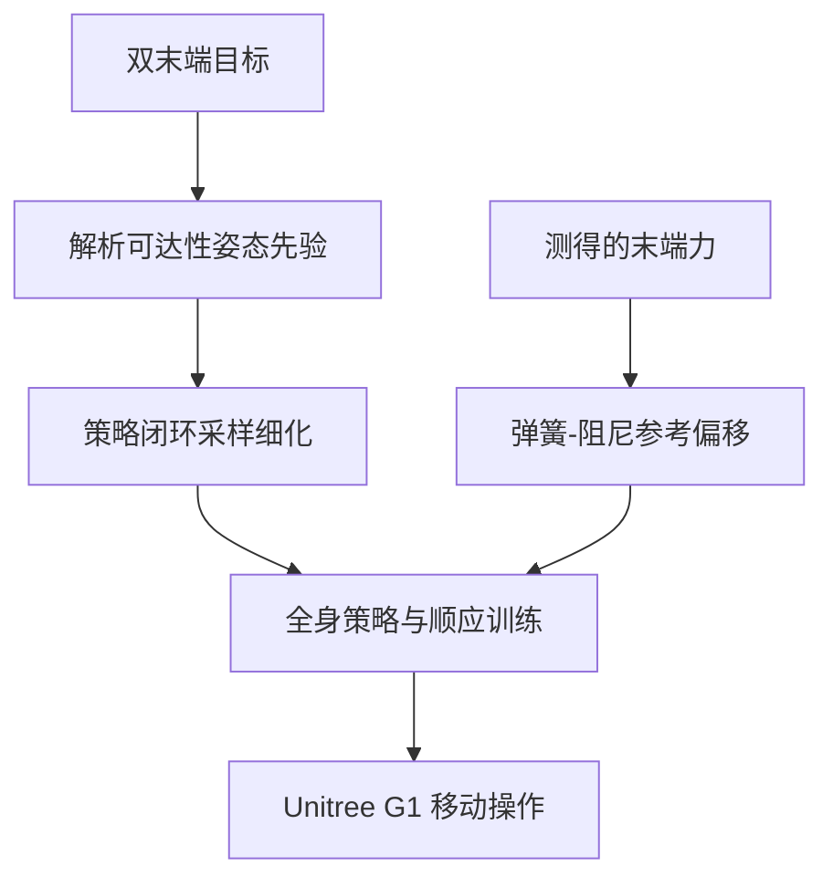

# Dataset-Free Compliant Humanoid Loco-Manipulation with Dynamic Online Posture（OCLO）

**一句话定义**：OCLO 是一种面向 Unitree G1 的无人体动作数据移动操作框架，它从双末端目标在线补全骨盆/躯干姿态，并通过力反馈参考偏移训练全身顺应性。

## 英文缩写速查

| 缩写 | 英文全称 | 简要说明 |
|------|----------|----------|
| OCLO | Online-posture Compliant LOco-manipulation | 本文系统：在线姿态生成与顺应控制的移动操作 |
| WBC | Whole-Body Control | 腿、躯干和手臂共同满足任务目标的全身控制 |
| SONIC | Scaling of Natural and Optimal Intelligent Control | 论文用于验证姿态模块迁移收益的预训练控制器 |
| G1 | Unitree G1 humanoid robot | 论文真机移动操作评测平台 |

## 为什么重要

人形移动操作常以人体动作捕捉或重定向轨迹提供全身协调先验；这带来数据采集和动作适配成本，也会让新任务被已有动作库覆盖范围限制。OCLO 把接口压缩为双末端目标，把“如何蹲下、俯身并保持平衡”留给机器人在线推断，并通过顺应训练处理真实接触和外力扰动。

“无数据”不是“无训练”：论文仍然训练机器人策略；它强调的是不使用人体动作数据作为全身运动监督。这个边界对复现和与模仿学习工作的比较很关键。

## 方法栈

### 动态在线姿态生成

双末端目标只约束手的位置/朝向，无法唯一指定骨盆高度与躯干姿态。OCLO 用解析可达性先验从末端目标推导可行的骨盆高度和躯干朝向；随后可用 policy-in-the-loop sampling，借助任务无关代价在候选姿态中进一步筛选。前者提供低成本初值，后者考虑实际策略执行能力，降低几何可达但控制器难以跟踪的风险。

### 弹簧-阻尼式全身顺应

策略接触物体时，测得的末端力用于偏移目标参考。弹簧项表达偏离目标的恢复倾向，阻尼项抑制相对运动；训练中这种参考让步鼓励身体通过腿、腰与骨盆共同调整，而非僵硬维持末端误差后失去平衡。它不是单独的末端力控器，而是把力反馈用于全身策略的目标修正。

### 系统流程总览

以上是论文方法的数据流概括；它不是源码运行时序图。当前未核实到公开可运行的官方代码。

## 实验与结果

| 证据类型 | 论文摘要报告 | 解读 |
|---|---|---|
| 姿态参考获取（仿真） | 有解析先验 77.8%，无先验 37.8% | 反映目标姿态是否能被策略获取，不应解释为端到端任务成功率 |
| 姿态细化（仿真） | 各评测任务的末端朝向误差下降 | 论文摘要未给出统一的改善百分比 |
| SONIC 模块迁移 | 五项任务中的四项改善 | 姿态生成模块可与预训练控制器结合，收益并非所有任务都保证 |
| 顺应消融 | 无顺应训练时扰动下更易失衡 | 支持接触让步机制的必要性 |
| Unitree G1 真机 | 七项任务，包括蹲姿行走、低处拾箱；扰动下保持平衡 | 这是硬件演示证据，不能与仿真成功率混算 |

## 结论

**一句话总判：** OCLO 的主要贡献是把全身姿态选择和接触顺应补进简单的末端目标接口，而不是宣称完全摆脱训练数据或机器人策略训练。

1. **把“dataset-free”按数据来源理解** — 它不依赖人体动作数据，并不代表无需仿真、奖励或策略训练。
2. **先验改善了命令可跟踪性** — 77.8% 对 37.8% 是姿态获取率证据，不是任务完成率。
3. **末端目标需要身体级冗余管理** — 解析姿态先验解决目标欠约束，策略闭环采样进一步纳入控制可行性。
4. **顺应训练影响扰动恢复** — 让身体在接触时适度让步，减少只顾跟踪末端导致的失衡。
5. **硬件范围仍有限** — 已报告 Unitree G1 七项任务；不能据此推断跨本体泛化或用户可复现性。

## 工程实践

| 项目 | 可操作读法 |
|---|---|
| 命令接口 | 双末端目标简化上层任务表达，但下层仍需姿态补全与平衡控制 |
| 姿态生成 | 几何解析先验适合快速给出可行初值；策略闭环采样可筛掉策略难跟踪的候选姿态 |
| 顺应信号 | 用测得末端力调节参考目标；真机部署需验证力传感器、滤波、坐标变换与弹簧/阻尼参数 |
| 数据与训练 | “无人体动作数据”不能替代策略训练所需的仿真环境、奖励设计和任务定义 |
| 源码状态 | **待核实**：项目页当前无法读取，未发现可确认的官方仓库；源码运行时序图不适用，因为尚无可运行实现入口 |

## 与其他工作对比

- 与 [SONIC-Transfer](./paper-sonic-transfer.md) 的关系是模块用途上的关联，不代表 OCLO 的实现代码或预训练权重已开放。OCLO 摘要只说明姿态模块改善预训练 SONIC 控制器五项中的四项。
- 与依赖动作示范的 loco-manipulation 路线相比，OCLO 把全身姿态来源由人类参考动作转为解析先验加策略内评估；这降低了动作数据依赖，但将可行性和泛化责任转移给先验与训练策略。
- 和单纯末端阻抗控制不同，论文将参考让步用于全身策略训练，目标是让下肢、腰部与骨盆共同吸收扰动。

## 局限与风险

- 论文摘要未披露完整超参数、力反馈噪声处理、控制频率或各项任务的逐项成功率；这些细节需查阅全文和项目材料。
- 77.8% / 37.8% 对比的评测口径是参考姿态获取，不是七项真机任务的成功率。
- 真机硬件仅报告 Unitree G1；当前资料不足以判断不同关节布局、手部执行器或力传感配置上的迁移成本。
- 官方项目页链接已知，但本次未能读取；截至 2026-10-10 代码、数据和模型开放状态**待核实**，不可称为已开源或确认未开源。

## 关联页面

- [Loco-Manipulation](../tasks/loco-manipulation.md) — 行走与操作耦合任务总览。
- [Whole-Body Control](../concepts/whole-body-control.md) — 解释多身体部位如何共同满足目标与平衡约束。
- [SONIC-Transfer](./paper-sonic-transfer.md) — 预训练 SONIC 控制器相关工作。

## 参考来源

- [论文归档：arXiv:2610.05678](../../sources/papers/oclo_arxiv_2610_05678.md)
- [官方项目页归档](../../sources/sites/oclo-humanoid.md)
- [arXiv 原文](https://arxiv.org/abs/2610.05678)

## 推荐继续阅读

- [OCLO 官方项目页](https://oclo-humanoid.github.io/) — 项目演示与后续代码/数据发布入口。
