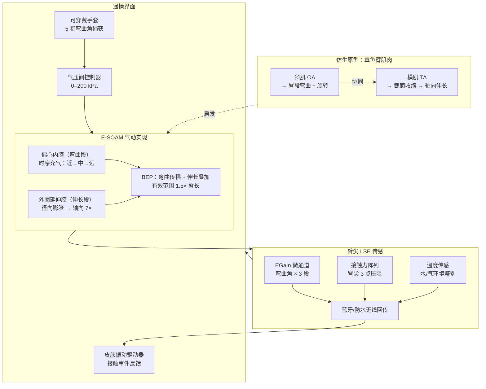

# E-SOAM：仿章鱼可传感软臂的环境交互

**Octopus-inspired sensorized soft arm for environmental interaction**（Fan Yang† / Hao Ding†、Tianmiao Wang、Wen Li‡，北京航空航天大学，**Science Robotics 2023**，[DOI:10.1126/scirobotics.adh7852](https://doi.org/10.1126/scirobotics.adh7852)）提出 **E-SOAM**（Environmentally-adaptable Sensorized Octopus-inspired soft Arm with Multifunction）：将仿章鱼 **弯曲-伸长协同传播（BEP）** 机制实现在气动硅胶臂结构中，于臂尖集成 **液态金属可拉伸传感电子（LSE）**，最大伸长达 **7×**、有效抓取范围达 **1.5 倍臂长**，并通过 **可穿戴柔性手套** 实现带触觉反馈的直觉遥操，在空气与水下双场景完成多模态抓取演示。

## 一句话定义

**受章鱼纵-斜肌协同启发，E-SOAM 通过分段气腔的时序充放气实现弯曲传播与局部伸长叠加，结合臂尖液态金属多模态传感和可穿戴手套遥操界面，使单条软臂能在空气和水下环境中以超过自身臂长 1.5 倍的范围完成适形抓取。**

## 英文缩写速查

| 缩写 | 英文全称 | 简要说明 |
|------|----------|----------|
| E-SOAM | Environmentally-adaptable Sensorized Octopus-inspired soft Arm with Multifunction | 本文提出的仿章鱼软手臂完整系统 |
| BEP | Bend-Elongation Propagation | 仿章鱼 OA/TA 协同的弯曲-伸长传播机制 |
| LSE | Liquid-metal Stretchable Electronics | 基于 EGaIn 液态金属的可拉伸柔性传感模块 |
| OA | Oblique muscle fibers in octopus arm | 章鱼臂斜肌，控制截面旋转与扭转 |
| TA | Transverse muscle fibers in octopus arm | 章鱼臂横肌，收缩后使臂段伸长 |
| EGaIn | Eutectic Gallium-Indium alloy | 镓铟共晶合金，室温液态导体，7× 拉伸下仍导通 |
| DOF | Degrees of Freedom | 软臂通过腔室组合实现弯曲、伸长、旋转多自由度 |

## 为什么重要

- **软体机器人传感短板的系统性解法：** 现有气动软臂大多只有驱动无感知，或传感局限于末端点接触；E-SOAM 将**三轴弯曲 + 接触力阵列 + 温度**感知全部嵌入 7× 可伸臂尖，是软体连续体本体感知的完整示范。
- **仿生到工程的精确映射：** 章鱼臂的 OA/TA 神经肌肉控制已有神经科学文献积累；本工作将其直接物理实现为分段气腔时序控制，而非仅做形态仿生，对[机器人仿生设计](../tasks/manipulation.md)具有方法论参考价值。
- **水陆双场景通用性：** 在空气与水下均完成抓取演示，LSE 在盐水浸泡后传感稳定性无明显衰减，拓展了软臂工作域，与北航文力组后续水中软体机器人研究（[水下可变形机器人](./paper-miniature-deep-sea-morphable-robot.md)）形成系列。
- **触觉闭环遥操：** 通过可穿戴手套将操作员手势直接映射为软臂驱动命令，并以皮肤振动驱动器反馈接触事件，为[软臂遥操数据采集](../tasks/teleoperation.md)提供基础范式。

## 仿生机制与系统架构

## 核心机制（提炼）

| 模块 | 原理 | 关键数据 |
|------|------|----------|
| **BEP 弯曲传播** | 近端→远端腔室时序充气，模拟章鱼 OA 收缩波 | 波形沿 3 段传播时间差约 80 ms |
| **伸长机制** | 外圈 TA 腔充气，截面径向膨胀驱动轴向延伸 | 最大 **7× 名义长度**；抓取域 **1.5× 臂长** |
| **LSE 传感** | EGaIn 微通道嵌入 Ecoflex 0030 基底 | 7× 拉伸下电阻漂移 < 5%；500 次循环无断路 |
| **接触力阵列** | 3 点压阻分布于臂尖 | 分辨率约 0.1 N；区分轻触/紧握状态 |
| **手套映射** | 5 指弯曲角 → 5 组腔室压力命令 | 延迟约 30 ms（蓝牙）|
| **触觉反馈** | 皮肤振动驱动器传递接触事件 | 单通道 100–300 Hz 振动，映射接触力幅值 |

## 实验演示

- **空气抓取：** 球体（直径 3–8 cm）、鸡蛋（易碎；软接触力 < 2 N 抓取成功）、L 形异形物体；验证形状适应性与轻柔夹持能力。
- **水下抓取：** 珊瑚礁模型环境中悬浮物体捕获；盐水浸泡 30 min 后 LSE 传感稳定（文中数据）。
- **遥操演示：** 操作员戴手套控制软臂绕障碍伸入取物；力觉反馈辅助操作员区分"触碰目标"与"碰到障碍"。
- **伸长对比：** 气压未充时臂长 L₀；TA 腔全充后臂长可达 7L₀；BEP 配合实现末端到达 1.5L₀ 半径范围内任意姿态抓取。

## 与其他工作对比

- **vs 传统气动软臂：** 现有气动软臂大多只有驱动无本体感知，或传感局限于末端点接触；E-SOAM 将三轴弯曲 + 接触力阵列 + 温度感知全部集成到 7× 可伸臂尖，是软体连续体本体感知的完整示范。
- **vs 商业软臂：** 相较 Festo Bionic Cobot 等商业方案，E-SOAM 的 7× 伸长与集成液态金属（EGaIn）传感在研究场景下独具价值，但制造复杂度与批次一致性仍逊于商业化产品。
- **同组研究系列：** 与北航文力组 [两栖印鱼机器人](./paper-aerial-aquatic-remora-hitchhiking-robot.md)、[深海可变形机器人](./paper-miniature-deep-sea-morphable-robot.md) 同属「软材料极端形变下的传感 / 驱动稳定性」研究脉络。

## 局限与风险

- **制造复杂度高：** 需多层硅胶铸模 + EGaIn 微通道注入 + 无线 PCB 封装，无标准化制造流程公开；**完整控制代码和制造 CAD 文件截至 2026-07-20 未开源**，直接复现需大量硬件调试。
- **气压驱动响应速度：** 软管 + 微型电磁阀系统带宽约 2–5 Hz；高动态交互（如快速移动目标抓取）受限。
- **水下长期密封耐久性：** 论文测试为短时浸泡；深水压差下 Ecoflex 材料寿命与 EGaIn 密封长期可靠性未系统评估。
- **自主控制缺失：** 当前为遥操模式，缺乏闭环自主抓取（如基于视觉的目标定位+抓取规划）；传感回路仅用于反馈，未被用于闭环自主控制器。
- **单臂演示：** 论文为单臂系统；双臂协同（如双手操作）未探索，见[双臂操作](../tasks/bimanual-manipulation.md)研究现状。

## 工程实践

- **液态金属传感器制造建议：** EGaIn 注入需在惰性气氛（N₂）下完成以防氧化；微通道宽度建议 ≥ 200 µm 以降低注入阻力；Ecoflex 0030 在 7× 拉伸后恢复率优于 0010/0020 系列。
- **气压控制策略：** BEP 时序建议采用查表法（预存弯曲角vs压力曲线）而非实时逆运动学，以降低控制延迟；遥操映射比例系数需针对具体软臂尺寸标定。
- **防水设计要点：** 近端 PCB 用环氧封装 + O 型圈组合；蓝牙天线置于防水舱外壁，避免金属外壳遮挡。
- **与现有软臂平台对比：** 相较 Festo Bionic Cobot 等商业方案，E-SOAM 的 7× 伸长与集成传感在研究场景下具有独特价值，但商业化需大幅简化制造与提高批次一致性。

## 参考来源

- [深蓝AI：近五年 Science Robotics 中国顶尖高校盘点](../../sources/blogs/wechat_shenlan_scirobotics_china_top3_2026-07-02.md)
- [E-SOAM 论文归档（Science Robotics 2023）](../../sources/papers/octopus_inspired_esoam_scirobotics_2023.md)
- Yang et al., *Octopus-inspired sensorized soft arm for environmental interaction*, [Science Robotics 2023](https://doi.org/10.1126/scirobotics.adh7852)
- 章鱼神经肌肉控制背景：Sumbre et al. (2005, 2006), Nature; Gutfreund et al. (1996), J. Neuroscience（OA/TA 协同模型原始文献）
- EGaIn 柔性电子基础：Dickey et al. (2017), *Advanced Functional Materials*；Kazem et al. (2017), *Advanced Materials*

## 关联页面

- [操作任务（Manipulation）](../tasks/manipulation.md) — 软臂空气与水下双场景抓取案例
- [遥操作（Teleoperation）](../tasks/teleoperation.md) — 可穿戴手套+触觉反馈遥操范式
- [双臂操作（Bimanual Manipulation）](../tasks/bimanual-manipulation.md) — 单臂扩展方向参考
- [空中-水中两栖机器人（北航文力组系列）](./paper-aerial-aquatic-remora-hitchhiking-robot.md)
- [深海可变形机器人（北航文力组系列）](./paper-miniature-deep-sea-morphable-robot.md)

## 推荐继续阅读

- [Science Robotics 原文](https://doi.org/10.1126/scirobotics.adh7852)
- Mazzolai et al., *Octopus-inspired design* 综述系列（Bioinspiration & Biomimetics）
- Rus & Tolley (2015), *Design, fabrication and control of soft robots*, Nature — 软体机器人领域奠基综述
- [北航文力组水下可变形机器人](./paper-miniature-deep-sea-morphable-robot.md) — 同组后续 Science Robotics 2025 工作
