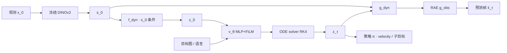
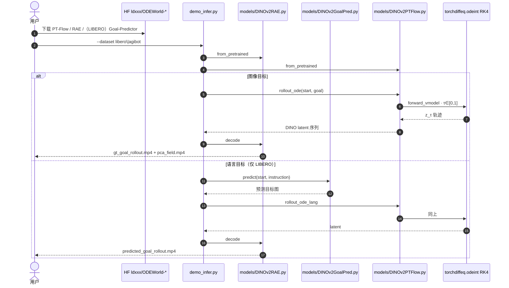

# ODEWorld（物理时间流连续预测架构）

**ODEWorld**（*A Continuous Predictive Architecture via Physical-Time Flow*，[arXiv:2607.27924](https://arxiv.org/abs/2607.27924)，Dongxiu Liu* / Haoyi Niu* 等 · **清华大学智能产业研究院（AIR）** / **加州大学伯克利分校 BAIR**；[项目页](https://dstate.github.io/odeworld_website/)，[代码](https://github.com/Dstate/ODEWorld)）把世界建模从离散 next-step 改成 **物理时间上的 latent ODE**：学一个连续速度场，未来预测 = 在压缩动力学表征里对时间积分。同一套表示既解码长程视频，又给下游策略提供 velocity / 子目标条件。

## 一句话定义

**在 DINO 特征上解耦出单 token 动力学 latent，用 JVP 直接监督物理时间速度场，再靠 ODE solver 做任意时刻、甚至反向的预测与子目标引导。**

## 英文缩写速查

| 缩写 | 英文全称 | 简要说明 |
|------|----------|----------|
| PT-Flow | Physical-Time Flow | 本文范式：物理时间上的 latent 速度场，而非噪声空间 flow matching |
| ODE | Ordinary Differential Equation | \(dz_t/dt=v_\theta\)；推理用 RK4 积分 |
| JEPA | Joint-Embedding Predictive Architecture | 离散 latent 预测族；本文用一阶监督对照其坍塌问题 |
| JVP | Jacobian-Vector Product | 把观测速度 \(\dot s_t\) 投影成 \(\dot z_t\) 的监督目标 |
| RAE | Representation Autoencoder | 把 DINO 特征解码回图像（训练配方对齐 RAE 论文） |
| FiLM | Feature-wise Linear Modulation | 3 层 MLP 速度网上的时间调制 |
| LDP | Latent Diffusion Planning | 视频基线：VAE latent + 离散规划 |
| VPP | Video Prediction Policy | 策略基线：视频预测表征上的隐式 IDM |

## 为什么重要

- **时间轴换轨：** 离散 next-step 绑死采样率；PT-Flow 把 \(t\) 写成相对物理时间，天然支持任意分辨率、缺帧插值与 \(v\to -v\) 反向预测——离散模型做不到或要另训。
- **坍塌对策不同：** JEPA 用一致性损失耦合 encoder 与 predictor，容易平凡解；ODEWorld 把重建与速度场拆开，JVP 直接打在 \(\dot z_t\) 上。RankMe 有效秩约 **425 / 768**，高于同协议下 V-JEPA 2 的 **204 / 1024**。
- **又快又小：** 单 token \(z_t\in\mathbb{R}^{1\times 768}\) + 浅 MLP，项目页报 **86.08 M**、短程 **33.67 FPS**；论文单 A100 上 64 帧延迟 **0.072 s**（V-JEPA 2 **0.619 s**）。
- **规划介质是动力学 latent：** 策略不滚完整像素去搜动作，而是吃 ODE 积出的子目标——更接近 [latent 中间路线](../overview/world-model-physics-fidelity-outputs.md)，而不是 [Ctrl-World](./paper-ctrl-world.md) 式像素沙盒。

## 核心信息

| 项 | 内容 |
|----|------|
| **机构** | 清华大学智能产业研究院（AIR, Tsinghua）；加州大学伯克利分校 BAIR（UC Berkeley） |
| **作者** | Dongxiu Liu*、Haoyi Niu*、Peng Cheng、Yuan Gao、Xirui Kang、Sangli Teng、Koushil Sreenath、Xianyuan Zhan |
| **观测骨干** | 冻结 DINOv2；\(s_t\in\mathbb{R}^{16\times 16\times 768}\) |
| **动力学 latent** | 单 token \(z_t\in\mathbb{R}^{1\times 768}\)（4 token 增益有限） |
| **速度网** | 3 层 MLP + FiLM(\(t\))；条件 \(z_0,c\)（目标图 / 语言） |
| **训练数据** | LIBERO 全量（130 任务 / 6,500 demo，重渲染 256×256）；AgiBotWorldChallenge-2025 ≈30K 轨迹 |
| **训练算力** | 8×A100 |
| **开源（截至 2026-08-16）** | **已开源、可运行推理**：[`Dstate/ODEWorld`](https://github.com/Dstate/ODEWorld) + HF [`ldxxx/odeworld`](https://huggingface.co/collections/ldxxx/odeworld)。**无 LICENSE**；**无训练脚本** |

## 核心原理（方法）

### PT-Flow

状态 \(s_t\) 经 \(s_0\) 条件编码器得到 \(z_t=f_{\mathrm{dyn}}(s_t;s_0)\)。速度场

\[
\frac{dz_t}{dt}=v_\theta(z_t,t;z_0,c)\implies z_T=z_0+\int_0^T v_\theta(z_t,t;z_0,c)\,dt.
\]

实现上把时间重标为 \(\tau=t/L\in[0,1]\)（\(L\) 为规划视界），到达条件 \(c\) 后把速度赶到 0。

两件关键设计：

| 模块 | 作用 |
|------|------|
| **动力学表征解耦** | \(f_{\mathrm{dyn}}/g_{\mathrm{dyn}}\) 都条件在 \(s_0\)：静态背景/纹理留给条件，\(z_t\) 只扛时间变化。\(\mathcal{L}_{\mathrm{dyn-recon}}=\|g_{\mathrm{dyn}}(f_{\mathrm{dyn}}(s_t;s_0);s_0)-s_t\|^2\) |
| **直接一阶监督** | \(\dot z_t=\mathrm{JVP}(f_{\mathrm{dyn}}(s_t;s_0),\dot s_t)\)；\(\dot s_t\) 用 Savitzky–Golay 窗 5 估计。\(\mathcal{L}_v=\|v_\theta-\mathrm{sg}(\dot z_t)\|^2\) |

总损失 \(\lambda_{\mathrm{rec}}\mathcal{L}_{\mathrm{dyn-recon}}+\lambda_v\mathcal{L}_v\)，论文取 \(\lambda=1\) 不调。去掉解耦后 latent 变抖、长程 LPIPS 变差；换成 neural-ODE 式多步一致性损失则短程崩、长程不可用。

与 **flow matching** 的分界：两者都学速度场并用 ODE solver 生成，但 flow matching 的时间是 **噪声→数据** 的概率路径；PT-Flow 的时间是 **物理经过的秒**。

### ODEWorld 实例化

冻结 DINOv2 \(f_{\mathrm{obs}}\) 与 RAE \(g_{\mathrm{obs}}\)（L1+LPIPS+GAN，对齐 RAE 配方）。PT-Flow 嵌在 DINO 空间：\(f_{\mathrm{dyn}}\) 用可学习 query 对 \(s_t,s_0\) 做 cross-attention；\(g_{\mathrm{dyn}}\) 反过来用 \(s_0\) 当 query、\(z_t\) 当 key/value，强迫重建必须「静态来自 \(s_0\) + 动态来自 \(z\)」。

推理：\(x_0\to s_0\to z_0\)，RK4 积到任意 \(\tau\)，再 \(g_{\mathrm{dyn}}\to g_{\mathrm{obs}}\) 出帧，或把 \(z_\tau\) 当策略子目标。

### 流程总览

## 源码运行时序图

节点对齐 [`sources/repos/odeworld.md`](../../sources/repos/odeworld.md)。官方仓目前只有 **推理 demo**。

- **最短复现：** 五套 HF 权重进 `assets/pretrained/` → `python demo_infer.py --dataset libero --case-ids case_00`。
- **训练 / 策略头：** README 未提供；论文 LIBERO-LONG 与 AgileX+X-VLA 实验 **不能从本仓一键复现**。

## 工程实践

| 项 | 实践要点 |
|----|----------|
| 环境 | Python 3.10、`torch==2.6.0` cu124、`torchdiffeq`；无 CUDA 时 `demo_infer.py` 可走 CPU，但 RK4×200 步会慢 |
| 权重 | LIBERO：PT-Flow + RAE + Goal-Predictor；AgiBot：仅 PT-Flow + RAE |
| 推理超参 | 默认 `horizon=1.0`、`steps=200`、`fps=10`、解码 chunk 16 |
| 速度目标 | 训练用 SG 核 \(w=\frac{1}{10}[-2,-1,0,1,2]\)；冻结 DINO 单帧特征本身时序吵，靠滤波补 |
| 策略接法 | \(\pi(a\mid z,c,v)\)；单子目标 \(\tau=0.25\)；序列 \(n=5,\tau_i=0.05i\)。论文里序列最好 |
| 选型 | 要 **连续时间 / 反向 / 任意帧率** 的紧凑 latent WM 时优先；要 **动作条件像素闭环评估** 见 [Ctrl-World](./paper-ctrl-world.md)；要 **互联网规模 JEPA + latent MPC** 见 [V-JEPA 2](./paper-vjepa2.md) |

## 实验与评测

| 轴 | 报告口径（以论文 / 项目页为准） |
|----|--------------------------------|
| 视频短程 @16 | PSNR **20.53** / LPIPS **0.109** / 延迟 **0.030 s**（LDP 16.33 / 0.489 / 1.104；V-JEPA 2 17.60 / 0.157 / 0.123） |
| 视频长程 @64 | PSNR **19.46** / LPIPS **0.134** / 延迟 **0.072 s**（V-JEPA 2 16.47 / 0.166 / 0.619） |
| 效率（站点） | FPS 33.67 / 13.83；参数 **86.08 M** |
| LIBERO-LONG | Velocity 82.3 / Single 82.6 / Sequential **83.6**（GLCBC 78.0、SuSIE 76.3、Seer 78.6、VPP 81.0） |
| 真机 AgileX | 四任务（虾入锅 / 装鼠标 / 插笔 / 双臂重排）；X-VLA **55% → 80%**（序列子目标） |
| 表征 | RankMe 有效秩跨视界 >400；均值 **425.2** vs V-JEPA 2 **203.7**、DINOv2 CLS **376.1** |
| 消融 | 无解耦：长程 LPIPS 0.212、FPS 掉到 2.29；无一阶监督：短程 PSNR 12.71，长程不可用 |

## 结论

**ODEWorld 真正值钱的是「物理时间速度场 + 解耦后的单 token 动力学」：视频质量和延迟是副产品，动作条件与数据规模才是当前主缺口。**

1. **连续时间不是装饰** — 任意 \(\tau\)、反向积分、训练降采样后补中间帧，都来自同一 \(v_\theta\)；离散 next-step 要另建插值/双向模型。
2. **一阶监督比一致性损失更稳** — 去掉 JVP 目标后优化直接失败；解耦主要换的是平滑与 FPS，不是短程 PSNR。
3. **规划读 latent，不要只看 PSNR** — 序列子目标在 LIBERO-LONG 最高（83.6%）；真机增益来自给 X-VLA 喂 \(\hat z_{\tau_i}\)，不是把 WM 当成可交互像素沙盒。
4. **当前版本无动作条件** — 作者自己把这一点写成局限；不能拿它当 Ctrl-World / DriftWorld 的动作条件评估器替代品。
5. **复现边界** — demo + 权重能复现视频 rollout；策略数字与训练配方不在公开仓。
6. **许可未声明** — 商用或再分发前先向作者确认，不要默认 MIT。

## 局限与风险

- **规模小：** 只吃两个机器人数据集；相对大规模视频 WM，覆盖与开放域泛化不足（App. E）。
- **冻结 DINO：** 单帧编码器时序不一致；靠 SG 滤波补，作者建议换时序编码器或解冻微调。
- **无动作条件：** 主叙事是目标/语言条件视频与子目标，不是 \(W(o_{t+1}\mid o_t,a_t)\)。
- **开源不完整：** 无训练入口、无 LICENSE；LIBERO-LONG / 真机策略头不可从 GitHub 复现。
- **「物理」是归纳：** 连续 + 反向看起来像物理，但没有显式力学约束；接触/力仍靠视觉统计。

## 与其他工作对比

| 对比轴 | ODEWorld | [V-JEPA 2](./paper-vjepa2.md) | [Ctrl-World](./paper-ctrl-world.md) | [PlaNet](./paper-planet-latent-dynamics.md) |
|--------|----------|------------------------------|-------------------------------------|--------------------------------------------|
| **时间** | **连续物理时间 ODE** | 离散表征预测 | 离散视频帧 | 离散 RSSM 步 |
| **监督** | JVP 速度 + 解耦重建 | JEPA 表征 L1 | 扩散去噪 | ELBO + overshooting |
| **动作** | **无**（子目标条件策略） | AC 后训练 + latent MPC | 帧级动作条件闭环 | CEM 在 latent 搜动作 |
| **解码** | RAE 可选出像素 | 规划可不渲染 | 必须出多视角视频 | 像素重建辅助 |
| **开源** | 推理+权重；无训练/许可 | MIT 完整 | MIT 完整 | Apache 完整 |

## 关联页面

- [Generative World Models](../methods/generative-world-models.md) — 生成式 WM 谱系；本页为连续时间 latent 代表
- [Latent Imagination](../concepts/latent-imagination.md) — ODE 积分展开 vs Dreamer 离散想象
- [Video-as-Simulation](../concepts/video-as-simulation.md) — 像素仿真对照；ODEWorld 规划不在像素环里
- [V-JEPA 2](./paper-vjepa2.md) — 论文视频基线与坍塌对照
- [LIBERO](./libero-benchmark.md) — 视频与 LIBERO-LONG 评测床
- [世界模型物理保真：输出阅读轴](../overview/world-model-physics-fidelity-outputs.md) — latent 中间路线
- [世界模型路线 01：级联](../overview/world-models-route-01-cascade.md) — 子目标再接策略
- [Ctrl-World](./paper-ctrl-world.md) — 动作条件像素闭环对照
- [Manipulation](../tasks/manipulation.md) — 操作任务坐标

## 参考来源

- [ODEWorld 论文摘录（arXiv:2607.27924）](../../sources/papers/odeworld_arxiv_2607_27924.md)
- [Dstate/ODEWorld 代码索引](../../sources/repos/odeworld.md)
- [ODEWorld 项目页](../../sources/sites/odeworld-website.md)

## 推荐继续阅读

- Liu & Niu et al., *ODEWorld*, arXiv:2607.27924 — <https://arxiv.org/abs/2607.27924>
- 项目页交互 demo — <https://dstate.github.io/odeworld_website/>
- 官方推理仓与 HF 权重 — <https://github.com/Dstate/ODEWorld>
