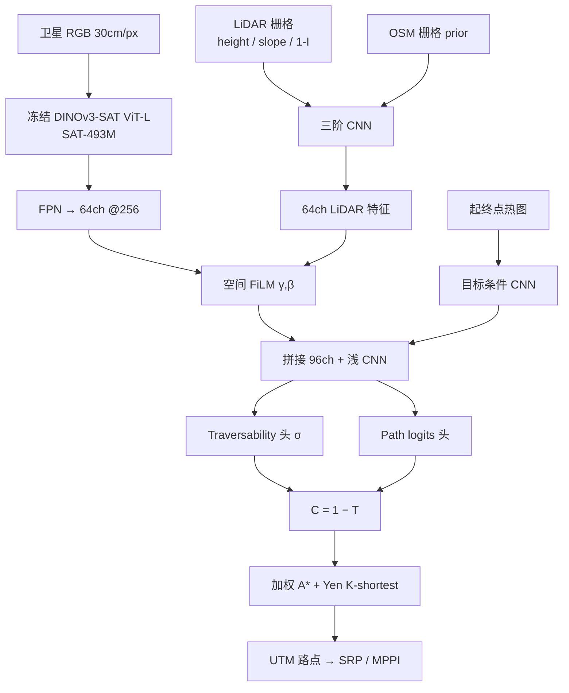

# Off-Road Global Nav：可通行感知的长程越野全局规划

**Learning Traversability-Aware Global Planners for Long Horizon Off-Road Navigation**（[arXiv:2607.23743](https://arxiv.org/abs/2607.23743)，[HF 数据集](https://huggingface.co/datasets/anony-008/offroad-global-nav)）由 **德州农工大学（Texas A&M University）** Unmanned Systems Lab（Kasi Viswanath、Shaunak Kolhe、Srikanth Saripalli）与 **美国陆军研究实验室（DEVCOM Army Research Laboratory）**（Jason M. Gregory）提出：用开销地理数据学 **连续 traversability** 与 **goal-conditioned 路径偏好**，再把 \(C=1-T\) 交给 [A\*](../methods/a-star.md) / Yen \(K\)-shortest 作 Long-Range Planner（LRP），真机局部层走 Phoenix 栈上的 [MPPI](../methods/mppi.md)。

## 一句话定义

**别把「没开过的地方」当成障碍**——用人类 GPS 当正样本、其余当 unlabeled，再拿航拍 LiDAR 几何 prior 把可通行图撑密，让公里级越野全局规划走出机载视野。

## 英文缩写速查

| 缩写 | 英文全称 | 简要说明 |
|------|----------|----------|
| LRP | Long-Range Planner | 本文全局层：学习 costmap 上的 A\* / Yen 路点 |
| SRP | Short-Range Planner | 局部层：TerrainNet costmap + MPPI |
| PU / nnPU | Positive-Unlabeled / non-negative PU | 走廊像素为正、其余 unlabeled，禁止把未驶过当负例 |
| FiLM | Feature-wise Linear Modulation | 卫星特征空间调制 LiDAR 特征 |
| OSM | OpenStreetMap | 公路/步道/水系弱语义 prior |
| DLIO | Direct LiDAR-Inertial Odometry | Phoenix 栈状态估计 |
| MPPI | Model Predictive Path Integral | 真机短程跟踪与避障 |
| Fréchet \(d_F\) | discrete Fréchet distance | costmap 基准：规划路径与人类轨迹形状距离 |

## 为什么重要

- **越野没有「路网全局层」：** 城市导航可以先跟地图再局部修；越野可行线不一定是可见步道，先验还常过时。长程成败取决于 **超出机载视野** 的可通行估计。
- **示范 ≠ 稠密标签：** 人类 GPS 只覆盖窄走廊。把未驶过像素当负例会学成「只走走过的路」。nnPU + LiDAR prior 把物理可行性与人类偏好拆开监督。
- **相对可微 planner：** 同组前作 Trailblazer 走 Neural A\* 反传；本文显式避开可微搜索，用 path-logits 头直接学走廊似然，梯度不绑搜索深度。
- **数据尺度：** 299 场景 / ~1,244 km² / 1,130 km GPS，作者称为目前越野导航地理覆盖最大的公开集；HF **CC BY-NC-4.0** 可下。
- **系统数字可读：** Warthog 七条真机路线相对人类 **+3.66%** 路程、相对 SRP-only 干预约 **−85%**——衡量的是 **分层栈**，不是单张 costmap 漂亮。

## 核心信息

| 项 | 内容 |
|----|------|
| **机构** | 德州农工大学（Texas A&M University）；美国陆军研究实验室（DEVCOM Army Research Laboratory） |
| **arXiv** | [2607.23743](https://arxiv.org/abs/2607.23743)（2026-07-26） |
| **项目页** | 无 |
| **数据集** | [anony-008/offroad-global-nav](https://huggingface.co/datasets/anony-008/offroad-global-nav)（CC BY-NC-4.0，~29.9 GB） |
| **代码** | **待发布**（截至 2026-09-21）；勿把 [unmannedlab/Trailblazer](https://github.com/unmannedlab/Trailblazer) 当成本文实现 |
| **开源** | **部分开源**（数据已发，训练/推理未发） |
| **真机** | Clearpath Warthog；≤2 m/s；Levee 250 m + RELLIS >9 km² |
| **局部栈** | ARL Phoenix：DLIO + TerrainNet + MPPI |

## 核心原理

### 监督为什么必须是 PU

未访问像素可能是可通行但没人开过，也可能是悬崖。论文把人类轨迹 \(r=5\) px 带内像素当正样本 \(P\)，其余当 unlabeled \(U\)，用 Kiryo et al. 的 **nnPU** 估负风险，并加 TV（空间平滑）与 mass penalty（防止处处高分）。Traversability 头没有稠密 GT，靠：

1. OSM 已知道路/步道把 \(\hat{T}\to 1\)（track loss）
2. 历史走廊软锚到 \(T^*=0.75\)（traj loss）
3. LiDAR **intensity / slope / height-gradient** 高斯 prior（坡度交叉约 30° 对应轮式边缘可通行）

辅助项前 3 epoch 线性 warmup，避免弱 prior 压过走廊信号。

### 双流融合

卫星流冻结、LiDAR 流可训；FiLM 的 \(\gamma\) 用 \(\tanh\) 限制在 \((-1,1)\)，按局部语义重加权几何特征，而不是简单 concat。

### 从 costmap 到真机

\(C=1-T\) 后，LRP 用平衡 traversal cost \(\alpha\) 与路径长度 \(\beta\) 的加权 A\* 生成 \(K\) 条候选，选路后栅格坐标转 UTM 再离散成路点。SRP 只看机载 TerrainNet 局部 costmap：全局层负责「别把车开进采石坑」，局部层负责「别撞眼前灌木」。地图外障碍触发停障 → 在估计位置注入高代价 → 从当前位置重规划（Route 6 沙堆）。

## 源码运行时序图

**不适用（截至 2026-09-21）。** 官方未发布训练 / 推理 / 部署仓库或权重；HF 数据集仅提供 `load_dataset("anony-008/offroad-global-nav")` 与共配准 GeoTIFF/LAZ/GPKG/KML。前作 Trailblazer 的 Neural A\* 笔记本 **不能** 直接复现本文 nnPU + FiLM 双头。

## 工程实践

| 项 | 建议 |
|----|------|
| 数据入口 | `datasets.load_dataset("anony-008/offroad-global-nav")`；注意 HF 当前 rows 可能少于论文 299 场景 |
| 栅格分辨率 | \(G_{\text{res}}\) 按点密度选，保证每格 ≥15 点再估法向；体素 \(0.25\cdot G_{\text{res}}\) |
| 融合尺寸 | 256×256 融合，1024×1024 上采样算损失 |
| 训练量级 | 7533 / 1716 场景级划分；RTX 4090 24 GB；val 必须 **换场景** 而非同场景切分 |
| 损失权重 | \(\lambda_p=1.0\) 走廊为主，辅助 \(\lambda\le 0.2\)；先 warmup 再开 prior |
| 下游规划 | 用 \(C=1-T\) 跑 A\*，不要直接把 path-logits 当唯一代价；真机保留独立 SRP |
| 许可 | CC BY-NC-4.0，商用不可直接吃 HF 副本 |

## 实验与评测

### 离线 costmap 基准（Table I，\(n=356\)，均长 412 m）

| Costmap | \(d_F\) (m) ↓ | \(r_c\) →1 | \(r_d\) →1 |
|---------|---------------|------------|------------|
| Height map | \(108.4\pm18.2\) | \(0.85\pm0.11\) | \(0.91\pm0.06\) |
| Trailblazer | \(91.6\pm22.7\) | \(0.71\pm0.09\) | \(0.81\pm0.08\) |
| OVerSeeC | \(77.5\pm20.1\) | \(0.23\pm0.14\) | **\(0.92\pm0.06\)** |
| **Ours** | **\(61.3\pm14.3\)** | **\(0.93\pm0.05\)** | \(0.89\pm0.05\) |

读法：\(r_d<1\) 几乎总出现（A\* 最短代价、人类不最短）。OVerSeeC 的短路径来自 **穿过人类拒绝的低代价区**（\(r_c=0.23\)）；本文短在走廊内部，而不是抄禁区。

### 消融（Table II）

仅 path corridor 时稠密人类走廊与稀疏备选几乎同分（\(\Delta=0.019\)）。加 OSM/轨迹弱正再加 LiDAR prior，全损失 \(\Delta=0.200\)（走廊 0.980 vs 备选 0.780）。**走廊监督单独不够做出地形可通行图。**

### 真机（Table III）

| Route | 人类 (m) | LRP (m) | SRP (m) | 干预 LRP / SRP |
|-------|----------|---------|---------|----------------|
| 1 | 320 | 335 | 360 | 0 / 3 |
| 2 | 379 | 386 | 392 | 1 / 2 |
| 3 | 765 | 810 | 901 | 1 / 8 |
| 4 | 289 | 338 | 326 | 0 / 1 |
| 5 | 393 | 425 | — | 2 / — |
| 6 | 1680 | 1714 | — | 3 / — |
| 7 | 1680 | 1956 | — | 1 / — |

SRP-only 在采石坑/长程上因安全未跑。LRP 平均路程开销 **3.66%** vs SRP-only **9.7%**；干预约每 480 m 一次 vs 每 140 m 一次。Route 4 最大偏差（+17%）来自植被过渡带偏保守 + MPPI 跟踪横向误差累积，而不是全局骨架走错。

## 结论

**长程越野的可通行图要从「开销地理 + 稀疏人类走廊 + 几何 prior」学，不能从局部感知外推，也不能把未驶过像素当障碍。**

1. **PU 是默认监督：** 把 GPS 当正、其余 unlabeled；显式负例缺失会让草–灌过渡带偏保守。
2. **几何 prior 决定能否区分走廊与禁区：** 消融里 LiDAR slope/height/intensity 才把 \(\Delta\) 拉开；只拟合轨迹会处处高分。
3. **离线看 \(d_F\) 和 \(r_c\)，不要只看路程比：** \(r_d\) 好可能是抄禁区（OVerSeeC）。
4. **LRP 不替代 SRP：** 真机数字是 Phoenix MPPI + TerrainNet 闭环；lookahead / handoff 仍是主要失效面。
5. **静态开销图会过时：** 季节植被、临时沙堆必须靠局部停障 + 注入高代价重规划。
6. **复现先下数据：** HF 可训自己的头；官方权重/训练脚本待发布，Trailblazer 仓不是本文代码。

## 与其他工作对比

| 对照 | 差异读法 |
|------|----------|
| 同组 [Trailblazer](https://arxiv.org/abs/2505.09739) | 卫星+LiDAR costmap + **可微 Neural A\***；本文改为 nnPU path 头 + 显式几何 prior，避开搜索反传 |
| OVerSeeC | 卫星开放词汇语义 costmap，几何接地弱；\(r_c\) 差说明 planner 会走人类不走的「语义便宜」区 |
| TartanDrive 2.0 / RELLIS-3D / RUGD | **机载** 局部感知与交互；本文是 **开销地理 × 公里级** 全局层，互补而非替代 |
| [TravExplorer](./paper-travexplorer.md) | 室内四足 **3D 可通行体积图 + ObjectNav**；本文是户外轮式 UGV **2.5D 开销 costmap + 长程路由** |
| [分层导航选型](../comparisons/mobile-robot-navigation-planning-methods.md) | 经典 A\*→DWA 三层；本文把全局 costmap 从占据/手工规则换成学习 \(T\)，局部仍是 MPPI 而非 DWA |

## 局限与风险

- **训练代码未开源：** 只能复用数据与论文超参，无法逐数字对齐 Table I。
- **HF 匿名组织 + 场景数口径：** 卡片 299 vs API ~201 rows；下载后按瓦片 ID 清点，不要默认齐套。
- **CC BY-NC：** 非商业；底层 USGS/OSM/ArcGIS 另有各自条款。
- **偏保守 + 静态图：** PU 无「可走但少见」负例；季节/临时障碍必须 SRP 兜。
- **平台绑定：** slope prior 按轮式 ~30° 标定；足式/履带需改 \(\sigma_s\)，不能直接搬 Warthog 数字。
- **LRP–SRP 接口：** 论文自己把 lookahead 与交接时机列为高速越野前置条件，尚未闭环。

## 关联页面

- [A\* 全局路径规划](../methods/a-star.md) — 本文 LRP 的搜索后端与 costmap 评测器
- [MPPI](../methods/mppi.md) — 真机 SRP；全局路点的反应式执行
- [移动机器人导航规划方法对比](../comparisons/mobile-robot-navigation-planning-methods.md) — 全局/局部/平滑分层选型
- [TravExplorer](./paper-travexplorer.md) — 室内可通行规划对照
- [导航与 SLAM 自主栈总览](../overview/navigation-slam-autonomy-stack.md) — 把学习 costmap 放回经典自主栈
- [四足分层导航栈](../concepts/hierarchical-quadruped-navigation-stack.md) — 同为分层，但底层是 RL loco 而非 MPPI 轮式

## 参考来源

- [论文摘录（arXiv:2607.23743）](../../sources/papers/offroad_global_nav_arxiv_2607_23743.md)
- [HF 数据集归档](../../sources/datasets/offroad-global-nav.md)

## 推荐继续阅读

- 论文 HTML：<https://arxiv.org/html/2607.23743v1>
- 数据集：<https://huggingface.co/datasets/anony-008/offroad-global-nav>
- 前作 Trailblazer（可微 A\*，有代码）：<https://arxiv.org/abs/2505.09739> · <https://github.com/unmannedlab/Trailblazer>
