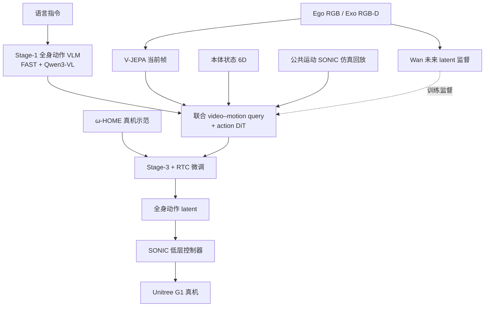

# ω-0：潜空间预测式人形并发 Loco-Manipulation WAM

**ω-0**（OMEGA-0；*A Latent Predictive World Action Model for Concurrent Humanoid Loco-Manipulation*，[arXiv:2608.06375](https://arxiv.org/abs/2608.06375)，[项目页](https://gentlefress.github.io/OMEGA-0_page/)）由 **NTU MARS Lab / 北京大学 / 北京智源（BAAI）/ 香港科技大学广州校区** 提出：在语言 + 多视角观测 + 本体状态下，直接预测 **SONIC 兼容** 的全身动作 latent，用 **紧凑未来观测 embedding**（而非像素视频重建）作为轻量世界模型信号，服务真机 **边移动边操作** 的家务任务。

## 一句话定义

**把「未来场景会怎么变」压成潜空间 foresight，与扩散全身动作生成耦合，让人形在走动中完成擦桌、拖地、洗衣等并发 loco-manipulation，而不是先走到位再站着操作。**

## 英文缩写速查

| 缩写 | 英文全称 | 简要说明 |
|------|----------|----------|
| WAM | World Action Model | 世界动力学与动作联合建模的策略范式 |
| ω-HOME | ω Household Omnimodal Multimodal Evidence | 本文 40.3 h 家务人形多模态数据集 |
| SONIC | Scalable Online Neural whole-body Integrated Control | 低层全身 motion latent 解码 / 遥操作接口 |
| VLA | Vision-Language-Action | π-0.5 / GR00T 等对照基线范式 |
| DiT | Diffusion Transformer | 动作 latent 去噪骨干（\(x_0\)-prediction） |
| RTC | Real-Time Chunking | 训练/部署用干净动作前缀对齐 receding-horizon |
| FAST | Frequency-space Action Sequence Tokenization | 连续全身轨迹 → 离散动作 token |
| V-JEPA | Video Joint-Embedding Predictive Architecture | 冻结当前帧视觉编码器 |
| RGB-D | Red-Green-Blue + Depth | ego RGB + exo RGB-D 多视角输入 |

## 为什么重要

- **并发而非交替：** 家务擦大桌、拖地、取冰箱饮品等需要下身、躯干与手臂持续协调；分层「导航→站立操作」会断档。
- **潜空间 foresight 的工程读法：** 相对视频中心 WAM，避免把噪声/遮挡下的像素轨迹误差放大到全身；策略更需要「对动作有用的紧凑未来信息」。
- **数据配套：** ω-HOME（40.3 h、4827 episodes、24 任务）提供同步多视角、SMPL、机器人状态与动作 latent，补真机全身示范缺口。
- **对照清晰：** 同数据协议下相对 ACT/DP、π-0.5/GR00T、ψ-0/Fast-WAM/DiT4DiT 全面领先（Omni **81.8%** SR）。

## 核心信息

| 项 | 内容 |
|----|------|
| **机构** | 南洋理工大学（NTU）MARS Lab；北京大学（PKU）；北京智源人工智能研究院（BAAI）；香港科技大学广州校区（HKUST-GZ） |
| **平台** | Unitree G1 + Inspire DexHands；SONIC 低层；Pico VR 遥操作采集 |
| **骨干** | Qwen3-VL-2B（动作 VLM）+ V-JEPA（当前帧）+ Wan（未来 latent 监督）+ T5（语言）+ action DiT |
| **数据** | ω-HOME：40.3 h、4827 episodes、24 任务；评测 11 任务 × 10 trials 单多任务策略 |
| **训练** | 三阶段；8×H100；公共运动经 SONIC 仿真回放接地 |
| **开源** | **宣称将开源 / WIP**（项目页 Code & Dataset；截至 **2026-08-10** 无可运行仓） |

## 核心原理

### 方法栈

| 模块 | 机制 |
|------|------|
| Stage 1 | **FAST** 全身动作 tokenizer + **Qwen3-VL-2B** 自回归预测离散动作 token；view token 区分 ego/exo |
| Stage 2 | 冻结 VLM / V-JEPA / Wan；motion+video query（2D/3D/1D RoPE）交叉注意；**action DiT** 去噪 SONIC latent；公共运动经仿真回放过滤 |
| Stage 3 | 真机混合任务微调；训练期 **RTC**（随机干净前缀）对齐部署时域 |
| 推理 | 语言 + 当前多视角 + 本体 → 未来感知 query + DiT → 缓存前缀 RTC → SONIC 全身执行 |

### 状态与条件

本体状态仅用关节、灵巧手与躯干 **6D 旋转**（四元数双覆盖 → 连续表示）；不用 IMU 线加速度/角速度。Omni 变体对 loco 重任务改用 exo 观测与 exo 未来 latent 监督，其余任务保持 ego。

### 流程总览

## 源码运行时序图

**不适用（官方可运行代码尚未发布）。** 截至 **2026-08-10**：项目页 [OMEGA-0_page](https://gentlefress.github.io/OMEGA-0_page/) 仍标注 Code/Dataset **WIP**；发布后应补：数据加载 → Stage1–3 训练 → SONIC 部署推理的 `sequenceDiagram`。

## 工程实践

| 项 | 建议 / 论文设定 |
|----|----------------|
| 何时用 | 需要 **manipulate-while-moving** 的家务/室内全身任务，且已有或可接 SONIC 类低层 |
| 输入模态 | Ego 可跑；Omni（+exo）在主表更强（81.8% vs 79.1%） |
| 当前帧编码器 | 部署侧优先 **V-JEPA 单帧语义**；勿为「与未来 latent 同空间」硬换 Wan 当前帧编码 |
| 评测读法 | 同时看 SR / 子任务 Score / Task Progress；长程任务 Progress 更能反映中途失败 |
| 数据接地 | 公共运动必须经控制器回放过滤不可执行轨迹，再进动作扩散 |
| RTC | 训练暴露干净前缀；部署缓存上一 chunk 前几帧作时间锚 |
| 复现现状 | **等官方代码与 ω-HOME**；当前只读论文/项目页选型 |

## 实验与评测

### 主表（11 任务均值）

ω-0 Omni **SR 81.8% / Score 36.7 / Progress 90.3%**；最强对照 ψ-0 **44.5%**、DiT4DiT **43.6%**、Fast-WAM **37.1%**；VLA 族约 22–32%；ACT/DP <16%。

### 任务族与协议

桌面取放、擦桌拖地、洗衣、多高度捡垃圾、膝关抽屉、冰箱取饮等，多数要求下身参与。每任务 10 trials；单多任务策略；评测段全自主。

### 消融（相对 Full Ego 79.1% SR）

| 变体 | SR (%) | 读法 |
|------|--------|------|
| w/o Robot state | 60.9 | 本体对转身/弯腰/接触边走最关键 |
| w/o Video query | 64.5 | 潜空间 foresight 不是装饰项 |
| Wan as current encoder | 63.6 | 离线重建好 ≠ 真机动作好 |
| w/o VLM prefix | 66.4 | 动作语义前缀有用 |
| w/o RTC | 71.8 | 缺前缀时犹豫/断档更明显 |
| Full Omni | **81.8** | loco 重任务用 exo 更稳 |

另：非重叠 ω-HOME 进 Stage-2 后 Omni 可到 **82.4%** SR。另报 held-out 跨物体/跨场景与 human-data transfer。

## 结论

**ω-0 的真贡献是把人形并发 loco-manipulation 的世界模型信号从「视频轨迹」换成「动作有用的潜空间 foresight」，并落到 SONIC 可执行 latent；数字优势建立在同数据多任务协议与低层统一接口上。**

1. **真影响：并发全身接口** — 直接预测全身 latent，而非上身 VLA + 下身独立 locomotion。
2. **真影响：轻量 foresight** — 相对像素 WAM，更贴真机遮挡/视角变化；消融去掉 video query 掉到 64.5%。
3. **真影响：数据接地管线** — SONIC 回放把人/公共运动变成可训监督。
4. **次要代价：依赖低层** — 能力与复现都绑 SONIC / 灵巧手栈。
5. **部署读法：Omni > Ego；V-JEPA 作当前帧** — 有外视就用；当前帧编码器别跟未来监督编码器盲目统一。
6. **工程读法：代码 WIP** — 先作 WAM/loco-manip 选型坐标，勿宣称可复现训练。

## 与其他工作对比

| 维度 | ω-0 | [MotionWAM](./paper-motionwam-humanoid-loco-manipulation-wam.md) | [Being-M0.7](./paper-being-m07-humanoid-latent-wam.md) | Fast-WAM / DiT4DiT |
|------|-----|------------------------------------------------------------------|--------------------------------------------------------|--------------------|
| 世界信号 | 未来观测 **embedding** | Video DiT 单次前向隐状态 | DINO latent + 紧凑 motion 先验 | 训练期视频 / 双 DiT 视频特征 |
| 结构 | Joint query + action DiT | Joint 双 DiT | **Cascaded** prior → action expert | 臂心或非统一全身 |
| 动作空间 | SONIC 全身 latent | SONIC 统一 token | SONIC + action chunk | 多偏操作或部分全身 |
| 任务焦点 | 家务并发 loco-manip（11 项） | 九项全身 loco-manip 实时 | 四项真机定量 | 操作榜或 G1 部分全身 |
| 开源 | WIP | 未开源 | 项目页/PDF | DiT4DiT 已开源 |

## 局限与风险

- **开源未落地：** 无法核对三阶段数据清洗、RTC 前缀与 SONIC 对接细节（2026-08-10 仍 WIP）。
- **平台绑定：** 主结果在 G1 + Inspire + SONIC；跨机需重新接地。
- **评测套件自建：** 11 任务强相关 ω-HOME，跨实验室对比需谨慎。
- **外视依赖：** Omni 最优；纯 ego 略降，视野遮挡仍是风险。
- **算力门槛：** 8×H100 三阶段，个人复现成本高。

## 关联页面

- [MotionWAM](./paper-motionwam-humanoid-loco-manipulation-wam.md) — Joint 视频隐状态人形 WAM 对照
- [Being-M0.7](./paper-being-m07-humanoid-latent-wam.md) — Cascaded 潜空间人形 WAM（人先验 + 后接地）对照
- [World Action Models](../concepts/world-action-models.md) — WAM 概念坐标
- [Loco-Manipulation](../tasks/loco-manipulation.md) — 任务背景
- [Teleoperation](../tasks/teleoperation.md) — Pico VR + SONIC 采集栈
- [SONIC](../methods/sonic-motion-tracking.md) — 低层全身接口
- [DiT4DiT](./paper-dit4dit-video-action-model.md) — 文内强 WAM 基线
- [DyPES-VLA](./paper-dypes-vla.md) — 同期跨本体 VLA（动力学先验用法不同）
- [VLA](../methods/vla.md) — 对照基线范式
- [Unitree G1](./unitree-g1.md) — 硬件平台

## 参考来源

- [omega0_arxiv_2608_06375.md](../../sources/papers/omega0_arxiv_2608_06375.md) — 论文摘录与开源核查
- [omega0-github-io.md](../../sources/sites/omega0-github-io.md) — 项目页核查
- [arXiv:2608.06375](https://arxiv.org/abs/2608.06375) — 原文

## 推荐继续阅读

- [ω-0 项目页](https://gentlefress.github.io/OMEGA-0_page/)
- [ω-0 PDF](https://arxiv.org/pdf/2608.06375)
- [MotionWAM（arXiv:2606.09215）](https://arxiv.org/abs/2606.09215) — Joint 人形全身 WAM 对照
- [Being-M0.7 项目页](https://research.beingbeyond.com/being-m07) — Cascaded 潜空间人形 WAM 对照
- [SONIC / GEAR](https://nvlabs.github.io/GEAR-SONIC/) — 低层全身跟踪接口
