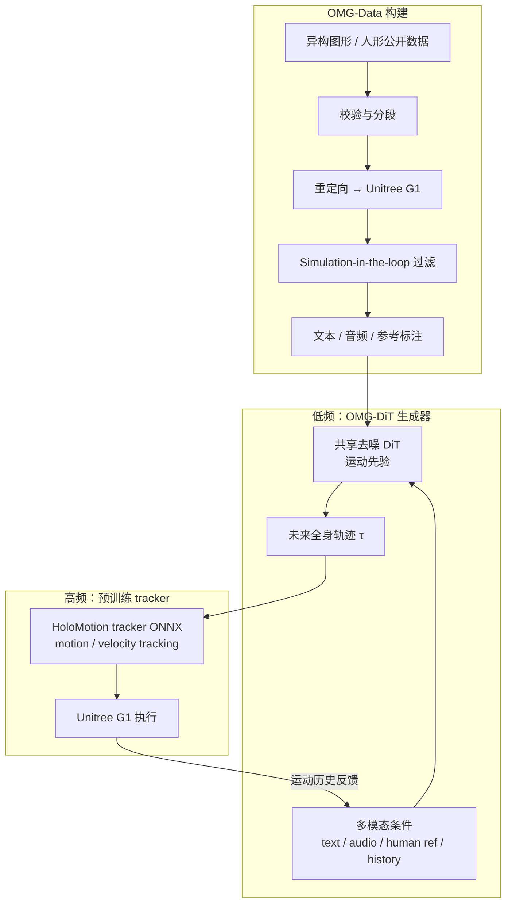

# OMG：Omni-Modal Motion Generation for Generalist Humanoid Control

**OMG**（*Omni-Modal Motion Generation for Generalist Humanoid Control*，[项目页](https://tsinghua-mars-lab.github.io/OMG/)，[GitHub](https://github.com/tsinghua-mars-lab/OMG)，Tsinghua University MARS Lab）把人形全身控制补上一层 **通用运动生成器**：在推理期不再强依赖外部参考文件，而是把 **语言、音频、人体参考轨迹、运动历史及其零样本组合** 实时映射为 **Unitree G1** 上可跟踪的全身未来轨迹，再由 **预训练 motion tracker** 物理执行。

> 截至入库日，官方 BibTeX 标注 **TBD**；方法细节以项目页、仓库文档与后续论文为准。

## 英文缩写速查

| 缩写 | 英文全称 | 简要说明 |
|------|----------|----------|
| DiT | Diffusion Transformer | 以 Transformer 为骨干的扩散去噪生成架构（OMG-DiT） |
| CFG | Classifier-Free Guidance | 训练时随机丢弃条件、推理时放大条件影响的扩散引导技巧 |
| FiLM | Feature-wise Linear Modulation | 用仿射变换调制特征图，常用于多模态条件注入 |
| WBT | Whole-Body Tracking | 让人形按参考全身运动的跟踪控制范式 |
| G1 | Unitree G1 Humanoid | 本文真机验证与 OMG-Data 对齐的目标平台 |
| BFM | Behavior Foundation Model | 大规模行为数据预训练的可复用全身行为先验叙事 |
| ONNX | Open Neural Network Exchange | 跨框架模型交换格式；OMG 导出供 TensorRT 实时推理 |
| Sim2Real | Simulation to Real | 仿真训练策略迁移真机；OMG-Data 含 sim-in-the-loop 过滤 |

## 为什么重要

- 在 [运动小脑 64 篇技术地图](../overview/humanoid-motion-cerebellum-technology-map.md) 中归类为 **E 可提示控制**（40/64）：可提示小脑：多模态提示到人形全身动作。
- **补上「意图 → 运动」缺失层：** [SONIC](../methods/sonic-motion-tracking.md)、[BeyondMimic](../methods/beyondmimic.md) 等 tracking 路线推理期仍需参考；窄技能 RL 又难覆盖开放指令。OMG 把 **多模态意图** 当作生成条件，与 [ETH G1 扩散 locomotion](./paper-hrl-stack-27-learning_whole_body_humanoid_locomot.md)、[Heracles](./paper-heracles-humanoid-diffusion.md) 同属 **生成参考 + 物理执行**，但强调 **omni-modal 组合与 foundation scaling**。
- **数据与模型一体：** **OMG-Data**（约 **1174.66 h**，经重定向 + 仿真筛选对齐 G1）支撑 **50M–1B** 规模 OMG-DiT 训练与 scaling 叙事，接近 [BFM](./paper-behavior-foundation-model-humanoid.md) / [HoloMotion](./holomotion.md) 的「运动基础模型」工程路径。
- **真机多模态切换：** 项目页 **一镜到底** 演示在 text / human ref / audio / 组合条件间 **实时切换**，把「通用人形控制接口」从单模态 tracking 推进到 **runtime 可组合**。
- **开源可复现栈：** MIT 仓库覆盖训练、ONNX 导出、pipeline 模式与 **G1 双机部署**（GPU planner + Orin tracker/bridge），降低与 [Whole-Body Tracking Pipeline](../concepts/whole-body-tracking-pipeline.md) 对照实验的门槛。

## 流程总览

## 核心机制（归纳）

### 1）Generator–tracker 分层

- **生成器（OMG-DiT）：** 扩散 Transformer 建模 **G1 可行运动流形**；条件与先验 **解耦**，新控制接口主要通过 **轻量 encoder + cross-attention / FiLM / CFG** 接入，复用预训练运动先验。
- **跟踪器：** 复用 [HoloMotion](./holomotion.md) 预训练 ONNX（`motion_tracking` / 真机推荐 `velocity_tracking`），把生成轨迹转为扭矩级可执行命令——与自研 RL tracker 的 [ETH G1](./paper-hrl-stack-27-learning_whole_body_humanoid_locomot.md) 路线形成对照。

### 2）OMG-DiT 多模态条件

| 模态 | 注入方式（项目页归纳） | 典型能力 |
|------|------------------------|----------|
| **语言** | 运动历史 + 指令 → 全局 context token | 自然语言驱动 stylized 动作与全身 locomotion |
| **音频** | 帧对齐音乐/音频，cross-attention + FiLM | 节奏、timing、风格调制 |
| **人体参考** | 逐帧 motion guidance | 神经重定向式全身跟踪引导 |
| **组合** | 多条件同时或运行时切换 | 零样本组合与一镜到底 modality switch |

### 3）OMG-Data

- **规模：** 总处理 **1174.66 h**；文本标注 **1166.6 h**；人体参考 **958.77 h**；音频条件 **191.6 h**（项目页统计）。
- **管线：** 聚合公开异构数据 → G1 重定向 → **仿真内筛选** 剔除物理无效轨迹 → 多模态对齐标注。
- **工程：** 仓库支持 **materialized** 分片加速训练；HF 数据集与 checkpoint 标注 **coming soon**（截至入库日）。

### 4）训练、推理与部署（仓库）

- **规模：** `50m`–`1b` 配置；文本 encoder 默认 **T5-base**。
- **推理：** checkpoint → **ONNX** → TensorRT/CUDA；pipeline 模式含 `async` / `sync` / `offline-track` 等。
- **真机：** **Jetson Orin** 跑 HoloMotion + OMG bridge；**GPU 工作站** 跑 realtime diffusion planner——分离算力以保 **实时 omni-modal** 闭环。

## 常见误区

1. **OMG 取代 tracker：** 生成器只产出 **参考轨迹**；物理可行性与高频控制仍由 **HoloMotion tracker** 承担（与 [Heracles](./paper-heracles-humanoid-diffusion.md)「中间件改参考」不同，OMG 是 **上游通用生成**）。
2. **等于人体文本→运动（HY-Motion / Kimodo）：** 那些工作多在 **SMPL 人体空间**；OMG 目标空间是 **G1 机器人可执行运动**，并含 **音频 / 参考 / 历史** 与 **真机部署** 全栈。
3. **等于 BFM 端到端 WBC：** [BFM](./paper-behavior-foundation-model-humanoid.md) 强调 **单策略多接口**；OMG 显式 **生成器 + tracker 两层**，更贴近 WBT 流水线里的「参考生产」阶段。
4. **数据已全开：** 代码已开源，但 **OMG-Data / 预训练权重 / Evaluator** 截至入库日仍 **待 HF 发布**——复现需关注官方更新。

## 评测与开放进度

> 截至入库日，官方**未公布同行评审论文与量化 benchmark 数据**（BibTeX 标注 TBD），以下为可核验的已公开口径：

- **数据规模（已公布）：** OMG-Data 总处理 **1174.66 h**，其中文本标注 **1166.6 h**、人体参考 **958.77 h**、音频条件 **191.6 h**（项目页统计）。
- **模型规模（已公布）：** OMG-DiT 提供 **50M–1B** 参数配置，文本 encoder 默认 **T5-base**。
- **评测工具（待发布）：** 仓库规划 **OMG-Evaluator** benchmark 流程，但其依赖的 **OMG-Data 数据集与预训练权重** 标注 **coming soon（HF 待发布）**，因此目前**无法复现官方量化指标**。
- **可验证证据：** 现阶段主要证据为项目页**一镜到底真机演示**（text / audio / human ref / 组合条件实时切换）与开源训练/推理/**G1 双机部署**代码，定量成功率/跟踪误差等指标需等官方 Evaluator 与权重发布后补录。

## 与其他工作对比（定性）

| 路线 | 生成层 | 执行层 | 条件模态 | 真机平台 |
|------|--------|--------|----------|----------|
| **OMG** | OMG-DiT 扩散 | HoloMotion tracker | text + audio + human ref + history + 组合 | G1 |
| **ETH G1 loco** | 地形条件 MDM | 自训 RL tracker | 朝向 + 高程图 | G1 |
| **Heracles** | Flow matching 中间件 | 通用 RL tracker | 状态 + 原始参考 | 多平台 |
| **BFM** | 潜空间生成式 WBC | 同一策略 | VR / 摇杆 / tracking 等 | G1 |
| **SONIC** | —（无生成层） | 规模化 tracking | 参考运动 / 视频估计 | 多具身 |

## 参考来源

- [OMG 项目页](../../sources/sites/omg-tsinghua-mars-lab-github-io.md)
- [OMG 官方仓库](../../sources/repos/omg-tsinghua-mars-lab.md)

## 关联页面

- [扩散运动生成](../methods/diffusion-motion-generation.md) — 扩散作为高层运动规划器的方法族
- [Whole-Body Tracking Pipeline](../concepts/whole-body-tracking-pipeline.md) — WBT 六阶段与 generator–tracker 扩展
- [HoloMotion](./holomotion.md) — OMG 默认 tracker 与权重来源
- [ETH G1 扩散全身 locomotion](./paper-hrl-stack-27-learning_whole_body_humanoid_locomot.md)、[Heracles](./paper-heracles-humanoid-diffusion.md)、[BFM](./paper-behavior-foundation-model-humanoid.md) — 生成 + 执行分层对照
- [人形运动跟踪方法选型](../queries/humanoid-motion-tracking-method-selection.md)
- [Unitree G1](./unitree-g1.md)

## 推荐继续阅读

- [OMG 项目页](https://tsinghua-mars-lab.github.io/OMG/) — 多模态演示视频与贡献列表
- [GitHub: tsinghua-mars-lab/OMG](https://github.com/tsinghua-mars-lab/OMG) — 安装、训练、部署文档
- [HoloMotion 仓库](https://github.com/HorizonRobotics/HoloMotion) — tracker ONNX 与权重下载
