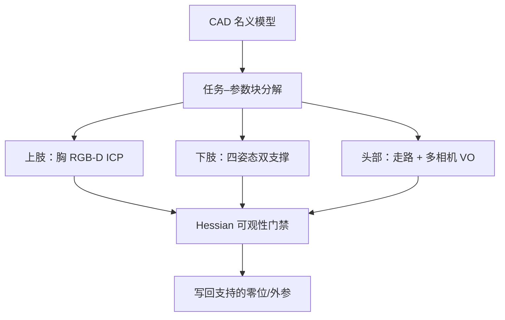

# OmniCalib（arXiv:2609.19582）

**OmniCalib**（*Target-Free, Task-Structured Self-Calibration for Humanoid Robots*，[arXiv:2609.19582](https://arxiv.org/abs/2609.19582)，2026-09-17）提出**免标定板、任务结构化**的人形全身自校准：每个模块绑定机器人原生动作与可观参数块，只写回 Hessian 支持的 CAD 修正（关节零位、相机外参）。

## 一句话定义

**装配/磨损会让 CAD 零位和外参一起漂——用臂扫工作空间、脚站双支撑、头随走路，分块估齐 14+12 关节零位与多路 RGB-D/头 rig，全程不要标定板。**

## 英文缩写速查

| 缩写 | 英文全称 | 简要说明 |
|------|----------|----------|
| ICP | Iterative Closest Point | 深度点云对齐；本文用于胸 RGB-D 观测手–臂 |
| RGB-D | RGB-Depth | 彩色+深度相机 |
| SO(3) | Special Orthogonal Group 3 | 三维旋转群；头 rig 旋转误差度量 |
| FK | Forward Kinematics | 正向运动学 |
| VO | Visual Odometry | 视觉里程计 |
| tf | Transform | ROS 坐标变换树 |

## 核心信息

| 字段 | 内容 |
|------|------|
| **平台** | AGIBOT A3 Ultra（全文统一硬件） |
| **作者** | Kaixiang Lu、Haiyu Lan、Chunxiao Qiao、You Li、Enyu Li、Yehao Lu、Jiarui Yang、Peiwen Lin、Chuang Wang |
| **开源** | **确认未开源**（截至 2026-09-19：无 GitHub/项目页） |
| **上肢** | 14 臂关节零位 + 左/右腕与胸 RGB-D 外参；深度 ICP 点–面残差 **2.09 mm** |
| **下肢** | 四静态双支撑 → 12 关节注入偏置恢复 RMS **0.063°** |
| **头部** | 平面行走 + 多相机 VO + 腿式里程计 + 动态 tf；三序列 SO(3) 均值 **1.061°**（最佳 **0.775°**） |

## 为什么重要

- **从「单传感器对」升级到「全身参数块」：** 现有方法多标定一对相机或依赖 ArUco；OmniCalib 在**无 fiducial** 下联合恢复臂零位与腕/胸外参。
- **任务即可观性设计：** 双支撑估腿、臂扫 workspace 估上肢、走路估头 rig——与 [接触约束下肢标定](./paper-contact-constrained-joint-offset-calibration.md) 等同属 **robot-native motion** 路线，但覆盖上/下/头全链。
- **写回门禁：** 用 Hessian 秩/条件数/局部 σ 决定哪些修正可写 CAD，避免不可观参数被误改。

## 方法

| 模块 | 机器人任务 | 估计量 | 关键机制 |
|------|------------|--------|----------|
| **上肢** | 臂扫 workspace，胸 RGB-D 看手 | 14 关节零位 + 腕/胸外参 | 深度 **ICP**；相对 CAD 左腕修正 10.56 mm / 1.74° 等 |
| **下肢** | 四静态双支撑 | 12 腿关节零位 | 脚间变换一致性 + 膝先验解 parallel pitch 和 |
| **头部** | 平面行走 | 多相机 rig 相对旋转 | ORB-SLAM3 VO + SuperPoint/LightGlue + 腿式里程计 + **动态 tf 补偿** |

### 流程总览

### 源码运行时序图

**不适用**（截至 2026-09-19：无可运行官方代码/项目页）。

## 工程实践

| 项 | 读法 |
|----|------|
| 适用场景 | 维护后重标、换腕/胸相机模块、批量出厂抽检——需能执行标准臂扫/双支撑/走路序列 |
| 与 ArUco/iKalibr | 上肢 ICP 与 ArUco 在注入实验均可 <0.1°；头 rig 用 **平面 walking** 可达 iKalibr 级 SO(3)（后者需 rich 6-DoF 激励） |
| 下游验证 | MuJoCo 固定基座足位 RMS 28.5→**2.8 mm**（注入回放） |
| 复现边界 | **代码未开源**；可实现思想为分块 Ceres + 动态 tf 时间对齐 |

## 实验与评测

| 模块 | Headline |
|------|----------|
| 上肢注入 | 14/14 满秩；max 绝对误差 **0.006°**（<0.1° 编码器分辨率参考） |
| 外参修正 | 左腕 10.56 mm / 1.74°；右腕 6.33 mm / 1.25°；胸 RGB-D 9.81 mm / 0.929° |
| 下肢 | 12 关节注入 RMS **0.063°**；held-out 静态足高 RMS 2.396→2.074 mm |
| 头部 | 序列 A/B held-out；rig 相对角重复 **0.140°** 内 |

## 结论

**OmniCalib 的真影响是「免标定板 + 分块写回」：把整机上肢/下肢/头 rig 拆成可观测子问题，而不是追求一次标定所有参数。**

1. **上肢 ICP 是首个卖点：** 14 零位与双腕外参从**胸 RGB-D 单源**联合恢复，残差 2.09 mm 是可部署级证据。
2. **下肢别省姿态数：** 四双支撑 + 膝先验才解 parallel pitch 和；两姿态不够。
3. **头部 walking 即可：** 1.061° 均值说明不必 warehouse 级 6-DoF 挥舞——但 yaw 信息来自对 nuisance 的导数正交化，序列设计仍重要。
4. **写回纪律：** 不可观块必须保留 CAD——量产要把 Hessian 诊断接进 MES/维护 SOP。
5. **与 WHU 下肢标定页对照：** [Contact-Constrained 标定](./paper-contact-constrained-joint-offset-calibration.md) 专注脚间 SE(3)；OmniCalib 将其扩展为 **全身任务表**。
6. **开源：** 无代码——工程落地需自研 Ceres 图与 AGIBOT/A3 等效传感布局。

## 局限与风险

- **平台绑定：** 实验全在 A3 Ultra；换关节序（pitch-roll-yaw vs roll-yaw-pitch）可观性不同。
- **头模块：** Kalibr 仅作 **后验旋转参考**，非优化输入；换 rig 布局需重验 VO 图。
- **LiDAR/IMU/FT：** 论文结论节明确 **未来扩展**  modalities，当前未覆盖。
- **误区：** 把 posterior σ 当精度——文中强调 σ 是可观性诊断，不等于 recovery 误差。

## 与其他工作对比

| 对照 | 差异读法 |
|------|----------|
| [Contact-Constrained 下肢标定](./paper-contact-constrained-joint-offset-calibration.md) | 同用双支撑脚间一致性；OmniCalib **加上肢 ICP 与头 rig**，且全程免板 |
| [状态估计 Hub](../overview/hub-state-estimation.md) | OmniCalib 位于 **出厂/维护几何层**，上游 IMU/LIO 仍依赖正确 tf |
| [感知栈选型闭环](../queries/robot-perception-stack-selection-loop.md) | 腕/胸/头外参错误会直接伤 VLA/manipulation——本文给 **whole-body 标定 SOP** 候选 |
| iKalibr / ArUco 管线 | OmniCalib  trade **激励复杂度** 换 **robot-native 任务**；头 rig 精度可比拟但流程不同 |

## 关联页面

- [Contact-Constrained 关节零位标定](./paper-contact-constrained-joint-offset-calibration.md)
- [状态估计 Hub](../overview/hub-state-estimation.md)
- [感知坐标后处理](../concepts/perception-coordinate-postprocessing.md)
- [机器人视觉感知栈选型闭环](../queries/robot-perception-stack-selection-loop.md)
- [Manipulation](../tasks/manipulation.md)

## 参考来源

- [omnicalib_arxiv_2609_19582.md](../../sources/papers/omnicalib_arxiv_2609_19582.md)
- [arXiv:2609.19582](https://arxiv.org/abs/2609.19582)

## 推荐继续阅读

- [arXiv PDF](https://arxiv.org/pdf/2609.19582)
- [Contact-Constrained 标定实体页](./paper-contact-constrained-joint-offset-calibration.md)
