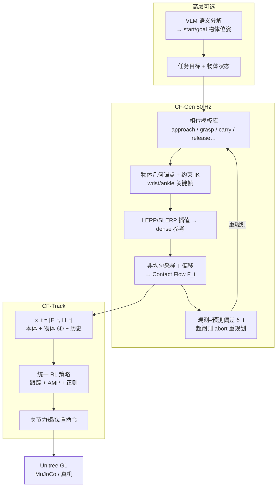

# OmniContact（Chaining Meta-Skills via Contact Flow）

**OmniContact**（*Chaining Meta-Skills via Contact Flow for Generalizable Humanoid Loco-Manipulation*，arXiv:2606.26201，[项目页](https://omnicontact.github.io/)）提出以 **Contact Flow（CF）** 为规划–执行共享接口的分层 loco-manipulation 框架：**CF-Track** 在统一 RL 策略下跟踪多样 meta-skill，**CF-Gen** 用物体几何规则合成 CF 并在 **50 Hz** 闭环重规划，实现长时程 **skill chaining**、**自主 recovery** 与 **VLM 语义分解**；配套自采 **OmniContact MoCap HOI 数据集**（1,274 序列 / 22.29 h）与 [MuJoCo sim2sim 仓库](https://github.com/Ingrid789/OmniContact_sim2sim)。

## 英文缩写速查

| 缩写 | 英文全称 | 简要说明 |
|------|----------|----------|
| CF | Contact Flow | 稀疏关键体轨迹 + 四端二进制接触信号的 skill 中间表示 |
| HOI | Human-Object Interaction | 人–物交互；本文强调 90 Hz 同步 MoCap + 6-DoF 物体轨迹 |
| CF-Track | Contact Flow Track | 统一低层 RL 执行器，跟踪 CF 或 NPZ 全轨迹 |
| CF-Gen | Contact Flow Generation | 规则相位模板 + 物体锚点 IK + 在线重规划的中层合成器 |
| RL | Reinforcement Learning | CF-Track 训练范式；奖励含跟踪、AMP 先验与动作正则 |
| AMP | Adversarial Motion Prior | 对抗运动先验，约束自然人形动力学 |
| VLM | Vision-Language Model | 高层语义任务分解为 start–goal 物体位姿 |
| G1 | Unitree G1 Humanoid | 论文与开源栈默认 29-DoF 人形平台 |
| NPZ | NumPy Archive | HF 数据集与 sim2sim 中的 G1 重定向轨迹格式 |

## 为什么重要

- **填补「可组合 skill 接口」空白**：dense HOI tracking（HDMI、OmniRetarget）难在线编辑；implicit embedding（LessMimic）难解释与结构化链接；OmniContact 用 **显式接触时序 + 稀疏体目标** 同时服务低层跟踪与中层启发式规划。
- **长时程闭环证据强**：Stack Boxes、Push-Stack 等多阶段任务基线近 **0%**，本文 chaining 达 **56.5–76.5%**；在线重规划进一步抬升 Push/Stack 成功率；连续搬箱 **~40 min** 耐力测试。
- **数据与代码可复现**：[HuggingFace 数据集](https://huggingface.co/datasets/lightcone02/OmniContact-Dataset)（917 G1 NPZ + 原始 MoCap）+ [sim2sim 仓库](https://github.com/Ingrid789/OmniContact_sim2sim)（CFgen/NPZ 双路径 + Xbox FSM）+ 项目页 **MuJoCo WASM + ONNX** 在线 viewer。
- **VLM 即插即用**：无需改低层权重，VLM 输出物体布局即可驱动 CF-Gen 合成 CF——语义任务（心形排箱、字母拼摆、进球）与接触物理层解耦。

## 流程总览

## 核心机制（归纳）

### 1）Contact Flow 表示

每控制步 $F_t = \{(b_{t+k}, c_{t+k})\}_{k \in \{0,1,2,3,4,8,12,16,24,32,50\}}$：

- $b_{t+k}$：稀疏 body targets（wrists、torso、ankles），在 torso-yaw 帧表达。
- $c_{t+k} \in \{0,1\}^4$：左踝、右踝、左腕、右腕 **二进制接触**。

相对 dense HOI 全轨迹：**更可编辑、可在线合成**；相对纯 object goal：**保留接触时序与交互意图**。Ablation 表明显式 contact 位将 Carry Box 从 **11.5%→98.7%**。

### 2）CF-Track：统一低层执行

| 组件 | 设计 |
|------|------|
| 输入 | 目标 CF $F_t$ + $K=5$ 步历史（关节、基座、EE、物体相对 pose、bbox、$a_{t-1}$） |
| 输出 | 低层 motor actions |
| 训练数据 | OmniContact MoCap→contact flow 监督 |
| 奖励 | $r^{\text{track}} + r^{\text{amp}} + r^{\text{reg}}$；track:amp = **0.85:0.15** 为最优平衡 |
| 能力 | 单一策略覆盖 carry / push / slide / kick / relocate；推理可跟 CF-Gen 或 NPZ 全轨迹 |

### 3）CF-Gen：相位模板 + 几何锚点

- 每 meta-skill 为 **有序 phase blocks**（如无接触接近 → 预抓 → 抬升 → 持物行走 → 释放）。
- 相位结束态由 **object-centric geometry** 锚定；接触相位用 **约束 IK**（pelvis 高/俯仰 + 关节，锁 waist roll/yaw）求 wrist/ankle。
- 相位间插值得 dense  kinematics，再采样为 CF 供 CF-Track——**不把 dense 关节命令直接喂策略**，保留低层柔顺与自然性。
- **50 Hz 监控**：$\delta_t = d(x^{\text{obj}}_{t,\mathrm{obs}}, x^{\text{obj}}_{t,\mathrm{pred}}) > \epsilon$ 时重规划 → 掉箱重接近等 recovery。

### 4）OmniContact 数据集

| 指标 | 数值 |
|------|------|
| 有效序列 | 1,274（论文）；HF 公开 917 条 G1 NPZ |
| 总时长 | 22.29 h |
| 物体帧 | 7.22M |
| 同步 | 90 Hz 人–物配对 MoCap |
| 原语 | carry / push / relocate / slide / kick |
| 平均序列 | 62.98 s；平均物体路径 19.76 m |

相对 OMOMO：更偏 **长时程搬运** 与 **contact-flow 监督**；OMOMO 序列更多、物体类别更广但 clip 更短。

## 评测（论文报告，仿真）

### Meta-skill（Table 2）

| 任务 | $R_{\text{succ}}$ | $E_{\text{obj}}^T$ (m) | $N_{\text{hoi}}$ |
|------|-------------------|------------------------|------------------|
| Carry Box | **98.7%** | 0.07 | 7.75 |
| Push Suitcase | **82.5%** | 0.27 | 6.00 |

### Meta-skill chaining

| 任务 | 阶段成功率 | 备注 |
|------|------------|------|
| Stack Boxes | 89 / 87 / **56.5%** | 三阶段 gather–stack |
| Push-Stack Boxes | 91.5 / **76.5%** | push + stack 组合 |

基线 Sonic / HDMI / PhysHSI / LessMimic 在长时程 chaining 上 **0% 或近零**；相对基线平均提升 meta-skill **+40.9%**、chaining **+66.5%**。

### 在线重规划（Table 3）

| 任务 | 无重规划 | 有重规划 $R_{\text{succ}}^*$ |
|------|----------|------------------------------|
| Push Suitcase | 82.5% | **94.5%** |
| Stack Boxes | 56.6% | **80.5%** |
| Push-Stack | 76.5% | **84.5%** |

## 与相邻路线对比

| 维度 | OmniContact | PhysHSI | HDMI | LessMimic |
|------|-------------|---------|------|-----------|
| Skill 表示 | **Contact Flow** | Object goal | Dense HOI TT | Skill embedding |
| 统一策略 | ✓ 单 CF-Track | ✗ 分任务 | ✓ 单轨迹易过拟合 | ✗ |
| Skill chaining | ✓ CF-Gen 链式 | ✗ | ✗ | 部分 |
| Recovery | ✓ 50 Hz 重规划 | ✓ | ✗ | ✓ |
| VLM 集成 | ✓ 物体布局→CF | ✗ | ✗ | ✗ |
| 数据 | 自采 22.29 h MoCap | AMASS+标注 | 视频→HOI | 多源 HOI |

## 开源与 sim2sim

- **仓库**：[Ingrid789/OmniContact_sim2sim](https://github.com/Ingrid789/OmniContact_sim2sim) — CFgen / NPZmotion 双参考源、`carry-push` 等 chaining preset、Xbox FSM 热切换（镜像 sim2real）。
- **数据集**：[lightcone02/OmniContact-Dataset](https://huggingface.co/datasets/lightcone02/OmniContact-Dataset) — G1 NPZ + BVH 原始 MoCap + Viser 可视化。
- **在线 demo**：项目页 MuJoCo WASM + ONNX policy viewer。

详见实体页 [OmniContact sim2sim](./omnicontact-sim2sim.md)（仓库工具页）。

## 常见误区或局限

- **不是端到端 VLA 全身策略**：VLM 只产出 **物体级布局**；接触与动力学仍由 CF-Gen + CF-Track 承担——语义层与物理层刻意解耦。
- **CF-Gen 仍为规则/heuristic**：对高度动态场景（快速踢球、复杂碰撞）规划能力有限；论文展望 **可学习 contact anchor 生成**。
- **夹爪欠驱动**：当前硬件限制精细操作；contact flow 向 **灵巧手** 扩展是明确 future work。
- **sim2real 叙事以仿真 benchmark 为主**：开源侧重 MuJoCo sim2sim；真机部署细节需跟踪后续发布。

## 关联页面

- [Loco-Manipulation](../tasks/loco-manipulation.md) — 长时程全身移动操作任务语境
- [Contact-Rich Manipulation](../concepts/contact-rich-manipulation.md) — 接触语义与中间表示
- [PhysHSI](./paper-amp-survey-15-physhsi.md) — AMP+HSI 单技能强基线
- [HDMI](./paper-hrl-stack-06-hdmi.md) — dense HOI co-tracking 对照
- [LessMimic](./paper-notebook-lessmimic-long-horizon-humanoid-interaction-with.md) — implicit embedding + chaining 对照
- [HumanX](./paper-hrl-stack-05-humanx.md) — 物体位姿泛化 HOI RL
- [OmniRetarget](./paper-hrl-stack-03-omniretarget.md) — 交互保留重定向数据管线
- [Unitree G1](./unitree-g1.md) — 默认硬件平台
- [AMP Reward](../methods/amp-reward.md) — CF-Track 运动先验
- [Sim2Real](../concepts/sim2real.md) — sim2sim 校验入口

## 参考来源

- [sources/papers/omnicontact_arxiv_2606_26201.md](../../sources/papers/omnicontact_arxiv_2606_26201.md)
- [sources/sites/omnicontact-project.md](../../sources/sites/omnicontact-project.md)
- [sources/repos/omnicontact-sim2sim.md](../../sources/repos/omnicontact-sim2sim.md)
- [sources/datasets/omnicontact-dataset.md](../../sources/datasets/omnicontact-dataset.md)
- Yu et al., *OmniContact: Chaining Meta-Skills via Contact Flow for Generalizable Humanoid Loco-Manipulation*, arXiv:2606.26201, 2026. <https://arxiv.org/abs/2606.26201>

## 推荐继续阅读

- [OmniContact 项目主页](https://omnicontact.github.io/)
- [GitHub: OmniContact_sim2sim](https://github.com/Ingrid789/OmniContact_sim2sim)
- [HuggingFace: OmniContact-Dataset](https://huggingface.co/datasets/lightcone02/OmniContact-Dataset)
- [arXiv HTML 全文](https://arxiv.org/html/2606.26201v1)
- [LessMimic（arXiv:2602.21723）](https://arxiv.org/abs/2602.21723) — 同 long-horizon chaining 议题的 embedding 路线对照（见 [LessMimic 实体](./paper-notebook-lessmimic-long-horizon-humanoid-interaction-with.md)）
