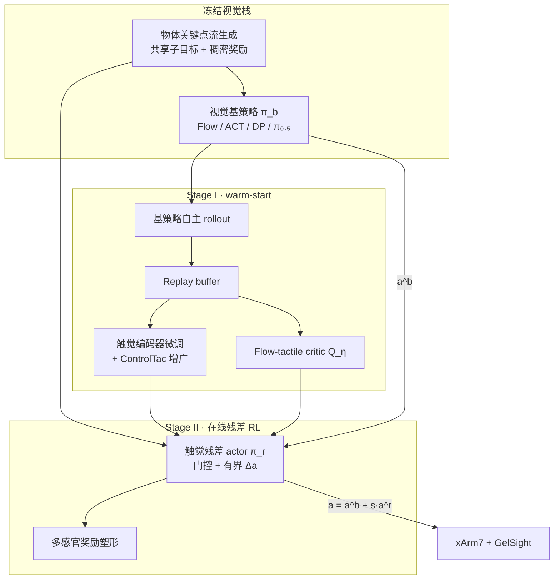

# OmniTacTune：视觉策略的触觉残差真机适应

**OmniTacTune**（*Policy-Agnostic Real-World RL for Tactile Residual Adaptation of Visual Policies*，UMD / Georgia Tech，arXiv:[2607.03723](https://arxiv.org/abs/2607.03723)，[项目页](https://colinyu1.github.io/omnitactune-site/)）提出 **「冻结视觉先验 + 触觉残差真机 RL」** 管线：不重新训练端到端 visuo-tactile 策略，而是在已有 **人视频或遥操视觉策略** 之上，用 **40–80 分钟** 在线交互学习 **轻量触觉残差**，把接触丰富任务的成功率从 **5–40% 拉到 85–100%**。

## 一句话定义

**视觉策略负责「大致怎么做」，触觉残差在真机试错里专门修接触——同一套残差学习器能挂在 Flow、ACT、DP 或 π₀.₅ 上，且不需要任何离线触觉演示。**

## 英文缩写速查

| 缩写 | 英文全称 | 简要说明 |
|------|----------|----------|
| RL | Reinforcement Learning | 本文在真机上用 SAC 类残差 RL 学触觉修正 |
| CRM | Contact-Rich Manipulation | 插装、开盖等依赖力与局部几何的操作族 |
| DP | Diffusion Policy | 遥操数据训练的扩散模仿基策略之一 |
| ACT | Action Chunking Transformer | 动作块 Transformer 模仿基策略 |
| VLA | Vision-Language-Action | π₀.₅ 所属的视觉–语言–动作策略族 |
| SAC | Soft Actor-Critic | 残差 RL 常用的 off-policy actor–critic 骨架 |
| IL | Imitation Learning | 视觉基策略主要来自模仿学习或 SFT |

## 核心信息

| 字段 | 内容 |
|------|------|
| 机构 | 马里兰大学帕克分校（University of Maryland, College Park）、佐治亚理工学院（Georgia Institute of Technology） |
| 平台 | xArm7 + 夹爪 + GelSight Mini + RealSense D435 第三视角 |
| 数据采集 | Meta Quest 人演示（第三视角 RGB + 手姿重定向）；OpenTeach VR 遥操 |
| 基策略 | Human/Teleop **Flow Policy**、ACT、DP、fine-tuned **π₀.₅** |
| 训练预算 | 12 min warm-start + 28–68 min 在线 RL（任务依难度 40–80 min 总计） |

## 为什么重要

- **解决视觉–触觉规模鸿沟：** 触觉数据比视觉小几个数量级；OmniTacTune **不追求把触觉数据扩到视觉规模**，而是让 **已有视觉策略当运动先验**，只在线补接触策略。
- **无需离线触觉演示：** 视觉演示天然缺触觉监督；本文用 **基策略自主 rollout** + **ControlTac 增广** 启动 critic/编码器，避开「必须先收大量视触配对数据」的瓶颈。
- **策略无关（policy-agnostic）：** 残差 actor 只读 **物体关键点子目标、基策略 action chunk、本体与触觉**，不侵入 ACT/DP/VLA 内部——工程上可 **即插即用** 到现有视觉栈。
- **样本效率实证：** 四接触丰富真机任务平均 **93.75%**，显著高于 PLD* / ViTAL；且 **比再给 IL 基线 50 min 遥操数据** 仍高 **20–30 pt**，说明 **接触修正更适合试错而非堆演示**。
- **与 [T-Rex](./paper-trex-tactile-reactive-dexterous-manipulation.md) 互补：** T-Rex 走 **大规模触觉 mid-training + 端到端 VLA**；OmniTacTune 走 **轻量残差 + 短真机 RL**——对应「有触觉数据预算」vs「只有视觉策略、想快速补触觉」两种部署路径。
- **与 [TacRefineNet](./paper-tacrefinenet-tactile-grasp-refinement.md) 互补：** TacRefineNet 用 **仿真 BC + 零样本** 做抓取末段局部精修头；OmniTacTune 用 **真机残差 RL** 修接触丰富技能——分别适合「固定几何精修」与「策略无关在线补触觉」。

## 核心贡献

| 模块 | 要点 |
|------|------|
| **残差 formulation** | 最终动作 $\mathbf{a}_t=\mathbf{a}_t^b+s_t\mathbf{a}_t^r$；基策略 $\pi_b$ **全程冻结** |
| **Stage I warm-start** | 自主 rollout → replay buffer；联合 bootstrap **flow-tactile critic** + 微调 **触觉编码器**（接触帧监督） |
| **ControlTac 增广** | 轨迹级合成 $\Delta F$ 触觉图像，扩少量真实接触对 |
| **Stage II 残差 RL** | 接触门控 $g_t$ 的 flow-tactile residual actor；有界动作尺度（如 0–0.15）+ scheduler |
| **物体流接口** | DINOv2+SAM+CoTracker3 关键点流 → 共享子目标与 **flow 匹配稠密奖励** |
| **多感官奖励** | 到达 + 抓取/接触 + flow 跟踪 + 触觉稳定 − 安全惩罚 + 终端成功 |

## 方法

### 视觉基策略（冻结）

- **Flow Policy：** 沿 Im2Flow2Act / GenFlowRL / Dex4D，从人视频或遥操学 **物体关键点运动先验**；生成流同时服务 **基策略输入** 与 **残差 RL 奖励**。
- **ACT / DP / π₀.₅：** 在同步 RGB+状态+动作的遥操数据上训练或微调；初成功率 **15–50%**（Peg-in-Hole），接触段是主要失败源。

### 两阶段真机 RL

**Stage I** 解决「无离线触觉数据时 critic/编码器如何起步」：不只填 buffer，而是 **用 on-policy 接触转移同时训练 critic 与编码器**。**Stage II** 在稳定价值估计上学习残差；**接触门控** 避免非接触段无意义触觉扰动。

### 策略无关接口设计

残差 actor 输入：

- 本体 $q_t$
- 流特征 $z_t^f$（含当前/生成关键点与相对运动）
- 门控触觉 $g_t\cdot z_t^\tau$
- 当前与 chunk 级基动作 $\mathbf{a}_t^b,\mathbf{a}_{t:t+K}^b$

**刻意不读** 基策略隐状态、视觉 token 或架构专有中间量——因此 **同一残差头** 可接 Flow、ACT、DP、π₀.₅。

## 实验要点

### 四接触丰富真机任务

| 任务 | 难点 | 训练时长 | 基策略成功率 → OmniTacTune |
|------|------|----------|---------------------------|
| **Peg-in-Hole** | 空间泛化 + 毫米级插入 | 50 min | 40% → **100%** |
| **Charger Insertion** | 微小插头公差 | 40 min | 10% → **100%** |
| **Cap Opening** | 开瓶器姿态 + 动态接触 | 60 min | 5% → **90%** |
| **Box Opening** | 杠杆 + 小边缘对齐 | 80 min | 5% → **85%** |

### 与真机 RL 基线

| 方法 | 平均成功率 | 要点 |
|------|-----------|------|
| **OmniTacTune** | **93.75%** | warm-start critic/encoder + 残差 + 多感官奖励 |
| PLD* | 52.5% | 有触觉数据但 **无 critic/encoder bootstrap** |
| PLD (visual only) | 37.5% | 无触觉适应 |
| ViTAL | 43.75% | 从零训 visuo-tactile critic，样本效率低 |

### 跨视觉基策略（Peg-in-Hole，~50 min）

五类基策略均提升 **+40–60 pt** 至 **75–100%**；**人视频 Flow** 运动先验最平滑、终值最高。说明残差管线 **绑定的是任务几何接口，而非某一网络架构**。

### 跨触觉表示

**AnyTouch2**、**Sparsh**、**T3** 与 **低维 marker MLP** 均可适配；动态接触更多的 Charger Insertion 上，未在动态接触数据上预训练的 Sparsh/T3 略逊于 AnyTouch2 与 markers。

### vs 更多触觉演示（IL）

在 Peg-in-Hole 上，即使给 ACT+触觉拼接、RDP、π₀.₅+触觉 **额外 50 min 遥操**（演示 50→90），成功率仍 **落后 OmniTacTune 20–30 pt**——**在线残差试错** 优于 **继续堆 visuo-tactile 模仿数据**。

## 结论

**接触丰富操作不必重训端到端视触策略：冻结视觉先验，用短时真机触觉残差 RL 专修接触段。**

1. **残差公式** — $a=a^b+s\cdot a^r$，基策略全程冻结；残差只读子目标/基动作/本体/触觉，不侵入 ACT/DP/VLA 内部。
2. **零离线触觉演示** — Stage I 用基策略 rollout + ControlTac 启动 critic/编码器；Stage II 接触门控残差 RL。
3. **四任务 40–80 min** — Peg/Charger/Cap/Box 成功率约 **5–40%→85–100%**，平均 **93.75%**，高于 PLD*/ViTAL。
4. **策略无关可插拔** — Flow/ACT/DP/π₀.₅ 在 Peg-in-Hole ~50 min 均约 **+40–60 pt** 至 **75–100%**。
5. **试错优于堆演示** — 再给 IL 基线 50 min 视触遥操仍落后 **20–30 pt**。
6. **选型边界** — 适合「已有视觉策略、快速补触觉」；与 T-Rex 大规模触觉 mid-training、TacRefineNet 仿真精修头预算区间不同。

## 常见误区

- **误区 1：「有 GelSight 就把触觉拼进 VLA token 再 SFT。」** 本文 π₀.₅+触觉 与 OmniTacTune(π₀.₅) 对比表明：**短预算下残差 RL > 多演示 SFT**；与 T-Rex 的「触觉必须架构上对」形成不同预算区间的证据。
- **误区 2：「残差只能修 locomotion/WBC。」** OmniTacTune 把 **残差 + 真机 RL** 推到 **桌面接触丰富 manipulation**，且 **插件式** 接 IL/VLA。
- **误区 3：「必须先收触觉演示才能训触觉 critic。」** warm-start 用 **基策略失败 rollout 中的接触帧** + ControlTac，**零人工触觉示教**。

## 局限

- 依赖 **人工 reset** 与 **GelSight 等脆弱传感器** 的反复接触，硬件磨损成本高。
- 评测平台为 **单臂 xArm7**；向双手灵巧、移动操作扩展尚待验证。
- 物体流生成与关键点跟踪在 **强遮挡/反光** 场景可能削弱共享接口质量。

## 关联页面

- [视触觉融合](../concepts/visuo-tactile-fusion.md) — 残差适应 vs 端到端融合 vs 阶段切换
- [Contact-Rich Manipulation](../concepts/contact-rich-manipulation.md) — 任务定义与接触失败模式
- [在 RL 中利用触觉反馈](../queries/tactile-feedback-in-rl.md) — 真机 RL、奖励塑形与 Sim2Real 对照
- [Manipulation 任务](../tasks/manipulation.md) — 操作技术栈入口
- [T-Rex](./paper-trex-tactile-reactive-dexterous-manipulation.md) — 端到端触觉反应式 VLA 对照
- [TacRefineNet](./paper-tacrefinenet-tactile-grasp-refinement.md) — 仿真 BC 局部触觉抓取精修对照
- [Diffusion Policy](../methods/diffusion-policy.md) — 支持的基策略之一

## 推荐继续阅读

- 论文 PDF：<https://arxiv.org/pdf/2607.03723>
- 项目页（含 40 min 一镜到底训练视频）：<https://colinyu1.github.io/omnitactune-site/>
- PLD（残差真机 RL 前身）：<https://arxiv.org/abs/2303.03381>（对比引用 [57]）

## 与其他工作对比

- 正文已给出与相邻路线 / baseline 的 **定性对照**；定量表格与 ablation 见原文（[参考来源](#参考来源)）。

## 参考来源

- [OmniTacTune 论文归档](../../sources/papers/omnitactune_arxiv_2607_03723.md)
- [OmniTacTune 项目页归档](../../sources/sites/omnitactune-project.md)
