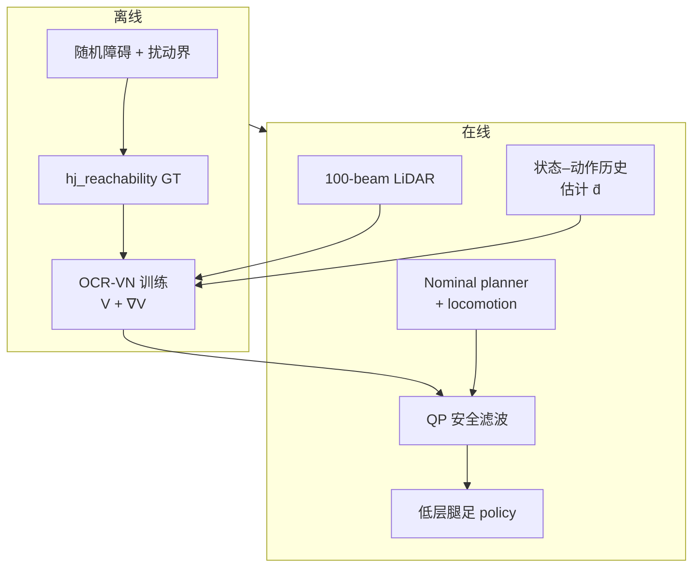

# One Filter to Deploy Them All：OCR 四足安全导航

**One Filter to Deploy Them All**（IEEE TRO, Vol. 42, pp. 545–560, 2026）提出 **Observation-Conditioned Reachability（OCR）**：不在每种 locomotion controller 上单独训 safety critic，而在 **任意 nominal 导航栈外** 加一层 **策略无关安全滤波器**——用 LiDAR 与在线扰动估计恢复与当前环境匹配的安全价值函数，并以 **最小干预** QP 修正高层 $(v_x,\omega_z)$ twist。

## 一句话定义

**把大量离线 HJ 最优安全解压缩进 OCR-VN，再用实时 LiDAR 与闭环扰动界驱动 QP 安全滤波——同一安全层可套在不同规划器与腿足控制器上。**

## 英文缩写速查

| 缩写 | 英文全称 | 简要说明 |
|------|----------|----------|
| OCR | Observation-Conditioned Reachability | 观测条件化可达性框架 |
| HJ | Hamilton-Jacobi | 哈密顿–雅可比可达性分析 |
| BRT | Backward Reachable Tube | 后向可达管；安全/危险边界 |
| QP | Quadratic Programming | 在线最小修改 nominal 的二次规划 |
| LiDAR | Light Detection and Ranging | 100 束扫描，局部障碍感知 |
| TRO | IEEE Transactions on Robotics | 发表期刊 |

## 为什么重要

- **环境 + 动力学双重未知：** 新障碍布局、摩擦突变、负载变化、低层跟踪误差、外扰——传统「训练分布内安全」不能自动继承。
- **与 RL safety critic 的分工：** OCR 学的是 **HJ 最优安全价值**（策略无关），而非某一 policy 的 Q 函数。
- **可部署降阶：** 全维四足 HJ 网格不可行 → 3D Dubins + 闭环等效扰动 $\bar{d}$，安全层不需知道 12 关节力矩如何计算。

## 流程总览



## 核心机制

### 1）安全价值与 BRT

- 失败集 $\mathcal{F}$ 用 Lipschitz 函数 $l(x)$ 隐式表示；$V(x)$ 为最坏扰动下的最小安全裕度。
- $V(x)\ge 0$：存在控制保持安全；$V(x)<0$：最坏情况下不可避免失败。

### 2）OCR-VN

- 输入：降阶状态 $(x,y,\theta)$、扰动界 $\bar{d}$、LiDAR（100 束，裁剪距离）
- 输出：安全价值 **及其梯度**（QP 约束需要 $\nabla V$）
- MLP 4×512 + sinusoidal activation；同时回归 $V$ 与 $\nabla V$

### 3）最小干预滤波

- BRT **外部**：nominal twist 原样通过
- **近边界**：求解式 (8)–(9)，在安全约束下最小偏离 nominal

### 4）Conformal 校准

- 神经网络可能 **高估** 安全；用 conformal prediction 在验证集上选 calibration level（文内部署约 **0.49 m** 量级）
- 这是对 **学习价值** 的统计保守，不是固定几何安全距离

### 5）扰动在线估计

- 用最近 $N$ 步状态–命令与无扰动 Dubins 预测比较，反推等效 $\bar{d}$
- 吸收打滑、摩擦、负载、低层跟踪误差、降阶模型误差与外扰

## 核心信息

| 字段 | 内容 |
|------|------|
| 期刊 | IEEE TRO, Vol. 42, pp. 545–560, 2026 |
| 项目页 | [One Filter to Deploy Them All](https://sia-lab-git.github.io/One_Filter_to_Deploy_Them_All/) |
| 接口 | 高层 twist $(v_x,\omega_z)$；关节力矩仍由底层 locomotion 生成 |

## 实验与评测（文内摘要）

- 多种高层规划器 × 多种低层 locomotion controller
- 狭窄通道、复杂地形、动态障碍、外扰与人工遥控对抗场景
- Figure 1 展示 **同一 OCR 层** 跨控制器复用

## 工程实践

| 项 | 内容 |
|----|------|
| **代码** | [albertklin/observation-conditioned-reachability](https://github.com/albertklin/observation-conditioned-reachability) — **已开源** |
| **离线 GT** | `hj_reachability`；1000 训练环境 / 100 验证环境 |
| **训练规模** | 数据生成 ~35 min（3090Ti）；OCR-VN 训练 ~8 h |

### 源码运行时序图

```mermaid
sequenceDiagram
  autonumber
  participant Off as 离线数据生成
  participant VN as OCR-VN
  participant Lidar as LiDAR
  participant Est as 扰动估计
  participant QP as 安全 QP
  participant Nom as Nominal 控制器
  participant Loco as 腿足 locomotion
  Off->>VN: HJ 监督训练
  Lidar->>VN: 扫描距离
  Est->>VN: d̄
  Nom->>QP: u_nom
  VN->>QP: V, ∇V
  QP->>Loco: u_safe twist
  Loco-->>Est: 状态历史
```

## 与其他工作对比

> 下表只做 **定位对照**：本页实验为「多规划器 × 多 locomotion controller」的跨栈复用验证，论文未给聚合成功率表，**不可与端到端安全策略的成功率并排读**。

| 对照 | 差异读法 |
|------|----------|
| **每个控制器单训 safety critic**（要替代的默认做法） | 换一个 locomotion policy 就要重训一次安全模块；OCR 把安全层做成 **策略无关** 的一层，只改高层 twist $(v_x,\omega_z)$，Figure 1 的同一 OCR 层跨控制器复用即这一条的直接证据 |
| [控制屏障函数（CBF）](../concepts/control-barrier-function.md) | 同为「最小干预」滤波形态（都落到一个 QP），但安全集的来源不同：CBF 需要人工构造并验证一个有效屏障函数；OCR 把 **离线 HJ 最优解** 压缩进 OCR-VN，安全集由可达性计算给出而非手工设计 |
| **在线全维 MPC** | 论文明确定位为互补而非竞争：MPC 每步在线求解、模型全维但算力重；OCR 是 **离线算、在线查**——代价是降阶到 3D Dubins，模型误差被吸收进扰动界 $\bar{d}$，极端动力学可能超出训练界 |
| [安全滤波器](../concepts/safety-filter.md) | 概念入口：OCR 属该页谱系里 **学习型价值函数 + QP 最小修正** 一支；读该页可看清「滤波器改什么量」这一轴上的选择（此处只改 twist，不碰关节力矩） |
| [Safe RL](../methods/safe-rl.md) | 把安全约束写进 **训练目标**，安全性与策略绑定；OCR 反其道——策略照常训，安全在 **部署期外挂**。这决定了它适合「高层规划 + 低层运动已定型、只想加盾」的场景 |
| [最优控制](../concepts/optimal-control.md) | 理论源头：OCR-VN 学的是 HJ 可达性的价值函数 $V$ 与梯度 $\nabla V$。NN 会高估安全，故论文加 conformal 校准——但分布偏移（如 LiDAR 域变化）下该概率保证不可外推 |

## 结论

**OCR 的价值在于把「安全」从某一 RL policy 的外挂 critic，升级为可跨控制器复用的 HJ 最优安全层——适合层次化四足栈中「高层规划 + 低层运动」已定型、只想加安全盾的场景。**

- 降阶到 3D Dubins + 扰动界是全文可计算的关键；安全层只改 twist，不替代低层力矩控制。
- LiDAR 条件化解决 **部署前未知障碍**；在线 $\bar{d}$ 估计解决 **动力学漂移**。
- Conformal 校准针对 NN 高估安全；分布偏移时概率保证不能无脑外推。
- 与 MPC/CBF 路线互补：OCR 偏 **学习压缩 HJ 解 + 快速查询**，而非在线全维 MPC。
- 人形/轮式需重新做降阶模型与失败集定义，但「策略无关滤波」结构可借鉴。

## 局限与风险

- 降阶模型误差被吸收进 $\bar{d}$，极端动力学可能超出训练扰动界。
- LiDAR 分布偏移会使 conformal 保证失效。
- 计算与传感依赖：需可靠状态估计与 100 束 LiDAR 流。

## 关联页面

- [Optimal Control](../concepts/optimal-control.md)、[Locomotion](../tasks/locomotion.md)

## 推荐继续阅读

- [TRO 项目页](https://sia-lab-git.github.io/One_Filter_to_Deploy_Them_All/)
- [官方代码](https://github.com/albertklin/observation-conditioned-reachability)

## 参考来源

- [sources/sites/one-filter-deploy-them-all.md](../../sources/sites/one-filter-deploy-them-all.md)
- [sources/repos/observation-conditioned-reachability.md](../../sources/repos/observation-conditioned-reachability.md)
- [PinkRobot TRO 2026 文献解读](../../sources/blogs/wechat_pinkrobot_one_filter_ocr_tro_2026_2026-09-15.md)
