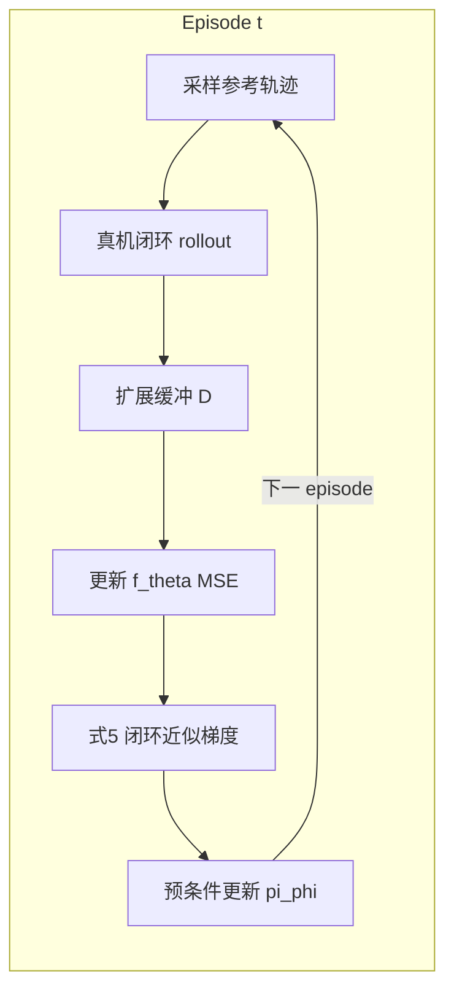

# Online MBRL via Online Optimization（真机在线模型基强化学习）

**Efficient Model-Based Reinforcement Learning for Robot Control via Online Optimization**（[arXiv:2510.18518](https://arxiv.org/abs/2510.18518)，v2 2026-05-06；Fang Nan / Hao Ma / Qinghua Guan / Josie Hughes / Michael Muehlebach / Marco Hutter · **苏黎世联邦理工（ETH Zürich）** / **马克斯·普朗克研究所（Max Planck）** / **洛桑联邦理工学院（EPFL）**）提出面向难仿真机器人的 **在线 MBRL**：用实时交互学动力学模型，再以模型引导的近似梯度在**真实 rollout** 上更新策略，并给出随机在线优化视角下的 regret 分析。

## 一句话定义

**不靠大规模仿真与想象 rollout，而用真机数据在线学模型、再在真实轨迹上做一阶策略优化的样本高效 on-robot MBRL。**

## 英文缩写速查

| 缩写 | 英文全称 | 简要说明 |
|------|----------|----------|
| MBRL | Model-Based Reinforcement Learning | 本文范式：学动力学再优化策略 |
| HEAP | Hydraulic Excavator for Autonomous Purpose | 12.5 t 液压挖掘机臂实验平台 |
| SGD | Stochastic Gradient Descent | 策略侧预条件在线下降 |
| PL | Polyak–Łojasiewicz | 理论分析中用于连接梯度范数与 regret |
| TV | Total Variation | 刻画策略更新导致的数据分布漂移 |
| MSE | Mean Squared Error | 单步动力学拟合损失 |

## 为什么重要

- **绕开难仿真平台：** 液压、软体等系统缺少可大规模并行的高保真仿真；本文把学习闭环直接放在真机。
- **算力叙事不同于 Dreamer / TD-MPC：** 不依赖海量想象数据或采样式在线规划，降低「数据够快、优化跟不上」的瓶颈。
- **有理论把手：** 把模型与策略拆成耦合的在线优化问题，明确梯度误差与分布漂移对 sublinear regret 的条件。
- **同超参跨 embodiment：** HEAP 与缆驱软臂共用 \(\alpha,\epsilon,\eta\)，强调「少先验、换维度即可起步」。

## 核心信息

| 字段 | 内容 |
|------|------|
| 论文 | Efficient Model-Based Reinforcement Learning for Robot Control via Online Optimization |
| arXiv | [2510.18518](https://arxiv.org/abs/2510.18518)（v2） |
| 机构 | ETH Zürich RSL · MPI-IS · ETH IDSC · EPFL CREATE Lab |
| 任务 | 连续轨迹跟踪（笛卡尔 / 平面尖端） |
| 平台 | HEAP 液压臂；缆驱三段 helicoid 软臂 |
| 开源 | **确认未开源**（截至 2026-08-11） |

## 核心原理（方法）

### 问题设定

未知动力学 \(x_{\tau+1}=f(x_\tau,u_\tau)\)；回合制最小化期望跟踪代价。策略 \(\pi_\phi(x,\tilde{x})\) 与模型 \(f_\theta\) 均为神经网络，参数在有界凸集上在线更新。

### Algorithm 1 主干

1. 采样参考轨迹，用当前 \(\pi_\phi\) 在真机上 rollout 固定 horizon \(H\)
2. 将 \((x,u,x^+)\) 写入累积缓冲 \(\mathcal{D}\)
3. **模型更新：** 最小化单步 MSE（式 3），实践中对模型用 Adam
4. **策略更新：** 用 \(f_\theta\) 的块 Jacobian \(A_t,B_t\) 与策略反馈 \(K_t\)，在**真实轨迹**上估计闭环梯度（式 5），再做预条件下降（式 6–7）

关键差别：不是 BPTT through learned rollouts，而是「真实状态轨迹 + 学习 Jacobian 的灵敏度」——避免模型复合误差主导优化，也避免反复在模型里做 zeroth-order 搜索。

### 流程总览

### 理论要点（索引级）

| 模块 | 结论读法 |
|------|----------|
| 策略侧 | regret 含标准 \(\mathcal{O}(\sqrt{T})\) 项 + 累积梯度误差 \(\delta_t\)；需 \(\sum\|\delta_t\|^2=o(T)\) |
| 模型侧 | 缓冲混合分布下的 regret 受 episode 漂移 \(\Delta_t\)（TV）影响；策略强正则 → 近似时间尺度分离 |
| 工程对应 | \(\Lambda_t\) 中 \(\epsilon I+\alpha JJ^\top\) 起 trust-region 作用；文中两平台共用 \(\alpha=0.01,\epsilon=0.05,\eta=0.5\) |

## 源码运行时序图

**不适用。** 截至 **2026-08-11**：无官方项目页与可运行代码仓；仅有论文伪代码与超参描述，无法对齐 README 入口画运行时序。

## 工程实践

| 项 | 实践要点 |
|----|----------|
| 开源状态 | **确认未开源** — 见 [`sources/papers/online_mbrl_robot_control_arxiv_2510_18518.md`](../../sources/papers/online_mbrl_robot_control_arxiv_2510_18518.md) |
| 状态/动作 | HEAP：关节位速 + 参考前瞻窗 + 既往阀电流指令 → 阀电流；模型预测臂速度 |
| 网络 | 模型与策略均为两隐层 MLP；模型 Adam、策略 SGD |
| Episode | 例：10 条子轨迹 × 数秒；HEAP 真机 180 episode ≈ **2.5 h** 数据、墙钟约 3 h（i9-12900K + RTX 4090，GPU 实现，ROS 通信） |
| 超参 | \(\alpha=0.01,\ \epsilon=0.05,\ \eta=0.5\)（两平台共用；对 \(\epsilon/\alpha\) 更敏感） |
| 选型读法 | 难仿真、连续跟踪、可安全在线试错 → 优先考虑本路线；稀疏奖励/接触丰富 → 作者建议补 latent（Dreamer 式）或预训练 |

## 实验与评测

| 轴 | 报告口径（以论文为准） |
|----|------------------------|
| HEAP 仿真 | 同交互预算优于 TD-MPC2 / DreamerV3；约 200 episode / **2.78 h** 仿真数据达均值跟踪误差 **5.5 cm**；相对 Egli & Hutter 的 PPO 叙事（\>10 000 h 仿真）样本差数量级 |
| HEAP 真机 | 180 episode / **2.5 h** → 随机样条均值误差 **2.7 cm**；\(v^{\max}=129.3\) cm/s，\(\rho=0.09\)（优于复现的 N&H24 \(\rho=0.27\) 与 E&H22 \(\rho=0.13\)） |
| 负载适应 | 切换夹持物/石块后误差跳升，约 **5 episode** 回到原水平 |
| 软臂 | 约 **30 episode** 收敛；圆/方测试轨迹均值误差 **2.95 cm**（对照 Chen et al. 2024a 约 2.8 cm，但流程更简单） |
| 消融（HEAP 仿真） | 停更模型 / 降频更模型 → 策略退化或周期振荡，印证模型–策略耦合 |

## 结论

**当平台难仿真且任务是连续跟踪时，用「真机缓冲学模型 + 真实轨迹上一阶策略更新」可以把 on-robot MBRL 压到小时级，并在负载漂移下保持可适应。**

1. **Jacobian-on-real-trajectory** — 模型提供局部灵敏度，策略仍在真实代价上更新，减轻想象域差。
2. **预条件正则是稳定性核心** — 比单纯调 \(\eta\) 更关键；停更模型会进入恶性循环。
3. **样本叙事要对齐基线族** — 相对 PPO 仿真小时数、相对 TD-MPC2/Dreamer 同交互预算，读法不同。
4. **跨 embodiment 少先验** — 液压臂与软臂同超参，换状态维度与归一化即可起步。
5. **适用范围窄于通用 RL** — 连续代价跟踪已验证；稀疏奖励/接触突变需扩展。
6. **复现门槛高** — 确认未开源；工程价值在选型与理论坐标，而非可直接跑的代码。

## 局限与风险

- **任务族：** 主实验为轨迹跟踪；抓取等离散/稀疏奖励、强接触不连续动力学未验证。
- **理论闭合：** 模型–策略完全耦合与 performative 分布漂移的严格联合分析仍开放。
- **噪声敏感：** 策略更新依赖有限 on-policy 轨迹，真机离群点会抬高梯度方差。
- **安全与硬件：** 从随机初始化在真机上线，需平台侧安全壳；文中未给通用安全层。
- **开源：** 无可运行实现，复现依赖自研。

## 与其他工作对比

| 对比轴 | 本文 Online MBRL | [TD-MPC2](./paper-td-mpc2.md) | [DreamerV3](./paper-shenlan-wm-13-dreamerv3.md) | [RWM / RWM-U（ETH RSL）](./robotic-world-model-eth-rsl.md) |
|--------|------------------|-------------------------------|--------------------------------------------------|-------------------------------------------------------------|
| 策略数据 | 真实轨迹 + 模型梯度 | 潜空间 MPC 规划 | 想象轨迹 actor-critic | 学模型后想象 rollout + PPO |
| 主战场 | 液压/软臂真机跟踪 | 仿真连续控制基准 | 通配仿真/沙盒 | 足式速度跟踪（Isaac Lab） |
| 相对 sim2real | **直接真机学** | 通常仍在仿真 | 可 DayDreamer 真机，但想象仍重 | 模型可服务 sim / offline |
| 开源 | 未开源 | MIT + 大量权重 | 公开复现丰富 | Isaac Lab 扩展 + Lite 开源 |

## 关联页面

- [Model-Based RL](../methods/model-based-rl.md)
- [Sim2Real](../concepts/sim2real.md) — 作为「难以仿真时的旁路：直接 on-robot」
- [Latent Imagination](../concepts/latent-imagination.md)
- [TD-MPC2](./paper-td-mpc2.md) · [DreamerV3](./paper-shenlan-wm-13-dreamerv3.md)
- [Robotic World Model（ETH RSL）](./robotic-world-model-eth-rsl.md)
- [Reinforcement Learning](../methods/reinforcement-learning.md)

## 参考来源

- [Online MBRL via Online Optimization 论文归档（arXiv:2510.18518）](../../sources/papers/online_mbrl_robot_control_arxiv_2510_18518.md)

## 推荐继续阅读

- [arXiv:2510.18518](https://arxiv.org/abs/2510.18518)
- [TD-MPC2](./paper-td-mpc2.md) — 文中仿真对照的 latent MPC 代表
- [DreamerV3](./paper-shenlan-wm-13-dreamerv3.md) — 想象数据训策略的对照
- Ma et al., *Stochastic Online Optimization for Cyber-Physical and Robotic Systems*（理论前身）
