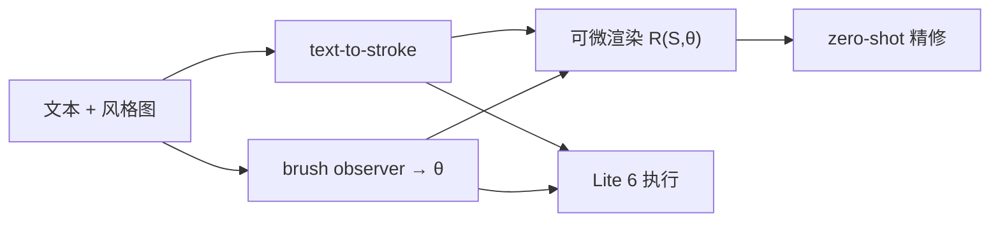

# OnOff：可微物理笔刷打通在线轨迹与离线手写

**OnOff**（*Bridging Online and Offline Handwriting via Differentiable Physical Rendering*；[arXiv:2608.03198](https://arxiv.org/abs/2608.03198)，[项目页](https://seonmip.github.io/onoff/)，ECCV 2026）由 **光州科学技术院 / 卡内基梅隆大学 / 延世大学 / 韩国能源技术大学** 提出：用紧凑可微笔刷把 stroke kinematics 接到像素外观，一次产出可执行轨迹与可看图像。

## 一句话定义

**用六个物理可解释的笔刷参数做可微渲染，把「能写的轨迹」和「像真的字」放进同一个梯度通路，从而既能生成离线图像，也能直接给机械臂执行。**

## 英文缩写速查

| 缩写 | 英文全称 | 简要说明 |
|------|----------|----------|
| OnOff | Online–Offline handwriting | 本文统一在线轨迹与离线图像的框架名 |
| FID | Fréchet Inception Distance | 生成图像分布距离；越低越像真字 |
| BFID | Binarized FID | 二值化后再算 FID，更看笔画结构 |
| CER | Character Error Rate | 识别器读生成字的字符错误率 |
| OCR | Optical Character Recognition | 离线手写常服务的下游识别任务 |

## 为什么重要

- 机器人书法要的是 **可执行轨迹**，字体/OCR 要的是 **像素纹理**；两条线长期各训各的。
- 可微笔刷让已有 online 语料（IAM-OnDB、CASIA-OLHWDB）变成配对数据，降低「必须有 trajectory–image 对齐集」的门槛。
- 真机映射简单：\((x,y)\) 走笔，压力代理映射 \(z\)，按 \(\theta\) 选工具——不必再为每种笔单独优化。

## 核心信息

| 项 | 内容 |
|----|------|
| **机构** | 光州科学技术院（GIST）；卡内基梅隆大学（CMU）；延世大学（Yonsei）；韩国能源技术大学（KENTECH） |
| **平台** | UFACTORY Lite 6；工具相对末端 0-DoF 固定 |
| **开源** | **项目页已发布，代码未列**（截至 2026-08-15） |

## 核心原理

### 方法栈

六参数 \(\theta=\{w_{\mathrm{base}},k_{\mathrm{spread}},\rho_{\mathrm{ink}},\sigma_{\mathrm{sharp}},p_{\min},p_{\max}\}\) 压缩笔尖足迹、压力展宽、墨色与边缘。无压感时用速度反比作压力代理并指数平滑。框架四块：text-to-stroke、brush observer、可微渲染器、zero-shot diffusion 精修。

### 流程总览

## 工程实践

| 项 | 建议 |
|----|------|
| 源码运行时序图 | **不适用**（项目页无训练/推理入口） |
| 真机 | 先标定纸面 \(Z_{\mathrm{canvas}}\)；\(z\) 只映射接触深度 |
| 工具选择 | 用估计的 \(w_{\mathrm{base}},\rho_{\mathrm{ink}}\) 选铅笔 / 马克笔，而不是改轨迹 |
| 长句 | 词级轨迹加固定间距拼接；端到端长句仍缺配对数据 |

## 实验与评测

- 自建配对集：Our Renderer FID **11.81** / BFID **11.03**，对照 One-DM 52.26 / 19.88。
- 挂到 DiffPen / One-DM 作 prerender 引导，IAM / CVL 上 FID、BFID 常降；HWD / CER 随噪声注入步数权衡。
- 真机：多工具词级书写 + 句级拼接演示。

## 与其他工作对比

相对纯 online（SDT 等）补纹理；相对纯 offline（One-DM、DiffPen、Emuru）补 stroke order 与可执行性。笔刷是可微代理，不是 Chu–Tai / Wetbrush 级全物理仿真。

## 结论

**把笔写成可微物理过程，比分别堆轨迹模型和图像模型更能同时服务「看见」和「写出」。**

1. **六参数够用** — 足迹、展宽、墨色、边缘、压力范围即可跨运动/外观反传。
2. **渲染器先造数据** — 先用 \(\mathcal{R}\) 把 online 语料变成配对集，再训生成器。
3. **真机几乎零后处理** — 轨迹直接笛卡尔执行，压力走 \(z\)。
4. **当引导模块** — 挂到现成 diffusion 离线模型主要抬 FID/BFID，不是万能替换。
5. **长句仍弱** — 当前靠拼接，不是端到端篇章生成。

## 局限与风险

- 省略 3D 笔毫、湿扩散与纸吸收；风格极值会失真。
- 代码未发布，无法核对其可微实现与超参。
- 句级应用依赖人工偏移，不能当完整排版系统。

## 关联页面

- [可微仿真](../concepts/differentiable-simulation.md) — 同一「物理过程进计算图」思路
- [视觉伺服](../methods/visual-servoing.md) — 真机写字仍要标定接触平面
- [DigitCode](./paper-digitcode.md) — 另一条「把连续手部运动变成可执行符号」线
- [Ego2Robot](./paper-ego2robot.md) — 人数据变成机器人可训资产

## 参考来源

- [OnOff 论文摘录](../../sources/papers/onoff_handwriting_arxiv_2608_03198.md)
- [OnOff 项目页归档](../../sources/sites/onoff-handwriting.md)
- [具身智能小站 9 篇盘点](../../sources/blogs/wechat_embodied_station_ego2robot_mango_grasp_2026-08-11.md)
- [arXiv:2608.03198](https://arxiv.org/abs/2608.03198)

## 推荐继续阅读

- [OnOff 项目页](https://seonmip.github.io/onoff/)
- Schaldenbrand et al., [FRIDA](https://arxiv.org/abs/2203.02172) — 可微笔触的机器人绘画前作
