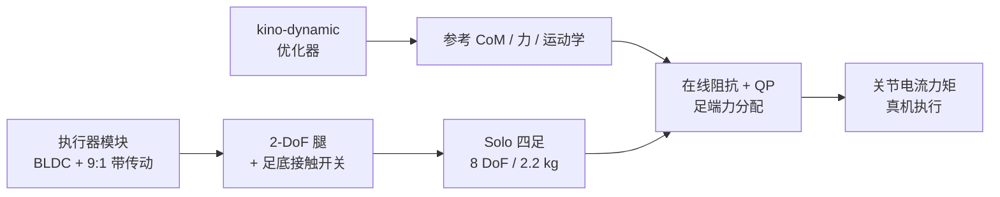
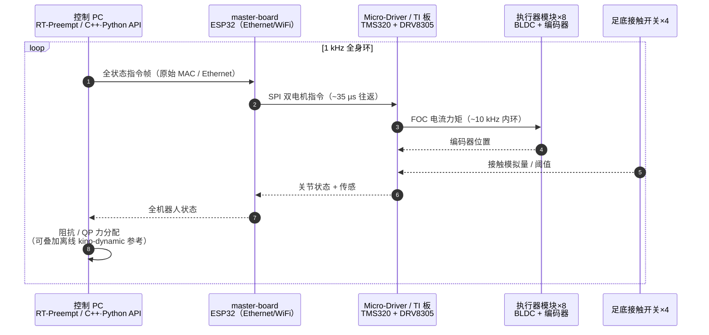

# An Open Torque-Controlled Modular Robot Architecture（Solo / ODRI）

## 一句话定义

**Grimminger et al.（MPI-IS / NYU / LAAS，[arXiv:1910.00093](https://arxiv.org/abs/1910.00093)，IEEE RA-L 2020）** 发布面向研究的 **开源力矩控制** 模块化腿足架构：以低减速比无刷执行器模块为核心，组装 **Solo**（2.2 kg、8 DoF 四足），并系统表征足端阻抗与动态跟踪能力——即今日 **[ODRI](./odri-solo-and-bolt.md)** 生态的奠基论文。

## 英文缩写速查

| 缩写 | 英文全称 | 简要说明 |
|------|----------|----------|
| ODRI | Open Dynamic Robot Initiative | 本工作衍生的开源力控腿足与执行器倡议 |
| QDD | Quasi-Direct Drive | 准直驱：低减速比、高背驱动性的力控作动方案 |
| BLDC | Brushless DC Motor | 无刷直流电机（文中 Antigravity 4004） |
| FOC | Field-Oriented Control | 磁场定向控制；驱动板以约 10 kHz 做双电机力矩环 |
| CoM | Center of Mass | 质心；在线控制器调节质心与角动量/基座姿态 |

## 为什么重要

- **把「可复制的力矩控制腿」做成社区基线**：机械以 3D 打印 + 现成件为主，仅电机轴/带轮需机加；整机材料成本约 **4000 €**，单研究者即可操作与维修。
- **执行器—传感—整机—控制器一条链**：不只给 CAD，还给足端阻抗标定、接触开关与真机 kino-dynamic 跟踪证据。
- **开源 QDD 学习阶梯的学术锚点**：与 [Stanford Doggo](./stanford-doggo-and-pupper.md) 同属早期开源力控四足；后续 [open_robot_actuator_hardware](./odri-solo-and-bolt.md) 与 Bolt/TriFinger 均由此线展开。

## 核心信息

| 项 | 内容 |
|----|------|
| **机构** | 马克斯·普朗克智能系统研究所（Max Planck Institute for Intelligent Systems）；纽约大学（NYU）；系统分析与架构实验室 / 法国国家科学研究中心（LAAS / CNRS） |
| **平台** | Solo：八执行器四足，质量 **2.2 kg**，站立髋高约 **24 cm** |
| **执行器** | Antigravity 4004 + **9:1** 双级同步带；模块约 **150 g**；\(\tau_{max}\approx 2.7\) N·m @ 12 A |
| **传感** | 电机轴光学编码器；足底光学孔径接触开关（~10 g，~3 N / 3 ms） |
| **电子** | TI 评估板或 MPI Micro-Driver（TMS320F28069M + 双 DRV8305）；ESP32 master board（Ethernet/WiFi） |
| **控制率** | 驱动 FOC ~**10 kHz**；上位机传感—控制环 **1 kHz** |
| **开源** | **已开源**（BSD-3-Clause）；入口见 [项目页](https://open-dynamic-robot-initiative.github.io) |

## 流程总览

## 核心原理

### 1）执行器与本体感受力矩

- 低减速比保证传动透明：关节力矩主要靠 **相电流** 估计（\(\tau_{joint}=k_i\,i\,N\)），无需关节力矩传感器即可做阻抗/力控。
- 双级同步带相对直齿/单点啮合更耐冲击，适合跳跃落地震动载荷。
- 局限侧写：低速扭矩纹波来自廉价外转子电机；高刚度时摩擦、皮带柔度与「编码器在电机侧」会使 **指令刚度 > 实测刚度**。

### 2）足底接触开关

- 弹簧加载孔径切断 LED–光敏通路，模拟量进入 MCU ADC。
- 宽角触发面向未知触地点；在 drop 测试中，相对电流估力阈值，误检与延迟更可控。

### 3）笛卡尔阻抗（单腿标定）

\[
\boldsymbol{\tau}=\mathbf{J}^{T}\bigl(\mathbf{K}(\mathbf{x}_{d}-\mathbf{x})-\mathbf{D}\dot{\mathbf{x}}\bigr)
\]

- 准静态：指令刚度约 **20–360 N/m**（无主动阻尼）；测得最大约 **266 N/m**。
- 无量纲腿刚度 \(\tilde{k}=k\cdot l_0/(mg)\) 最高约 **10.8**，落在跑步人体常用区间下沿。

### 4）四足跟踪控制器

- **离线**：交替优化质心动力学（含接触力）与全身运动学（Herzog / Ponton 等 kino-dynamic 管线），数次迭代达共识。
- **在线**：在参考扳手 \(\mathbf{W}_{CoM}^{ref}\) 上叠加 CoM 与基座/角动量阻抗；QP 分配足端力并满足摩擦锥松弛；再叠加低阻抗腿长跟踪：

\[
\boldsymbol{\tau}_{i}=\mathbf{J}_{i,a}^{T}\bigl(\mathbf{F}_{i}+\mathbf{K}(\mathbf{l}_{i}^{ref}-\mathbf{l}_{i})+\mathbf{D}(\dot{\mathbf{l}}_{i}^{ref}-\dot{\mathbf{l}}_{i})\bigr)
\]

- 接触集由 **计划 + 足底开关反馈** 共同决定，利于未知扰动（如跷跷板）。

## 源码运行时序图

官方栈已开源：硬件见 [`open_robot_actuator_hardware`](https://github.com/open-dynamic-robot-initiative/open_robot_actuator_hardware)；主控板 [`master-board`](https://github.com/open-dynamic-robot-initiative/master-board)；统一接口 [`odri_control_interface`](https://github.com/open-dynamic-robot-initiative/odri_control_interface)；Solo 驱动 [`solo`](https://github.com/open-dynamic-robot-initiative/solo)（`demos/`）。1 kHz 闭环典型路径：

- **复现入口**：按项目页 → 组装执行器/Solo → 刷 `master-board` 固件 → 用 `odri_control_interface` / `solo` 的 `demos/` 先跑关节标定与位置/力矩示例，再接入自研高层控制器。
- **注意**：原始以太网/ESP-NOW 帧常需 root；WiFi 约 1.1 ms RTT、偶发丢包，协议以全状态重传换实时性。

## 工程实践

| 项 | 建议 |
|----|------|
| 装配 | 优先跟 [`open_robot_actuator_hardware`](https://github.com/open-dynamic-robot-initiative/open_robot_actuator_hardware) 文档；电机轴/带轮是少数需机加件 |
| 电气 | 论文实验可用 TI 评估板；量产体积走 MPI Micro-Driver；整机通信走 `master-board` |
| 标定 | 先复现准静态 \(F\)–\(\Delta x\) 曲线，确认高刚度区「指令 vs 实测」偏差再上跳跃 |
| 接触 | 动态任务优先用足底开关阈值，不要只靠电流估力 |
| 控制 | 长时域计划可开环跟踪，但应用低阻抗足端 + 接触反馈吸收模型误差 |
| 软件 | `treep` 克隆 `SOLO` / `odri_control_interface`，`colcon build`；API 文档见 Solo pages |

## 实验与评测

| 实验 | 要点 |
|------|------|
| 准静态阻抗 | 指令 20–360 N/m；低刚度匹配好，高刚度实测偏低；最大测得 ~266 N/m |
| Drop | \(K=150\) N/m、小阻尼；冲击后 50 ms 内可见非簧载振荡与滞环（摩擦/结构损耗） |
| 跳跃（腿） | 约 0.65 m，约 2× 腿长 / 2.7× 静息腿长 |
| 接触开关 | 相对力板真值延迟 ~3 ms；电流估力稳健阈值约 ~31 ms |
| 四足能力 | 膝构型切换、超转髋、翻倒起立；慢走过未知跷跷板；基座跳高约 **65 cm** |

## 与其他工作对比

| 对照 | 差异 |
|------|------|
| [Stanford Doggo](./stanford-doggo-and-pupper.md) | 同为开源力控四足；Doggo 偏水刀件 + ODrive 叙事，Solo 偏 3D 打印模块化 + 自研 Micro-Driver / master-board |
| [Katz Mini Cheetah 执行器](./paper-low-cost-modular-actuator-katz.md) | 同属模块化 QDD；Katz 行星 6:1 + 空翻级动态、电子部分开源；Solo 皮带 9:1 + **全栈开源**与阻抗标定教材更完整 |
| [OpenTorque](./opentorque-actuator.md) / Urs 3D-print QDD | 后者更偏**单关节**热/寿命教材；本文给**整机 + 接触 + 优化跟踪**闭环 |
| HyQ / ANYmal / MIT Cheetah | 性能标杆但机加与成本门槛高；本文目标是可复制研究平台 |
| Oncilla 等并联柔顺开源 | 机械柔顺为主；Solo 强调主动阻抗与本体感受力矩 |

## 结论

**Solo / ODRI 证明：用低成本 BLDC + 低减速带传动 + 简单接触开关，就能做出可标定、可跳跃、可跟踪优化轨迹的开源力矩控制四足基线。**

1. **选型先看透明传动与电流力矩估计**，不要默认上关节力矩传感器。
2. **高刚度必须实测**：指令刚度到 360 N/m 时，摩擦与传动柔度会拉低有效刚度；无阻尼上限约 266 N/m。
3. **动态接触用远端开关**：电流估力延迟对百毫秒级支撑相不可接受。
4. **kino-dynamic 计划可上真机**：关键是参考力前馈 + CoM 阻抗 QP + 低阻抗足端，而非完美模型。
5. **复现走官方组织仓**：硬件 `open_robot_actuator_hardware`，通信 `master-board`，控制 `odri_control_interface` / `solo`。
6. **平台定位是研究与教学**：轻量安全；论文时仍有线供能/通信，无线 12-DoF 扩展是后续线。

## 局限与风险

- 论文版 Solo 主要在矢状面八关节；髋外展等需后续机型（如 Solo12 / Bolt）。
- 廉价 BLDC 低速纹波；精密慢速任务可能要主动补偿。
- WiFi 控制存在丢包与毫秒级延迟，强实时优先 Ethernet。
- 开源完整但供应链（带轮机加、专用 PCB）仍有工程门槛；电机本体不含电磁自研（见 [QDD 对比](../comparisons/open-source-qdd-actuator-projects.md)）。

## 关联页面

- [ODRI Solo / Bolt](./odri-solo-and-bolt.md)
- [开源 QDD 执行器项目对比](../comparisons/open-source-qdd-actuator-projects.md)
- [Katz Mini Cheetah 模块化执行器](./paper-low-cost-modular-actuator-katz.md)
- [执行器驱动链选型闭环](../queries/actuator-drive-chain-selection-loop.md)
- [Stanford Doggo / Pupper](./stanford-doggo-and-pupper.md)
- [开源人形硬件方案对比](./open-source-humanoid-hardware.md)
- [四足机器人](./quadruped-robot.md)
- [Locomotion](../tasks/locomotion.md)
- [阻抗控制](../concepts/impedance-control.md)
- [力矩电机设计纵深](../../roadmap/depth-torque-motor-design.md)

## 参考来源

- [sources/papers/open_torque_controlled_modular_robot_solo_arxiv_1910_00093.md](../../sources/papers/open_torque_controlled_modular_robot_solo_arxiv_1910_00093.md)
- [open_dynamic_robot_initiative 项目页归档](../../sources/sites/open_dynamic_robot_initiative.md)
- [open_robot_actuator_hardware 仓库归档](../../sources/repos/open_robot_actuator_hardware.md)

## 推荐继续阅读

- 论文：<https://arxiv.org/abs/1910.00093>
- 项目页与引用条目：<https://open-dynamic-robot-initiative.github.io>
- 执行器硬件仓：<https://github.com/open-dynamic-robot-initiative/open_robot_actuator_hardware>
