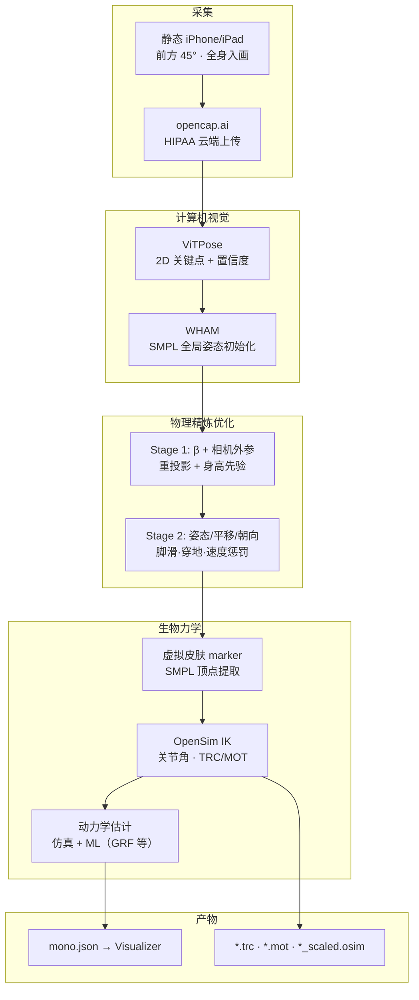

# OpenCap Monocular：单手机视频的人体运动学与动力学

**OpenCap Monocular**（*3D Human Kinematics and Musculoskeletal Dynamics from a Single Smartphone Video*，犹他大学 MoBL，arXiv:2603.24733；[项目页](https://utahmobl.github.io/OpenCap-monocular-project-page/)，[代码](https://github.com/utahmobl/opencap-monocular)，[opencap.ai](https://opencap.ai)）从 **单台静态智能手机视频** 估计 **3D 骨骼运动学** 与 **肌肉骨骼动力学**（关节力矩、地面反力、肌力等）。它在计算机视觉姿态估计（**WHAM** + **ViTPose**）之后插入 **物理约束优化** 与 **OpenSim 生物力学模型**，面向 **康复、运动科学与大样本临床筛查**，而非机器人 GMR 的主线 SMPL 轨迹接口。

## 英文缩写速查

| 缩写 | 英文全称 | 简要说明 |
|------|----------|----------|
| MoCap | Motion Capture | 动作捕捉；本文对标 marker-based 实验室金标准 |
| IK | Inverse Kinematics | 由 marker/虚拟点反解关节角；OpenSim 管线核心步骤 |
| GRF | Ground Reaction Force | 地面反力；行走动力学关键观测量 |
| WHAM | World-grounded Human Activity and Motion | 单目 3D 人体姿态初始化骨干（本管线 Stage 0） |
| SMPL | Skinned Multi-Person Linear Model | 参数化人体网格；优化与虚拟 marker 提取的中间表示 |
| OpenSim | — | 开源肌肉骨骼仿真平台；输出 `.trc`/`.mot` 与缩放模型 |
| MAE | Mean Absolute Error | 平均绝对误差；论文报告旋转 4.8°、骨盆平移 3.4 cm |

## 为什么重要

- **把生物力学评估装进口袋：** 相对实验室 Vicon + 测力台（>15 万美元、数小时/人），单手机 + 云端 **<2 分钟** 出运动学，使诊所/居家大规模队列研究可行。
- **不止运动学：** 相对 [GVHMR](./gvhmr.md) 等 **SMPL 世界轨迹** 上游，OpenCap Monocular 明确追求 **动力学可解释量**（膝伸展力矩、膝内收力矩、股四头肌力等），并已用临床意义阈值验证（衰弱 ~11 Nm、膝 OA ~0.5% BW·ht）。
- **物理精炼优于纯回归：** 论文报告相对「CV + OpenSim IK」基线，旋转精度 **+48%**、平移 **+69%**；说明 **优化层** 对脚滑、穿地、漂移的修正对生物力学可信度至关重要。
- **OpenCap 生态单相机延伸：** 在已服务 1.4 万研究者、40 万试次的双相机 [OpenCap](https://opencap.ai) 之上，把硬件门槛再降到 **一台 iPhone/iPad**，仍保持与金标准可比精度。

## 流程总览

## 核心机制（归纳）

### 1）WHAM 初始化与已知局限

- **WHAM** 提供 SMPL 序列（β, θ, τ, Γ）与相机外参初值；**ViTPose** 供 2D 监督；脚跟/脚趾 **接触概率** 引导后续优化。
- 纯回归常见 **平移漂移、脚滑、穿地**——这正是 OpenCap Monocular 引入全序列优化的动机。

### 2）两阶段序列优化（PyTorch + GPU）

| 阶段 | 优化变量 | 主要损失 |
|------|----------|----------|
| Stage 1 | 体型 β、相机外参 ξ | 置信度加权 2D 重投影、身高、β 偏离 WHAM 初值 |
| Stage 2 | SMPL 姿态/根平移/朝向 | 重投影 + 脚滑/穿地 + 关节速度 + 接触引导 |

- **假设：** 相机 **静止**、个体身高录制时录入、iOS 内参来自机型数据库（2018 年后设备）。

### 3）OpenSim 与动力学后处理

- 精炼 SMPL 网格顶点作 **虚拟 marker** → **OpenSim IK** → 标准 `.trc`/`.mot`。
- **行走 GRF：** 云端/离线可用混合 **机器学习 + 仿真**（[opencap-processing-grf](https://github.com/opencap-org/opencap-processing-grf)）。
- **其他活动动力学：** [opencap-processing](https://github.com/opencap-org/opencap-processing) 离线管线。

## 实验与评测（索引级）

| 任务 | 关键结果 |
|------|----------|
| 运动学（行走/深蹲/坐站） | 旋转 MAE **4.8°**；骨盆平移 **3.4 cm** |
| vs 纯 CV+IK | 旋转 **+48%**、平移 **+69%** 精度提升 |
| 行走 GRF | ≥ 双相机 OpenCap |
| 坐站膝伸展力矩 | 可区分衰弱前期策略；误差低于 ~11 Nm 临床阈值 |
| 行走膝内收力矩 | 误差低于 ~0.5% BW·ht（膝 OA 相关指标） |

## 采集最佳实践（项目页）

- **相机：** 前方 **45°**、三脚架固定、被试 **<5 m**、全程全身可见。
- **已验证：** 行走、深蹲、坐站；**跳跃当前不可靠**。
- **避免：** 宽松衣物、强阴影、前景多人。

## 与机器人学习栈的关系

| 维度 | OpenCap Monocular | GVHMR / GMR 主线 |
|------|-------------------|------------------|
| 主输出 | OpenSim 关节角、力矩、GRF | 世界系 SMPL → 机器人 IK 重定向 |
| 优化目标 | 生物力学可信度、临床指标 | 几何跟踪、仿真可执行参考 |
| 典型下游 | 康复评估、流行病学、运动医学 | 模仿学习、WBT、遥操作参考 |
| 可衔接点 | `.trc`/`.mot` 可作 [Motion Retargeting Pipeline](../concepts/motion-retargeting-pipeline.md) 的 **生物力学约束运动学源**；需额外坐标/骨架映射 | 人形数据管线默认上游 |

> **选型提示：** 若目标是 **人形策略训练参考轨迹**，优先 [GVHMR](./gvhmr.md) + [GMR](../methods/motion-retargeting-gmr.md)。若需要 **带动力学标注的人体运动**（力矩/GRF）或 **临床可比指标**，OpenCap Monocular 更合适。

## 常见误区

1. **= 单目 WHAM：** WHAM 只是初始化；价值在 **全序列物理优化 + OpenSim + 动力学**。
2. **= 双相机 OpenCap 完全等价：** 单相机在部分平移/遮挡场景更敏感；但论文显示行走 GRF 可 **持平或优于** 双相机系统。
3. **输出可直接驱动人形电机：** OpenSim 骨架与机器人 DoF/接触模型不同；上机器人仍需 [Motion Retargeting](../concepts/motion-retargeting.md) 与物理筛选。
4. **任意手机视频即可：** 需 **静态机位 + 验证过的活动类型**；手持跟拍、跳跃等未验证场景易失败。

## 与其他页面的关系

- **单目 HMR 对照：** [GVHMR](./gvhmr.md) — 世界系 SMPL 上游，机器人栈更常见；[MAMMA](./paper-mamma-markerless-motion-capture.md) — 多视角高精度 SMPL-X。
- **开源 MoCap 对照：** [FreeMoCap](./freemocap.md) — 教学向多相机 3D 重建，无 OpenSim 动力学。
- **重定向流水线：** [Motion Retargeting Pipeline](../concepts/motion-retargeting-pipeline.md) — TRC/MOT 可作为异构源之一，但非默认路径。
- **人体动作索引：** [Human Motion 分类](../overview/paper-notebook-category-14-human-motion.md)

## 参考来源

- [OpenCap Monocular 论文归档（arXiv:2603.24733）](../../sources/papers/opencap_monocular_arxiv_2603_24733.md)
- [OpenCap Monocular 项目页](../../sources/sites/opencap-monocular-github-io.md)
- [utahmobl/opencap-monocular 代码索引](../../sources/repos/opencap-monocular.md)

## 推荐继续阅读

- [OpenCap Monocular 项目页](https://utahmobl.github.io/OpenCap-monocular-project-page/) — demo 与 Vicon 对比可视化
- [opencap.ai](https://opencap.ai) — 免费采集与云端处理
- [arXiv:2603.24733](https://arxiv.org/abs/2603.24733) — 完整方法与临床验证
- [GitHub: opencap-monocular](https://github.com/utahmobl/opencap-monocular) — 本地复现与 `INSTALL_SLIM.md`
- [OpenCap Visualizer](https://visualizer.opencap.ai) — `mono.json` 交互查看
