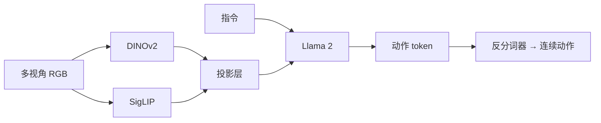
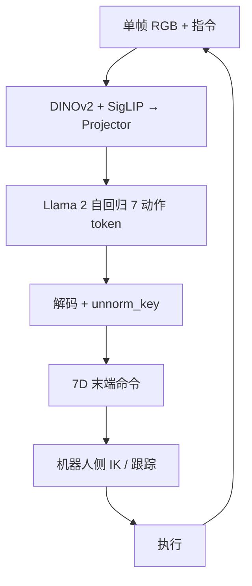
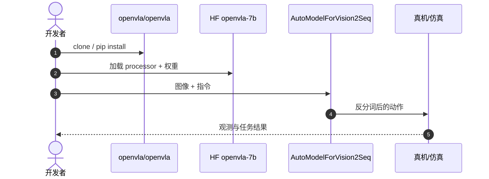

# OpenVLA：可复现的开源视觉–语言–动作模型

**OpenVLA**（*OpenVLA: An Open-Source Vision-Language-Action Model*，[arXiv:2406.09246](https://arxiv.org/abs/2406.09246)，[项目页](https://openvla.github.io/)，[代码](https://github.com/openvla/openvla)）由 **斯坦福 / 伯克利 / MPI** 提出：7B 参数、在 Open X-Embodiment 上预训练的开源 VLA，性能接近更大的闭源 [RT-2-X](./paper-rt-2.md) 量级，训练成本约 **$30k** 量级（文内口径）。

## 一句话定义

**用公开数据和 7B 权重，把 RT-2 的动作 token 路线变成社区可微调的默认 VLA。**

## 英文缩写速查

| 缩写 | 英文全称 | 简要说明 |
|------|----------|----------|
| VLA | Vision-Language-Action | 视觉-语言-动作策略 |
| OXE | Open X-Embodiment | 跨本体预训练数据 |
| LoRA | Low-Rank Adaptation | 低成本微调 |
| OFT | OpenVLA Fine-Tuning 变体 | 常用开源微调配方 |

| VLM | Vision-Language Model | 视觉-语言多模态理解模型，VLA 的上游 |
| SFT | Supervised Fine-Tuning | 用监督数据将通用模型适配到特定任务分布 |
| SDK | Software Development Kit | 软件开发工具包 |
| WBC | Whole-Body Control | 协调全身关节满足多任务/约束的控制基础设施 |

## 为什么重要

- 纳入 [VLA/WM 阅读路线](../../sources/blogs/wechat_embodied_ai_lab_vla_wm_reading_roadmap_2026-09-02.md) 的开源主线。
- DINOv2 管几何、SigLIP 管语言对齐，成为后续 VLA 视觉塔的常见配方。
- **已开源** 训练、推理与 HF 权重。

## 核心信息

| 项 | 内容 |
|----|------|
| **机构** | 斯坦福大学；加州大学伯克利分校；马克斯·普朗克研究所 |
| **视觉** | DINOv2 + SigLIP 双塔 |
| **语言** | Llama 2 7B |
| **动作** | 7 维各 256 bin 自回归 token |
| **数据** | OXE ~970k 轨迹 + 内部数据 |
| **开源** | **已开源** [openvla/openvla](https://github.com/openvla/openvla) |

### 流程总览

## 推理与执行边界（原始 OpenVLA）

下列边界对齐 [自由度 FreeDof 链路导读](../../sources/blogs/wechat_freedof_openvla_perception_to_action_chain_2026-09-30.md) 与 [openvla/openvla](https://github.com/openvla/openvla) 公开实现，便于区分 **神经网络预测** 与 **机器人侧控制**。

| 环节 | 原始 OpenVLA 默认 |
|------|-------------------|
| **观测** | 单帧主相机 RGB + 语言指令；**不**把历史帧、关节角、夹爪开合作为显式 NN 输入 |
| **一步输出** | 7 维 **末端** 增量（3 平移 + 3 旋转 + 1 夹爪），经 256-bin 离散 token **自回归** 生成整步后再解码 |
| **反归一化** | 推理需指定与权重配套的 `unnorm_key`（常用 p1/p99 → [−1,1] 再还原物理量） |
| **预测结束点** | 反归一化后的数值动作交给环境；**IK、限速、碰撞** 在下游 |
| **Bridge/WidowX** | 末端增量 → 末端目标 → **IK** → 关节指令（IK 不在 token 语义内） |

**控制循环：** 刷新图像 → 模型生成 **完整一步** → 调用执行接口 → 再观测；阻塞/非阻塞由评测脚本决定，不等于必须等机器人完全到位才采下一帧。

**常见误读：**

- 「自回归」指 **同一步 7 个动作分量** 的顺序依赖，不是一次输出整段语言计划或全长关节轨迹。
- 论文 **256 档** vs 代码 **255 区间中心 + 边界裁剪** — 复现须跟仓库分箱，勿自行换规则。
- 单帧看不见夹爪时模型仍会输出；若存在左/右对称歧义且 **无** 本体/历史，下一步 **不可靠** — 后续 VLA 改观测（多帧、状态、并行 chunk）多为此类缺口，见 [VLA 演进谱系](../overview/vla-evolution-lineage.md)。

**推理算力（发表口径）：** ~7B、单卡 RTX 4090、无 compile 时约 **6 次完整推理/秒** — 这是 **策略调用频率** 的上界参考，不等于机械臂 1 kHz 关节环。

## 评测

- 文内口径（**2024 年原文发表时**）：开源 7B 相对当时闭源 SOTA 基线（RT-2-X 量级）约 **85%+** 相对水平；此为**发表时快照**，随后续 VLA 迭代会变，横比前请回 [VLA SOTA Leaderboard](./vla-sota-leaderboard.md) 与原文核评测协议。
- 目标机器人 **5k–10k** 步微调即可适配。
- 基准细节以 [原文](https://arxiv.org/abs/2406.09246) 与仓库 README 为准。

## 结论

**要跑通 VLA，优先 OpenVLA 权重与 LoRA/OFT，而不是等待闭源 RT-2 训练配方。**

- 双塔视觉把几何与语义拆开，比单 CLIP 塔更适合操作
- 动作 token 让 LLM 主干无需改输出头类型
- 预训练后微调是部署默认路径，不是可选
- 7B 仍有延迟税，高频控制要看 [π₀](./paper-pi0.md) 或轻量适配

## 源码运行时序图

## 局限与风险

- **默认操作空间：** 不是导航/全身 WBC。
- **算力：** 全参微调门槛高，实用路径是 LoRA/OFT。
- **安全：** 零样本工业部署仍需围栏与标定。

## 与其他工作对比

| 工作 | 相对本页 |
|------|----------|
| [RT-2](./paper-rt-2.md) | 范式源头，闭源更大模型 |
| [Octo](./paper-octo.md) | 更轻、读出头更灵活 |
| [π₀](./paper-pi0.md) | 流匹配连续动作，非自回归 bin |
| [ECoT](./paper-ecot.md) | 同骨干 + 具身思维链训练；泛化 **+28%** 绝对成功率 |

## 项目资源与工程补充

### 核心结构/机制

- **骨干**：Prismatic-7B 等 VLM，融合 SigLIP/DINO 视觉特征与 Llama 类语言模型。
- **动作表示**：将连续控制 **离散化为 token**，便于自回归生成。
- **训练**：多机器人数据集混合预训练；下游可用 **LoRA、OFT** 降低算力门槛。

### 常见误区或局限

- **误区：OpenVLA 负责底盘导航** — 默认面向 **操作空间**；移动导航仍常需 [Nav2](./navigation2.md) 等栈。
- **误区：零样本即可工业部署** — 需目标机器人 **微调、标定与安全围栏**。
- **局限**：与 [人形全身控制](./openloong.md) 的关节级 WBC 是不同层级。
- [Arcadia](./paper-arcadia.md) 把本页当操作基线（真机 9/100 vs Arcadia 27/100），并复用 7D de-tokenizer 思路；那是生命周期对照，不是 OpenVLA 官方 G1 协议。

## 关联页面

- [ECoT](./paper-ecot.md) — 基于 OpenVLA 的具身思维链奠基
- [Fast ECoT](./paper-fast-ecot.md) — ECoT 推理时加速
- [RT-2](./paper-rt-2.md)
- [Octo](./paper-octo.md)
- [VLA](../methods/vla.md)
- [VLA SOTA Leaderboard](./vla-sota-leaderboard.md) — 社区多基准摘录榜，核对本页发表时相对位次是否已被后续工作刷新
- [VLA/WM 14 篇路线](../overview/vla-wm-reading-roadmap-14-papers-technology-map.md)
- [Dita](./paper-dita-scaling-diffusion-transformer-vla.md) — in-context 扩散 Transformer VLA：带噪 action chunk 直接进因果 Transformer，对照 OpenVLA 的离散 bin 动作

- [LeRobot](./lerobot.md)
- [VLA 开源复现景观 2025](../overview/vla-open-source-repro-landscape-2025.md)
- [WCM 世界模型 Critic](./paper-wcm-world-critic-model.md) — 用世界模型 critic 做 RL 后训练，OpenVLA-OFT 上 ManiSkill IND 28.1%→99.0%（arXiv:2607.29613）
- [Temporal GRPO](./paper-temporal-grpo.md) — 同一 OFT SFT 热启动的阶段条件 GRPO；RoboTwin 75.8%（arXiv:2608.13026；未开源）
- [Arcadia](./paper-arcadia.md) — 共享 VLN/VLA + 真机反馈；以本页为操作基线（部分开源）

- [lerobot](../entities/lerobot.md)
- [navigation-slam-autonomy-stack](../overview/navigation-slam-autonomy-stack.md)

## 推荐继续阅读

- [项目页](https://openvla.github.io/)
- [arXiv:2406.09246](https://arxiv.org/abs/2406.09246)

## 参考来源

- [openvla_arxiv_2406_09246](../../sources/papers/openvla_arxiv_2406_09246.md)
- [具身智能研究室 VLA/WM 阅读路线](../../sources/blogs/wechat_embodied_ai_lab_vla_wm_reading_roadmap_2026-09-02.md)
- [自由度 FreeDof：OpenVLA 从看懂到动起来](../../sources/blogs/wechat_freedof_openvla_perception_to_action_chain_2026-09-30.md)
- [openvla 仓库归档](../../sources/repos/openvla.md)

- [openvla/openvla](https://github.com/openvla/openvla)
- Kim et al., *OpenVLA: An Open-Source Vision-Language-Action Model*

- [arcadia_arxiv_2512_00076](../../sources/papers/arcadia_arxiv_2512_00076.md)
