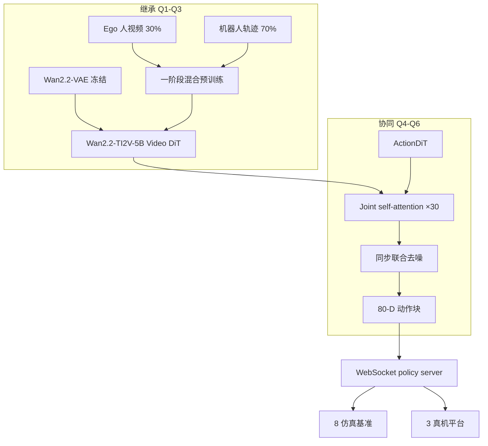
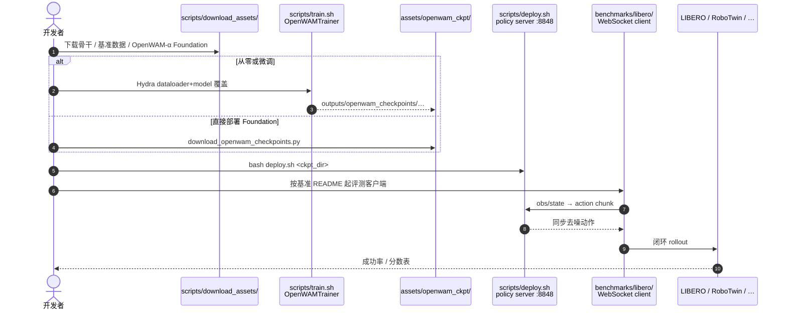

# OpenWAM：系统化世界–动作预训练的开源模块化栈

**OpenWAM**（*An Open, Modular Exploration Towards Systematic World–Action Model Pretraining*，[arXiv:2609.07398](https://arxiv.org/abs/2609.07398)）由 **新加坡国立大学（NUS）**、**清华大学（Tsinghua）**、**北京大学（PKU）**、**香港大学（HKU）**、**浙江大学（ZJU）**、**香港中文大学（CUHK）** 与 **上海交通大学（SJTU）** 等联合提出：把紧耦合的 WAM 实现拆成 **可组合实验程序**，经对照研究沉淀预训练原则，并发布 **OpenWAM-α** 预训练模型与完整工程栈。[项目页](https://openwam-official.github.io/) · [代码](https://github.com/OpenWAM-Official/OpenWAM) · [HF 权重](https://huggingface.co/OpenWAM)

## 一句话定义

**WAM 预训练不该是黑箱单体——OpenWAM 用模块化 Infra 做六项对照实验，把「继承什么、如何协同、如何跨域缩放」写成可复现原则，再落到开源预训练模型与评测协议。**

## 英文缩写速查

| 缩写 | 英文全称 | 简要说明 |
|------|----------|----------|
| WAM | World–Action Model | 联合未来观测与动作的策略族 |
| DiT | Diffusion Transformer | 视频与动作去噪骨干 |
| VAE | Variational Autoencoder | Wan2.2 冻结视觉编码 |
| OOD | Out-of-Distribution | 具身预训练主要增益域 |
| HF | Hugging Face | 46 个公开检查点托管 |
| IDM | Inverse Dynamics Model | 仓库支持的 dual_system 变体 |

## 为什么重要

- **把设计空间从「论文附录」拉回「可实验变量」**：骨干、表征、架构、掩码、数据配方、去噪策略均可插拔，避免每项工作重搭单体栈。
- **给出可操作的预训练读法**：强生成骨干 + 紧凑潜空间、专用动作通路 + mutual 信息流 + 同步联合去噪、一阶段 ego+robot 共训——不是口号，而是 Q1–Q6 累积默认。
- **仿真到真机的一致头部**：8 个仿真基准与 3 个真机平台（含预训练未见的灵巧手 OOD）均报告领先或并列；RoboDojo 双臂 **37.6 / 24.4% SR** 相对次佳 π₀.₅ **22.9 / 12.8%** 拉开差距。
- **开源完整度罕见**：训练、WebSocket 部署、多基准客户端、Foundation 与 Study 检查点一并发布，并接入 [XPolicyLab](https://github.com/XPolicyLab/XPolicyLab)。

## 核心信息

| 项 | 内容 |
|----|------|
| **机构** | 新加坡国立大学（NUS）；清华大学（Tsinghua）；北京大学（PKU）；香港大学（HKU）；浙江大学（ZJU）；香港中文大学（CUHK）；上海交通大学（SJTU） |
| **三层栈** | **Infra**（模块 + 统一 train/deploy/eval）→ **Study**（Q1–Q6 对照）→ **OpenWAM-α**（规模化预训练） |
| **OpenWAM-α 骨干** | 冻结 Wan2.2-VAE + umT5；**Wan2.2-TI2V-5B** 视频 DiT + **ActionDiT**；30 层 joint self-attention；**mutual mask** |
| **预训练数据** | **518.5M 帧（≈6,369 h）**；**70% 机器人 / 30% egocentric 人视频**；**80-D 统一动作空间** |
| **开源** | **已开源**：[OpenWAM-Official/OpenWAM](https://github.com/OpenWAM-Official/OpenWAM)；HF [`OpenWAM`](https://huggingface.co/OpenWAM)（**46** 检查点） |

## 核心原理

### OpenWAM-Study 三问与累积默认

| 阶段 | 问题 | _carry-forward 默认_ |
|------|------|----------------------|
| **继承** | 该继承什么世界知识？ | 足够强的视频生成骨干（**Wan2.2-TI2V-5B**）+ **紧凑潜空间**；表征编码器经压缩也可竞争重建式编码器 |
| **协同** | 世界与动作如何互相增益？ | **专用 ActionDiT**、**显式 world→action 可见性**、**同步联合去噪**（非级联两段推理） |
| **缩放** | 协同如何跨域扩展？ | 具身预训练主要扩 **OOD**；**一阶段 ego+robot 共训**；大规模上 **mutual visibility** 一致更优 |

### OpenWAM-α 架构要点

- **视频流**：Wan2.2-TI2V-5B 在潜空间对未来帧窗口去噪；3D RoPE 覆盖 (frame, H, W)。
- **动作流**：独立 ActionDiT（width 1024），1D RoPE 覆盖 chunk 索引；每步一个噪声动作 token。
- **耦合**：30 对层 **joint self-attention**，双残差宽度投影到共享 24-head 注意力空间。
- **可见性**：**mutual mask**——两流互读；干净首帧行 **不 attend** 噪声未来帧与动作。
- **推理**：训练覆盖联合噪声平面；推理走 **synchronized diagonal**（同步对角去噪）。

### 流程总览

## 源码运行时序图

节点对齐 [`sources/repos/openwam.md`](../../sources/repos/openwam.md) 与 README Quick Start。

- **最短复现路径**：下载 OpenWAM-α Foundation → `bash scripts/deploy.sh <ckpt>` → 按 `benchmarks/libero/README.md` 起客户端（无需重训 6,400 h）。
- **微调路径**：`training.finetune_ckpt_path=<foundation>` + `dataloader=libero`（或 RoboTwin 等）；注意 `num_frames=33` / `video_stride=4` 对齐 32-step action horizon。

## 工程实践

| 项 | 建议 |
|----|------|
| 配置入口 | Hydra：`configs/model/dual_system.yaml` + `wan22_ti2v_5b` + `attention_mask_mode=mutual` |
| 资源 | 推荐 **8×80GB** 训练 Wan2.2-5B 级骨干；部署默认 `compile`，首帧编译较慢 |
| 检查点 | HF 46 模型分 Foundation / Study / 下游微调；`download_openwam_checkpoints.py` 自带完整 config |
| 评测契约 | 各 `benchmarks/<name>/` 经 WebSocket 连 policy server；RoboDojo 真机走 XPolicyLab |
| 对照阅读 | 与 [GlanceWAM](./paper-glancewam.md)（异步想象）、[Flex-π](./paper-flex-pi.md)（多流算力柔性）、[DiT4DiT](./paper-dit4dit-video-action-model.md)（双 DiT 联合）并读 |

## 实验与评测

| 设定 | 数字（项目页 / 论文） |
|------|----------------------|
| LIBERO 平均 SR | **99.3%**（最佳 WAM −0.1；最佳 VLA +0.1） |
| RoboTwin2.0-Full | **89.0%** |
| LIBERO-plus | **77.1%** |
| EBench | **60.5%** |
| RoboCasa-GR1 | **38.2%** |
| RoboDojo 真机双臂 | **37.6 分 / 24.4% SR**（π₀.₅ 次佳 22.9 / 12.8%） |
| 灵巧手 OOD | 预训练未见该本体；仍报告背景 / 布局 / 光照 / 物体变体 |
| 覆盖 | **8** 仿真基准 × **5** 本体类；**3** 真机平台 |

## 结论

**OpenWAM 把 WAM 预训练从「单体工程运气」变成「可拆模块 + 可累积对照」——真影响指标是跨基准一致头部与 OOD 真机泛化，而不是单点刷榜。**

1. **模块化是方法论，不是仓库洁癖** — Infra 让 Q1–Q6 可累积；没有统一 train/deploy/eval，Study 结论不可移植。
2. **继承看骨干 × 潜空间，不单看 VAE 重建** — Wan2.2-5B + 紧凑 latent 是默认；表征编码器压缩路线同样可用。
3. **协同需要动作专用容量 + mutual 信息流 + 同步去噪** — 级联「先视频完再动作」或阻断梯度不是 Study 最优解。
4. **数据配方的一阶段 ego+robot 共训** — 机器人保接地，人视频扩世界覆盖；预训练规模上 mutual visibility 稳定更优。
5. **仿真强不等于真机凑合** — RoboDojo 与灵巧手 OOD 与 LIBERO 99.3% 同属叙事；选型要看目标平台契约。
6. **复现优先走 Foundation 微调 + 官方 benchmark 客户端** — 46 个 HF 检查点已对齐 deploy 路径，不必从零预训练 6,400 h。

## 与其他工作对比

| 对照 | 差异读法 |
|------|----------|
| [GlanceWAM](./paper-glancewam.md) | 单 DiT 内异步稀疏前瞻，优化 **控制环延迟**；OpenWAM 强调 **预训练设计空间与全栈开源** |
| [Flex-π](./paper-flex-pi.md) | 多流 Joint WAM + 推理时流掩码算力柔性；OpenWAM 默认 dual_system + 同步对角去噪 |
| [MotionWAM](./paper-motionwam-humanoid-loco-manipulation-wam.md) | 人形 loco-manip 实时 WAM；OpenWAM 聚焦 **操作多基准 + 统一 80-D 动作空间** |
| π₀ / π₀.₅ / Fast-WAM / Being-H0.7 | 项目页同轴对比；OpenWAM-α 在 LIBERO-plus、RoboTwin-Full、RoboDojo 等多项领先或并列 |
| [Awesome-WAM 综述](../concepts/world-action-models.md) | 文献 taxonomy；OpenWAM 补 **工程化预训练对照与开源基座** |

## 局限与风险

- **算力门槛**：Wan2.2-5B 级训练推荐 8×80GB；小团队应走 Foundation 微调而非全量预训练。
- **统一动作空间抽象成本**：80-D 槽位语义跨本体对齐需要读数据配方与 dataloader 契约，误配会静默掉点。
- **部分基准仍外部化**：RoboDojo 真机评测依赖 XPolicyLab；SimplerEnv / Calvin 标注 Planned。
- **Wan / Cosmos 许可与资产体积**：视频骨干与基准数据下载体积大，需按 `download_assets` 脚本分步准备。

## 关联页面

- [World Action Models](../concepts/world-action-models.md) — Joint WAM 文献坐标
- [Generative World Models](../methods/generative-world-models.md) — 视频 DiT 骨干与联合去噪
- [VLA](../methods/vla.md) — π 系与 WAM 基线对照轴
- [GlanceWAM](./paper-glancewam.md) — 异步想象另一条部署优化线
- [DiT4DiT](./paper-dit4dit-video-action-model.md) — 双 DiT 联合 VAM 先驱
- [开源可复现 9 篇地图](../overview/open-source-reproducibility-9-papers-technology-map.md) — 开源 WAM 选型语境

## 参考来源

- [openwam_arxiv_2609_07398](../../sources/papers/openwam_arxiv_2609_07398.md)
- [openwam 仓库](../../sources/repos/openwam.md)
- [OpenWAM 项目页](../../sources/sites/openwam-official.md)

## 推荐继续阅读

- [arXiv:2609.07398](https://arxiv.org/abs/2609.07398)
- [项目页](https://openwam-official.github.io/)
- [GitHub](https://github.com/OpenWAM-Official/OpenWAM)
- [Hugging Face 模型与数据](https://huggingface.co/OpenWAM)
