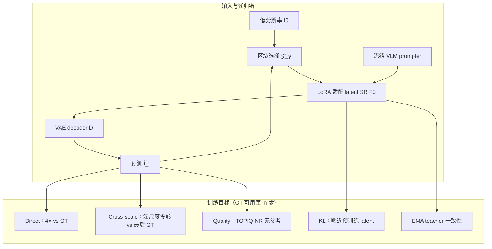
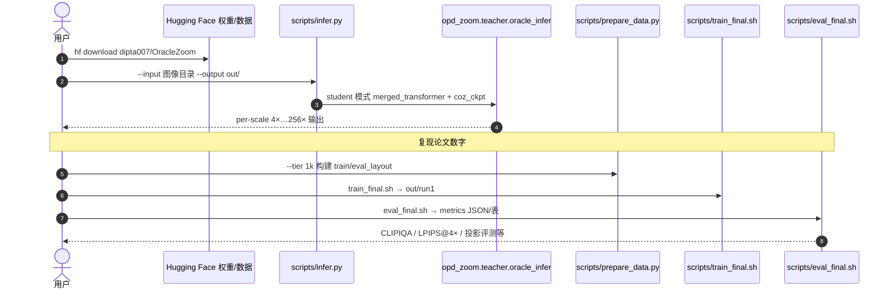

# OracleZoom（Reference-Constrained Recursive Image Super-Resolution）

**OracleZoom**（*On-Policy Self-Distillation Inspired Reference-Constrained Recursive Image Super Resolution*，[arXiv:2609.06490](https://arxiv.org/abs/2609.06490)，[项目页](https://dipta007.github.io/OracleZoom/)，[代码](https://github.com/dipta007/OracleZoom)，[权重](https://huggingface.co/dipta007/OracleZoom)，[Demo](https://huggingface.co/spaces/dipta007/OracleZoom)，**UMBC**）解决 **递归图像超分（Recursive SR）** 在极深倍率（论文设定 successive **4×** 至 **256×**）下的 **监督缺口**：更深 zoom 的 GT 像素规模几何增长（256× 单图源域约 **131072²**，未压缩 RGB 量级 **~52 GB**），模型必须在 **无逐像素目标** 时仍合成细节。方法在 **on-policy** 轨迹上训练，并把 **最后一档可用 GT** 当作 **跨尺度参考（oracle reference）**，分离 **可验证结构** 与 **不可验证细尺度纹理**，相对 [Chain-of-Zoom](https://github.com/bryanswkim/Chain-of-Zoom) 类 **VLM 语义引导** 路线，强调 **与早期观测一致的保真** 而非仅 perceptual sharpness。

## 一句话定义

**递归 zoom 超出 GT 边界后，用「最后一档还能对齐的 GT」约束可验证内容，用 KL 约束的先验 + 无参考质量 + EMA 在 on-policy 链上引导其余细节，使极深倍率 SR 更少幻觉、更稳 aggregate 质量。**

## 英文缩写速查

| 缩写 | 英文全称 | 简要说明 |
|------|----------|----------|
| SR | Super-Resolution | 低分辨率观测重建高分辨率图像 |
| OPSD | On-Policy Self-Distillation | 在模型自身 rollout 轨迹上蒸馏/训练，对齐部署分布 |
| CoZ | Chain-of-Zoom | 递归固定倍率 SR + 多尺度 VLM 文本引导的极深 zoom 基线 |
| VLM | Vision-Language Model | 多尺度图像输入生成 caption 式 SR prompt（继承 CoZ 管线） |
| EMA | Exponential Moving Average | 慢更新 teacher 副本，稳定监督边界附近训练 |
| NR-IQA | No-Reference Image Quality Assessment | 无 GT 的质量评分（如 TOPIQ-NR、CLIPIQA） |

## 核心信息

| 字段 | 内容 |
|------|------|
| **机构** | University of Maryland, Baltimore County（UMBC） |
| **arXiv** | [2609.06490](https://arxiv.org/abs/2609.06490) |
| **venue** | WACV 2027（in submission，以项目页为准） |
| **开源** | **已开源**（2026-09-28 核查）— GitHub + HF 权重 + 1k 训练数据 + Space Demo |
| **训练规模** | rank-16 LoRA **7.1M** 参数；**1,000** 图像（论文 tier） |
| **推理** | 512×512 输入；**4** 次相对 **4×** zoom → 4× / 16× / 64× / 256× 输出目录 |

## 为什么重要

- **问题定义清晰：** 把 recursive SR 的瓶颈从「再训一个更大扩散 SR」转成 **GT 不可得尺度上的可信合成** — 对远距视觉、质检放大、显微等 **安全相关** 场景（论文 Introduction 列举的多领域）有直接方法论意义。
- **训练–推理一致：** on-policy 反传整条 zoom 链，避免只在有 GT 的浅层 scale 上过拟合、深层部署漂移。
- **质量–保真权衡可审计：** 去掉 KL 先验会升 NR 分但 **投影 DISTS 与 VLM 判幻觉暴涨**（README 消融），提醒 **单看无参考质量不够**。
- **工程可复现：** 单卡 `uv` 工作流、merged 权重一键下载、与 CoZ **同 zoom loop 公平对比** 的 `eval_final.sh`。

## 核心结构

| 模块 | 作用 |
|------|------|
| **递归 zoom 算子** | 从上一预测选 region 作下一步 SR 输入（`𝒵_γ`）；VLM `G` 生成多尺度 caption prompt |
| **Latent SR + LoRA** | 冻结骨干 + **rank-16 LoRA**（7.1M）；VAE decoder 映回像素 |
| **Direct supervision** | GT 可用尺度：解码 **4×** 预测 vs GT（LPIPS 等） |
| **Cross-scale consistency** | GT 边界外：将深尺度预测 **投影回** 最后一档 GT 分辨率，对齐可观测区域 |
| **Quality guidance** | 冻结 **TOPIQ-NR** 引导不可投影的细尺度细节 |
| **KL prior** | 约束 adapted latent 贴近 **预训练 SR** 在同输入上的预测分布 |
| **EMA consistency** | 慢更新 adapter 副本 + GT 输入，稳定监督边界 |

### 流程总览

## 主要结果（摘要）

| 方法 | CLIPIQA（7 集均值） | LPIPS @4× | DISTS @4× | CLIPIQA @256× |
|------|---------------------|-----------|-----------|---------------|
| Chain-of-Zoom | 0.621 | 0.215 | 0.170 | 0.579 |
| **OracleZoom** | **0.713** | **0.199** | **0.160** | **0.706** |

- **VLM 判一致性（InternVL3.5-38B）：** 64× / 256× 决定性子比较偏好 OracleZoom **68% / 78%**（相对 CoZ）；幻觉率 **0.21 / 0.14** vs CoZ **0.55 / 0.70**。
- 完整设置与复现命令见 [REPRODUCE.md](https://github.com/dipta007/OracleZoom/blob/main/REPRODUCE.md) 与 [项目页](https://dipta007.github.io/OracleZoom/)。

## 源码运行时序图

官方仓库 [`dipta007/OracleZoom`](https://github.com/dipta007/OracleZoom)（含 Chain-of-Zoom 子模块）：推理最短路径为 `scripts/infer.py`；训练为 HF 数据准备 + `train_final.sh`；评测为 `eval_final.sh`。

- **推理权重形态：** 发布为 **merged transformer**，需 `--full_transformer`；勿按 LoRA adapter 路径加载。
- **SD3-medium** 需在 Hugging Face 接受 gated license 后首次自动下载。

## 工程实践

| 项 | 说明 |
|----|------|
| 环境 | Python ≥3.10，单 NVIDIA GPU；`uv sync`（仓库推荐） |
| 依赖基座 | Chain-of-Zoom（zoom loop + prompter）、OSEDiff（一步 SR）、IQA-PyTorch（指标，固定版本） |
| 数据 | `prepare_data.py --tier 1k` 拉 HF 训练集与缓存 prompt；七测试集 full eval 需自备 DIV2K 等（脚本 `prep_eval_datasets.py`） |
| Demo | 免安装：[HF Space](https://huggingface.co/spaces/dipta007/OracleZoom) |

## 与其他工作对比

| 维度 | Chain-of-Zoom（CoZ） | OracleZoom |
|------|----------------------|------------|
| 深层监督 | 多尺度 **VLM caption** 语义引导 | **最后一档 GT** 跨尺度投影 + on-policy 链 |
| 训练轨迹 | 递归应用固定 SR | **On-policy** 反传整条 zoom 链 |
| 不可验证细节 | 主要靠生成先验与文本 | **NR 质量 + KL 约束 latent + EMA** |
| 论文报告 | CLIPIQA 0.621；256× 0.579 | CLIPIQA **0.713**；256× **0.706**；VLM 判幻觉显著更低 |
| 工程 | CoZ 开源 zoom loop（本方法基座） | 同 pipeline 公平评测；**7.1M** LoRA + 1k 图 |

- 与 **OSEDiff / SeeSR** 等 **单步** 扩散 SR：OracleZoom 的价值在 **递归倍率链** 与 **GT 边界外** 的一致性，而非替换单尺度 SR 骨干。
- 定量以 [README 表](https://github.com/dipta007/OracleZoom#3-results) 与 arXiv 为准；本页不搬运完整 per-dataset 表。

## 局限与风险

- **任务域：** 单图 **递归 SR**，非视频时序一致、非机器人端到端策略；与 [机器人视觉感知栈选型闭环](../queries/robot-perception-stack-selection-loop.md) 的关系是 **上游增强/放大** 而非控制闭环。
- **指标陷阱：** NR 质量（CLIPIQA）领先不意味着 **与场景一致**；需结合 **投影 DISTS / VLM 判幻觉**（论文与 README 均强调）。
- **泛化：** 1k 图 + 7.1M 适配参数的高效设定；跨域退化与更复杂 zoom 策略未在本页展开。
- **许可：** MIT 代码；SD3 等上游模型受各自 license 约束。

## 结论

**递归极深 SR 的核心矛盾是 GT 在 zoom 结束前就耗尽；OracleZoom 用 on-policy 链 + 最后一档 GT 的跨尺度参考，把「还能验证的结构」和「只能先验约束的细节」分开训，在 aggregate 质量与幻觉率上同时压过 Chain-of-Zoom。**

1. **先认清监督缺口** — 256× 量级 GT 不可存储，深层不能假装有逐像素监督。
2. **on-policy 不是可选项** — 训练输入必须是模型自己的 zoom 预测，才能对齐推理误差累积。
3. **参考约束 > 纯 VLM 语义** — 最后一档 GT 的投影对齐提供 **可 falsify** 的视觉证据，caption 不能替代。
4. **KL 先验防「锐但假」** — 去掉 KL 会升 NR 分但投影保真与幻觉崩坏，部署应同时看 NR 与 reference-consistent 指标。
5. **小适配器可打深 zoom** — 7.1M LoRA + 1k 图仍达 0.713 mean CLIPIQA，适合作为 **轻量递归 SR 插件** 评估起点。
6. **复现路径短** — `infer.py` 四步出 256×；full 数字走 prepare → train_final → eval_final 与 REPRODUCE.md。

## 关联页面

- [机器人视觉感知栈选型闭环](../queries/robot-perception-stack-selection-loop.md) — 感知增强与一致性在栈中的位置
- [Vision Backbones](../concepts/vision-backbones.md) — VLM + 生成式视觉模块组合语境
- [U-Net](../methods/unet.md) — 经典图像到图像重建方法谱系（对照扩散/一步 SR 路线）

## 参考来源

- [OracleZoom 论文摘录（arXiv:2609.06490）](../../sources/papers/oraclezoom_arxiv_2609_06490.md)
- [OracleZoom 官方项目页归档](../../sources/sites/oraclezoom-project.md)
- [OracleZoom 代码仓库索引](../../sources/repos/oraclezoom.md)

## 推荐继续阅读

- 论文 PDF：<https://arxiv.org/pdf/2609.06490>
- 项目主页：<https://dipta007.github.io/OracleZoom/>
- Chain-of-Zoom 基线：<https://github.com/bryanswkim/Chain-of-Zoom>
- Hugging Face Demo：<https://huggingface.co/spaces/dipta007/OracleZoom>
