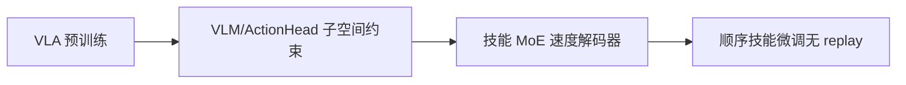
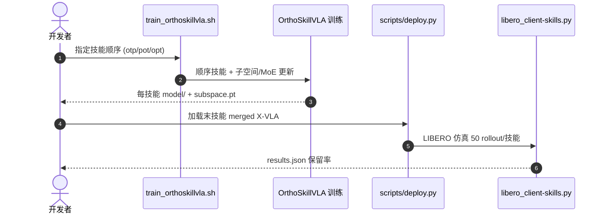

# OrthoSkillVLA

**OrthoSkillVLA: Continual Skill Learning via Gradient-Informed Skill Subspace Adaptation**（[arXiv:2608.19589](https://arxiv.org/abs/2608.19589)，[代码](https://github.com/Jiaqi-Wangx/OrthoSkillVLA)）——（见论文；PRCV 2026）。

## 一句话定义

**VLA 持续学习的难点是不同模块遗忘方式不同——不能对整个模型套同一约束。**

## 英文缩写速查

| 缩写 | 英文全称 | 简要说明 |
|------|----------|----------|
| VLA | Vision-Language-Action | 视觉-语言-动作模型 |
| MoE | Mixture of Experts | 多专家混合解码 |
| X-VLA | Cross-embodiment VLA | 本文基座预训练模型 |

## 为什么重要

- 纳入 [具身智能小站 2026-08-22 十篇盘点](../../sources/blogs/wechat_embodied_station_video_contact_control_10_papers_2026-08-22.md) 的「视频→接触→控制→VLA 持续学习」主线。
- 开源状态（入库日）：**已开源**。

## 核心信息

| 项 | 内容 |
|----|------|
| **机构** | （见论文；PRCV 2026） |
| **出处** | arXiv:2608.19589（2026-08） |
| **开源** | **已开源** |

### 流程总览

## 结论

**组件级正交子空间 + 轻量 MoE 能在无演示 replay 下更好保留旧技能。**

- VLM 易受容量耗尽；ActionHead 对扰动更敏感
- 输出层冻结成瓶颈、全量更新易覆盖旧映射
- LIBERO-90 三技能顺序学习开源脚本
- 单卡复现；多卡训练未支持

## 源码运行时序图

## 与其他页面的关系

- [vla](../methods/vla.md)
- [manipulation](../tasks/manipulation.md)
- [libero-benchmark](../entities/libero-benchmark.md)
- [视频–接触–控制 10 篇技术地图](../overview/video-contact-control-10-papers-technology-map.md)

## 参考来源

- [orthoskillvla_arxiv_2608_19589](../../sources/papers/orthoskillvla_arxiv_2608_19589.md)
- [orthoskillvla](../../sources/repos/orthoskillvla.md)
- [wechat_embodied_station_video_contact_control_10_papers_2026-08-22](../../sources/blogs/wechat_embodied_station_video_contact_control_10_papers_2026-08-22.md)

## 推荐继续阅读

- [arXiv:2608.19589](https://arxiv.org/abs/2608.19589)
- [OrthoSkillVLA 官方代码](https://github.com/Jiaqi-Wangx/OrthoSkillVLA)
