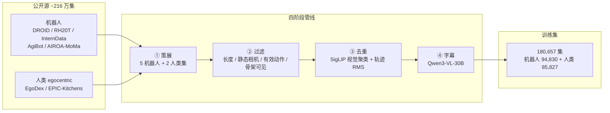
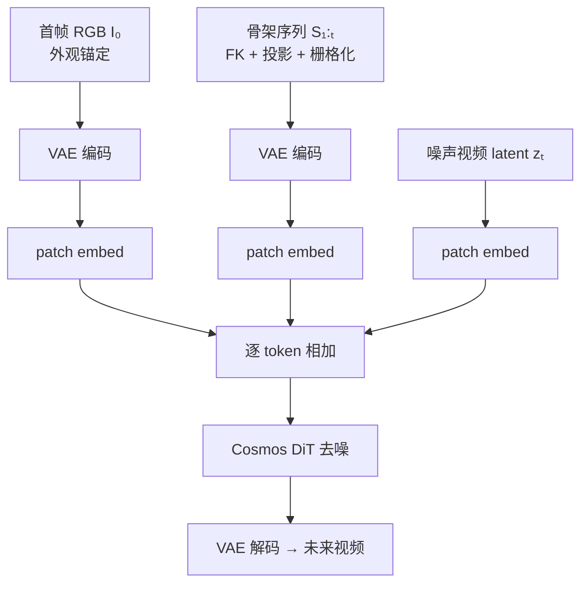

---

type: entity
tags:
  - world-models
  - video-generation
  - manipulation
  - cross-embodiment
  - policy-evaluation
  - cosmos
  - skeleton-conditioning
status: complete
updated: 2026-07-22
arxiv: "2606.04463"
related:
  - ../queries/embodied-eval-benchmark-selection-loop.md
  - ../methods/generative-world-models.md
  - ../concepts/video-as-simulation.md
  - ../methods/roboarena.md
  - ../overview/robot-world-models-training-loop-taxonomy.md
  - ../overview/world-models-route-03-virtual-sandbox.md
  - ./cosmos-3.md
  - ./paper-shenlan-wm-15-worldgym.md
  - ./paper-kairos-native-world-model-stack.md
  - ./paper-driftworld.md
  - ../tasks/manipulation.md
sources:
  - ../../sources/papers/oscar_arxiv_2606_04463.md
  - ../../sources/repos/oscar_public.md
  - ../../sources/sites/oscar-project-page.md
summary: "OSCAR：以 2D 运动学骨架作跨具身动作条件，四阶段数据管线筛得 18 万集，单 GH200 微调 Cosmos-Predict2.5-2B；开环视频质量超越 14B Kinema4D，RoboArena 虚拟策略评测与真机排名强相关。"
tags: [world-models, video-generation, manipulation, cross-embodiment, policy-evaluation, cosmos, skeleton-conditioning, nvidia]

---

# OSCAR（跨具身动作条件世界模型）

**OSCAR**（*OSCAR: Omni-Embodiment Action-Conditioned World Model for Robotics*，arXiv:2606.04463，2026，[项目页](https://wuzy2115.github.io/oscar-project-page/)，[代码](https://github.com/wuzy2115/oscar-public)）由 **Zhuoyuan Wu**（北京大学）与 **Jun Gao**（密歇根大学 / NVIDIA）提出：面向 **机器人策略评估** 的 **精确动作条件视频世界模型**，在 **跨具身泛化** 与 **开环生成质量** 上同时推进，并以 **RoboArena** 真机排行榜验证虚拟评测可用性。

## 一句话定义

**一个 2B 级动作条件视频世界模型：用无纹理 2D 骨架统一机器人臂与人类手条件，经大规模策展–过滤–去重数据管线联合训练，在单卡 GH200 上微调 Cosmos-Predict2.5，使虚拟 rollout 上的策略成功率与真机评测强相关。**

## 英文缩写速查

| 缩写 | 英文全称 | 简要说明 |
|------|----------|----------|
| WM | World Model | 预测未来观测/状态以支撑评估或规划 |
| DiT | Diffusion Transformer | 扩散去噪 Transformer 骨干 |
| FK | Forward Kinematics | 由关节角计算各连杆位姿 |
| URDF | Unified Robot Description Format | 机器人运动学链描述格式 |
| MANO | hand Model with Articulated and Non-rigid defOrmations | 参数化人手模型 |
| MMRV | Mean Maximum Rank Violation | 策略排名与真机的一致性指标（越低越好） |
| VAE | Variational Autoencoder | 视频 latent 编码器（本工作用 WAN 2.1 VAE） |

## 为什么重要

- **策略评估代理：** 将 WM 从「会生成未来视频」推进到「**虚拟成功率能预测真机排名**」——在 RoboArena 七策略上报告 Pearson **ρ +0.750**、MMRV **0.571**，对齐 [Video-as-Simulation](../concepts/video-as-simulation.md) 与 [虚拟沙盒路线](../overview/world-models-route-03-virtual-sandbox.md) 的核心诉求。
- **跨具身条件设计：** **2D 骨架线框** 只编码运动学树，不绑定机器人纹理；同一表示可覆盖 Franka、KUKA、AgiBot G1、HSR 与 **MANO 人手**，人类 egocentric 数据经 warm-start 混合可提升开环指标（PSNR **24.24** vs robot-only **23.48**）。
- **数据工程即方法：** 从 **216 万** 公开源集经四阶段管线降至 **18 万** 高质量集——说明 WM 上限常受 **场景多样性 + 去重** 约束，而非仅堆模型参数；2B 模型即可超越 **14B Kinema4D** 开环指标。
- **训练成本友好：** **单 GH200** 完成 Cosmos-Predict2.5-2B 微调，FPS **2.214**（同卡），降低动作条件 WM 复现门槛。

## 核心结构（方法）

| 模块 | 作用 |
|------|------|
| **基座** | [Cosmos-Predict2.5-2B](./cosmos-3.md) — rectified-flow **DiT** + **WAN 2.1 VAE**；首帧 RGB 锚定外观 |
| **动作条件** | URDF/MANO **FK → 2D 骨架栅格化** → VAE 编码 → 与噪声视频 latent **patch 级相加** |
| **数据管线** | 策展 → 质量过滤 → SigLIP+轨迹语义去重 → Qwen3-VL 字幕 |
| **训练** | Stage 1：15k iter 四具身机器人；Stage 2：机器人+人类 **warm-start** 混合 |
| **策略评估** | 给定首帧+动作序列自回归 rollout → **GPT-5** 判成功/配对偏好 → 与 [RoboArena](../methods/roboarena.md) 真机排名对照 |

### 数据管线总览

### 条件注入（方法）

## 开环生成（论文 Table 2，四具身均值）

| 方法 | 参数量级 | PSNR↑ | SSIM↑ | LPIPS↓ | FVD↓ | FPS↑ |
|------|----------|------:|------:|-------:|-----:|-----:|
| Kinema4D | **14B** | 17.68 | 0.741 | 0.198 | 17.07 | 0.089 |
| Genie Envisioner | — | 23.29 | 0.838 | 0.140 | 15.37 | 1.382 |
| EnerVerse-AC | — | 20.47 | 0.746 | 0.223 | 33.70 | 1.900 |
| **OSCAR** | **2B** | **24.24** | **0.846** | **0.094** | **7.08** | **2.214** |

## RoboArena 策略评测（65 session × 7 策略）

| 条件表示 | MMRV↓ | Pearson ρ↑ | Spearman r↑ | SISR_Δ (pp)↓ |
|----------|------:|-----------:|------------:|-------------:|
| Latent action | 1.429 | +0.643 | +0.867 | 1.98 |
| Mesh rendering | 0.714 | +0.679 | +0.781 | 3.04 |
| **Skeleton（OSCAR）** | **0.571** | **+0.750** | +0.852 | **1.73** |

评测对象：π₀-flow、π₀-FAST、PG-flow、PG-FSQ、PG-FAST、PG-FAST+、PG-Bin 等 **DROID 通用策略**；相机标定用 MoGe-v2 + CtRNet-X；成功判定与配对排序用 **GPT-5**（协议对齐 SIMPLER / WorldGym / WorldEval 系）。

## 与相邻工作的分界（对比）

| 对比轴 | OSCAR | Kinema4D / Genie Envisioner | IRASim / Ctrl-World（latent-action） | [WorldGym](./paper-shenlan-wm-15-worldgym.md) |
|--------|-------|----------------------------|--------------------------------------|-----------------------------------------------|
| **条件形式** | **2D 骨架**（跨具身） | pointmap / gripper 渲染 | 压缩 latent 动作嵌入 | 动作条件 + VLM 奖励 |
| **规模** | **2B**，单 GH200 | 14B / 多卡 | 各异 | — |
| **评估侧重** | **RoboArena 排名相关性** | 开环视频指标为主 | IRASim 亦报相关性 | MC + VLM 奖励靶场 |
| **人类数据** | **EgoDex + EPIC** warm-start | 以机器人为主 | 有限 | — |

## 常见误区

- **误区 1：骨架条件 = 低精度。** 论文显示 mesh 与 skeleton 开环指标接近，但 mesh **绑定 URDF 资产**、难混入人类手数据；策略评估上 **骨架 MMRV 最优**。
- **误区 2：虚拟相关 = 可完全替代真机。** Pearson **ρ +0.750** 表明强相关但仍存在 **SISR_Δ 1.73 pp** 差距；适合 **加速迭代与预筛选**，非取消 [RoboArena](../methods/roboarena.md) 分布式真机验证。
- **误区 3：数据越多越好。** 公开 **216 万** 集经滤除与去重后仅 **18 万** 有效训练集；重复场景会诱导 **freeze-frame** 退化解。

## 关联页面

- [Generative World Models](../methods/generative-world-models.md) — 动作条件视频 WM 谱系
- [robot-world-models-training-loop-taxonomy](../overview/robot-world-models-training-loop-taxonomy.md) — 学习型模拟器 / 视频 WM 三线坐标
- [world-models-route-03-virtual-sandbox](../overview/world-models-route-03-virtual-sandbox.md) — 虚拟沙盒策略评估路线
- [RoboArena](../methods/roboarena.md) — 分布式真机评测框架
- [Cosmos 3](./cosmos-3.md) — 基座视频扩散平台
- [WorldGym](./paper-shenlan-wm-15-worldgym.md) — 同类 WM 策略评估靶场
- [DriftWorld](./paper-driftworld.md) — 1-step drifting：强调推理时搜索速度
- [Manipulation](../tasks/manipulation.md) — 操纵策略与评测语境
- [具身大模型评测基准选型闭环](../queries/embodied-eval-benchmark-selection-loop.md) — 本页兼跨其 ② 世界模型与 ④ 校准层：视频世界模型作虚拟策略评估器，RoboArena 评测与真机排名强相关

## 参考来源

- [OSCAR 论文归档（arXiv:2606.04463）](../../sources/papers/oscar_arxiv_2606_04463.md)
- [wuzy2115/oscar-public 代码索引](../../sources/repos/oscar_public.md)
- [OSCAR 项目页归档](../../sources/sites/oscar-project-page.md)

## 推荐继续阅读

- [arXiv 摘要与 PDF](https://arxiv.org/abs/2606.04463)
- [项目页](https://wuzy2115.github.io/oscar-project-page/)
- [GitHub — oscar-public](https://github.com/wuzy2115/oscar-public)
- [RoboArena 论文](https://arxiv.org/abs/2506.18123) — 真机评测协议背景
