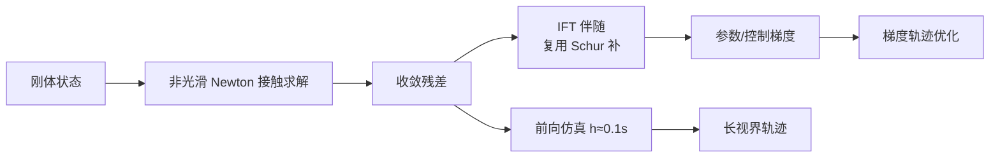

# Ostrich：硬接触可微动力学

**Ostrich**（*Taking Large Strides Through Stiff Contact in Differentiable Dynamics*，[arXiv:2609.08800](https://arxiv.org/abs/2609.08800)，[项目页](https://aleskucera.github.io/ostrich/)，[代码](https://github.com/aleskucera/ostrich)）由 **布拉格捷克理工大学（CTU Prague）** Aleš Kučera、Karel Zimmermann 提出：可微仿真器能否支撑 **基于梯度的接触优化**，取决于 **仿真精度、梯度可靠性、每步成本** 三者。Tape-based 引擎（MJX、Newton Semi-Implicit）需要小时间步且反传内存随步数线性增长；代理模型省内存却损失接触几何。Ostrich 用 **大步长非光滑 Newton** 解硬接触与摩擦，并对收敛残差用 **隐函数定理** 求导——复用前向 Schur 补，**每步 O(1) 记忆**。

## 一句话定义

**硬接触不必用小步长 tape 反传——解稳了再用隐函数定理，梯度跟几何走、内存不跟步数走。**

## 英文缩写速查

| 缩写 | 英文全称 | 简要说明 |
|------|----------|----------|
| Ostrich | — | 本文 GPU 可微刚体仿真器 |
| MJX | MuJoCo XLA / MJX | Tape 式可微基线之一 |
| IFT | Implicit Function Theorem | 对收敛残差求导；O(1) 步记忆 |
| GPU | Graphics Processing Unit | 8192 并行世界单卡示例 |
| h | Simulation timestep | 论文用 ~0.1 s 大步长 |
| T | Horizon length | 轨迹长度；反传内存不随 T 线性涨 |

## 为什么重要

- **接触优化瓶颈在梯度质量：** 随机初始化下 Ostrich 梯度可收敛；MJX 下降慢、Newton Semi-Implicit 易停滞（论文 pallet 障碍真机轨迹实验）。
- **并行尺度：** 单 24 GB GPU **8192** 并行世界；无 checkpoint 时基线更早 OOM；吞吐可达 checkpointed MJX 的 **29×**（同场景）。
- **大步长仍准：** 相对 MuJoCo 真机轨迹，精度保持到 **50× 更大时间步**；适合长视界 **梯度轨迹优化**（10 s 三角网格地形 demo）。

## 核心信息

| 项 | 内容 |
|----|------|
| **机构** | Czech Technical University in Prague |
| **栈** | NVIDIA [Warp](https://github.com/NVIDIA/warp) + [Newton](https://github.com/newton-physics/newton) |
| **坐标** | 最大坐标刚体；精确非穿透 + 非光滑摩擦 |
| **开源** | **已开源** — `uv sync --extra sim`；需 CUDA 12+、CMake 3.x |

## 流程总览



## 核心原理

1. **硬接触不求平滑：** 非光滑摩擦锥精确处理，适合滑移转向、翻车等 **摩擦主导** 行为（Helhest / Marv demo）。
2. **隐式微分：** 不对整个展开轨迹 tape；对 **收敛点** 用 IFT，伴随与 forward 共享 Schur 结构。
3. **大步长稳定：** 0.05–0.1 s 步长仍稳定，降低长视界优化的步数乘积。
4. **与代理模型分界：** 不牺牲接触几何换可微；相对 MJX 类引擎，卖的是 **梯度可信 + 并行** 而非仅 forward 速度。

## 源码运行时序图

官方仓 [aleskucera/ostrich](https://github.com/aleskucera/ostrich)（归档见 [sources/repos/ostrich.md](../../sources/repos/ostrich.md)）：

```mermaid
sequenceDiagram
    autonumber
    actor Dev as 开发者
    participant Clone as git clone + submodule
    participant Patch as apply_newton_patch.sh
    participant UV as uv sync --extra sim
    participant Ex as examples/<br/>comparison_*.py
    participant Opt as experiments/<br/>轨迹优化
    Dev->>Clone: 拉取 Newton 子模块
    Dev->>Patch: 修复无 CUDA 时 GL viewer
    Dev->>UV: 安装 pinned 依赖
    Dev->>Ex: 跑稳定性/梯度/扩展性对比
    Dev->>Opt: 三角网格地形 10s 梯度优化
```

- **最短复现：** `git clone` → `git submodule update --init --recursive` → `./scripts/apply_newton_patch.sh` → `uv sync --extra sim` → `examples/comparison_gradient_old.py` 等。
- **环境：** CMake 须 **< 4.0**；系统为 4.x 时按 README 装 3.27。

## 实验与评测

- **Sim-to-real 精度：** 真机 pallet 障碍轨迹；Ostrich 与 MuJoCo 对齐至 **50×** 步长倍率（相对 MJX 需小步）。
- **梯度优化：** 随机初始化收敛对比 MJX / Newton Semi-Implicit；warm iteration **211×** vs MJX、**4.7×** vs Semi-Implicit。
- **并行：** 8192 worlds @ 24 GB；MJX checkpoint 吞吐的 **29×**（论文同场景设定）。
- **演示：** Helhest 三轮滑移转向、Marv 履带翻爪、三角网格 **10 s** 梯度轨迹优化。

## 结论

**Ostrich 适合「接触几何不能糊、又要长视界梯度优化」的机器人问题，而不是替换所有 MuJoCo 强化学习训练。**

1. **IFT 是内存拐点** — 长 T 轨迹优化优先看能否隐式微分，而非盲目 checkpoint。
2. **硬接触 + 大步长** — 滑移/翻车等摩擦敏感任务受益最大。
3. **GPU 并行是第二卖点** — 数千世界同时求梯度做系统辨识或 TO。
4. **依赖 Newton/Warp 生态** — 与 [Newton Physics](./newton-physics.md) 栈绑定，升级需跟子模块补丁。
5. **不是 RL 默认后端** — 论文定位可微 TO / 系统辨识；大规模 RL 仍常用 MJX/Isaac。

## 工程实践

| 项 | 建议 |
|----|------|
| 何时用 | 硬接触梯度优化、滑移转向、履带/翻爪、mesh 地形 TO |
| 何时不用 | 仅需 forward RL rollout、不需可信接触梯度 |
| 安装 | `uv` + CUDA 12+；记得 `apply_newton_patch.sh` |
| 对照 | MJX（tape）、Newton Semi-Implicit（小步）、平滑代理模型 |

## 关联页面

- [可微仿真](../concepts/differentiable-simulation.md)
- [Newton Physics](./newton-physics.md)

## 参考来源

- [`ostrich_arxiv_2609_08800.md`](../../sources/papers/ostrich_arxiv_2609_08800.md)
- [`ostrich.md`](../../sources/sites/ostrich.md)
- [`ostrich.md`](../../sources/repos/ostrich.md)
- [arXiv:2609.08800](https://arxiv.org/abs/2609.08800)

## 推荐继续阅读

- [Ostrich GitHub](https://github.com/aleskucera/ostrich)
- [NVIDIA Warp](https://github.com/NVIDIA/warp)
- [原文 PDF](https://arxiv.org/pdf/2609.08800)
