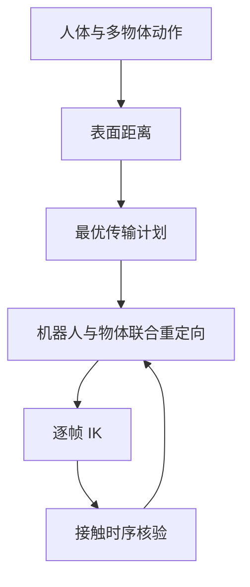

# OTRetarget：Joint Robot and Object Motion Retargeting via Optimal Transport

## 一句话定义

**OTRetarget** 不只调整机器人的动作，也一起优化物体的位姿，让换了身材的机器人仍能完成原本的人—物接触。

## 英文缩写速查

| 缩写 | 英文全称 | 简要说明 |
|------|----------|----------|
| OT | Optimal Transport | 将人体表面交互对应迁移到机器人几何 |
| IK | Inverse Kinematics | 每帧求解机器人和物体位姿的约束优化 |
| HOI | Human-Object Interaction | 人与物体的接触及相对关系 |

## 为什么重要

只复制人体骨架或固定物体轨迹，臂长和桌高变化时双手可能够不到物体。保留“手在箱子哪一侧、脚在哪里支撑”比保持原世界坐标更关键。

## 流程总览

以下按本页已归纳的机制与资料绘制，表示模块或阅读路径关系。

## 方法

用有符号距离、最近表面点及方向描述表面交互；熵正则 OT 将人体表面探针对应到机器人连杆，随后约束 IK 同时优化机器人与物体位姿，平衡接触、风格、碰撞与连续性。

## 实验与评测

官方项目页报告 OMOMO 接触 Jaccard **87%**、深度误差 **8.7 mm**；OmniRetarget 对照为 **28%** 和 **29.3 mm**。G1 真机展示搬箱，接触几何指标不等同于长期策略成功率。

## 动态动作与控制边界

论文图 1 展示的动作包括四足爬行（手部触地）和带全身旋转的移动；这说明接触目标可覆盖足部之外的身体部位。论文没有明确报告侧手翻接后空翻及双脚、单手之间的连续支撑切换，因此该具体序列不列为已验证结果。

OTRetarget 输出的是逐帧受约束 IK 参考，真机执行依赖在仿真中训练的下游全身跟踪策略。接触保真是重定向目标，不代表该求解器本身进行动态平衡或接触力控制。

## 与其他工作对比

[OmniRetarget](./paper-hrl-stack-03-omniretarget.md) 也强调保留交互；OTRetarget 的区别是物体轨迹和机器人轨迹**联合求解**。[HOI-Retarget](./paper-hoi-retarget.md) 用接触中心的时间窗优化。

## 结论

**涉及物体的重定向应允许物体重新选可达轨迹，并用接触指标而非只用关节姿态误差验收。**

1. 接触表面对应比固定骨架点更能迁移不同形态。
2. 几何接触好还需下游动态控制验证。
3. 换物体外形要重新检查碰撞与抓握。

## 工程实践

复现关注表面采样密度、OT 计划、逐帧 IK 收敛及物体接触时序。项目页的 “Code” 标签目前没有可点击仓库 URL；截至 2026-10-02 暂按**待发布 / 未核实可运行代码**处理。论文 PDF 与 Hugging Face 论文索引可直接阅读，数据评测用 OMOMO；OMOMO 官方下载入口和非官方 HF 镜像需区分，后者没有 dataset card 或明确许可说明。

## 局限与风险

几何优化非在线动态控制；接触力与摩擦执行取决于下游跟踪策略。官方项目页尚不能提供完整复现入口。

## 源码运行时序图

**不适用**：未发现官方可运行代码。

## 关联页面

- [OmniRetarget](./paper-hrl-stack-03-omniretarget.md)
- [HOI-Retarget](./paper-hoi-retarget.md)

## 参考来源

- [Day 1 文章逐篇索引](../../sources/blogs/humanoid_motion_intelligence_day1_data_retargeting_2026_10_02.md)
- [项目页开放状态](../../sources/sites/otretarget-project.md)
- [论文来源摘录](../../sources/papers/otretarget_arxiv_2609_36602.md)
- [官方项目页](https://simple-robotics.github.io/publications/otretarget/)
- [论文](https://arxiv.org/abs/2609.36602) · [PDF](https://simple-robotics.github.io/publications/otretarget/static/paper/otretarget.pdf) · [Hugging Face 论文页](https://huggingface.co/papers/2609.36602)
- [OMOMO 官方数据说明](https://lijiaman.github.io/projects/omomo/) · [非官方 Hugging Face 镜像](https://huggingface.co/datasets/snorfyang/omomo)（许可信息未明确）

## 推荐继续阅读

- [OTRetarget 项目页](https://simple-robotics.github.io/publications/otretarget/)
