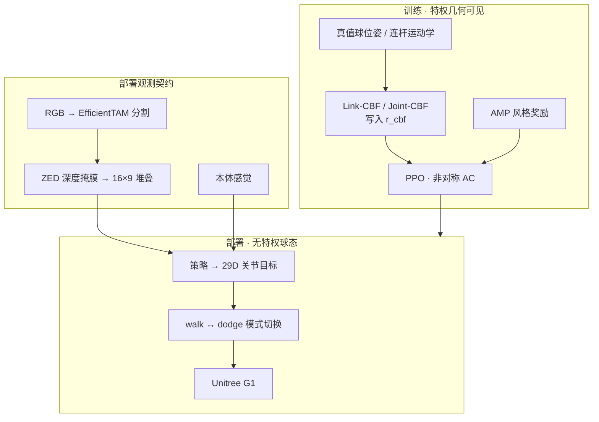
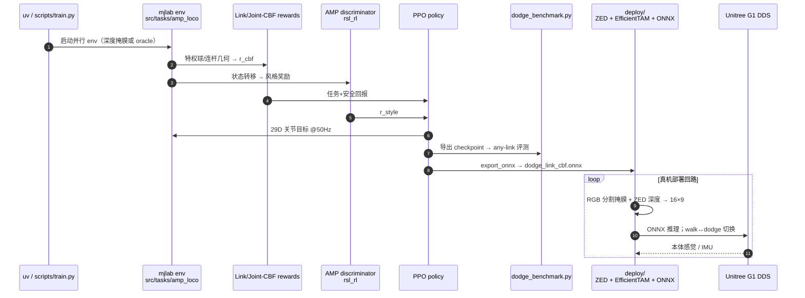

# PAC-MAN

**PAC-MAN**（*Perception-Aware CBF-RL for Whole-Body Safety in Humanoid Dodgeball*，[arXiv:2607.28623](https://arxiv.org/abs/2607.28623)，[项目页](https://lzyang2000.github.io/perceptive_cbf_rl/)，[浏览器 Demo](https://lzyang2000.github.io/perceptive_cbf_rl/demo/)）由 **加州理工学院（Caltech）AMBER Lab**（Lizhi Yang、Junheng Li、Aaron D. Ames）提出：把控制屏障安全与**部署级机载感知**耦合，训练人形在躲避球中做全身避碰并保持直立。

## 一句话定义

**训练时用特权几何把全身 CBF 写进奖励，部署时只剩头戴分割掩膜深度 + 本体感觉——屏障强度必须匹配球的可观测性，否则更强的 Joint-CBF 反而学坏。**

## 英文缩写速查

| 缩写 | 英文全称 | 简要说明 |
|------|----------|----------|
| PAC-MAN | Perception-Aware CBF-RL for Whole-Body Safety in Humanoid Dodgeball | 本文框架：感知感知 CBF-RL 人形躲避球 |
| CBF | Control Barrier Function | 用前向不变集编码连杆–球 clearance 安全集 |
| Link-CBF | Link-level CBF reward | 每连杆 clearance 奖励；部署配置，无在线滤波 |
| Joint-CBF | Joint-space CBF projection | 关节速度半空间投影；训练指导或特权 +filter |
| AMP | Adversarial Motion Prior | 对抗运动先验，把躲避正则成 duck/sidestep 等 |
| PPO | Proximal Policy Optimization | mjlab + rsl_rl 上的策略优化 |
| G1 | Unitree G1 Humanoid | 真机零样本部署平台 |
| ETAM | EfficientTAM | 真机 RGB 球分割，掩膜后取 ZED 深度 |

## 为什么重要

- **把「感知」写进安全设计：** 不是先定 CBF 再塞相机，而是证明可用屏障结构随球可观测性变化。
- **any-link 成功标准：** 护骨盆不够——手臂/腿擦球也算失败；Link-CBF 把安全从骨盆扩到全身连杆。
- **部署契约极简：** 固定相机 + 掩膜深度即可接近特权 oracle 几分；真机 95% 躲开、0 跌倒。
- **可玩可复现：** 项目页提供浏览器 Demo；GitHub 含训练、benchmark 与硬件 ONNX 栈（MIT）。

## 核心信息

| 项 | 内容 |
|----|------|
| **机构** | 加州理工学院（Caltech）AMBER Lab |
| **作者** | Lizhi Yang、Junheng Li、Aaron D. Ames |
| **平台** | Unitree G1；头戴 ZED Mini；仿真 mjlab（MuJoCo Warp） |
| **观测（部署）** | 球-only 掩膜深度 16×9 稀疏堆叠 + 关节/IMU/重力/上一步动作 |
| **动作** | 29 维关节目标（相对名义姿态），PD 跟踪 50 Hz |
| **开源** | **已开源（MIT）**：[perceptive_cbf_rl](https://github.com/lzyang2000/perceptive_cbf_rl)；含 `deploy/ckpts/dodge_link_cbf.onnx` |

## 流程总览

## 核心机制（方法栈）

### 1）安全引导学习

- 策略 $\pi_\theta(a_t\mid o_t)$ 只看机载可得 $o_t$；价值网络与 CBF 计算使用特权球/连杆几何（非对称 actor-critic）。
- 回报：$r_t = r^{\mathrm{core}}_t + r^{\mathrm{cbf}}_t + \lambda_s r^{\mathrm{style}}_t$。$r^{\mathrm{core}}$ 奖励球远离骨盆并在安全时保持静止；$r^{\mathrm{style}}$ 为 AMP。

### 2）Link-CBF（部署）

- 每连杆 $h_i = \lVert p^b - p_i\rVert - (\rho^b + \rho_i)$，安全集 $\mathcal{C}=\bigcap_i\{h_i\ge 0\}$。
- 奖励惩罚最紧约束的屏障条件违反：$\min_i\mathrm{clip}(\dot h_i+\alpha h_i,-c,0)$（$\alpha$ 类 $\mathcal{K}$ 项在接近时加重，而非只在接触瞬间）。
- **只进训练奖励**，部署无在线 CBF-QP——策略内化安全结构后即可跑。

### 3）Joint-CBF（指导 / +filter）

- 对最受威胁点构造关节速度仿射约束，闭式投影 $v^{\mathrm{des}}\to v^\star$；训练加校正代价与缓冲代价。
- 去掉在线模块后测「策略吃进了多少更强屏障」；`+filter` 保留投影作仿真上限，**需真值球态，非真机配置**。

### 4）感知制度决定屏障选型

| 感知 | 可读法 |
|------|--------|
| 状态 oracle | 最强 Joint-CBF +filter 可达约 98–99% |
| 固定头相机 | **Link-CBF 最稳**（deployment ~89%）；裸 Joint-CBF 掉到 ~76% |
| 云台追踪相机 | 可观测性上升后 Joint-CBF 恢复竞争力 |

设计含义：**屏障强度必须匹配威胁可观测性**；固定相机部署选轻量 Link-CBF。

### 5）AMP 涌现躲避模式

- 约 100 s 人类 crouch/lean/sidestep/leap 重定向到 G1；CBF 定安全结构，AMP 定「怎么动得像人」。
- 威胁类型混合：下落擦腿 vs 低弧打躯干/头，各占约一半；20% 环境为无球站立锚点。

## 源码运行时序图

官方仓库 [lzyang2000/perceptive_cbf_rl](https://github.com/lzyang2000/perceptive_cbf_rl)（MIT）提供训练、benchmark 与硬件栈（归档见 [sources/repos/perceptive_cbf_rl.md](../../sources/repos/perceptive_cbf_rl.md)）。

- **训练复现：** `uv sync` 后按 `train_runs/` 启动器跑论文格子；任务 id 见仓库 README。
- **真机：** `STATIC_MASK=1 ETAM=1 TINY=1 NET=<iface> zsh deploy/play_real_dodge.sh deploy/ckpts/dodge_link_cbf.onnx`（详见 `deploy/SETUP.md`）。

## 工程实践

| 项 | 建议 |
|----|------|
| 仿真栈 | mjlab + rsl_rl；AMP 适配自 AMP_mjlab |
| 观测对齐 | 仿真分割掩膜深度必须与真机 EfficientTAM 输出同契约（16×9、远平面填充、稀疏堆叠） |
| 域随机 | 整球 dropout、像素破损、深度抖动、边缘闪烁——对齐分割失败模式 |
| 部署滤波 | 低分位池化拒飞点；距离感知 mask 尺寸检查；可选 looming 门控；丢跟踪时送全远平面帧 |
| 模式切换 | 行走策略回站 → 躲避策略反应 → 再回站，与仿真 deployment 回路一致 |
| Demo | 浏览器端交互投球：[demo](https://lzyang2000.github.io/perceptive_cbf_rl/demo/)（约 15 MB 本机下载） |

## 实验与评测

### 仿真（any-link 成功 / 不跌倒）

- 冻结雕像基线仅约 **4%** 存活（校准投掷命中率）。
- 固定相机 · deployment：Link-CBF **89%** > no-barrier **86%** ≫ 裸 Joint-CBF **76%**；`+filter` 在有真值球态时最高。
- Link-CBF 固定相机与状态 oracle 仅差数个百分点——**固定机载相机对躲避已够用**。
- 与 SMP 全向投掷设定对照：PAC-MAN oracle 约 **98%**，接近其报告 ~99%。

### 真机（Unitree G1）

| 指标 | 结果 |
|------|------|
| 手动投掷躲开 | **19/20（95%）** |
| 跌倒 | **0** |
| 感知 | 100% 机载（分割 + 深度），无外置球态 |
| 球种 | 语义分割使同一策略可躲训练未见球种 |

## 结论

**PAC-MAN 的真影响是「感知可支撑的屏障强度」选型：固定相机部署用轻量 Link-CBF 内化全身避碰；更强的 Joint-CBF 只有在球足够可观测（oracle / 云台 / 特权滤波）时才值得用。**

1. **部署读 Link-CBF，不要默认上 Joint-CBF +filter** — 后者在仿真是上限，真机没有准确球态时不可直接搬。
2. **成功标准用 any-link** — 只看骨盆距离会低估手臂/腿擦球；Link-CBF 正是补这一缺口。
3. **观测契约决定 Sim2Real** — 把球压成 16×9 掩膜深度后，域差距主要在分割质量；EfficientTAM + 保守滤波是工程主战场。
4. **AMP 管风格，CBF 管安全** — 躲避模式（duck/sidestep）是涌现的，不是脚本动作库。
5. **复现路径清晰** — 开源训练格子、benchmark 与 `dodge_link_cbf.onnx`；浏览器 Demo 可先体感任务难度。
6. **主动云台是下一步** — 论文把 tracker 驱动 pitch 留给未来硬件，当前真机仍是固定相机。

## 与其他工作对比

| 维度 | PAC-MAN | SHIELD（CBF-in-Expectation） | Vision-Driven Soccer |
|------|---------|------------------------------|----------------------|
| 安全机制 | 训练期 Link/Joint-CBF 奖励；部署无滤波 | 学习动力学上的期望 CBF | 主要靠任务/AMP，非 CBF 安全层 |
| 威胁 | 快速飞行球（~0.6 s 反应窗） | 更广的 loco 安全设定 | 主动看球 + 踢球 |
| 感知 | 球-only 掩膜深度 | 依赖动力学/状态估计设定 | 检测球位进策略 |
| 真机证据 | G1 19/20 躲开、0 跌倒 | 见对应笔记实体 | Booster 平台踢球 |
| 开源 | **全栈 + Demo** | 见 Paper Notebooks 进度 | 项目页暂无 Code（截至既有归档日） |

## 局限与风险

- **适用边界：** 正面锥投掷、短时窗躲避；不是全向导航避障或接触丰富操作。
- **Joint-CBF 误用：** 在固定相机、弱可观测下强制更强屏障，仿真会掉成功率——「更安全的奖励」≠「更好的部署策略」。
- **分割依赖：** 真机靠点击初始化 EfficientTAM；跟踪丢失时策略吃全远平面，可能漏躲或误触发（looming 门控缓解）。
- **主动感知未上真机：** 云台结果是仿真 oracle 瞄准上限；硬件 gimbal 闭环仍是未来工作。
- **动作先验数据：** AMP clip 来自 NVIDIA SEED mocap 重定向，遵循上游许可。

## 关联页面

- [Control Barrier Function](../concepts/control-barrier-function.md) — 屏障条件与 CBF-QP 基础
- [Safety Filter](../concepts/safety-filter.md) — 在线投影对照；本文部署刻意不用运行时滤波
- [Safe RL](../methods/safe-rl.md) — CBF 奖励 / 安全层屏蔽谱系
- [Privileged Training](../concepts/privileged-training.md) — 训练特权几何、部署机载观测
- [AMP](../methods/amp-reward.md) — 风格先验
- [CLF vs CBF](../comparisons/clf-vs-cbf.md) — 稳定性 vs 安全性工具对
- [Unitree G1](./unitree-g1.md)、[mjlab](./mjlab.md)、[AMP_mjlab](./amp-mjlab.md)
- [SHIELD（CBF-in-Expectation）](./paper-notebook-shield-safety-on-humanoids-via-cbfs-in-expectati.md)
- [Vision-Driven Reactive Soccer](./paper-hrl-stack-26-learning_vision_driven_reactive_socc.md) — 另一条视觉反应式全身技能线
- [机器人视觉感知栈选型闭环](../queries/robot-perception-stack-selection-loop.md) — 分割→深度→策略观测契约选型

## 参考来源

- [pac_man_perceptive_cbf_rl_arxiv_2607_28623.md](../../sources/papers/pac_man_perceptive_cbf_rl_arxiv_2607_28623.md) — 论文策展摘录
- [perceptive-cbf-rl-github-io.md](../../sources/sites/perceptive-cbf-rl-github-io.md) — 项目页核查
- [perceptive_cbf_rl.md](../../sources/repos/perceptive_cbf_rl.md) — 官方仓库归档
- 论文：<https://arxiv.org/abs/2607.28623>

## 推荐继续阅读

- [PAC-MAN 项目页](https://lzyang2000.github.io/perceptive_cbf_rl/)
- [浏览器交互 Demo](https://lzyang2000.github.io/perceptive_cbf_rl/demo/)
- [GitHub：lzyang2000/perceptive_cbf_rl](https://github.com/lzyang2000/perceptive_cbf_rl)
- Ames et al., *Control Barrier Function Based Quadratic Programs for Safety Critical Systems* (IEEE TAC, 2017)
