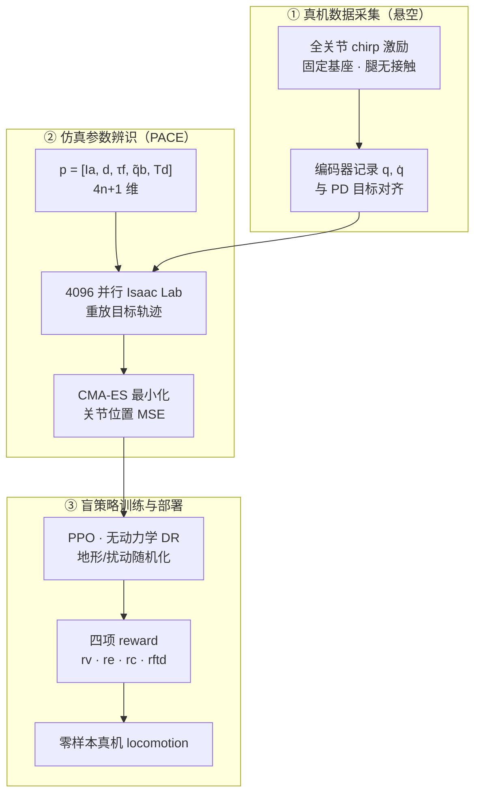

# PACE（足式系统化 Sim2Real）

**PACE**（**P**recise **A**daptation through **C**ontinuous **E**volution）是 ETH Zurich Robotic Systems Lab 提出的足式机器人 **系统化 sim2real** 框架（arXiv [2509.06342](https://arxiv.org/abs/2509.06342v1)）：先用标准关节编码器采集 **悬空 chirp** 轨迹，在 **Isaac Lab** 中用 **CMA-ES** 拟合紧凑关节动力学参数对齐仿真，再以 **仅四项**、基于 **PMSM 物理损耗** 的 reward 训练 **盲 locomotion** 策略并 **零样本** 部署。开源实现：[leggedrobotics/pace-sim2real](https://github.com/leggedrobotics/pace-sim2real)；文档：<https://pace.filipbjelonic.com/>。

## 一句话定义

用 **最少可解释动力学参数** 把仿真关节响应对齐真机，再用 **物理能量目标** 训出可迁移且更省电的足式 RL 行走策略。

## 英文缩写速查

| 缩写 | 英文全称 | 简要说明 |
|------|----------|----------|
| PACE | Precise Adaptation through Continuous Evolution | 本文提出的足式 sim2real 系统化管线 |
| Sim2Real | Simulation to Real | 把仿真中学到的策略迁移落地真机 |
| PMSM | Permanent Magnet Synchronous Motor | 永磁同步电机，足式平台主流作动器 |
| SysID | System Identification | 系统辨识，估计物理/动力学参数 |
| CMA-ES | Covariance Matrix Adaptation Evolution Strategy | 进化策略优化，用于并行仿真参数拟合 |
| CoT | Cost of Transport | 运输成本，单位距离能耗指标 |
| DR | Domain Randomization | 训练时随机化仿真参数以提升跨域鲁棒迁移 |
| Isaac Lab | NVIDIA Isaac Lab | 基于 Omniverse 的机器人学习训练框架 |
| PPO | Proximal Policy Optimization | 足式 locomotion 常用 on-policy 策略梯度算法 |
| PD | Proportional–Derivative | 关节阻抗底层控制，策略输出常为其 setpoint |

## 为什么重要

- **moderate-data 可解释路线：** 相对纯 [Domain Randomization](../concepts/sim2real.md) 或黑盒 [Actuator Network](../methods/actuator-network.md)，PACE 用 **$4n+1$ 维** 关节空间参数（armature、粘性阻尼、Coulomb 摩擦、偏置、全局延迟）即可显著缩小执行器 gap，且 **无需力矩传感器**。
- **reward 与物理对齐：** 多数 locomotion RL 依赖十余项手工 shaping；PACE 证明 **四项**（速度跟踪、能量、碰撞、足端触地）在动力学对齐后足够，且能量项直接建模 **Joule 损耗 + 机械功率 + 势能**。
- **跨平台实证：** 主平台 ANYmal D / Tytan / Minimal，另 **10+** 机器人部署；ANYmal 全 **CoT 1.27**，相对先前 SOTA **降低 32%**，且 **不做动力学参数随机化**。
- **工程可复现：** Isaac Lab 扩展包 + MkDocs 文档 + ANYmal 公开示例脚本，与 ETH RSL 其他 Isaac 项目（如 [RWM](./robotic-world-model-eth-rsl.md)）栈一致。

## 流程总览

## 核心机制（知识归纳）

### 1. 数据采集协议

- **固定基座、腿悬空：** 隔离腿/驱动动力学，避免支撑期基座惯量主导（论文 Appendix B 量级分析）。
- **Chirp 带宽：** 理想覆盖至策略 Nyquist $f_{\text{policy}}/2$；受结构限制时 ANYmal 约 2 Hz，Tytan/Minimal 可达 10 Hz。
- **低 PD 增益：** 辨识与后续 RL 均用小增益，使主导极点落在可激励频段；高增益会把极点推高、加重带宽需求。
- **仅需标准编码器：** 与需力矩传感的 ActuatorNet 路线对比，部署门槛更低。

### 2. 参数辨识

| 符号 | 含义 |
|------|------|
| $\mathbf{I}_a$ | 每关节 armature / 等效惯量 |
| $\mathbf{d}$ | 粘性阻尼 |
| $\boldsymbol{\tau}_f$ | Coulomb 摩擦 |
| $\tilde{\mathbf{q}}_b$ | 关节偏置 |
| $T_d$ | 全局指令延迟 |

在 GPU 并行仿真中重放真机 $\hat{\mathbf{q}}$，优化 $\mathbb{E}[\|\mathbf{q}^{\text{real}}-\mathbf{q}^{\text{sim}}\|^2]$。**CMA-ES** 对 ~49 维（12 关节四足）问题稳健；论文亦指出驱动侧 $\hat q \rightarrow q$ 近似线性，使紧凑参数集可跨平台迁移。

### 3. 策略训练差异点

- **不做动力学 DR**；随机化推力、地面摩擦与多样地形（平地/粗糙/楼梯/箱体/坡道）。
- **位置饱和：** 近关节硬限位时对 PD 目标饱和，仿真与真机一致，保护硬件。
- **四项 reward：**
  - $r_v$：基座线速度 + yaw 角速度跟踪（Lee 2020 风格指数核）
  - $r_e$：$P_{\text{el}}$（$R i_q^2$）+ $P_{\text{mech}}$（含再生系数）+ $P_{\text{pot}}$，经 $\gamma_v$ 速度归一化
  - $r_{\text{ftd}}$：触地瞬间足端速度惩罚（缓冲窗 $n=3$）
  - $r_c$：关节限位与大腿–环境碰撞指示
- **调度：** 能量与 FTD 项指数 warmup；PPO 熵系数 tanh 退火。

### 4. 自下而上验证

1. **单驱动器** — 高带宽力矩跟踪与机械参数辨识（全已知条件）
2. **悬空整机** — 对比 **无模型**、**Actuator Network** 与 PACE 的 joint delta 相位图（论文 Fig.1）
3. **地面 locomotion** — 跟踪、能效与长时运行；ANYmal CoT **1.27**

## 实验与评测

- **本页为策展编译；完整量化基准、消融与实机指标以原文 PDF / 项目页为准**（链接见 [参考来源](#参考来源)）。
- **主平台与规模：** ANYmal D / Tytan / Minimal 为主，另在 **10+** 足式机器人上部署，验证跨平台可迁移性。
- **能效指标：** ANYmal 全流程 **CoT 1.27**，相对原文所述先前工作 **降低 32%**，且 **未做动力学参数随机化**——支撑「辨识对齐优于盲目随机化」的核心论点。
- **自下而上验证（三层）：** 单驱动器高带宽力矩跟踪 → 悬空整机 joint-delta 相位图对比（无模型 / Actuator Network / PACE，论文 Fig.1）→ 地面 locomotion 跟踪与长时能效。
- **奖励精简消融：** 在动力学对齐后，仅 **四项** 奖励（速度跟踪、能量、碰撞、足端触地）即可支撑稳定 locomotion，验证 reward 与物理对齐的充分性。

## 工程实践

| 步骤 | 开源入口 |
|------|----------|
| 安装 Isaac Lab + `pip install -e source/pace_sim2real` | [README](https://github.com/leggedrobotics/pace-sim2real) |
| 采集/准备 chirp 数据 | `scripts/pace/data_collection.py` |
| CMA-ES 拟合 | `scripts/pace/fit.py` → `logs/pace/...` |
| 自定义环境 | `PaceCfg`, `PaceSim2realEnvCfg`, `CMAESOptimizer` |

**版本：** 推荐 **Isaac Sim ≥ 5.0**（关节粘性摩擦等属性）；旧版可跑但物理保真度下降。

**常见陷阱（论文 §2.4）：**

- 驱动侧速度低通未建模 → PD 力矩偏差
- PD 增益非 SI 单位 → 跨增益泛化差、能量项失真
- 盲目增参 → 可辨识性下降；与 PD 增益共优化易产生非唯一解

## 局限与风险

- **PMSM / 场定向控制假设：** 主要面向现代足式 **永磁同步** 关节电机；与舵机 Stribeck 摩擦为主的 [BAM](./paper-bam-extended-friction-servo-actuators.md) 场景侧重不同。
- **悬空辨识协议：** 需要安全吊装或固定基座；支撑期接触动力学不在辨识数据中，依赖后续 locomotion 实验验证。
- **栈绑定：** 当前开源实现深度集成 **Isaac Lab**；与 [SAGE](./sage-sim2real-actuator-gap-estimator.md)（偏 gap **度量** 与成对数据导出）互补而非替代。
- **API 演进中：** 仓库标注 active development，集成前锁定 commit 与 Isaac 版本。

## 与其他页面的关系

- **[Sim2Real](../concepts/sim2real.md)：** PACE 代表 **SysID 对齐 + 紧凑物理 reward** 路线，与 DR、RMA、处理器在环等可组合但论文强调 **无需动力学 DR**。
- **[System Identification](../concepts/system-identification.md)：** 执行器层 moderate-data 辨识实例；参数有明确物理含义。
- **[Actuator Network](../methods/actuator-network.md)：** 论文主要黑盒对照；PACE 用可解释参数达到更接近真机的悬空轨迹。
- **[Sim2Real 方法对比](../comparisons/sim2real-approaches.md)：** 可归入 moderate-data / 残差物理先验谱系。

## 推荐继续阅读

- 论文 HTML：<https://arxiv.org/html/2509.06342v1>
- 官方文档：<https://pace.filipbjelonic.com/>
- GitHub：<https://github.com/leggedrobotics/pace-sim2real>

## 参考来源

- [sources/papers/pace_sim2real_arxiv_2509_06342.md](../../sources/papers/pace_sim2real_arxiv_2509_06342.md)
- [sources/repos/pace-sim2real.md](../../sources/repos/pace-sim2real.md)
- [sources/sites/pace-filipbjelonic-com.md](../../sources/sites/pace-filipbjelonic-com.md)

## 关联页面

- [ANYmal 四足机器人](./anymal.md)
- [Isaac Gym / Isaac Lab](./isaac-gym-isaac-lab.md)
- [Sim2Real Gap 缩减实战指南](../queries/sim2real-gap-reduction.md)
- [执行器驱动链选型闭环知识链](../queries/actuator-drive-chain-selection-loop.md) — PACE 面向③层腿式执行器 sim2real gap 的对齐
