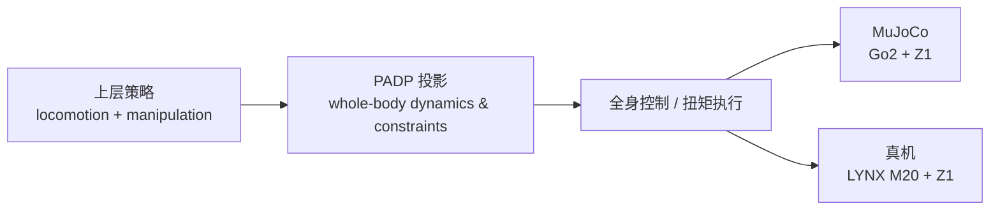

# PADP（Policy Action Dynamics Projection）四足 loco-manipulation

**From Policy Actions to Whole-Body Dynamics: A Unified Projection-Based Framework for Versatile Legged Loco-Manipulation**（IEEE RA-L 2026，[DOI:10.1109/lra.2026.3734869](https://doi.org/10.1109/lra.2026.3734869)）由 **中国科学技术大学（USTC）** 的 Chengzhen Yan、Qingchen Liu、Jiahu Qin、Yiming Jiang 与 **维多利亚大学** 的 Yang Shi 发表。核心缩写 **PADP（Policy Action Dynamics Projection）** 指向统一的 **projection-based** 全身接口：上层 **策略动作** 经投影成为满足 **whole-body dynamics** 的可执行指令，面向 **versatile legged loco-manipulation**。

> **链接澄清：** 本篇 **无** 对应 arXiv:2609.36012；该 arXiv 号为无关的机器人 ICL 综述。一手正文见 [IEEE Xplore](https://ieeexplore.ieee.org/document/11692614/)。

## 一句话定义

在四足 + 臂的移动操作系统上，用 **PADP** 把 RL/策略层输出的 **policy actions** **投影** 到 **全身动力学可行** 的控制空间，使 loco-manipulation 任务可切换而不牺牲底层物理一致性。

## 英文缩写速查

| 缩写 | 英文全称 | 简要说明 |
|------|----------|----------|
| PADP | Policy Action Dynamics Projection | 策略动作→全身动力学投影 |
| WBC | Whole-Body Control | 全身控制与约束满足 |
| LocoManip | Loco-Manipulation | 移动与操作耦合 |
| RL | Reinforcement Learning | 常见上层策略来源 |
| MuJoCo | Multi-Joint dynamics with Contact | 论文仿真栈之一 |

## 为什么重要

- **接口层问题：** 四足 + Z1 类系统常分层训练—— locomotion / manipulation 策略输出 **不一定** 同时满足耦合动力学与接触约束；**统一投影框架** 把「策略灵活改任务」与「WBC 保可行」绑在同一接口上。
- **跨形态验证：** **Unitree Go2 + Z1**（MuJoCo）与 **DEEP Robotics LYNX M20 + Z1**（真机）覆盖 **仿真—真机** 与 **不同四足底盘**，比单平台 demo 更利于判断方法是否依赖某一 URDF 细节。
- **与站内 WBC / MPC 线对照：** 不同于 [MPC-RL](./paper-mpc-rl-humanoid-locomotion-manipulation.md) 的「训练期 MPC 教师」，PADP 强调 **策略动作与全身动力学之间的在线/统一投影**（细节以 RA-L 正文为准）。

## 核心信息

| 项 | 内容 |
|----|------|
| **机构** | 中国科学技术大学（USTC）；维多利亚大学（University of Victoria，通讯合作） |
| **刊物** | IEEE Robotics and Automation Letters（RA-L），2026 |
| **DOI** | [10.1109/lra.2026.3734869](https://doi.org/10.1109/lra.2026.3734869) |
| **平台** | Go2 + Z1（MuJoCo）；LYNX M20 + Z1（真机） |
| **开源** | 截至 **2026-09-30** **未见** 官方 GitHub / 项目页 |

## 核心原理

### 问题设定（归纳）

1. **上层** 产生 task-level **policy actions**（如足端/臂目标、增量命令等，具体参数化见原文）。
2. **下层** 需输出满足 **floating-base + 操作臂** 耦合 **动力学、接触与关节限位** 的全身控制。
3. **PADP** 在统一优化/投影框架内，把 (1) **映射** 到 (2)，避免「策略可行但 WBC 不可行」或「WBC 可行但偏离策略意图」的割裂。

### 流程总览

## 源码运行时序图

**不适用** — 截至 **2026-09-30** 无可运行官方代码（IEEE 页无 Code 链接；公开检索无仓库）。若后续发布代码，应按 README 补 `sources/repos/` 与本节 **sequenceDiagram**（仿真 env → 策略 → PADP → 低层力矩 → 真机 IO）。

## 工程实践

| 项 | 说明 |
|----|------|
| 一手来源 | [IEEE Xplore 11692614](https://ieeexplore.ieee.org/document/11692614/) |
| 硬件对照 | Go2 与 LYNX M20 底盘差异大——复现时优先核对 **URDF、质量分布与臂安装位** |
| 机械臂 SDK | Unitree Z1 软件接口见 [Z1 SDK](./z1-sdk.md) |
| 开源状态 | **未开源** — 部署需自研或等待作者发布 |

## 实验与评测

- **仿真：** MuJoCo 下 **Go2 + Z1** 验证 versatile loco-manipulation（任务列表与成功率 **以 RA-L PDF 为准**；本页未转存表格）。
- **真机：** **LYNX M20 + Z1** 展示跨平台迁移；具体任务与扰动设置见原文 **Experimental Results**。
- **读法：** 先对齐「策略输出维度 ↔ PADP 约束 ↔ WBC 频率」，再比成功率；勿与 arXiv 预印本数字混用。

## 与其他工作对比

| 维度 | PADP | 对照 |
|------|-------------|------|
| 物理结构的作用位置 | 部署时把 policy actions **投影** 到全身动力学可行指令（细节以 RA-L 正文为准） | [MPC-RL](./paper-mpc-rl-humanoid-locomotion-manipulation.md)：训练期质心 MPC 预测地标奖励指导 PPO，部署时 MPC 退场、纯 RL |
| 核心问题 | 策略输出与耦合动力学 / 接触 / 关节限位之间的 **接口一致性** | [Contact-Guided Exploration](./paper-contact-guided-exploration-locomanipulation.md)：非抓取任务的 **稀疏接触探索**，用多 Critic PPO + 可退火探索权重 |
| 平台与开源 | Go2 + Z1（MuJoCo）与 LYNX M20 + Z1（真机）；未见官方代码 | [Contact-Guided Exploration](./paper-contact-guided-exploration-locomanipulation.md)：ALMA 真机椅运；项目页同样无代码 |

## 结论

**PADP 的价值在「策略—动力学」统一投影接口，适合作为四足+臂 loco-manipulation 的系统层参考，而非新的单点 RL 算法名。**

1. RA-L 2026 发表；DOI **10.1109/lra.2026.3734869** 为唯一权威链接（非 arXiv:2609.36012）。
2. **双平台**（Go2 / LYNX M20 + Z1）支持「方法 vs 单机 URDF 过拟合」的粗判。
3. 与 **whole-body optimization** 叙事一致：上层改任务，投影层保可行。
4. **未见开源** — 复现前预留 WBC/QP 与 sim2real 标定成本。
5. 与 [Contact-Guided Exploration](./paper-contact-guided-exploration-locomanipulation.md) 等 **RL 探索** 路线互补：本篇偏 **动力学投影接口**，彼篇偏 **接触探索奖励**。

## 局限与风险

- 本页机制描述为 **标题/关键词级归纳**；QP 维度、实时性与 ablation **必须以 IEEE PDF 为准**。
- LYNX M20 与 Go2 **动力学差异** 可能限制 zero-shot 迁移声明的外推。
- 无官方代码时，**PADP 实现细节**（约束集合、求解器）存在复现歧义。

## 关联页面

- [loco-manipulation](../tasks/loco-manipulation.md)
- [whole-body-control](../concepts/whole-body-control.md)
- [MPC 与 WBC 集成](../concepts/mpc-wbc-integration.md)
- [Z1 SDK](./z1-sdk.md)
- [Contact-Guided Exploration loco-manip](./paper-contact-guided-exploration-locomanipulation.md)

## 参考来源

- [padp_lra_2026_3734869_legged_loco_manipulation.md](../../sources/papers/padp_lra_2026_3734869_legged_loco_manipulation.md)
- [IEEE PADP 页面归档](../../sources/sites/ieee-padp-lra-2026.md)

## 推荐继续阅读

- [https://doi.org/10.1109/lra.2026.3734869](https://doi.org/10.1109/lra.2026.3734869)
- [https://ieeexplore.ieee.org/document/11692614/](https://ieeexplore.ieee.org/document/11692614/)
