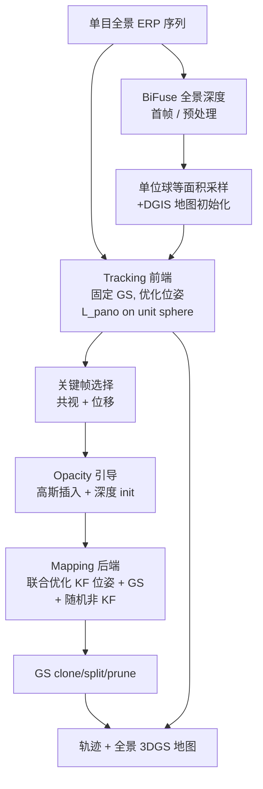

# PanoGS-SLAM（Panoramic 3D Gaussian Splatting SLAM）

**PanoGS-SLAM**（*Panoramic 3D Gaussian Splatting SLAM*，[arXiv:2609.17387](https://arxiv.org/abs/2609.17387)，2026-09-15）由 **浙江大学（ZJU）** 联合 **国防科技大学（NUDT）**、**蚂蚁集团（Ant Group）** 提出：在 **单目全景（ERP）** 输入下，**直接在球面域** 做可微 splat 渲染并联合优化相机位姿与 3D 高斯图——填补「窄 FoV 3DGS-SLAM」与「离线全景 3DGS」之间的 **在线定位 + 稠密建图** 空白。

## 一句话定义

**用球面 ERP 光栅化承载 3DGS 稠密 SLAM，以面积一致的 L_pano 稳定全景光度跟踪，并以 DGIS 在 newly observed 区域快速注入有几何先验的高斯。**

## 英文缩写速查

| 缩写 | 英文全称 | 简要说明 |
|------|----------|----------|
| PanoGS-SLAM | Panoramic 3D Gaussian Splatting SLAM | 本文全景 3DGS 在线 SLAM 系统 |
| 3DGS | 3D Gaussian Splatting | 显式高斯原语 + 可微光栅 |
| ERP | Equirectangular Projection | 360°×180° 等距圆柱全景投影 |
| DGIS | Depth-Guided Gaussian Initialization Strategy | 深度引导地图初始化与高斯插入 |
| FoV | Field of View | 视场角；论文 FoV 消融显示覆盖越大 conditioning 越好 |
| ATE | Absolute Trajectory Error | 轨迹 RMSE（米或厘米，Sim(3) 对齐） |
| PAL | Panoramic Annular Lens | PALVIO 数据集所用环带相机模型 |
| PALVIO | Panoramic Annular Lens Visual-Inertial Odometry dataset | 真实全景 SLAM 基准 [14] |

## 为什么重要

- **传感几何 ↔ 优化 landscape：** 论文用 FoV 控制实验证明：角覆盖从 120° 扩到 360°，光度梯度在球面更均匀分布 → **旋转可观性** 与 **收敛 basin** 显著改善——FoV 不只是硬件选型，而是可微 GS-SLAM 的 **数值稳定性旋钮**。
- **首个在线全景 3DGS-SLAM：** 相对 360-GS / ODGS / OmniGS 等 **离线** 全景 splat，本文同时估计 **位姿 + 增量高斯图**。
- **相对窄 FoV GS-SLAM 的量级差距：** SynPano room2 ATE **0.018 m** vs MonoGS **1.190 m**；PALVIO ID02 **0.055 m** vs MonoGS **1.490 m**（论文表 I–II）。
- **前端收敛与实时：** 位姿优化 **~15 iter** 稳定（MonoGS ~100 iter）；SynPano room3 **~7 FPS**（表 VI）。
- **与机器人栈关系：** 全景相机（Insta360、PAL、车载环视）在 **快速转向 / 弱纹理 / 大位移** 场景需要更强角约束；本路线可与 [PanoLOG / G²PS](./paper-panolog-ggps.md) 的 **离线全景资产**、[Gaussian-LIC2](./paper-gaussian-lic2.md) 的 **LIC 几何监督** 形成「在线定位 vs 离线重建 vs 多传感器几何」对照。

## 核心信息

| 字段 | 内容 |
|------|------|
| 作者 | Yongqi Mao, Hao Shi, Yufan Zhang, Zhonghua Yi, Xiangfei Guo, Kaiwei Wang† |
| 机构 | 浙江大学（ZJU）；国防科技大学（NUDT）；蚂蚁集团（Ant Group） |
| 出处 | arXiv:2609.17387（2026-09-15） |
| 输入 | **单目全景 ERP**（360°×180°）；PALVIO 为真实 PAL / SynPano 为合成 ERP |
| 输出 | 相机轨迹 + 增量 3D 高斯地图 + 全景/针孔渲染 |
| 深度先验 | 首帧 **BiFuse** 全景单目深度 [31] |
| 开源（截至 2026-09-20） | **待发布**：论文写 code will be publicly available；**无** 项目页与 GitHub URL |

## 方法与核心结构

| 模块 | 作用 |
|------|------|
| **ERP 球面光栅** | 3D 高斯 → 球坐标 → ERP 像素；Jacobian 传播协方差（参考 ODGS 系） |
| **Tracking 前端** | 固定地图，优化当前位姿；损失 **L_pano**（\(\cos\theta\) 面积加权） |
| **Keyframe 管理** | MonoGS 风格：高斯共视 + 位姿位移；opacity 图送后端指导采样 |
| **Mapping 后端** | 关键帧窗口内联合优化位姿 + 高斯；附加 2 个随机非关键帧防遗忘 |
| **DGIS** | 单位球 **等面积采样** 初始化/插入；深度来自 BiFuse 或渲染深度 + 最近邻 |
| **GS 管理** | clone / split / prune unseen（窗口外） |

### 流程总览

## 源码运行时序图

**不适用**（截至 2026-09-20）：论文 Abstract 承诺开源，但 **无** 官方 GitHub / 项目页链接，检索 `PanoGS-SLAM` 仓库数为 0。代码放出后应补：ERP 帧流 → BiFuse 深度 → 首帧 DGIS 建图 → 逐帧 L_pano 跟踪 → 关键帧触发插入 → 后端窗口联合优化 → GS 管理的 `sequenceDiagram`。

## 工程实践

| 项 | 建议 / 论文设定 |
|----|----------------|
| **何时用** | 已有 **360° ERP / PAL** 传感器，需要 **在线稠密 splat 地图 + 位姿**；快速运动、大视角变化、窄 FoV GS-SLAM 易漂 |
| **何时不用** | 标准针孔 + LiDAR 且要 **厘米级几何** → [Gaussian-LIC2](./paper-gaussian-lic2.md)；只要 **离线全景资产** → [PanoLOG](./paper-panolog-ggps.md)；经典稀疏实时 → ORB-SLAM3 |
| **损失** | 必须用 **球面面积加权** L_pano；消融 w/o L_pano SynPano ATE **5.19 cm** vs **0.78 cm** |
| **插入** | DGIS 对新观测区关键；w/o DGIS **1.27 cm** |
| **FoV 规划** | 若只能用 cropped 全景，论文显示 **≥200°** 往往是 conditioning 拐点 |
| **评测注意** | 与针孔 GS 基线比较时，基线吃 **投影 pinhole / PAL**；全景渲染 PSNR 天然低于针孔 crop |
| **开源跟进** | 待官方仓库放出后核对 CUDA 全景 raster 依赖（ODGS/OmniGS 系）与 BiFuse 权重 |

## 实验与评测（论文报告摘要）

| 基准 | 对照 | 主要结论 |
|------|------|----------|
| **PALVIO**（10 seq） | P2U-SLAM、MonoGS、Photo-SLAM 等 | **Ours** 全序列 ATE **0.055–0.102 m**；MonoGS 多 seq **>1 m** 或失败 |
| **SynPano**（5 room） | P2U-SLAM、MonoGS | **Ours** **0.003–0.018 m**；room3 **0.003 m** vs MonoGS **0.354 m** |
| **渲染** | GS 基线 | PALVIO PSNR **23.48**；SynPano **30.58**（针孔 120° 三视图平均协议） |
| **FoV 消融** | MonoGS @120° | Ours 360° room2 ATE **0.45 cm** vs MonoGS **118.98 cm** |
| **收敛** | MonoGS ~100 iter | **15 iter**；room3 **7.04 FPS** vs MonoGS **5.07 FPS**（同表 VI） |

## 结论

**PanoGS-SLAM 说明：把 3DGS-SLAM 搬到全景不是换相机模型，而是重写光度约束的几何——球面一致损失 + 等面积采样 + 深度引导插入，共同把窄 FoV 下的病态优化拉回到可实时收敛的 basin。**

1. **真影响：球面 L_pano** — 补偿 ERP 极区面积畸变；去掉后 SynPano ATE 从 **0.78 cm** 飙到 **5.19 cm**。
2. **真影响：DGIS** — 新观测区有几何锚；w/o DGIS **1.27 cm**，增量 mapping 不再拖垮前端。
3. **真影响：FoV ↔ conditioning** — 120°→360° 单调改善；解释为何全景在快速运动下比针孔 GS-SLAM 稳一个量级。
4. **真影响：收敛速度** — **15 iter** vs MonoGS **~100 iter**；对机器人在线栈的 **延迟预算** 直接友好。
5. **次要代价：全景 PSNR 绝对值** — 360° 渲染相对针孔 crop 数值偏低，但 novel-view 仍优于 GS 基线（论文 Fig. 4–5）。
6. **部署读法：代码未放出** — 今日只能读方法与数字；复现需等官方 repo + 全景 raster 依赖。
7. **未来（论文）：** 全局优化与回环 closure 留作后续——当前为 **前端实时 + 窗口后端** 范式。

## 与其他工作对比

| 对照 | 差异读法 |
|------|----------|
| MonoGS / Photo-SLAM / GS-SLAM | **针孔** 3DGS-SLAM；窄 FoV 光度优化病态；本文 **原生 ERP + L_pano** |
| 360-GS / ODGS / OmniGS | **离线** 全景 splat / 重建；**无** 在线位姿 SLAM 闭环 |
| P2U-SLAM / LF-VISLAM | **几何** 宽 FoV / 全景 SLAM；**非** 可微 splat 地图 |
| [PanoLOG / G²PS](./paper-panolog-ggps.md) | **离线** 户外 ERP 3DGS 划分重建 + 训练代码已开源；本文 **在线 SLAM** |
| [Gaussian-LIC2](./paper-gaussian-lic2.md) | **LIC** 多传感器 + LiDAR 深度监督；针孔/标准相机，几何精度路线 |
| [UniSim-SLAM](./paper-unisim-slam.md) | 前馈 **Sim(3) 图** + 无标定 RGB；非 splat、非全景 |
| [Wid3R](./paper-wid3r.md) | 宽 FoV **前馈重建**；非增量 splat SLAM |

## 局限与风险

- **代码待发布：** 无仓库与项目页；BiFuse / 全景 raster 的工程耦合未知。
- **无回环 / 大尺度全局优化：** 论文 Conclusion 明确留作 future work；长程漂移风险仍在。
- **单目尺度：** 与 MonoGS 同类，依赖初始化与窗口优化；IMU 未融合（PALVIO 基准含 VIO 系基线但本文方法未用 IMU）。
- **传感器依赖：** 需要可靠 **360° ERP 或 PAL** 输入与标定；针孔机器人栈需额外环视硬件。
- **深度网络偏置：** BiFuse 误差会传导到 DGIS 初始化质量。

## 关联页面

- [State Estimation](../concepts/state-estimation.md) — 视觉几何估计在 autonomy 上游
- [状态估计知识链](../overview/hub-state-estimation.md) — SLAM / VIO 入口
- [导航·SLAM 开源栈总览](../overview/navigation-slam-autonomy-stack.md) — 经典与学习型视觉栈分层
- [PanoLOG / G²PS](./paper-panolog-ggps.md) — 离线全景 3DGS 大规模重建
- [Gaussian-LIC2](./paper-gaussian-lic2.md) — LIC 实时 3DGS-SLAM
- [UniSim-SLAM](./paper-unisim-slam.md) — 前馈 Sim(3) 统一图 SLAM
- [LiDAR / LIO / VIO 选型](../comparisons/lidar-slam-lio-vio-selection.md) — 传感器栈选型

## 参考来源

- [panogs_slam_arxiv_2609_17387.md](../../sources/papers/panogs_slam_arxiv_2609_17387.md) — 论文摘录与开源核查
- Mao et al., *PanoGS-SLAM* — <https://arxiv.org/abs/2609.17387>
- PALVIO 数据集：<https://github.com/WangKaiwei2000/PALVIO>（论文引 [14]）
- SynPano 数据集：<https://github.com/guoxf304/SynPano-Dataset>（论文引 [13]）

## 推荐继续阅读

- MonoGS（针孔 3DGS-SLAM 主基线）：<https://arxiv.org/abs/2312.06741>
- ODGS（球面/ERP 可微 raster）：<https://arxiv.org/abs/2406.09327>
- P2U-SLAM（宽 FoV 几何 SLAM，ZJU Kaiwei Wang 组，IEEE TITS 2026）：见论文参考文献 [25]
- GS-SLAM（CVPR 2024 3DGS dense SLAM）：<https://arxiv.org/abs/2311.11700>
