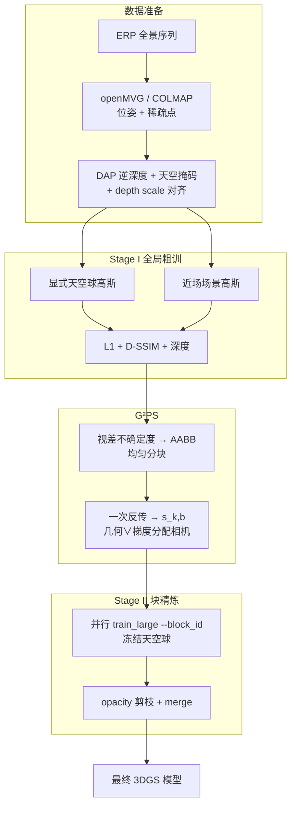
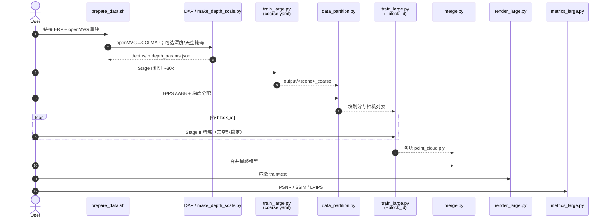

# PanoLOG / G²PS：全景户外大规模 3DGS 划分重建

**PanoLOG**（*Geometry and Gradient-based Partitioning for Panoramic Outdoor Reconstruction*，[arXiv:2607.08769](https://arxiv.org/abs/2607.08769)，[项目页](https://insta360-research-team.github.io/GGPS-Website/)）由 **影石研究（Insta360 Research）** 联合 **中山大学、华南理工大学、中国科学院大学、哈尔滨工程大学、武汉大学** 提出：在 **等距圆柱全景（ERP）** 输入下做可扩展户外 **3D Gaussian Splatting**。核心是 **G²PS（Geometry and Gradient-based Partitioning Strategy）**——用视差不确定度构造有界重建体，再用渲染梯度给相机–块分配，避免 360° **全可见性** 把「分块训练」打回全局优化。配套基准 **Pano360**；官方仓名 **GGPS**。

## 一句话定义

**两阶段粗到细全景 3DGS：Stage I 用天空球与全景深度稳住几何，Stage II 用 G²PS（视差 AABB + 梯度重要性）做真正可并行的块精炼并合并。**

## 英文缩写速查

| 缩写 | 英文全称 | 简要说明 |
|------|----------|----------|
| PanoLOG | Panoramic Large Outdoor Gaussian（框架通称） | 本文粗到细全景 3DGS 总框架 |
| G²PS / G2PS / GGPS | Geometry and Gradient-based Partitioning Strategy | 几何+梯度划分；仓库/项目简称 |
| 3DGS | 3D Gaussian Splatting | 显式高斯原语 + 可微光栅 |
| ERP | Equirectangular Projection | 360° 等距圆柱全景投影 |
| AABB | Axis-Aligned Bounding Box | G²PS 收缩后的有效重建体积 |
| DAP | Depth Any Panoramas | 原生支持 ERP 的单目深度估计器 |
| PSNR | Peak Signal-to-Noise Ratio | 新视图合成主指标之一 |
| FoV | Field of View | 全景相对窄 FoV 显著降低采集量 |

## 核心信息

| 字段 | 内容 |
|------|------|
| **机构** | 影石研究（Insta360 Research）；中山大学（SYSU）；华南理工大学（SCUT）；中国科学院大学（UCAS）；哈尔滨工程大学（HEU）；武汉大学（WHU） |
| **arXiv** | [2607.08769](https://arxiv.org/abs/2607.08769) |
| **输入** | ERP 全景（3840×1920）；openMVG/COLMAP 位姿与稀疏点 |
| **方法栈** | ERP 光栅化 3DGS + 显式天空球 + DAP 深度；G²PS 划分后块并行 |
| **基准** | **Pano360**（NSC/NSK 无人机，BAX/NSN 手持）+ Ricoh360 / 360Roam |
| **开源（截至 2026-07-26）** | **已开源（训练代码）**：[GitHub](https://github.com/Insta360-Research-Team/GGPS)；**数据集部分开源**：[HF](https://huggingface.co/Insta360-Research/GGPS) 含 FTP/NSC/NSK；预训练 `.ply` 与 UE 5.8 插件 **待发布**；许可 **CC BY-NC 4.0** |

## 为什么重要

- **全景采集 vs 针孔海量图：** 单帧 360° 大幅降低户外采集成本，但破坏了 CityGaussian / VastGaussian 等依赖 **局部 frustum** 的分治前提。
- **真正的块并行：** G²PS 用几何边界 + 梯度贡献选相机，使块训练聚焦关键观测区，而不是「名义分块、实质全局」。
- **机器人 / 仿真资产语境：** 高质量户外全景 3DGS 可服务 [GS-Playground](./gs-playground.md) 类光真实感仿真、Web/引擎浏览（[Spark](./spark-3dgs-renderer.md)、预告中的 UE 插件），以及下游 novel-view / 数字孪生；位姿侧可与 [Glob3R](./paper-glob3r.md) 等离线 SfM 衔接。
- **同机构全景双线：** [PanoWorld](./paper-panoworld-real-world-panoramic-generation.md) 做 **可控全景视频生成**；本页做 **可扩展全景重建**——生成 vs 重建互补。

## 流程总览

## 核心原理

### 1. 全景基表示

- **ERP 光栅：** 3D 点经球面角映射到像素；2D 协方差用 ERP Jacobian，而非针孔投影矩阵。
- **天空球：** 无 SfM 几何的天空若用近场高斯硬拟合，易漂成 floaters；专用远球高斯 + 粗训锁位置、精炼全冻结。
- **深度锚定：** ERP 极区拉伸使 SfM 稀疏不可靠；DAP 径向逆深度 + 衰减权重在早期提供几何，后期让光度主导。

### 2. G²PS：几何划分

相机质心与轨迹半径给出基础盒；代表基线 $\hat{b}$（最近邻距离中位数）与三角化因子 $\rho_{\mathrm{tri}}$ 给出 margin，把无界户外收成可均匀分块的 AABB，再把盒外高斯收缩进有界域（继承 CityGaussian 思路）。

### 3. G²PS：梯度相机–块分配

全可见性下「相机在块内」不够：远处块仍可能被同视角看见。用粗模型上各视角损失对块内高斯位置的平均梯度范数 $s_{k,b}$，当几何隶属或 $s_{k,b}/\max_{b'}s_{k,b'}>\tau_{\mathrm{grad}}$（默认 **0.8**）时分配该相机。消融显示去掉 G²PS 约 **−0.51 dB**。

### 4. 块优化与无缝合并

各块从完整粗模型初始化；周期性 opacity reset 后仅本块观测充分的高斯恢复；半开区间保证原语不重复；邻块共享相机 → 边界外观一致，无需显式缝合。

## 源码运行时序图

官方仓可运行入口对齐 [`sources/repos/ggps.md`](../../sources/repos/ggps.md)：`scripts_new/prepare_data.sh` → `scripts_new/train.sh`（或逐步调用下列脚本）。

关键复现路径：自建或 HF 下载场景 → `prepare_data.sh`（开深度则勿跳过 `make_depth_scale.py`）→ 配好 `config_360/<scene>.yaml` 与 `<scene>_c4.yaml` → `SCENE_NAME=... bash scripts_new/train.sh`。

## 工程实践

| 项 | 建议 |
|----|------|
| **选型** | 需要 **ERP 户外大场景可训练 3DGS** → PanoLOG；需要 **离线高精度位姿** → 先看 [Glob3R](./paper-glob3r.md) / COLMAP；需要 **全景视频生成** → [PanoWorld](./paper-panoworld-real-world-panoramic-generation.md) |
| **数据** | HF：`FTP` / `NSC` / `NSK`；论文另有 BAX/NSN，入库日 HF **未见** 对应 zip |
| **深度链** | `use_depth: True` 时必须先做 depth-scale；纯 RGB 可用 `SKIP_DAP=1` |
| **硬件** | 参考环境含 RTX 5090（sm_120）需 CUDA 12.8 + torch≥2.7 cu128；论文实验为 4090 24 GB |
| **许可** | **CC BY-NC 4.0** — 商业产品勿直接嵌入 |
| **开源跟进** | 盯 HF `ply/` 与仓 Roadmap 的 UE 插件勾选 |
| **重定向就绪度** | 重建产物是**几何+外观**的 3DGS 资产，**可部署**进 [GS-Playground](./gs-playground.md) / [Spark](./spark-3dgs-renderer.md) / 预告中的 UE 5.8 插件做光真实感渲染；但入库日官方合并 `.ply` **待发布**，做机器人仿真**训练输入**前须自行补碰撞体/物理属性（重建不含物理可行性），属「可训、待资产」适配阶段 |
| **源码运行时序图** | 见上节（训练管线已可跑） |

## 实验与评测

| 设定 | 论文报告要点 |
|------|----------------|
| **NSC（A1）** | PSNR **28.18** / SSIM 0.859 / LPIPS 0.244；Size **463 MB**（H3DGS ~1002 MB） |
| **NSK（A1）** | SSIM / LPIPS 最优档；PSNR 24.64（CityGaussian 24.83 略高） |
| **BAX / NSN（X5）** | 相对最强基线约 **+0.64 / +1.16 dB**；相对 H3DGS 体积约 **2.9–7.5×** 更小 |
| **Ricoh360 / 360Roam** | 全面优于 OmniGS / ODGS / SpaGS / cubemap 3DGS |
| **消融** | w/o G2PS、天空球、深度均伤质量；$\tau_{\mathrm{grad}}=0.8$ 质量–体积折中最好 |

## 结论

**PanoLOG 证明：全景户外 3DGS 的可扩展性瓶颈在「全可见性下的划分」，而不只是更强的光栅公式；G²PS 把分块从名义回到可并行。**

1. **先稳住粗几何再划分** — 天空球 + DAP 深度是梯度分配可信的前提。
2. **相机归属看贡献，不只看位置** — $\tau_{\mathrm{grad}}\approx0.8$ 是默认工程甜点。
3. **体积可与质量同赢** — 多场景相对 H3DGS 更小模型、更高或持平 PSNR。
4. **复现优先走官方六阶段脚本** — 深度对齐遗漏会直接毁掉监督尺度。
5. **许可与权重缺口** — NC 许可 + `.ply`/UE 未齐时，产品排期按「可训、待资产」管理。
6. **与生成线分工** — 同机构 PanoWorld 管生成；本页管重建资产。

## 与其他工作对比

| 对照 | 差异 |
|------|------|
| CityGaussian / H3DGS / DOGS | 针孔 frustum / 分层分治；全景下易退化；本文专为 ERP 设计分配 |
| OmniGS / ODGS / SpaGS | 全景光栅/局部流形强，但难扩到无界户外大场景管理 |
| [Glob3R](./paper-glob3r.md) | 偏 **位姿/SfM 精炼**；PanoLOG 偏 **给定位姿下的可微重建与渲染** |
| [PanoWorld](./paper-panoworld-real-world-panoramic-generation.md) | **生成式** 全景世界模型；本页 **重建式** 3DGS 资产 |
| [GS-Playground](./gs-playground.md) | 仿真内批量 3DGS 渲染训练；可消费本类户外重建资产 |

## 局限与风险

- **依赖 SfM / openMVG 质量：** 位姿与稀疏点差时，AABB 与深度对齐都会漂。
- **DAP 与外部依赖：** 深度链需另装 DAP 权重；跳过则失去极区/远景几何锚定。
- **数据集完整度：** HF 当前三景；论文四景中 BAX/NSN 复现需自采或等待后续上传。
- **权重与引擎插件未齐：** 入库日无可直接下载的官方合并 `.ply`；UE 插件仍为预告。
- **许可：** CC BY-NC 4.0 限制商业再分发与嵌入。
- **非在线 SLAM：** 面向离线批处理重建，不替代 [导航·SLAM 栈](../overview/navigation-slam-autonomy-stack.md) 的实时定位。

## 关联页面

- [PanoWorld](./paper-panoworld-real-world-panoramic-generation.md) — 同机构可控全景生成
- [Glob3R](./paper-glob3r.md) — 离线全局 SfM / 高精度几何上游
- [GS-Playground](./gs-playground.md) — 3DGS×仿真视觉学习
- [Spark](./spark-3dgs-renderer.md) — Web 端大规模 3DGS 浏览
- [Unreal Engine 5](./unreal-engine-5.md) — 官方预告 3DGS 插件目标引擎
- [导航·SLAM 开源栈总览](../overview/navigation-slam-autonomy-stack.md) — 建图/定位工程栈对照
- [状态估计知识链](../overview/hub-state-estimation.md) — 几何估计在感知链中的位置

## 参考来源

- [PanoLOG / G²PS 论文摘录](../../sources/papers/ggps_panolog_arxiv_2607_08769.md)
- [项目页归档](../../sources/sites/insta360-research-team-ggps-website.md)
- [官方仓归档](../../sources/repos/ggps.md)
- Chen et al., *Geometry and Gradient-based Partitioning for Panoramic Outdoor Reconstruction* — <https://arxiv.org/abs/2607.08769>
- 项目页：<https://insta360-research-team.github.io/GGPS-Website/>
- 代码：<https://github.com/Insta360-Research-Team/GGPS>
- 数据 / 权重：<https://huggingface.co/Insta360-Research/GGPS>

## 推荐继续阅读

- 项目页演示与定量表：<https://insta360-research-team.github.io/GGPS-Website/>
- CityGaussian（分治底座）：<https://github.com/Linketic/CityGaussian>
- OmniGS（ERP 光栅参考）：<https://github.com/liquorleaf/OmniGS>
- DAP（全景深度）：Lin et al., *Depth Any Panoramas*, CVPR 2026 线
