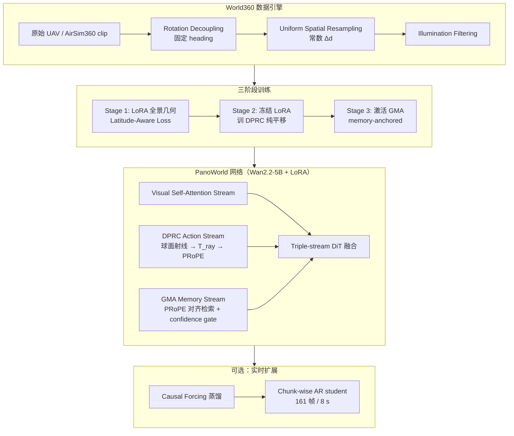

# PanoWorld：真实世界全景可控生成

**PanoWorld**（*Real-World Panoramic Generation*，[arXiv:2607.09661](https://arxiv.org/abs/2607.09661)，2026-07-10，**Insta360 Research** 等，[项目页](https://lihaoy-ux.github.io/panoworld-page/)）提出 **扩散式全景世界模型**：利用 **等距圆柱投影（ERP）旋转等变**，把 **旋转当作精确几何变换**、**仅显式建模平移**，以 **Dense Panoramic Ray-Conditioning（DPRC）** 与 **Geometry-aware Memory Augmentation（GMA）** 同时解决 **轨迹可控动作建模** 与 **长程 spatiotemporal 记忆**；并发布 **World360**（**120k** clip：7 万真实 UAV + 5 万 AirSim360 仿真）支撑 **大规模户外物理变化** 下的评测。

## 一句话定义

**在 Wan2.2-5B 上经三阶段 LoRA 训练：固定 heading 下用 DPRC 把平移编码为 per-ray SE(3) 射线场，GMA 在同一 PRoPE 流形检索历史特征并 confidence 门控融合，实现高保真、轨迹对齐的 360° 视频世界合成。**

## 英文缩写速查

| 缩写 | 英文全称 | 简要说明 |
|------|----------|----------|
| ERP | Equirectangular Projection | 等距圆柱全景表示；本工作利用其旋转等变性 |
| DPRC | Dense Panoramic Ray-Conditioning | 密集全景射线条件；平移动作建模核心 |
| GMA | Geometry-aware Memory Augmentation | 几何感知记忆增强；长程一致性检索 |
| PRoPE | Projective Positional Embeddings | 射线几何位置编码，注入 DiT |
| FoV | Field of View | 360° 全视场；每帧覆盖完整环视 |
| UAV | Unmanned Aerial Vehicle | 真实 World360 数据来源之一 |
| DMD | Distribution Matching Distillation | Causal Forcing 实时蒸馏所用非对称分布匹配 |
| FID | Fréchet Inception Distance | 分布保真；含 pole/equator 分区 FID |

## 为什么重要

- **全景 WM 的专属几何：** 多数记忆增强视频生成（3D 点、KV cache、显式重建）继承 **透视相机假设**，在 ERP **极区畸变与旋转视点** 下检索错位；PanoWorld 把 **rotation-equivariance** 写进建模假设，而非后处理补丁。
- **轨迹可控 + 长程一致：** 相对 **Matrix-3D**（显式 3D 重建 + inpainting，高延迟、高度变化易 void）与 **OmniRoam**（固定高度训练、竖向指令 ghosting），PanoWorld 在 **multi-altitude 户外** PSNR 与 FID 上 **全面领先**（480p $\mathrm{PSNR}_{75\text{-}80}$ **20.92 vs 18.02/17.02**）。
- **World360 填补 benchmark 空白：** 相对 360-1M / PanoWan 等 **平面街景**，World360 强调 **多高度 aerial 3D 轨迹 + 真实光照变化 + 仿真 pose/depth**，更适合评 **物理一致性与大尺度空间变化**。
- **机器人/UAV 语境：** 论文明确面向 **自动驾驶与 UAV** 等需 **环视一致预测** 的应用；与 [Generative World Models](../methods/generative-world-models.md) 中 **像素 rollout** 路线互补，但 **输入/输出为 360° ERP** 而非窄 FOV pinhole。
- **工程可部署路径：** **Causal Forcing** 蒸馏 + Rolling Forcing 推理，161 帧 **8 s**（单 H20），为 **交互式全景探索**（键盘控制 demo）提供数量级加速。

## 流程总览

## 核心机制（归纳）

### 1）Motion Decoupling（旋转解耦）

- 原始航拍含 **剧烈 yaw/风致抖动**；数据管线将相对旋转因子剔除并重投影到 **统一 heading**。
- 训练时令 $\mathbf{R}_t=\mathbf{I}$，**平移 $\mathbf{c}_t$** 成为视觉变化的唯一驱动 → 模型专注 **depth-dependent parallax**。
- LoRA 微调 backbone 以学习 **极区畸变与水平 wrap-around**，保留 Wan 预训练生成质量。

### 2）DPRC：dense 射线条件

| 步骤 | 内容 |
|------|------|
| 球面反投影 | 像素 $(i,j)$ → 纬度 $\theta$、经度 $\phi$ → 单位射线 $\mathbf{r}_{cam}\in\mathbb{S}^2$ |
| 局部基 | $\mathbf{z}_{loc}=\mathbf{r}_{cam}$，构造 $\mathbf{R}_{loc}=[\mathbf{a}_x,\mathbf{a}_y,\mathbf{z}_{loc}]$ |
| SE(3) 锚定 | $\mathbf{T}_{ray}$ 将 **全局平移** 投影到 **per-ray 局部坐标** |
| 注入 | PRoPE 编码 $\hat{\mathbf{r}}_t$ 注入 DiT **Action Stream** |

相对 **CameraCtrl / 光流条件**，DPRC 在 **ERP 拓扑** 上建模 **light-field 强度演化**，减轻极区/赤道非均匀畸变。

### 3）GMA：几何感知记忆

- Query latent 与 memory bank $\{\mathbf{x}_m\}$ 经 **同一 PRoPE 空间** 编码为 $[\mathbf{K}_{mem},\mathbf{V}_{mem}]$。
- 注意力按 **3D 射线对应** 检索，而非 image-space warp（透视假设下易错）。
- **Confidence gating：** 高几何重叠区加大 memory 权重；未观测区抑制 hallucination。
- 消融：**w/o GMA** 空间 sliding/blur；**Random Memory** 几何破碎；完整 GMA **+1.07 PSNR**（Table 4）。

### 4）World360 vs prior 全景数据

| 数据集 | 规模 | 运动空间 | Pose | Depth | 特点 |
|--------|------|----------|------|-------|------|
| 360-1M | 1076k | 平面街景 | ✓ | ✗ | 大规模但高度模糊 |
| PanoWan | 13k | 平面 | ✗ | ✗ | 沉浸式子集 |
| Matrix-Pano | 116k | 3D（仿真） | ✓ | ✓ | 仿真 3D 空间 |
| **World360** | **120k** | **multi-altitude aerial** | ✓ | w/ Syn. | **真实+仿真统一 curation** |

真实 **Scene-Reality**：124 条长视频、GPS-INS **6-DoF**、>600 万帧（公园/道路/湖泊/建筑群）。仿真 **Trajectory-Precise**：AirSim360 提供 **完美 GT 轨迹** 训练动作条件。

## 实验要点

- **骨干：** Wan2.2-5B + LoRA；评测 **480p / 720p**，81 帧协议。
- **基线：** Imagine360、Matrix-3D、OmniRoam；统一 **de-rotated GT 轨迹** 条件（CamPVG / OmniRoam 协议）。
- **视觉质量（480p）：** FID **27.64**，$\mathrm{FID}_{\mathrm{pole}}$ **47.21**，$\mathrm{QA}_{\mathrm{qual.}}$ **4.0202** — 全面优于 Matrix-3D / OmniRoam。
- **轨迹控制：** PSNR 全窗口领先；**ViPE** 从生成视频重建 pose，与 GT 对齐最紧。
- **实时：** Causal Forcing 蒸馏后 **~8 s / 161 帧** vs 完整模型 **~4 min 48 s**。

## 局限与风险

- **模态与平台：** 数据以 **UAV 环视航拍** 为主，**地面人形 egocentric / 操纵手眼** 覆盖有限；与 [HumanoidPano](./paper-notebook-humanoidpano-hybrid-spherical-panoramic-lidar-cr.md) 等 **机器人环视感知** 需额外 domain 适配。
- **物理可执行性：** 高 PSNR/FID **不保证** 可用于 closed-loop 控制或 Sim2Real；部署前仍需 [Video-as-Simulation](../concepts/video-as-simulation.md) 类 **交互/接触** 校验。
- **显式 3D：** 不做 Matrix-3D 式全局 mesh/GS 重建，**持久 editable 3D 资产** 非目标；偏 **视频级 world rollout**。
- **开源状态：** 论文承诺公开模型/代码/World360；以项目页与仓库实际上线为准。

## 关联页面与对比

- [Generative World Models](../methods/generative-world-models.md) — 生成式 WM 总览；PanoWorld 为 **轨迹可控全景** 实例
- [Video-as-Simulation](../concepts/video-as-simulation.md) — 视频 rollout 作仿真代理的适用边界
- [InfiniteDiffusion / Terrain Diffusion](./paper-infinite-diffusion-terrain-diffusion.md) — 另一 **360°/无限场景** 生成相邻方向（静态地形 vs 动态全景视频）
- [GigaWorld-1](./paper-gigaworld-1-policy-evaluation.md) — 同为 **分层记忆 + 显式 control** 的视频 WM 对照
- [WEM（World-Ego Modeling）](./paper-wem-world-ego-modeling.md) — world/ego 长程分解的另一记忆范式

## 推荐继续阅读

- [PanoWorld 项目页](https://lihaoy-ux.github.io/panoworld-page/)
- [AirSim360 全景仿真平台（arXiv:2512.02009）](https://arxiv.org/abs/2512.02009)
- [Matrix-3D 全向可探索 3D 世界（arXiv:2508.08086）](https://arxiv.org/abs/2508.08086)
- [OmniRoam 长程全景漫游（arXiv:2603.30045）](https://arxiv.org/abs/2603.30045)

## 参考来源

- [PanoWorld 论文归档（arXiv:2607.09661）](../../sources/papers/panoworld_arxiv_2607_09661.md)
- [PanoWorld 项目页](https://lihaoy-ux.github.io/panoworld-page/)
