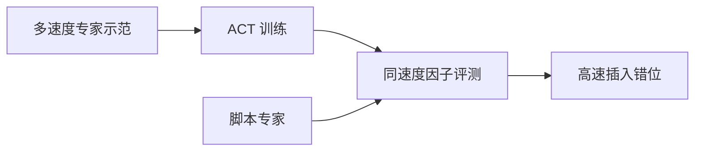
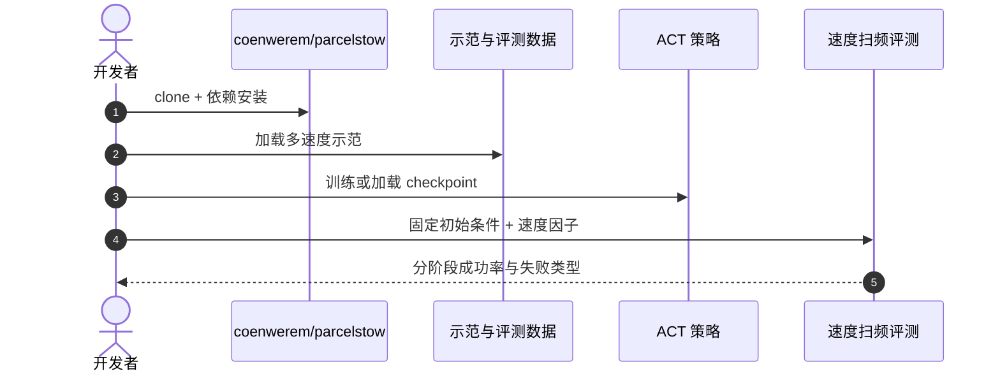

# ParcelStow：模仿学习是否保留时间鲁棒性？

**ParcelStow**（*Does Imitation Learning Preserve Temporal Robustness in Dexterous Manipulation?*，[arXiv:2609.01453](https://arxiv.org/abs/2609.01453)，[代码](https://github.com/coenwerem/parcelstow)）由 **马里兰大学（University of Maryland）** 提出：在接触丰富的 **ParcelStow** 任务（获取、重定向、插入包裹）上，系统比较 **脚本专家** 与 **ACT** 学习者在不同任务执行速度下的表现。

## 一句话定义

**标称成功率相同，不代表模仿策略继承了专家跨执行速度的时间鲁棒性。**

## 英文缩写速查

| 缩写 | 英文全称 | 简要说明 |
|------|----------|----------|
| ACT | Action Chunking with Transformers | 本文使用的模仿学习基线 |
| IL | Imitation Learning | 模仿学习 |
| BC | Behavior Cloning | 行为克隆（ACT 的训练范式） |
| DR | Domain Randomization | 域随机化（本文未作为主消融轴） |

## 为什么重要

- 纳入 [2026-09-02 七篇盘点](../../sources/blogs/wechat_embodied_station_7_papers_contact_manipulation_2026-09-02.md) 的「评测维度」支线。
- 现有 IL 鲁棒性评测多关注场景/物体/指令变化，**执行速度** 维度常被忽略。
- 对部署侧：产线节拍变化可能直接击穿「实验室 100%」策略。
- **已开源** 代码、数据与评测脚本。

## 核心信息

| 项 | 内容 |
|----|------|
| **机构** | 马里兰大学（University of Maryland） |
| **任务** | ParcelStow：获取 → 重定向 → 插入 |
| **对比** | 脚本专家 vs ACT（两种初始化） |
| **开源** | **已开源** [coenwerem/parcelstow](https://github.com/coenwerem/parcelstow) |

### 流程总览

## 评测

| 速度设置 | 专家成功率 | ACT 成功率 |
|----------|-----------|-----------|
| 标称速度 | 100% | 100% |
| 示范范围最高速度 | 84% | 53% |

- 最高速度下 ACT 47 次失败中 **35 次为插入错位**。
- 无 force closure 的 414 次获取 **无一** 完成任务。

## 结论

**模仿学习评测必须包含时间维度，否则会高估真实部署稳定性。**

- 标称 100% 可掩盖高速段 30+ pt 成功率落差
- 插入阶段是 ACT 时间敏感的主要瓶颈
- 两个不同初始化的 ACT 均出现类似退化
- 专家在示范速度范围内仍保留更高时间鲁棒性
- 开源评测管线可直接复现专家—学习器对照
- 部署前应在目标节拍范围做速度扫频评测

## 源码运行时序图

## 局限与风险

- **任务单一：** 结论来自 ParcelStow，泛化到其他接触丰富任务需验证。
- **专家类型：** 脚本专家非人类示范，与真实遥操作数据分布可能不同。
- **ACT 版本：** 其他 IL 架构（扩散策略、VLA 等）时间鲁棒性未覆盖。

## 与其他工作对比（索引级）

| 维度 | 本文的速度扫频评测 | 常见 IL 鲁棒性评测 | 脚本专家（本文对照组） |
|------|------------------|-----------------|--------------------|
| 扰动轴 | **执行速度（时间维度）** | 场景 / 物体 / 指令 / 光照 | — |
| 暴露的问题 | 标称 100% 掩盖高速段 30+ pt 落差 | 视觉与语义分布外 | — |
| 高速段表现 | [ACT](../methods/action-chunking.md) **53%** | 通常不测 | **84%** |
| 主要失败模式 | **插入错位**（47 失败中 35 次） | 抓取/识别失败 | — |
| 结论方向 | 时间鲁棒性**没有**随行为克隆一起继承 | — | 在示范速度范围内更稳 |

- **本文不是在否定 [ACT](../methods/action-chunking.md)**：标称速度下两者都是 100%，差距只在示范速度范围的高端；把它读成「ACT 不行」会丢掉真正的结论——**评测协议缺了时间轴**。
- **不可外推的部分**：只测了一个任务与一种 IL 架构，扩散策略 / VLA 的时间鲁棒性未覆盖（见「局限与风险」），也不能反推 [Facet-0](./paper-facet-0.md) 这类含力后果建模的方法会有同样退化。
- **对部署的直接含义**：产线节拍是会变的，验收应在目标节拍范围做速度扫频，而不是只报标称速度成功率。

## 关联页面

- [Imitation Learning](../methods/imitation-learning.md)
- [Manipulation](../tasks/manipulation.md)
- [Action Chunking](../methods/action-chunking.md) — 本文被测学习器 ACT 的机制页
- [接触丰富操作 7 篇地图](../overview/contact-rich-manipulation-7-papers-technology-map.md)
- [Facet-0](./paper-facet-0.md)

## 推荐继续阅读

- [arXiv:2609.01453](https://arxiv.org/abs/2609.01453)
- [coenwerem/parcelstow](https://github.com/coenwerem/parcelstow)

## 参考来源

- [parcelstow_arxiv_2609_01453](../../sources/papers/parcelstow_arxiv_2609_01453.md)
- [具身智能小站 2026-09-02 七篇盘点](../../sources/blogs/wechat_embodied_station_7_papers_contact_manipulation_2026-09-02.md)
- [coenwerem/parcelstow](../../sources/repos/coenwerem-parcelstow.md)
