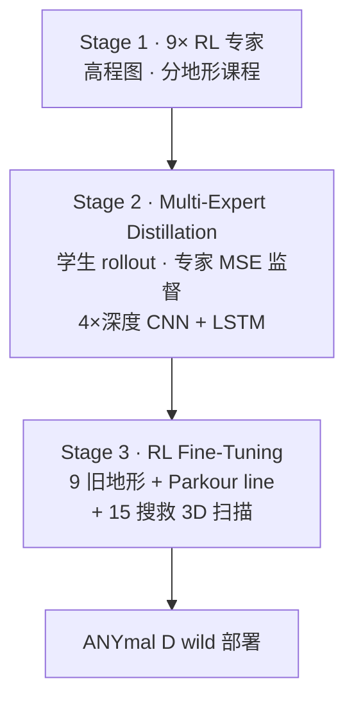

# Parkour in the Wild（PITW）

**Parkour in the Wild**（*Learning a General and Extensible Agile Locomotion Policy Using Multi-Expert Distillation and RL Fine-tuning*，Nikita Rudin、Junzhe He、Joshua Aurand、Marco Hutter；ETH Zurich RSL × NVIDIA Switzerland；arXiv:[2505.11164](https://arxiv.org/abs/2505.11164)，IJRR [DOI:10.1177/02783649261455067](https://doi.org/10.1177/02783649261455067)）提出 **显式命名 multi-expert distillation** 的三阶段足式管线，并在 **ANYmal D** 上完成 **室内外 + 搜救训练场 unseen rubble** 的 wild 部署。

## 一句话定义

**先分地形训满 9 个 RL 专家，再用 DAgger 把专家动作蒸馏进四深度 LSTM 单策略，最后用 RL 在含真实 3D 扫描的更广地形上微调，得到可增量扩展的 legged foundation policy。**

## 英文缩写速查

| 缩写 | 英文全称 | 简要说明 |
|------|----------|----------|
| PITW | Parkour in the Wild | 本文系统简称 |
| MED | Multi-Expert Distillation | 多专家蒸馏；本文标题核心方法 |
| DAgger | Dataset Aggregation | 蒸馏阶段在线聚合专家标注 |
| RLFT | RL Fine-Tuning | 蒸馏后无专家监督的 PPO 微调 |
| RSL | Robotic Systems Lab | ETH Zurich 机器人系统实验室 |
| ANYmal D | — | 部署平台（四足，四 RealSense D435i） |
| LSTM | Long Short-Term Memory | 学生策略记忆模块，补部分可观测 |

## 为什么重要

- **方法命名锚点：** 文献中 **「multi-expert distillation」** 作为标题级贡献的 flagship（相对仅正文提及的 Robot Parkour / LightLP）。
- **三阶段可扩展：** 展示 **重复 fine-tune** 加新地形（如 Down-on-stones 54.4%→92.4%）而 **不明显遗忘** 旧技能。
- **wild 证据链：** 不仅仿真 Table 4，还有 **搜救 rubble 真机**、光照/泥泞/foot trap 等 **感知与接触扰动**。
- **与分层 ANYmal Parkour 对话：** 正面论证 **单策略蒸馏 + RLFT** 相对 **分层选技能** 的可扩展性与部署简洁性。

## 核心信息

| 字段 | 内容 |
|------|------|
| **机构** | ETH Zurich（Robotic Systems Lab）；Nikita Rudin @ NVIDIA Switzerland |
| **平台** | ANYmal D；4× RealSense D435i 深度 |
| **专家感知** | 基座周围 **elevation map** |
| **学生感知** | **4 路深度**（48×32 处理后）+ 本体 + 位置/朝向/剩余时间指令 |
| **专家数** | **9**（walk, climb, climb down, jump, tables, rock pile, low wall, beams, stepping stones） |
| **开源** | **确认未开源**（无官方训练/部署仓库；2026-09-22 核查） |
| **邻近开源** | [Robot Parkour Learning](https://github.com/ZiwenZhuang/parkour)（同系 CoRL 2023 蒸馏先例，非本文实现） |

## 核心原理

### 三阶段管线

### 蒸馏要点（§2.2）

- 并行 sim：每 robot 绑定 terrain $i$ 与 $\pi_{\text{expert},i}$；学生执行 $a_{\text{student}}$，数据集收集 $(o_{\text{student}}, a_{\text{expert}})$。
- 损失：$\sum \|\pi_{\text{student}}(o_{\text{student}})-a_{\text{expert}}\|^2$；rollout 对动作加 **高斯噪声**。
- 学生需隐式学 **地形识别** 与 **专家动作匹配**。

### RLFT 稳定技巧

- 蒸馏期动作噪声 → foundation 对 RL 探索噪声鲁棒。
- **冻 actor 预训 critic** 再联合 PPO；保守超参。

## 实验与评测

**Table 4 节选（成功率 %）：**

| 地形 | 蒸馏 $\pi_D$ | RLFT $\pi_{RL}$ |
|------|-------------|-----------------|
| Walk | 99.3 | **100.0** |
| Stepping stones | 73.0 | **98.8** |
| Parkour line（仅 FT 加入） | 5.8 | **98.5** |
| Scanned meshes (test, 未见) | 14.9 | **94.9** |
| Gap - climb（未见） | 10.2 | **82.0** |

**对比：** 论文亦比较 **分层** 与 **VAE 技能编码**；在 **无专家新地形** 上二者易失败，蒸馏+RLFT 组合最佳。

## 工程实践

| 检查项 | 建议 |
|--------|------|
| 专家训练 | 单地形 RL + 专用课程（低墙 expert 可 init 自 climb） |
| 深度 sim2real | 边缘 shuffle、Perlin 孔洞、blind spot、clip 2 m |
| 蒸馏数据 | 混合地形并行 + 动作噪声 |
| RLFT | critic warm-up；扩展 **3D 扫描 mesh** 作真实几何增广 |
| 增量扩展 | 新地形加入 FT 集 **重复 fine-tune**（$\pi_{RL^*}$ 范例） |

## 源码运行时序图

**不适用** — 截至 2026-09-22 核查，**无官方可运行训练/部署仓库**（见 [`sources/papers/parkour_in_the_wild_arxiv_2505_11164.md`](../../sources/papers/parkour_in_the_wild_arxiv_2505_11164.md) 步骤 2.5）。

## 结论

**Parkour in the Wild 把「multi-expert distillation」做成可扩展的 legged foundation 配方：蒸馏 alone 不够，但蒸馏 + RLFT + 3D 扫描增广 能在 ANYmal D 上同时保住分地形性能并泛化到 wild unseen 结构。**

- **蒸馏是 foundation，不是终点：** Table 4 显示 Parkour line、扫描 mesh 等 **几乎靠 RLFT 救回**。
- **9 专家是可维护上限的一种答案：** 再增技能靠 **新 expert + 再蒸馏/FT**，而非 end-to-end 重训。
- **四深度 + LSTM 是为 partial observability 设计：** 相对 height map 专家，学生必须 **记忆补全视场外结构**。
- **与 Robot Parkour 同范式、不同规模：** CoRL 2023 五技能开源先例；PITW 推到 **9 地形 + wild 3D 扫描 + IJRR 系统实验**。
- **开源缺失限制复现：** 工程价值目前在 **配方与 ablation 读法**，非即插权重。
- **后人形/ WBC 借 RLFT 流程：** [Athena-WBC](./paper-athena-wbc-humanoid-longtail.md) 等引用其 **critic warm-up + 渐解冻 actor** 微调套路。

## 局限与风险

- **专家调参成本：** 每地形独立课程/奖励，扩展技能 **工程量大**。
- **纯蒸馏多模态折中：** 单地形仍可能低于 expert（踏石 73% vs 98.8% expert）。
- **无公开代码/权重：** 复现需自研 sim、深度退化与 ANYmal 栈。
- **四足专用：** 与人形 **全身接触 / transition**（LightLP）问题设定不同，迁移需重做专家与转移数据。

## 与其他工作对比

| 维度 | PITW | [Robot Parkour](./paper-robot-parkour-learning.md) | [ANYmal Parkour 分层](https://doi.org/10.1126/scirobotics.adi7566) | [LightLP](./paper-light-loco-parkour.md) |
|------|------|---------------------|----------------------------------------------------------------------|------------------------------------------|
| 合成方式 | MED + RLFT | 5 专家 DAgger | 高层 **选** 低层 expert | MED + transition RL + 深度 |
| 载体 | ANYmal D | A1/Go1 | ANYmal | Lightbot 0 人形 |
| 感知迁移 | 高程图→4 深度 | 特权→深度 | height scan 分层 | height-scan→GRU 深度 |
| 扩展性 | 重复 RLFT | 固定 5 技能 | 离散技能库 | Real2Sim2Real 种子扩张 |
| 开源 | 未开源 | **已开源** | 部分 Zenodo 数据 | 未开源 |

## 关联页面

- [Multi-Expert Distillation 方法页](../methods/multi-expert-distillation.md)
- [DAgger](../methods/dagger.md)
- [Robot Parkour Learning](./paper-robot-parkour-learning.md)
- [Light-Loco-Parkour](./paper-light-loco-parkour.md)
- [RPL](./paper-rpl-robust-humanoid-perceptive-locomotion.md)
- [Athena-WBC](./paper-athena-wbc-humanoid-longtail.md)
- [深度感知 locomotion 路线](../../roadmap/depth-perceptive-locomotion.md)

## 参考来源

- [parkour_in_the_wild_arxiv_2505_11164.md](../../sources/papers/parkour_in_the_wild_arxiv_2505_11164.md)
- [multi_expert_distillation_locomotion.md](../../sources/papers/multi_expert_distillation_locomotion.md)

## 推荐继续阅读

- [arXiv:2505.11164 HTML](https://arxiv.org/html/2505.11164v1) — Algorithm 1 与 Table 4
- [IJRR DOI](https://doi.org/10.1177/02783649261455067) — 正式版
- [Robot Parkour Learning（CoRL 2023）](https://arxiv.org/abs/2309.05665) — 同作者系蒸馏先例
- [ANYmal Parkour（SciRob 2023）](https://doi.org/10.1126/scirobotics.adi7566) — 分层对照与 Discussion
