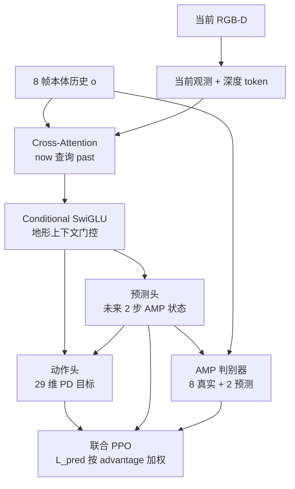

# ParkourFormer（预测监督 + 序列建模人形跑酷）

**ParkourFormer**（*Integrating Predictive Supervision and Sequence Modeling into Parkour Locomotion*，[arXiv:2605.25782](https://arxiv.org/abs/2605.25782)；[项目页](https://mronaldo-gif.github.io/parkourformer.github.io/)）由 **香港科技大学广州校区（HKUST-GZ）**、**CLAI-LAB / CL-TECH**、**华南农业大学（SCAU）**、**广东工业大学（GDUT）** 提出：把人形跑酷从「观测→动作」的 reactive RL 改写成 **future-conditioned Seq2Seq**——当前状态查询历史，预测头监督未来两步本体，再把预测未来喂给动作头与 AMP 判别器。在 **Unitree G1（29 DoF）** 上用**单一策略**覆盖九类地形，仿真平均穿越成功率 **93.85%**。

## 一句话定义

**用「现在查过去、监督未来两步」把 PPO 策略条件化到短时域本体预测上，而不是只靠更大的 MLP / MoE / Transformer 隐式记未来。**

## 英文缩写速查

| 缩写 | 英文全称 | 简要说明 |
|------|----------|----------|
| ParkourFormer | Parkour Transformer | 本文框架：query 历史 + 未来监督的跑酷策略 |
| PPO | Proximal Policy Optimization | 联合优化动作头与预测头的主算法 |
| AMP | Adversarial Motion Priors | 风格先验；预测未来拼进 10 帧判别序列 |
| RGB-D | Red-Green-Blue + Depth | 当前帧编码为 128 维地形 token |
| MoE | Mixture of Experts | 4-MLP 基线；本文用条件 SwiGLU 代替拆专家 |
| FFN | Feed-Forward Network | Conditional SwiGLU：地形上下文乘性门控 |
| Seq2Seq | Sequence-to-Sequence | 历史 token → 未来状态 + 当前动作 |
| G1 | Unitree G1 Humanoid | 29 DoF 评测平台 |
| MSE | Mean Squared Error | 未来两步 AMP 状态的监督损失 |

## 为什么重要

- **把 foresight 从隐状态里拎出来：** [Next Token Prediction](./paper-notebook-humanoid-locomotion-as-next-token-prediction.md) 用因果 Transformer 拟合下一 token；ParkourFormer 额外加 **显式未来头 + 监督**，让当前动作直接吃 \(\hat{\mathbf{s}}_{t+1:t+2}\)。
- **消融可操作：** 去 MSE 监督时下楼从 **95.42% → 9.50%**；去 RGB-D 时缺口从 **96.20% → 24.24%**。容量（vanilla Transformer 已 90.49%）不是主因。
- **单策略、不拆技能：** 相对 [PHP](./paper-hrl-stack-22-perceptive_humanoid_parkour.md) 的 motion matching 技能链、[LightLP](./paper-light-loco-parkour.md) 的种子扩张 + 转移组，本稿押 **短时域预测 + 条件 FFN**。
- **仿真栈可对照：** 训练走 [Hiking in the Wild](./paper-hiking-in-the-wild.md) 同族的 **Project Instinct MuJoCo**，便于和 Hiking 的 MoE + AMP 单阶段路线并读。

## 核心信息

| 项 | 内容 |
|----|------|
| **机构** | 香港科技大学广州校区（HKUST-GZ）；创联人工智能实验室（CLAI-LAB / CL-TECH）；华南农业大学（SCAU）；广东工业大学（GDUT） |
| **平台** | Unitree G1，29 DoF；真机 + 仿真 |
| **仿真** | Project Instinct MuJoCo；4096 并行；200 Hz 仿真 / 50 Hz 控制；≤30k iter；RTX 4090D |
| **输入（策略）** | 8 帧本体 \(o_t\in\mathbb{R}^{96}\) + 当前 RGB-D token \(\mathbf{z}_t\in\mathbb{R}^{128}\) |
| **AMP 状态** | \(s_t\in\mathbb{R}^{67}\)（含特权线速度 \(\mathbf{v}_l\)） |
| **动作** | \(\mathbf{a}_t\in\mathbb{R}^{29}\) 名义姿态 delta，底层 PD |
| **开源（截至 2026-08-16）** | **未开源**（仅项目页/视频/arXiv；无训练仓） |

## 核心原理（方法）

### 方法栈

| 模块 | 作用 |
|------|------|
| 位置编码历史 | 把 \(\{o_{t-7},\ldots,o_t\}\) 投成有序 token 记忆 |
| Cross-attention | 当前观测 ⊕ 深度 token 作 query，历史作 KV（「now → past」） |
| Conditional SwiGLU | RGB-D 地形上下文 \(c_t\) 乘性门控中间 FFN |
| 未来预测头 | 确定性预报 \(\hat{\mathbf{s}}_{t+1:t+2}\)；rollout MSE + 无效步 mask |
| 未来条件动作头 | \(\hat{\mathbf{a}}_t\sim\pi'(\mathbf{a}_t\mid\mathbf{Q}_t^{(L)},\hat{\mathbf{s}}_{t+1:t+2})\) |
| AMP 判别器 | 输入改为 \([\mathbf{s}_{t-7:t};\hat{\mathbf{s}}_{t+1:t+2}]\)，把预期运动钉在参考流形上 |
| 非对称 critic | 特权 \(\mathbf{v}_l\) 改善 value |
| 联合 PPO | \(\mathcal{L}_{\mathrm{ppo}}+c_1\mathcal{L}_V+c_2\mathcal{L}_{\mathrm{pred}}-c_3\mathcal{H}-c_4\mathcal{L}_{\mathrm{AMP}}\)；\(c_2\) 对负 advantage 加大 |

### 流程总览

预测损失（论文 Eq. 6）：

\[
\mathcal{L}_{\mathrm{pred}}=\frac{1}{|\mathcal{M}_{\mathrm{pred}}|}\sum_i\sum_{k=1}^{2}m_{i,k}\,\|\hat{s}_{i,k}-s_{i,k}\|_2^2
\]

动作在名义姿态附近输出 delta；总奖励 \(R_{\mathrm{task}}+R_{\mathrm{AMP}}\)。

## 源码运行时序图

**不适用**（截至 2026-08-16：项目页与作者 GitHub 仅有 [`parkourformer.github.io`](https://github.com/MRonaldo-gif/parkourformer.github.io) 站点仓，无训练/推理入口）。待代码发布后按 README 补 `sequenceDiagram`。

## 工程实践

| 项 | 建议 |
|----|------|
| 复现入口 | arXiv HTML/PDF + 项目页视频；**代码未发布** |
| 仿真对齐 | 先对齐 Project Instinct / [Hiking](./paper-hiking-in-the-wild.md) 的 MuJoCo 地形课，再谈 Transformer |
| 预测步长 | 论文钉死 **2 步**；更长视野未报，勿默认可外推 |
| 监督权重 | \(c_2\) 对失败/负 advantage 加大——下楼消融说明这不是装饰项 |
| AMP 拼接 | 判别器必须看到「历史+预测」连续序列，而不是只加 MSE |
| 感知 | 缺口/攀升依赖 RGB-D query；盲走或深度失效会整体掉功能 |
| 源码运行时序图 | **不适用**（未开源） |

## 实验与评测

九类程序地形 × L1–L9。主对照：1-MLP、4-MLP（MoE）、vanilla Transformer。

| 模型 | Mean 成功率 | Target Near | Tracking Vel |
|------|------------:|------------:|-------------:|
| 1-MLP（无 MoE） | 46.73% | 0.199 | 0.554 |
| 4-MLP（MoE） | 87.16% | 0.437 | 0.793 |
| Vanilla Transformer | 90.49% | 0.462 | 0.812 |
| **ParkourFormer** | **93.85%** | **0.489** | **0.837** |

单地形极值：ParkourFormer 缺口 **96.20%**、下楼 **95.42%**、上坡 **95.32%**；1-MLP 在上/下楼与缺口接近失败（4.58% / 0.14% / 0.54%）。

| 消融 | Mean | 关键塌点 |
|------|-----:|----------|
| 全文 | 93.85% | — |
| w/o MSE 监督 | 82.87% | 下楼 **9.50%** |
| w/o RGB-D query | 80.08% | 缺口 **24.24%**、Climb Up **75.84%** |
| w/o 未来预测头 | 92.79% | 全面小幅掉，无单地形崩盘 |

真机：项目页展示楼梯、平台、缺口与不规则障碍；统一策略、无按地形切换网络。

## 结论

**一句话总判：人形多地形跑酷的增量不在「再换一个更大的 backbone」，而在把短时域接触/动量写成可监督的未来状态，并让当前动作与 AMP 判别器同时看见它。**

1. **先看消融再看 93.85%** — vanilla Transformer 已 90.49%；真正救命的是下楼的 MSE 与缺口的 RGB-D。
2. **预测头 ≠ 世界模型** — 只预报两步本体/AMP 状态，不是像素或高程 rollout；别和 [SSR](./paper-ssr-humanoid-open-world-traversal.md) 的想象落脚或 WAM 未来图像混谈。
3. **AMP 要吃预测未来** — 只加 \(\mathcal{L}_{\mathrm{pred}}\) 不够，判别序列必须接上 \(\hat{\mathbf{s}}_{t+1:t+2}\)。
4. **单策略换技能链** — 适合「九类程序地形课」；不覆盖 PHP 式 1.25 m 攀墙技能库或 LightLP 的 0.83H 承重攀爬。
5. **负 advantage 加权监督** — 失败轨迹更需要学「下一步身体会怎样」，而不是只在成功轨迹上拟合。
6. **代码未开源** — 选型先看表与视频；仿真数字绑定 Instinct MuJoCo + 自建九类课，勿直接对标 IsaacLab 论文。

## 与其他工作对比

| 对照 | 差异读法 |
|------|----------|
| [Hiking in the Wild](./paper-hiking-in-the-wild.md) | 同族 MuJoCo / 单阶段深度+AMP；Hiking 用 MoE + 边缘/足端软约束做野外持续通过；本稿用 query 历史 + 未来监督做九类课成功率 |
| [PHP](./paper-hrl-stack-22-perceptive_humanoid_parkour.md) | PHP 离线 motion matching 长程参考 + DAgger 技能链；ParkourFormer 无技能标签、无 matching |
| [LightLP](./paper-light-loco-parkour.md) | LightLP 稀疏种子扩张 + 转移组蒸馏，平台是 Lightbot 0；本稿 G1、无蒸馏教师 |
| [SSR](./paper-ssr-humanoid-open-world-traversal.md) | SSR 想象落脚 + 潜空间对称 + 分地形 AMP，押开放世界长程；本稿押短时域本体 foresight |
| [Next Token Prediction](./paper-notebook-humanoid-locomotion-as-next-token-prediction.md) | 因果 Transformer 拟合下一 token / 行走数据；ParkourFormer 在 RL 环里加显式未来头，任务是跑酷而非平地行走 |
| [Humanoid Parkour Learning](./paper-notebook-humanoid-parkour-learning.md) | H1 上 scandots oracle → 深度 DAgger；本稿端到端 Transformer，无特权 scandots 教师 |

## 局限与风险

- **未开源：** 无法核对网络宽度、\(c_{1\ldots4}\) 或地形生成器；数字以 arXiv v3 / 项目页为准。
- **AMP reset 无地形：** 作者自承参考被随机切段，动态跑酷缺地形条件化运动检索。
- **RGB-D 单点故障：** 深度损坏则策略整体失效，没有盲走回退。
- **奖励稀疏：** 大缺口/不规则障碍上优化仍弱。
- **平台与课绑定：** 结果在 G1 + Instinct 九类课；迁 IsaacLab / 其他本体需重做。
- **「47.12%」读法：** 是相对 **1-MLP** 的均值百分点，不是相对 vanilla Transformer。

## 关联页面

- [Hiking in the Wild](./paper-hiking-in-the-wild.md) — 同仿真栈的单阶段感知跑酷
- [Perceptive Humanoid Parkour（PHP）](./paper-hrl-stack-22-perceptive_humanoid_parkour.md) — 技能链对照
- [Light-Loco-Parkour（LightLP）](./paper-light-loco-parkour.md) — 无标签深度跑酷对照
- [SSR 开放世界穿越](./paper-ssr-humanoid-open-world-traversal.md) — 想象落脚 vs 本体 foresight
- [Humanoid Locomotion as Next Token Prediction](./paper-notebook-humanoid-locomotion-as-next-token-prediction.md) — 序列建模行走前驱
- [Humanoid Parkour Learning](./paper-notebook-humanoid-parkour-learning.md) — H1 视觉跑酷
- [Deep Whole-Body Parkour](./paper-deep-whole-body-parkour.md) — 全身跑酷同簇
- [Humanoid Locomotion](../tasks/humanoid-locomotion.md) — 人形运动任务
- [Locomotion](../tasks/locomotion.md) — 腿式任务中心
- [楼梯/障碍感知 locomotion](../tasks/stair-obstacle-perceptive-locomotion.md) — 感知穿越枢纽
- [AMP 奖励](../methods/amp-reward.md) — 对抗运动先验
- [强化学习](../methods/reinforcement-learning.md) — PPO 骨架
- [Terrain Adaptation](../concepts/terrain-adaptation.md) — 感知到动作闭环

## 参考来源

- [ParkourFormer 论文归档](../../sources/papers/parkourformer_arxiv_2605_25782.md)
- [parkourformer.github.io 项目页归档](../../sources/sites/parkourformer-github-io.md)
- [arXiv:2605.25782](https://arxiv.org/abs/2605.25782)

## 推荐继续阅读

- [官方项目页](https://mronaldo-gif.github.io/parkourformer.github.io/) — 真机与 L9 仿真视频
- [arXiv HTML](https://arxiv.org/html/2605.25782) — 公式与 Table 1–3
- [Hiking in the Wild 项目页](https://project-instinct.github.io/hiking-in-the-wild) — 同族 MuJoCo 开源对照
