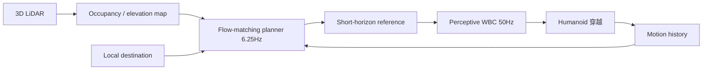

# PASSAGE：场景对齐的人形感知 clutter 穿越

**PASSAGE**（*Scaling Scene-Aligned Motion Learning for Perceptive Humanoid Traversal in Cluttered Environments*，[arXiv:2609.18732](https://arxiv.org/abs/2609.18732)，Galbot / PKU / 清华 / 上交 / 南开 / 上海期智等，通讯 **He Wang**、**Li Yi**）提出 **planner–tracker** 框架：用 VR + 惯性动捕在 **1500** 个 clutter 场景采集 **100 h** **scene-aligned** 人体运动，条件 **flow-matching planner** 生成短 horizon 参考，**perceptive whole-body tracker** 以几何反馈 **50 Hz** 执行；**无技能标注** 即可组合 step-over / squeeze / duck-under。

## 一句话定义

**用大规模「人在场景里怎么走」对齐数据，让一个 planner–tracker 对在 onboard 感知下自己选 traversal 行为，而不是为每种障碍单独训策略。**

## 英文缩写速查

| 缩写 | 英文全称 | 简要说明 |
|------|----------|----------|
| PASSAGE | Scaling Scene-Aligned Motion Learning for Perceptive Humanoid Traversal | 本文系统名 |
| WBC | Whole-Body Control | 50 Hz 全身跟踪控制器 |
| RL | Reinforcement Learning | Planner 侧冻结 tracker 后的 post-training |
| LiDAR | Light Detection and Ranging | 自中心 3D 感知输入 |
| VR | Virtual Reality | 与动捕联合的数据采集界面 |
| MoCap | Motion Capture | 100 h 人体运动来源 |

## 为什么重要

- **行为覆盖不靠技能库：** 相对 task-specific RL 或 curated motion library，单一 planner–tracker 对在未见几何上组合 traversal。
- **数据 scaling 有量化曲线：** 6 h → 100 h 使 held-out **contact-free success** 从 **48.1%** 到 **68.9%**（三 seed）；加 scene augmentation **70.3%**。
- **全 onboard 实机：** 3D LiDAR + occupancy map + **6.25 Hz** 规划 + **50 Hz** 控制，Jetson AGX Orin；**50** 未见布局零预建图。
- **与 [SSR](./paper-ssr-humanoid-open-world-traversal.md) 对照：** SSR 走单阶段深度 PPO；PASSAGE 走 **demonstration scaling + flow planner + tracker** 分层。

## 核心信息

| 项 | 内容 |
|----|------|
| **机构** | 银河通用（Galbot）；北京大学；清华大学；上海交通大学；南开大学；上海期智研究院（作者网络与 HumanTracker 重叠） |
| **数据** | 100 h human motion，1500 cluttered scenes，scene-aligned |
| **机载** | Egocentric 3D LiDAR，online occupancy mapping，Jetson AGX Orin |
| **开源** | **截至 2026-09-18 arXiv v1 未列项目页或 GitHub** |

## 核心原理（方法）

**Planner：** 条件 flow matching；输入 motion history、局部 destination、robot-centric **multi-layer elevation map**；输出短 horizon 参考。**Real-time chunking** 保 inter-chunk 一致。

**Tracker：** Perceptive whole-body control，50 Hz，几何反馈闭环。

**Post-training：** Planner 侧 RL（tracker 冻结）提升 closed-loop。

### 流程总览

## 工程实践

| 项 | 建议 |
|----|------|
| 读 scaling 曲线 | 不要只报 70.3% final — 6 h baseline **48.1%** 说明数据量敏感 |
| onboard 预算 | 6.25 Hz 规划 + 50 Hz 控制需分开 profiling |
| 对照 | [SSR](./paper-ssr-humanoid-open-world-traversal.md) 单阶段 RL；PHP 多阶段跑酷管线 |
| 复现 | 代码未发布 — 仅作架构与 scaling 参考 |

## 实验与评测

| 设定 | 数字 |
|------|------|
| Sim scaling（3 seeds） | 6 h → 100 h：**48.1% → 68.9%** contact-free success |
| + scene augmentation | **70.3%** |
| 实机 | **50** unseen physical layouts，无 prebuilt map / offboard |
| Ablations | 各 stage 贡献见论文 simulation 组件消融 |

## 与其他工作对比

> 下表只做**定位对照**，不做跨设定横比：PASSAGE 截至入库日未开源代码/数据，其 68.9%/70.3% 与 50 布局实机结果与下列各页不共享评测协议。

| 对照 | 差异读法 |
|------|----------|
| [SSR 开放世界穿越](./paper-ssr-humanoid-open-world-traversal.md) | 同为 onboard 感知穿越，差别在**行为多样性从哪来**：SSR 走单阶段深度 PPO，多样性来自奖励与探索；PASSAGE 走 100 h 场景对齐人体 motion，多样性来自数据分布。读法对应两种成本——调奖励 vs 采数据 |
| **task-specific RL / curated motion library**（本文要替代的默认做法） | 同为「让机器人会跨、会挤、会低头」，差别在**是否需要技能标注**：技能库按障碍类型分别训练并在运行时切换，PASSAGE 无技能标注、由 planner 隐式组合。代价是组合能力被数据覆盖面卡住，而非被切换逻辑卡住 |
| [HumanTracker](./paper-humantracker.md) | 同作者网络的上游件：HumanTracker 评的是 **motion tracking 本身**，PASSAGE 把 tracker 冻结后只在 planner 侧做 RL post-training。两页合读可分清「跟踪不准」与「参考轨迹选得不对」两类失败 |
| [楼梯与障碍感知 locomotion](../tasks/stair-obstacle-perceptive-locomotion.md) | 该页归纳这一任务族的评测口径；PASSAGE 是其中「稠密 clutter + 无预建图」一支，与台阶/连续地形一支的取舍是**几何复杂度 vs 高度变化幅度** |
| [机器人视觉感知栈选型闭环](../queries/robot-perception-stack-selection-loop.md) | 提醒读法：planner 吃的是 multi-layer elevation map，成绩上限被 LiDAR 建图与 occupancy 质量卡住——数据再多，感知栈偏了一样撞 |

## 结论

**PASSAGE 把 clutter 穿越从「分技能 RL」推向「场景对齐 motion 数据 + 通用 planner–tracker」——scaling 曲线和 onboard 闭环是主要证据。**

1. **100 h 场景对齐数据是核心资产** — 没有它，48% 量级说明小数据不够。
2. **Planner post-training 在 frozen tracker 上有效** — 分层优化比端到端瞎训更稳。
3. **6.25/50 Hz 双率系统是真部署形态** — 规划不必跟控制同频。
4. **无技能标注是可复用卖点** — 但依赖高质量 elevation / occupancy 感知栈。
5. **代码未开源** — 选型先当 research reference，勿假设可复现数字。

## 局限与风险

- **无公开代码/数据（截至入库日）** — 70.3% 与 50 布局实机暂无法独立验证。
- **Human motion → humanoid gap** — retarget 与 tracker 细节未开源时难评估。
- **与 terrain pathfinding 同名 PASSAGE 无关** — 勿混淆其他领域仓库。

## 关联页面

- [楼梯与障碍感知 locomotion](../tasks/stair-obstacle-perceptive-locomotion.md)
- [Humanoid locomotion](../tasks/humanoid-locomotion.md)
- [SSR 开放世界穿越](./paper-ssr-humanoid-open-world-traversal.md)
- [HumanTracker](./paper-humantracker.md) — 同作者网络 motion 评测
- [机器人视觉感知栈选型闭环](../queries/robot-perception-stack-selection-loop.md) — planner 输入的 elevation/occupancy 栈选型入口

## 参考来源

- [passage_arxiv_2609_18732](../../sources/papers/passage_arxiv_2609_18732.md)

## 推荐继续阅读

- [arXiv:2609.18732](https://arxiv.org/abs/2609.18732)
