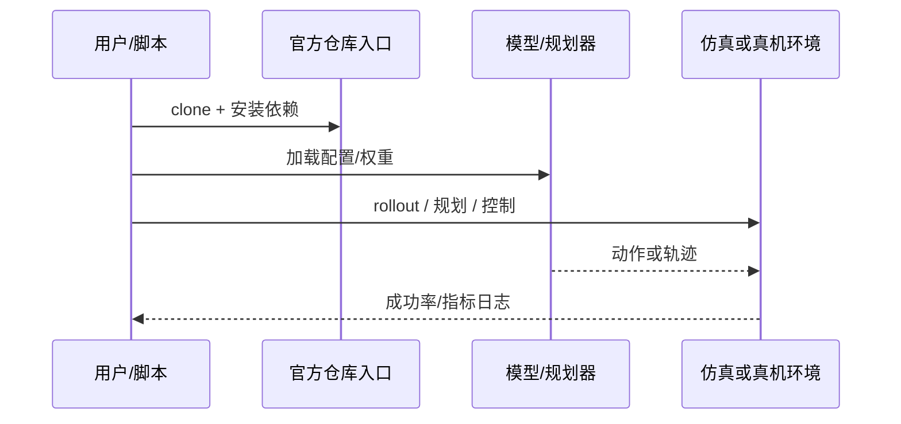

# PccDiffuser（arXiv:2609.09745）

**PccDiffuser**（[PccDiffuser: Multi-solution Motion Planning for Continuum Robots](https://arxiv.org/abs/2609.09745)）来自 [具身智能小站 11 篇盘点](../../sources/blogs/wechat_embodied_station_11_papers_vlm_manipulation_2026-09-10.md)。条件扩散生成连续体机器人多模态配置空间路径；障碍物图网络+解析微分运动学；混合测试集 91% 成功率。

## 一句话定义

**0–4 障碍物混合测试集报告 91% 成功率。**

## 英文缩写速查

| 缩写 | 英文全称 | 简要说明 |
|------|----------|----------|
| IL | Imitation Learning | 从专家示范学习策略 |
| VLM | Vision-Language Model | 视觉-语言多模态模型 |
| WM | World Model | 预测未来观测或表征的动力学模型 |
| RL | Reinforcement Learning | 强化学习 |
| CEM | Cross-Entropy Method | 采样优化动作/轨迹的规划器 |
| DoF | Degrees of Freedom | 自由度 |

## 为什么重要

- 纳入本期 **VLM 控制 / 世界模型 / 灵巧操作 / 规划 / 评测** 主线之一。
- 开源状态：**已开源**（步骤 2.5 核查，2026-09-10）。
- 与 [11 篇技术地图](../overview/vlm-manipulation-11-papers-technology-map.md) 中同类工作可横向对照。

## 核心机制

| 项 | 内容 |
|----|------|
| **arXiv** | [2609.09745](https://arxiv.org/abs/2609.09745) |
| **项目页** | — |
| **代码** | https://github.com/qiuke-qiuke/pcc_diffuser |
| **开源** | **已开源** |
| **文内指标** | 0–4 障碍物混合测试集报告 91% 成功率。 |

## 源码运行时序图

## 结论

**PccDiffuser 值得按「已开源」边界阅读：先核对仓库是否可跑，再引用文内成功率数字。**

1. 索引来源为公众号导读，实验细节以 arXiv PDF 为准。
2. 开源结论：**已开源**。
3. 选型时对照 [11 篇地图](../overview/vlm-manipulation-11-papers-technology-map.md) 中相邻节点，避免重复造页。

## 关联页面

- [VLM 与操作 11 篇技术地图](../overview/vlm-manipulation-11-papers-technology-map.md)
- [模仿学习 (Imitation Learning)](../methods/imitation-learning.md)
- [Generative World Models](../methods/generative-world-models.md)
- [Manipulation](../tasks/manipulation.md)

## 参考来源

- [pccdiffuser_arxiv_2609_09745.md](../../sources/papers/pccdiffuser_arxiv_2609_09745.md)
- [wechat 11篇盘点](../../sources/blogs/wechat_embodied_station_11_papers_vlm_manipulation_2026-09-10.md)
- [arXiv:2609.09745](https://arxiv.org/abs/2609.09745)

## 推荐继续阅读

- [arXiv PDF](https://arxiv.org/pdf/2609.09745)

- [GitHub](https://github.com/qiuke-qiuke/pcc_diffuser)
