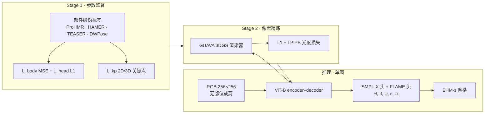

# PEAR：像素对齐的表意人体网格恢复

**PEAR**（*Pixel-aligned Expressive humAn mesh Recovery*，arXiv:2601.22693，SIGGRAPH 2026，[IDEA](https://idea.edu.cn/)）从 **单张野外 RGB** 恢复 **全身 + 双手 + 面部表情** 的 **EHM-s** 参数化网格，在 **无脸/手/人体裁剪** 前提下达到 **>100 FPS**（4090/L40S 级，FP32）。相对 OSX、Multi-HMR、SMPLest-X 等 **Type-3 SMPL-X** 方法，论文强调 **像素级对齐** 与 **实时部署**；项目页对比 [SAM 3D Body](./sam-3d-body.md) 约 **100×** 推理加速。

## 英文缩写速查

| 缩写 | 英文全称 | 简要说明 |
|------|----------|----------|
| HMR | Human Mesh Recovery | 从图像恢复参数化人体网格 |
| EHM-s | Expressive Human Model (scaled) | SMPL-X 身体/手 + 缩放 FLAME 头（尺度 $s$） |
| SMPL-X | Skinned Multi-Person Linear Model Extended | 含身体、手、面部的参数化人体模型 |
| FLAME | Faces Learned with an Articulated Model and Expressions | 专用面部形状/表情/姿态模型 |
| ViT | Vision Transformer | PEAR 统一骨干（ViT-B/16） |
| GMR | General Motion Retargeting | 人体网格序列→机器人重定向（下游可选） |

## 为什么重要

- **机器人与遥操作上游：** 论文将 HMR 列为 **机器人感知**、数字人与 embodied AI 的基础能力；PEAR 的 **单图、无预处理、亚 10 ms** 特性适合 **摄像头→人体参数→[GMR](../methods/motion-retargeting-gmr.md)** 的 **低延迟** 链路（对比 [GVHMR](./gvhmr.md) 的视频 world 轨迹或 [SAM 3D Body](./sam-3d-body.md) 的重型基础模型）。
- **Type-3 表达力：** 在 **同一前向** 中输出 **SMPL-X + FLAME**，脸手细节优于纯 SMPL-X 头空间；头尺度 $s$ 解耦 **儿童/卡通** 等非成人头身比——对 **虚拟人驱动** 与 **跨体型重定向** 更友好。
- **像素监督不增推理成本：** Stage-2 用 **GUAVA** 神经渲染提供训练期 **光度损失**，推理仍走 **轻量 ViT**，把「分析–综合」留在训练侧——工程上比多分支高分辨率 HMR 更易部署。

## 流程总览

## 核心机制（归纳）

### 1）EHM-s 表示

| 组件 | 参数 | 作用 |
|------|------|------|
| SMPL-X | $\theta_b, \beta_b$ | 身体姿态与形状（含双手） |
| FLAME | $\theta_h, \beta_h, \phi_h$ | 头部姿态、身份、表情 |
| 尺度 | $s \in \mathbb{R}^3$ | 头网格缩放，解耦头身比例 |

相对标准 SMPL-X，**FLAME 头** 提升表情保真；$s$ 使模型覆盖 **幼儿、风格化角色** 等 SMPL-X 形状空间难以表达的分布。

### 2）统一 ViT 与损失（Stage 1）

- **输入：** 256×256，**单流 ViT-B**；摒弃 Multi-HMR 式 896² 或多分支脸手编码器。
- **监督：** 式 (1)–(5) 对 SMPL-X/FLAME 参数与 2D/3D 关键点；FLAME 分支可 **独立** 在缺身体上下文时预测面部。

### 3）像素级增强（Stage 2）

- 用 **GUAVA** 将 EHM-s 网格 **可微渲染** 为 $\hat{I}$，优化 $\mathcal{L}_{photo} = L_1 + L_{lpips}$。
- **两阶段必要：** 粗网格先对齐，再绑高斯点；联合训练易导致外观–几何耦合失败（论文 Fig. 5、Tab. 6 消融）。

### 4）部件级伪标签

| 部位 | 工具 | 说明 |
|------|------|------|
| 身体 | ProHMR → SMPL-X | SMPL 体姿 + $\Delta\theta$ T-pose 对齐 |
| 手 | HAMER | SMPL-X 手部初值 |
| 脸 | TEASER + DWPose | FLAME 参数 + 2D 精炼 |

Part1（3M+ 图）+ Part2（Ego-Exo4D、Harmony4D 等，总 6M+）支撑 **头/上半身/全身** 多样裁剪泛化。

## 实验与工程要点

| 维度 | PEAR | 对照（论文） |
|------|------|----------------|
| 速度 | **~100 FPS**（4090/L40S） | Multi-HMR ~10 FPS；OSX/SMPLest-X ~20 FPS |
| 3DPW MPJPE | **71.3** | OSX 74.7；Multi-HMR 78.0 |
| COCO PCK@0.05 | **0.81** | OSX 0.70 |
| 面部 LVE（UBody） | **1.22×10⁻⁵ m** | SMPLest-X 15.6×10⁻⁵ m 量级 |
| 输入分辨率 | **256×256** | Multi-HMR 896×896 |

**训练成本（公开）：** Stage1 ~10 天 / 8×A6000；Stage2 ~1 天。代码已开源；**训练数据集待发布**。

## 在机器人知识库中的位置

- **与 GVHMR：** PEAR 解决 **单帧表达力 + 速度**；长视频 **世界坐标与脚滑** 仍需 [GVHMR](./gvhmr.md) 或 [HTD-Refine](./paper-htd-refine-monocular-hmr.md) 类后处理。
- **与 SAM 3D Body：** 同属 **Type-3 全身 HMR**；SAM3D 偏 **基础模型 + MHR + 可提示**；PEAR 偏 **SMPL-X/FLAME 生态 + 极致实时 + 像素对齐**。
- **与 WiLoR：** 手部极精细语义可仍用 [WiLoR](../methods/wilor.md)；PEAR 提供 **全身一致** 的实时初值。

## 局限与风险

- **Type-3 权衡：** 同时建模脸手会降低相对 **Type-1/2 纯体姿** 方法的部分肢体精度上限（论文 §5 讨论）。
- **单目歧义仍在：** 无物理接触/地面约束；**不可直接** 作真机力控指令，需 [Motion Retargeting Pipeline](../concepts/motion-retargeting-pipeline.md) 筛选。
- **视频一致性：** 官方以 **单图** 为主；视频应用需 **跟踪 + 时序滤波**（可与 GVHMR 输出级联）。
- **数据与复现：** 自定义伪标签管线与 Stage-2 GUAVA 依赖使 **完全复现** 成本高于纯回归 HMR；数据集 **尚未公开**。

## 关联页面

- [Motion Retargeting Pipeline](../concepts/motion-retargeting-pipeline.md)、[Whole-Body Tracking Pipeline](../concepts/whole-body-tracking-pipeline.md)
- [SAM 3D Body](./sam-3d-body.md)、[GVHMR](./gvhmr.md)、[HTD-Refine](./paper-htd-refine-monocular-hmr.md)
- [GMR](../methods/motion-retargeting-gmr.md)、[GENMO](../methods/genmo.md)、[WiLoR](../methods/wilor.md)

## 参考来源

- [PEAR（arXiv:2601.22693）](../../sources/papers/pear_arxiv_2601_22693.md)
- [PEAR 项目页](../../sources/sites/pear-wujh2001-github-io.md)
- [PEAR 官方仓库](../../sources/repos/pear.md)

## 推荐继续阅读

- 论文：<https://arxiv.org/abs/2601.22693>
- 项目页：<https://wujh2001.github.io/PEAR/>
- 代码：<https://github.com/Pixel-Talk/PEAR>
- GUAVA、Multi-HMR、OSX 原文 — 理解像素监督与 Type-3 基线设计空间
