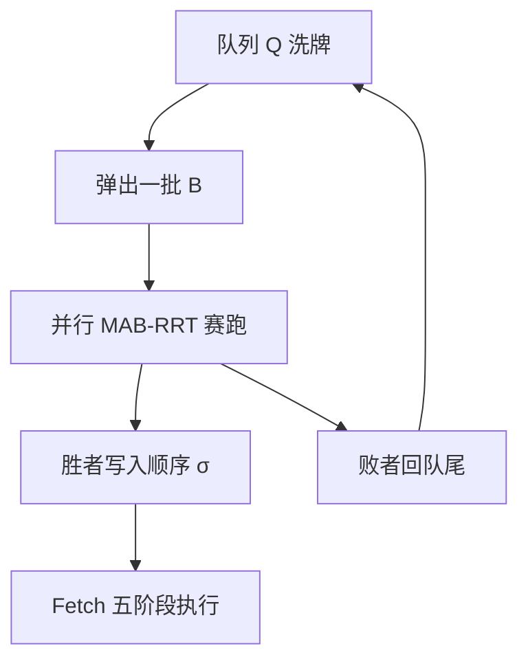
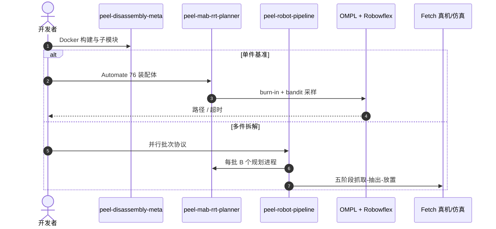

# PEEL：长程拆解要同时解决顺序、尺度和逃逸路径

**PEEL**（*Parallel Extraction for Long-Horizon Disassembly Planning via Scale-Invariant Sampling*；[arXiv:2608.08773](https://arxiv.org/abs/2608.08773)，[项目页](https://peel-disassembly.surge.sh/)）由 **Servet B. Bayraktar / Andreas Orthey / Zachary Kingston（Purdue）/ Marc Toussaint** 提出：多件拆解不是只排 precedence，还要在窄逃逸通道里算出一串无碰移除轨迹。

## 一句话定义

**先用赌博机 RRT 按物体尺度找单件逃逸路径，再让一批规划器赛跑——谁先找到无碰路径谁就进入拆解顺序，避免指数级组合搜索。**

## 英文缩写速查

| 缩写 | 英文全称 | 简要说明 |
|------|----------|----------|
| PEEL | Parallel Extraction for Long-Horizon Disassembly | 本文多件协议 |
| MAB-RRT | Multi-Arm Bandit Rapidly-exploring Random Tree | 单件规划器 |
| OMPL | Open Motion Planning Library | 规划器挂载点 |
| PCA | Principal Component Analysis | 估逃逸主方向 |
| IK | Inverse Kinematics | 真机五阶段换抓 |

## 为什么重要

- 符号 precedence 只保证无穷小可分，不保证全局可抽出。
- 物体尺度差几个数量级时，固定采样半径会同时失败于大件与窄缝。
- 并行赛跑把「下一块该拆谁」变成在线发现，而不是预先枚举。

## 核心信息

| 项 | 内容 |
|----|------|
| **机构** | 普渡大学（Purdue；Kingston）；其余单位未在 HTML 页头单列 |
| **评测** | Automate 76 单件；四套 10–17 件 + Fetch |
| **开源** | **部分开源**（双盲 anonymous.4open.science） |

## 核心原理

### 方法栈

burn-in 自适应球半径直到有效采样率达标，得到尺度线索。随后 MAB 在均匀采样与两条沿 PCA 逃逸方向的圆柱采样器之间按奖励切换。多件：物体洗牌入队，每批弹出 B 个并行规划；先成功者写入顺序 \(\sigma\)，失败者回队尾；整批超时则整批重入队，预算 \(T\) 可升高。真机五阶段：侧抓 → 直线抽出 → 目标侧 IK → 桥接换顶抓 → 跨装配体放置。

### 流程总览

## 源码运行时序图

项目页 Code 指向匿名仓 [peel-disassembly-meta](https://anonymous.4open.science/r/peel-disassembly-meta/)（归档见 [sources/repos/peel-disassembly.md](../../sources/repos/peel-disassembly.md)）：

- **最短复现：** 从 meta-repo 按项目页 Docker demo 起步。匿名 URL 可能在审稿结束后迁移到实名 GitHub。

## 工程实践

| 项 | 建议 |
|----|------|
| 单件先看 100% | 76×10 旋转是几何可行性，不是抓取成功率 |
| 批次大小 | 文档示意 N=8、B=4；核数不够就降 B |
| 真机 | 五阶段假设侧抓可行；夹爪行程不够会在抽出后卡死 |
| 对照 | AssembleThemAll 仓可直接跑，但约束口径不同 |

## 实验与评测

- **单件：** 760 trial，MAB-RRT **100%**，中位 3.2 s（均值 4.3 s）。次优 BFS 53.9%，informed RRT 45–48%。
- **多件：** 显微镜 12、碟刹 10、联轴 14、钳子 17；相对 RRT / TRRT / MateVec-TRRT 快 **2–7×**，方差更小。Fetch 完整拆完四套。

## 与其他工作对比

相对符号干涉矩阵：PEEL 每步都做几何路径，不满足于无穷小可分。相对 [PGIF-MPPI](./paper-pgif-mppi.md)：一个在人群里滚采样控制，一个在装配体配置空间里滚采样规划。相对 [3D-IC 联合导航操作规划](./paper-3d-ic-joint-navigation-manipulation-planning.md)：3D-IC 偏导航–操作联合；PEEL 专攻拆解逃逸。

## 结论

**长程拆解的硬点是「尺度正确的逃逸采样 + 在线发现顺序」，不是先穷举 precedence 再调用通用 RRT。**

1. **burn-in 估尺度** — 固定半径过不了窄缝。
2. **bandit 切采样器** — 均匀探索与沿逃逸方向开采要切换。
3. **赛跑代替枚举** — 先成功者就是当前可拆件。
4. **几何 100% ≠ 抓取 100%** — 真机还有五阶段换抓。
5. **匿名仓** — 能复现但引用 URL 不稳定。

## 局限与风险

- 双盲仓与 Anonymous bib 说明审稿未结束，接口可能改名。
- 单件基准无碰撞装配体，真实公差与变形未建模。
- Fetch 侧抓假设对某些几何会失败。

## 关联页面

- [MPC](../methods/model-predictive-control.md)
- [MPPI](../methods/mppi.md)
- [PGIF-MPPI](./paper-pgif-mppi.md)
- [3D-IC 联合规划](./paper-3d-ic-joint-navigation-manipulation-planning.md)

## 参考来源

- [PEEL 论文摘录](../../sources/papers/peel_disassembly_arxiv_2608_08773.md)
- [项目页归档](../../sources/sites/peel-disassembly-surge.md)
- [匿名仓归档](../../sources/repos/peel-disassembly.md)
- [具身智能小站 9 篇盘点（2026-08-17）](../../sources/blogs/wechat_embodied_station_9_papers_2026-08-17.md)
- [arXiv:2608.08773](https://arxiv.org/abs/2608.08773)

## 推荐继续阅读

- [PEEL 项目页](https://peel-disassembly.surge.sh/)
- [Assemble-Them-All](https://github.com/yunshengtian/Assemble-Them-All) — 文内对照
