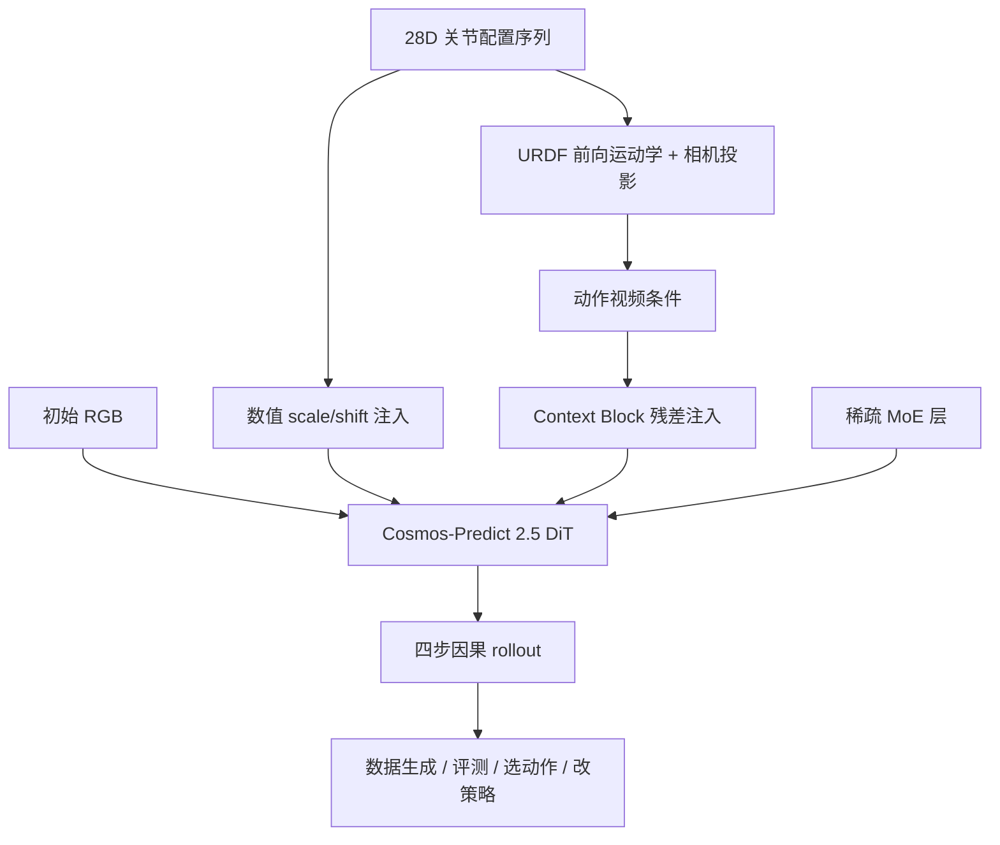

# Pelican-Sim 1.0（arXiv:2609.12036）

**Pelican-Sim 1.0**（[Pelican-Sim 1.0: A General World Model Simulator for Embodied Intelligence](https://arxiv.org/abs/2609.12036)）由 **北京人形机器人创新中心（X-Humanoid）** WFM System Group 提出（Shilong Zou、Shilin Zhang 等）。世界模型价值在于能否被策略训练与决策使用；Pelican-Sim 把 WM 变成 **数据生成、策略评测、动作选择与策略改进** 四类下游工具，核心设计是 **28 维统一动作数值 + URDF 渲染动作视频** 双分支注入 Cosmos-Predict 2.5 DiT，辅以稀疏 MoE 与 **四步** 因果 rollout（相对 35 步 **5.67×** 加速）。

## 一句话定义

**28 维统一动作空间 + URDF 渲染动作视频 + 稀疏 MoE + 四步 rollout 的通用具身世界模型仿真器。**

## 英文缩写速查

| 缩写 | 英文全称 | 简要说明 |
|------|----------|----------|
| WM | World Model | 动作条件未来观测预测模型 |
| MoE | Mixture of Experts | 稀疏专家层扩展异构动力学容量 |
| URDF | Unified Robot Description Format | 机器人几何；用于渲染动作视频条件 |
| DiT | Diffusion Transformer | Cosmos-Predict 2.5 视频预测骨干 |
| PSNR | Peak Signal-to-Noise Ratio | 视频预测质量指标（文内多数据集 +4–10 dB） |
| FVD | Fréchet Video Distance | 生成视频分布距离（MoE 相对稠密骨干 −6.530） |
| EWMBench | Embodied WM Benchmark | 适配后的整体评分（RoboTwin +0.426） |

## 为什么重要

- **统一动作接口：** 14 维×双臂（7 关节 + 夹爪 + 6 手关节），缺省零填充，单模型跨平行夹爪与灵巧手。
- **动作–像素桥：** URDF 前向运动学 + 相机投影生成 **动作视频**，相对纯数值注入 PSNR **+0.904**（文内消融）。
- **闭环四类应用：** 同一四步仿真器服务数据增广、Qwen3-VL-2B 策略评测（Pearson **0.994**）、动作选择（相对增益 **47.7%**）、策略改进（**20.3%**）。
- **训练规模：** ~**1M** 轨迹 / **8000 h** 视频，混合 AgiBotWorld Beta、RoboMIND、RoboTwin 等七源。

## 核心机制

| 项 | 内容 |
|----|------|
| **机构** | 北京人形机器人创新中心（X-Humanoid） |
| **arXiv** | [2609.12036](https://arxiv.org/abs/2609.12036) |
| **项目页** | https://zoushilong1024.github.io/Pelican-Sim1.0/ |
| **代码** | https://github.com/ZouShilong1024/Pelican-Sim1.0 |
| **开源** | **部分开源**（占位仓已公开；训练/权重 **待发布**） |
| **文内指标** | RoboTwin：50 demo + 500 生成轨迹 70%→**93%**；策略评测 Pearson **0.994**；动作选择相对增益 **47.7%**。 |

## 流程总览

## 源码运行时序图

**不适用**（截至 **2026-09-15** [ZouShilong1024/Pelican-Sim1.0](https://github.com/ZouShilong1024/Pelican-Sim1.0) 仅含 README/LICENSE，**无可运行训练或推理入口**）。完整栈发布后应按：数据混合 → WM 训练 → 四步蒸馏 → Qwen3-VL 冻结评测器 → RoboTwin 下游四类应用。

## 实验与评测

### 视频预测（相对最强 baseline PSNR 提升）

| 数据集 | Δ PSNR | 本文 PSNR |
|--------|--------|-----------|
| AgiBotWorld Beta | +4.636 dB | 22.276 |
| RoboMIND | +2.080 dB | 23.850 |
| RoboTwin | +10.343 dB | 30.383 |

### RoboTwin 下游（π0.5）

| demo 数 | 仅采集 | + Pelican 生成 |
|---------|--------|----------------|
| 50 | 70.0% | **93.0%** |
| 30 | 57.0% | **87.0%** |
| 10 | 28.5% | **64.5%** |

- **读法：** 策略评测 Pearson **0.994** 是 **排序相关性**，不是成功率；具体对照组定义以 **原文 PDF** 为准。

## 与其他工作对比

- **物理引擎仿真器（[MuJoCo](./mujoco.md) / [Isaac Lab](./isaac-lab.md)）** — 显式刚体动力学 vs 学出来的 WM rollout。
- **[Dynin-Robotics](./paper-dynin-robotics.md)（同批）** — WM 在策略 **内部** vs 本文 **外部仿真器**。
- **[DATAFARM](./paper-datafarm.md) / [FoldNet++](./paper-foldnet-plus-plus.md)（同批）** — TAMP 规划 / 仿真渲染造数据 vs **WM rollout** 造数据。
- **[Pelican-Unified 1.0](../methods/pelican-unified-1.md)** — 同 X-Humanoid「Pelican」品牌但 **不同论文线**：Unified 是 VLA+联合扩散 UEI；Pelican-Sim 是 **动作条件视频 WM 仿真器**（勿混仓库）。

## 结论

**Pelican-Sim 1.0 把「数值动作 + URDF 动作视频」双条件写进可四步滚动的通用 WM，在百万轨迹规模上同时服务生成数据与策略决策四类闭环。**

1. **真影响指标：** 三数据集视频质量 SOTA 档；RoboTwin 50+500 轨迹把 π0.5 成功率拉到 **93%**。
2. **次要代价：** 四步蒸馏牺牲部分逐步去噪细节；跨本体仍依赖 28 维零填充约定。
3. **部署读法：** 下游用冻结 Qwen3-VL-2B 评测器；真机仍需独立验证生成轨迹物理可信度。
4. **复现边界：** 官方仓 **[ZouShilong1024/Pelican-Sim1.0](https://github.com/ZouShilong1024/Pelican-Sim1.0)** 当前为占位；**勿**用 [Open-X-Humanoid/Pelican-Sim1.0](https://github.com/Open-X-Humanoid/Pelican-Sim1.0) 旧链。

## 关联页面

- [11 篇技术地图](../overview/vla-tamp-planning-11-papers-technology-map.md)
- [Generative World Models](../methods/generative-world-models.md)
- [World Action Models](../concepts/world-action-models.md)
- [DATAFARM](./paper-datafarm.md)
- [RoboTwin](./robotwin.md)

## 参考来源

- [pelican-sim_arxiv_2609_12036.md](../../sources/papers/pelican-sim_arxiv_2609_12036.md)
- [pelican-sim-1.md](../../sources/repos/pelican-sim-1.md)
- [pelican-sim-1.md](../../sources/sites/pelican-sim-1.md)
- [wechat_embodied_station_11_papers_vla_tamp_planning_2026-09-14.md](../../sources/blogs/wechat_embodied_station_11_papers_vla_tamp_planning_2026-09-14.md)

## 推荐继续阅读

- [arXiv PDF](https://arxiv.org/pdf/2609.12036)
- [项目页](https://zoushilong1024.github.io/Pelican-Sim1.0/)
- [官方代码仓（占位）](https://github.com/ZouShilong1024/Pelican-Sim1.0)
