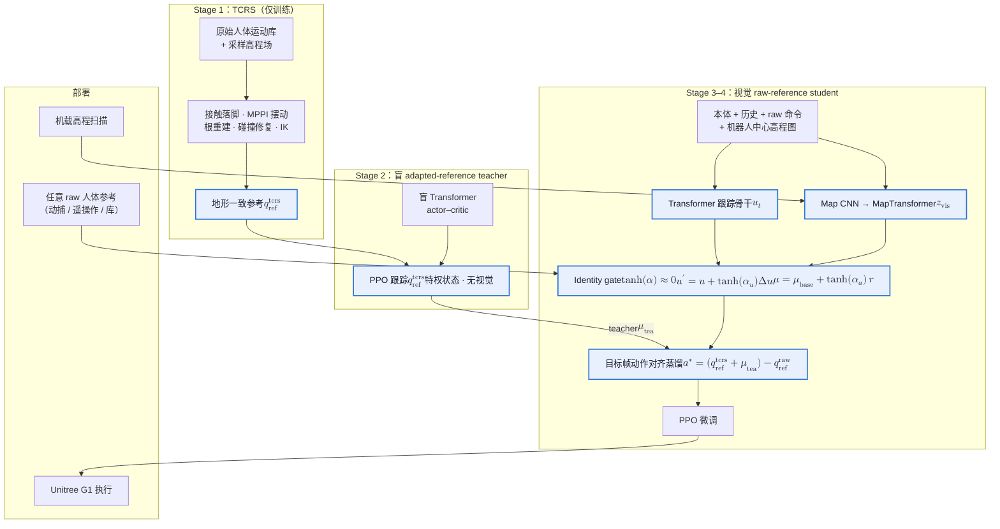

# Perceptive BFM：Adapting Human Motion Priors to Robot-Centric Terrain

**Perceptive BFM**（*Perceptive Behavior Foundation Model: Adapting Human Motion Priors to Robot-Centric Terrain*，[项目页](https://acodedog.github.io/perceptive-bfm/)，CoRL 2026 submission）提出 **地形感知的人形行为基础模型**：部署期仍接受 **任意平地人体运动参考**（动捕、遥操作或库内片段）作为行为接口，由 **机器人中心局部高程扫描** 在线决定落脚、摆动间隙、身体高度与接触时序——把「人类先验说什么」与「机器人在哪踩」解耦。

> 截至入库日，arXiv 与代码标注 **TBA**；量化与消融以项目页 / submission PDF 为准。

## 英文缩写速查

| 缩写 | 英文全称 | 简要说明 |
|------|----------|----------|
| BFM | Behavior Foundation Model | 大规模人体运动先验上的可复用全身控制 |
| PMT | Perceptive Motion Tracking | 本文四阶段感知运动跟踪训练算法 |
| TCRS | Terrain-Conformal Reference Synthesis | 离线将 raw 片段+高程场合成地形一致监督 |
| PPO | Proximal Policy Optimization | 盲 teacher 与微调阶段的 RL 算法 |
| IK | Inverse Kinematics | TCRS 中多点逆解以重建全身姿态 |
| MPPI | Model Predictive Path Integral | TCRS 足端摆动轨迹采样优化 |
| MoCap | Motion Capture | 平地参考与遥操作命令来源 |

## 为什么重要

- **补上 BFM 的地形盲区：** [SONIC](../methods/sonic-motion-tracking.md)、[BFM](../entities/paper-behavior-foundation-model-humanoid.md) 等 goal-conditioned 路线多假设参考已与场景兼容；本文显式处理 **操作者–环境失配**——人类/动捕在平地给意图，机器人在楼梯、块体、草地上自行「落地」。
- **部署接口不变：** 与测试期喂 **地形一致参考** 的感知跟踪不同，**raw 参考始终是运行时命令**；TCRS 仅作 **离线 teacher 监督**，降低对在线重定向/规划栈的依赖。
- **单策略广度：** 同一 **Unitree G1** 权重覆盖 locomotion、风格舞蹈、台阶后空翻等杂技、侧向/后退步态与 **mocap 遥操作**，且项目页强调 **无 per-skill 调参**——接近 BFM「一个 checkpoint 多种行为」叙事，但核心增益来自 **感知**（无视觉消融 reward **54.6 → 3.6**）。
- **可复现工程信号：** 浏览器 **MuJoCo WASM + ONNX** demo；训练预算与骨干消融在同任务契约下报告，便于与 [RPL](./paper-rpl-robust-humanoid-perceptive-locomotion.md)、[Hiking in the Wild](./paper-hiking-in-the-wild.md) 等感知人形路线对照。

## 流程总览

## 核心机制（归纳）

### 1）Operator–Environment Mismatch

- **命令侧：** 动捕操作员或平地录制片段提供 **风格与意图**（怎么走、怎么跳、上身怎么摆）。
- **世界侧：** 机器人面对楼梯踢面、稀疏块、坡道或户外不规则面，需要 **落脚集合、摆动净空、支撑高度、接触时刻**——参考里通常没有。
- **契约：** Perceptive BFM **不修改** 上层参考接口，把失配交给 **低层感知跟踪器** 闭合。

### 2）TCRS（Terrain-Conformal Reference Synthesis）

- **输入：** 原始 locomotion 向人体片段 + 随机/结构化 **height field**。
- **管线：** 接触感知落脚 → 足几何 **MPPI** 摆动优化（mid-foot 帧）→ 支撑感知根轨迹重建 → 碰撞修复 → 多点 **IK**。
- **角色：** 为盲 teacher 提供 **物理上更可信的跟踪目标**；相对简单 Z-lift，足-地形穿透 **−56.6%**（5.48 → 2.38 cm）。
- **边界：** **运动学合成器**——不解接触丰富动力学；假设 **静态刚体、可观测高程**（见局限）。

### 3）PMT 与 Identity-Gated 视觉融合

- **盲 teacher：** 无视觉 Transformer，PPO 跟踪 $q_{\mathrm{ref}}^{\mathrm{tcrs}}$，学「若已知地形一致目标，全身应如何动」。
- **视觉 student：** 接收 **raw** $q_{\mathrm{ref}}$ + **局部高程图**；MapTransformer 以运动 query 读地形。
- **Identity gate：** $\tanh(\alpha)$ 初值 $\approx 0$ → 网络起步为 **纯 raw-reference tracker**，仅在地形逼迫时打开残差；避免感知支路破坏已有运动先验。
- **Target-frame alignment：** teacher 动作在 adapted 帧表达；蒸馏把有效 PD 目标 **重表达到 raw 帧**：$a^* = (q_{\mathrm{ref}}^{\mathrm{tcrs}} + \mu_{\mathrm{tea}}) - q_{\mathrm{ref}}^{\mathrm{raw}}$，使跨帧蒸馏可优化（去此项 **54.6 → 50.1**）。

## 实验与评测

> 截至入库日，**未见同行评审正式版 benchmark 表**；以下为项目页已公布的 **训练消融** 与 **定性真机** 口径。

### 仿真训练消融（项目页）

| 项 | 数值 / 结论 |
|----|-------------|
| Full PMT vs 无视觉 | **54.6 vs 3.6**（末 1k iter 均值 reward） |
| Transformer vs MLP/GRU/CNN 骨干 | **+5–8** reward（同 48×A800 预算） |
| 有 vs 无 target-frame distillation | **54.6 vs 50.1** |
| TCRS vs Z-offset 足-地形穿透 | **5.48 → 2.38 cm**（−56.6%）；间隙违规 −48.3% |

- 各变体共享任务、奖励、观测契约；去视觉伤害最大，说明增益主要来自 **感知与架构** 而非单纯网络容量。

### 真机与开放评测状态

| 项 | 状态 |
|----|------|
| 平台 | **Unitree G1** |
| 地形 | 楼梯、坡、稀疏块、凹障、草地、室内外不规则面 |
| 行为 | locomotion、风格舞蹈、台阶后空翻链、mocap 遥操作、侧向/后退 |
| 定量部署指标 | **待论文正式版**（项目页以视频画廊与浏览器 WASM demo 为主） |

## 常见误区

1. **「Perceptive BFM = 在线 TCRS」** — TCRS **从不**在部署查询；运行时只有 **raw 参考 + 感知策略**。
2. **「等于换参考的感知跟踪」** — [RPL](./paper-rpl-robust-humanoid-perceptive-locomotion.md) 等仍可在训练/蒸馏链中使用特权地形；本文强调 **测试命令仍是平地参考**，感知做 **残差修正** 而非替换参考源。
3. **「上身也地形自适应」** — 当前适应 **以足为中心**，上身命令 **原样跟踪** → 近障时手臂可能撞击（项目页给出 mocap 失败例）；与全身障碍避让 WBC 仍不同层。
4. **「等于野外跑酷专精」** — 与 [Hiking in the Wild](./paper-hiking-in-the-wild.md) 同属感知复杂地形，但本文锚点是 **BFM 式开放 raw 参考接口 + 单策略多行为**，而非仅长途徒步技能链。

## 与其他工作对比（定性）

| 路线 | 部署参考 | 地形感知 | 预训练/跟踪叙事 | 平台 |
|------|----------|----------|-----------------|------|
| **Perceptive BFM** | **Raw 人体参考** | 高程图 + identity-gated 残差 | BFM + PMT 四阶段 | G1 |
| **SONIC / BFM** | 参考跟踪 | 通常无/弱 | 大规模 tracking 预训练 | 多具身 |
| **RPL** | 跟踪专家 + 蒸馏 | 前/后深度 | 分地形专家 + DAgger | G1 |
| **Hiking in the Wild** | 课程/技能向 | 深度跑酷 | 持续野外地形通过 | 人形 |
| **Heracles** | 原始参考 + 扩散中间件 | 状态条件改参考 | 生成式参考修正 | 多平台 |

## 局限（作者自述）

- TCRS **不建模** 可变形、颗粒或湿滑地面；依赖 **静态刚体高程**。
- **上肢碰撞**：mocap 上身命令 **无环境反应** 时可能撞障——未来需 **碰撞感知上身适应** 与更系统部署评测。

## 参考来源

- [Perceptive BFM 论文摘录（CoRL 2026）](../../sources/papers/perceptive_bfm_corl_2026.md)
- [Perceptive BFM 项目页归档](../../sources/sites/perceptive-bfm-github-io.md)

## 关联页面

- [Behavior Foundation Model](../concepts/behavior-foundation-model.md) — BFM 范式与 goal-conditioned 线
- [Whole-Body Tracking Pipeline](../concepts/whole-body-tracking-pipeline.md) — WBT 六阶段与感知扩展
- [楼梯与障碍 Locomotion](../tasks/stair-obstacle-perceptive-locomotion.md) — 感知楼梯/块体任务索引
- [Terrain Adaptation](../concepts/terrain-adaptation.md)、[Privileged Training](../concepts/privileged-training.md)
- [SONIC](../methods/sonic-motion-tracking.md)、[BFM（CVAE）](./paper-behavior-foundation-model-humanoid.md)、[RPL](./paper-rpl-robust-humanoid-perceptive-locomotion.md)
- [人形运动跟踪方法选型](../queries/humanoid-motion-tracking-method-selection.md)
- [Unitree G1](./unitree-g1.md)

## 推荐继续阅读

- [Perceptive BFM 项目页](https://acodedog.github.io/perceptive-bfm/) — 真机画廊、浏览器 demo 与 submission PDF
- [A Survey of Behavior Foundation Model（arXiv:2506.20487）](https://arxiv.org/abs/2506.20487) — BFM taxonomy 背景
- [SONIC 项目页](https://sonic-motion.github.io/) — 无感知大规模 tracking 对照
- [RPL 论文（arXiv:2602.03002）](https://arxiv.org/abs/2602.03002) — G1 双向感知楼梯/垫脚石另一路线
