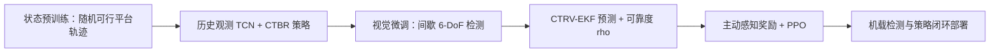

# PerchRL

**PerchRL: Vision-Based Agile Perching on Inclined Platforms under Rapid and Irregular Motion**（arXiv:2606.03441v3）研究四旋翼仅凭机载视觉，在快速、非规则运动的倾斜平台上完成敏捷接触/栖停。核心难点不是单纯估计目标，而是在视场丢失期间决定何时继续追击、何时机动以重获目标，同时不把已经漂移的状态预测当成可靠观测。

## 英文缩写速查

| 缩写 | 全称 | 本文含义 |
|---|---|---|
| FOV | Field of View | 相机视场范围 |
| PPO | Proximal Policy Optimization | 策略优化算法 |
| TCN | Temporal Convolutional Network | 编码平台历史观测的时序卷积网络 |
| EKF | Extended Kalman Filter | 视觉丢失期间预测平台状态 |
| CTBR | Collective Thrust and Body Rates | 策略输出的推力与机体系角速度控制接口 |

## 论文与版本

| 字段 | 内容 |
|---|---|
| 作者（v3） | Zihong Lu, Zongzhuo Liu, Huaxu Li, Yitao Zeng, Jinqiang Cui, Jie Mei, Youmin Gong, U Kei Cheang, Boyu Zhou |
| 单位 | Southern University of Science and Technology；Harbin Institute of Technology, Shenzhen；Peng Cheng Laboratory；Differential Robotics |
| 版本 | arXiv v3，2026-09-19 修订；cs.RO / cs.LG |
| 投稿状态 | STAR Group 页面标注 Submitted to CoRL 2026；不是已接收声明 |
| 论文 | [arXiv:2606.03441v3](https://arxiv.org/abs/2606.03441v3) · [HTML](https://arxiv.org/html/2606.03441v3) · [PDF](https://arxiv.org/pdf/2606.03441v3) |
| 项目页 | [STAR Group — PerchRL](https://robotics-star.com/projects.html)（独立归档见 [项目详情](./perchrl-project.md)） |
| 代码 | 未公开；论文写明 source code will be released |

## 问题设定与主张

目标平台由差速地面车承载，沿快速、非规则轨迹移动，平台面有较大固定倾角。四旋翼相机视场有限，强机动会使平台暂时离开视野。传统“感知—运动预测—约束轨迹优化”依赖准确预测且重规划开销高；早期端到端 RL 又容易记住固定直线/圆形轨迹，并通常把视觉丢失简化成可见性惩罚，缺少估计失效时的可靠性提示。

PerchRL 的核心主张是把可见性作为控制策略显式感知的状态，而不仅是视觉检测器的前端问题：策略既能利用短时运动估计继续进场，也知道这个估计随着失去观测而逐渐不可信，并通过奖励学会兼顾平台追击与视线恢复。

## 方法：两阶段学习管线

### 1. 状态策略预训练

- 每个 episode 生成周期均匀三次 B-spline 平台轨迹；从极坐标控制点采样并平滑，再做全局曲率检查/优化，并随机化平台期望速度与倾角，使轨迹多样且满足差速车的可行性。
- 对速度加入时间相关噪声而非逐帧独立扰动，避免不真实的瞬时速度跳变。
- 观测包含四旋翼自身速度/姿态、最近 (H) 帧平台相对位置/法向/速度/时间戳、可靠度变量及上一时刻动作。历史平台状态由三层 1D TCN 编码后与瞬时量拼接，经 MLP actor 输出动作。
- 使用质量归一化 collective thrust and body rates（CTBR）作为 4 维动作接口。采用 asymmetric actor-critic：critic 额外看到从轨迹采样的未来 15 个特权平台状态；actor 不依赖这些未来真值。
- dense shaping 提供相对位姿引导、终端姿态/速度对齐、平滑动作、机动边界和时间代价；成功接触另有稀疏终端奖励，准确对齐有额外 bonus。

### 2. 视觉策略微调

论文中“vision-based”是系统级视觉输入，不是 raw-pixel policy：相机图像经上游检测器生成间歇式平台 6-DoF 位姿，策略消费的是这些检测及机载自身状态。这样将感知器与控制策略模块化，但检测质量仍是整条系统的依赖项。

- **可见性门控仿真观测：** 使用向下针孔相机模型判定目标是否在视野中；只在检测周期到达且目标可见时产生带噪位姿测量。噪声含各向异性、几何依赖和系统偏差。
- **连续状态估计：** CTRV（constant turn rate and velocity）模型驱动 EKF 持续预测平台状态；观测可用时依据 Mahalanobis 距离门控更新。
- **可见性可靠度：** 当前视觉丢失时长为 (T_t^{loss})，输入可靠度 (
ho_t=exp(-lambda_
ho T_t^{loss}))，可见时 (
ho_t=1)。预测状态因此保持输入连续，而逐渐下降的 (
ho_t) 提示策略不要无限信任 stale prediction。
- **主动感知奖励：** 一项惩罚 EKF 平台位置估计误差并随丢失时长加强；另一项奖励相机光轴朝向目标。与状态增强联合训练，使策略自己学习何时优先重获视觉、何时趁预测可信继续追击。

## 训练、基线与消融

- PPO 基于开源 Omnidrones 工具链；论文报告 8192 个并行环境、100 Hz / 0.01 s 仿真步长、最长 500 步，训练机器为 Intel i7-14700KF + NVIDIA RTX 4080。
- 随机化质量 ±30%、惯量 ±10%、推重比 ±15%、相机安装倾角 ±5°，并将检测频率随机化在 20–60 Hz。
- 状态策略与 Fast-Perching（模型预测规划）、InclineLander（RL）及无 temporal augmentation 变体比较；在往复直线、跑道、8 字等结构化轨迹上，基线按轨迹专门训练至最多 40M steps。论文报告 PerchRL 在各场景成功率最高；无 temporal augmentation 的 MLP 对固定轨迹尚可，但在随机 B-spline 轨迹上训练受阻、速度上升时泛化较差。
- 视觉策略与使用相同两阶段训练策略的 LSTM 基线比较，并消融可靠度/状态增强/主动感知机制。状态增强贡献显著；单独使用状态增强已可达有竞争力的结果；主动感知奖励进一步改善收敛和最终表现，但单独不足以稳健应对视觉丢失。移除 (
ho_t) 后策略会过度信任漂移的 EKF 估计。

## 真机与定量结果

| 平台 / 设置 | 报告结果 |
|---|---|
| Crazyflie 2.1，31.1 g，静态 (90^circ) 斜面 | 状态策略；NOKOV 100 Hz 动捕、离板运行策略，CTBR 由 Crazyflie onboard PID 执行；Velcro 完成接触后固定 |
| 自制四旋翼，610.2 g，推重比 2.26 | PX4 + Jetson Orin NX；机载策略 100 Hz，推理延迟 <1.8 ms；单目 global-shutter 相机 1280×720，FOV 82.96°×52.90°、向下约 15°；CUDA Isaac ROS AprilTag 检测 |
| 移动平台 | Scout Mini 载 42×42 cm 可调倾角铁磁板；四旋翼底部磁铁吸附；NOKOV 只为评测提供地面车真值，不作为策略输入 |
| Normal-I | 平台约 2.0 m/s、70°；成功栖停；报告平面误差 0.21 m、对齐误差 12.12°、法向/切向撞击速度 −0.39/0.31 m/s |
| Hard-I | 平台速度目标随正弦变化，约 0.7–2.7 m/s、70°；10 次中成功 7 次（感知丢失/接触/磁吸失败分别 1/1/1）；平面误差 0.15±0.05 m、对齐误差 7.65±3.94° |
| Hard-II | 1.5–2.2 m/s、70°；10 次中成功 7 次（2/0/1）；平面误差 0.18±0.07 m、对齐误差 8.13±4.08° |

Normal-I/Hard-I 是正文重点展示；六个场景的补充细节在论文视频中。Hard 场景并非全成功，结果表把感知丢失、接触和磁吸分别统计为失败模式。

## 与已有路线对比

| 路线 | 处理方式 | 本文差异 |
|---|---|---|
| 感知 + 运动预测 + 轨迹优化 | 显式预测后优化轨迹 | PerchRL 用高频 RL policy，避免依赖高精度长时预测与频繁规划 |
| 固定轨迹 RL | 在直线/圆等预设运动上训练 | 随机、动力学可行的 B-spline 轨迹与历史编码用于提升未见运动泛化 |
| 仅用可见性惩罚的视觉 RL | 惩罚目标离开视野 | EKF 预测、随丢失时间衰减的可靠度和主动感知奖励联合处理缺测 |
| Raw-image end-to-end | 策略直接消费像素 | 本文策略实际接收上游 detector 的间歇 6-DoF pose，不是像素策略 |

## 贡献与适用边界

适用于：需要在移动平台上快速拦截/栖停，平台轨迹难以预先准确建模，且相机视场可能造成短时目标丢失的四旋翼任务。工程上值得借鉴的是“估计状态连续化 + 明示可靠度 + 主动感知 shaping”的组合，以及用时间历史而非固定轨迹记忆提升运动泛化。

边界与复现注意：

1. 视觉策略依赖外部 AprilTag 检测，控制器本身不从 RGB 端到端学习；更换 marker / detector / 标定后仍需验证检测噪声和延迟是否落在训练分布内。
2. EKF 的 CTRV 运动假设在急转、加减速时会失配；(
ho_t) 是基于丢失时长的置信代理，不等同于经校准的协方差或真实概率。
3. 固定刚性相机与四旋翼欠驱动动力学形成 perception-control coupling。作者在结论中提出 active gimbal 联合控制作为未来方向。
4. 真机移动平台用差速车及铁磁板/磁铁接触，报告场景与失败数有限；Hard-I / II 各 10 次，不应把结果外推成任意倾角、目标检测器或载荷设置下的普遍成功率。
5. 仿真基于 Omnidrones；论文未公开代码、配置、权重或完整复现脚本。工具链开源不代表 PerchRL 实现已开源。

## 结论

PerchRL 把间歇视觉反馈显式纳入策略状态与训练目标：估计器保持输入连续，可靠度信号告诉策略预测何时变得陈旧，主动感知奖励再提供恢复视野的学习信号。仿真与真机结果支持其在本文测试平台上的可行性；Hard 场景 7/10 成功和固定相机/检测器依赖也说明它仍是针对特定视觉栖停系统的验证，而非通用无人机栖停保证。

## 关联页面

- [PerchRL 官方项目页摘录](./perchrl-project.md)
- [Omnidrones 项目 / 论文引用](https://github.com/thu-uav/OmniDrones)（PerchRL 所用工具链；非 PerchRL 代码）
- [论文原始来源归档](../../sources/papers/perchrl_arxiv_2606_03441_v3.md)
- [STAR Group 项目页归档](../../sources/sites/robotics_star_perchrl.md)

## 参考来源

- [论文来源归档](../../sources/papers/perchrl_arxiv_2606_03441_v3.md) — v3 正文方法、训练设置、真机表与局限摘录
- [STAR Group 官方项目页来源](../../sources/sites/robotics_star_perchrl.md) — 项目页、投稿状态与视频链接
