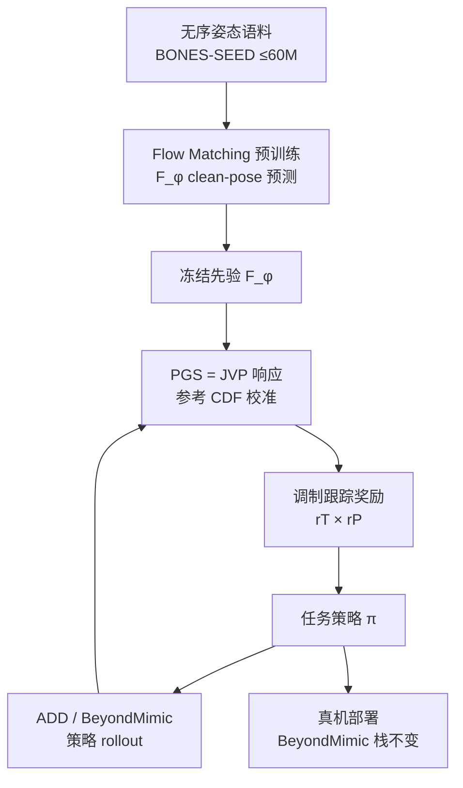

# PFM-HR：面向人形的姿态流匹配先验

**PFM-HR**（*Pose Flow Matching for Humanoid Robots*；[arXiv:2608.03227](https://arxiv.org/abs/2608.03227)，[项目页](https://gaoyukang33.github.io/PFM-HR.web/)，[代码占位](https://github.com/gaoyukang33/PFM-HR)）由 **香港科技大学广州校区 / 诺亦腾机器人 / 清华大学深圳国际研究生院 / 谷歌** 提出：在大规模**无序**人形姿态上预训练可复用 Flow Matching 去噪器，用 **Pose Geometry Score（PGS）** 衡量策略引起的关节协同变化是否落在先验局部几何上，并以此调制跟踪奖励；先验在下游 RL 中保持冻结，可挂到 [ADD](../methods/add.md) 与 [BeyondMimic](../methods/beyondmimic.md)。

## 一句话定义

**用无序姿态训出的冻结 Flow Matching 先验，经 Jacobian–向量积得到的 PGS 去抬高「像语料共变」的姿态转移、压低弱支持转移，从而在不改部署栈的前提下提高高动态跟踪样本效率。**

## 英文缩写速查

| 缩写 | 英文全称 | 简要说明 |
|------|----------|----------|
| PFM-HR | Pose Flow Matching for Humanoid Robots | 本文可复用姿态流匹配先验框架 |
| PGS | Pose Geometry Score | 用去噪 Jacobian 响应度量关节差分是否对齐局部几何 |
| FM | Flow Matching | 连续归一化流式生成建模；本文训姿态边际 |
| PDF-HR | Pose Distance Fields for Humanoid Robots | 冻结姿态距离场对照（需距离对监督） |
| ADD | Adversarial Differential Discriminator | 本文仿真跟踪骨干 |
| SDS | Score Distillation Sampling | SMP 等用扩散/流模型造奖励的路径；本文用 PGS 替代重建式打分 |

## 为什么重要

- **填补姿态先验缺口：** [PDF-HR](./paper-notebook-pdf-hr.md) 只评单个姿态可信度；[SMP](../methods/smp.md) 保留时序但要有序 clip 与更重在线推理。PFM-HR 仍用无序姿态，却用局部几何响应评「关节怎么一起变」。
- **工程可插拔：** 先验与策略解耦、任务间冻结复用；BeyondMimic 真机部署栈不变，只改仿真训练奖励。
- **高动态样本效率：** Backflip / Double Kong 等技能上相对 PDF-HR 更少样本、更低位置误差；ADD 本身可不收敛。

## 核心信息

| 项 | 内容 |
|----|------|
| **机构** | 香港科技大学广州校区（HKUST-GZ）；诺亦腾机器人（Noitom Robotics）；清华大学深圳国际研究生院（SIGS, Tsinghua）；谷歌（Google） |
| **平台** | Unitree G1（文中 \(N_J=29\)）；MimicKit 单轨迹 + LaFAN1 通用跟踪；真机经 BeyondMimic 管线 |
| **先验数据** | BONES-SEED 未镜像姿态；演示规模至 **60M** poses |
| **训练栈** | 8× RTX 4090，4096 并行环境，默认 MimicKit；先验 residual MLP（10 blocks × 1024）+ adaLN-Zero |
| **开源** | **宣称开源 / 实现待发布**：项目页有 Code 链；仓库 tip 仅 MIT + README「Coming Soon」（核查日 2026-08-08） |

## 核心原理

### 方法栈

| 模块 | 机制 |
|------|------|
| Flow Matching 先验 | 路径 \(\boldsymbol{z}_t=t\boldsymbol{x}+(1-t)\boldsymbol{\epsilon}\)；学 clean-pose 映射 \(F_\phi\)；数据当无序集合 |
| 局部几何解释 | 人口最优去噪 Jacobian \(\propto\) 条件协方差；方向响应反映关节共变模态 |
| PGS | 对归一化差分 \(\boldsymbol{d}_k\) 算 \(\|J_\phi\boldsymbol{d}_k\|_2^2\)（一次 JVP）；\(t_{\mathrm{eval}}=0.75\) |
| 参考校准调制 | 参考上建 PGS 经验 CDF → 分位 \(\rho\) → \(r^{P}=\exp(-\alpha\rho)\) 乘在跟踪项上 |

### 流程总览

## 源码运行时序图

**不适用（可运行训练 / 推理入口尚未发布）。** 截至 2026-08-08：项目页 Code 指向 [gaoyukang33/PFM-HR](https://github.com/gaoyukang33/PFM-HR)，但 tip 仅有 MIT `LICENSE` 与 README「Coming Soon ！！！」，无 `train` / `eval` / checkpoint。正式 release 后应补：姿态语料准备 → FM 预训练 → 参考 PGS CDF → ADD/BeyondMimic 挂载训练 →（可选）真机部署的 `sequenceDiagram`。

## 工程实践

| 项 | 建议 / 论文设定 |
|----|----------------|
| 何时挂 PFM-HR | 高动态单轨迹或通用跟踪样本吃紧；已有 ADD / BeyondMimic 骨干 |
| 相对 PDF-HR | 不想付距离对采样成本、需要「姿态转移」而非「单姿态距离」时优先 PFM-HR |
| 相对 SMP | 只有无序姿态、或要压在线先验开销时选 PFM-HR；需要时序似然/方向时仍看 SMP |
| \(t_{\mathrm{eval}}\) | 默认 **0.75**；过低欠特异、过高近恒等 |
| 校准 | 每条参考先算 PGS 经验 CDF；\(p_{\mathrm{good}}=0.05\)、\(p_{\mathrm{bad}}=0.01\)、\(\alpha=0.5\) |
| 扩展先验 | 继续训练扩展语料（30M→60M ≈65 GPU-h）优于盲目从头 |
| 复现现状 | **等官方代码**；当前只能读论文/项目页选型，不能按仓复现 |

## 实验与评测

- **单轨迹（MimicKit 9 技能）：** PFM-HR 在六项上样本最优；Backflip / Double Kong 上 ADD 失败，PFM-HR 相对 PDF-HR 更快收敛且位置误差更低（项目页：Backflip **−14.3%** 样本 / **−6.3%** \(E^{\mathrm{pos}}\)；Double Kong **−28.8%** / **−9.7%**）。
- **通用跟踪（LaFAN1 34 段，12B samples）：** 10/20/30 s 上位置与旋转误差均最低；相对 ADD 位置误差均约 **−7.6%**，相对 PDF-HR 约 **−10.3%**。
- **BeyondMimic 真机管线：** Table I 四技能达 \(SR\geq80\%\) 仿真样本均最少；相对原 BM 约 **−15.1%–30.8%**。
- **消融：** 60M 先验整体最强；x-pred 优于 v-pred（动态技能）；PGS 优于同先验 FM-Recon；JVP **0.75 ms** vs 三水平重建 **1.8 ms**（4096 / 4090）。

## 结论

**PFM-HR 把「冻结姿态先验」从单姿态距离推进到可对关节差分打分的局部几何响应；真影响指标是高动态跟踪样本效率与跨任务复用，而不是新的部署栈。**

1. **真影响：PGS 评的是转移方向，不是姿态绝对值** — 相对 PDF-HR 在 Backflip / Double Kong 等技能上更省样本、更准。
2. **真影响：先验与策略解耦** — 一次预训练、多任务冻结挂载；BeyondMimic 部署零改动。
3. **真影响：无序大数据可扩展** — 60M 姿态与 continue-train 路径降低相对距离场监督的准备成本。
4. **次要代价：无时序方向敏感性** — 反向差分可能得相近分数；分布外姿态引导变弱。
5. **部署读法：** 仿真训练加奖励调制即可；真机不跑先验前向。
6. **工程读法：代码 Coming Soon** — 当前适合方法选型与对照 PDF-HR/SMP；复现等官方 release。

## 与其他工作对比

| 对照 | 差异读法 |
|------|----------|
| [PDF-HR](./paper-notebook-pdf-hr.md) | 姿态距离场 + 距离对监督；PFM-HR 用 FM + PGS 评关节差分，同语料对照下动态技能更强 |
| [SMP](../methods/smp.md) | 时序扩散/score + SDS；要有序 clip、在线更重；PFM-HR 走无序姿态 + JVP |
| [ADD](../methods/add.md) | 对抗差分判别骨干；PFM-HR 是可插拔冻结几何先验，不替代 ADD |
| [BeyondMimic](../methods/beyondmimic.md) | 跟踪/蒸馏/引导全栈；PFM-HR 仅增强其仿真训练阶段的跟踪奖励 |
| AMP 族对比页 | 见 [AMP / ADD / SMP 变体](../comparisons/amp-add-smp-motion-prior-variants.md) 旁注：姿态几何先验另一轴 |

## 局限与风险

- **开源未落地：** 仓库占位，无法核对超参、权重或 MimicKit 集成细节。
- **边际几何 ≠ 动力学时序：** 不能替代需要方向/顺序约束的时序先验。
- **语料覆盖决定上限：** 先验未见过的姿态区域，PGS 可能误导或失效。
- **对照范围：** 主表在 ADD 插件设定下比 PDF-HR；与 SMP 因控制公式不同未做同骨干对照。

## 关联页面

- [BeyondMimic](../methods/beyondmimic.md) — 真机部署宿主管线
- [ADD](../methods/add.md) — 仿真跟踪骨干
- [PDF-HR](./paper-notebook-pdf-hr.md) — 冻结姿态距离场直接对照
- [CMP](./paper-cmp.md) — 同组相邻 arXiv（2608.03234）：软重权 AMP/SMP 参考监督，不改姿态流形
- [SMP](../methods/smp.md) — 冻结时序生成先验对照
- [MimicKit](./mimickit.md) — 单轨迹实验框架
- [运动跟踪方法选型](../queries/humanoid-motion-tracking-method-selection.md)
- [AMP / ADD / SMP 对比](../comparisons/amp-add-smp-motion-prior-variants.md)
- [具身智能小站 9 篇盘点（2026-08-11）](../../sources/blogs/wechat_embodied_station_ego2robot_mango_grasp_2026-08-11.md) — 把 PFM-HR 放进「接口意识」综述，不另造节点

## 参考来源

- [pfm_hr_arxiv_2608_03227.md](../../sources/papers/pfm_hr_arxiv_2608_03227.md) — 论文摘录与开源核查
- [pfm-hr-web.md](../../sources/sites/pfm-hr-web.md) — 项目页归档
- [pfm-hr.md](../../sources/repos/pfm-hr.md) — GitHub 占位仓归档
- [具身智能小站 9 篇盘点](../../sources/blogs/wechat_embodied_station_ego2robot_mango_grasp_2026-08-11.md)
- [arXiv:2608.03227](https://arxiv.org/abs/2608.03227) — 原文（Submitted 2026-08-04）
- [项目页](https://gaoyukang33.github.io/PFM-HR.web/)

## 推荐继续阅读

- [PFM-HR 项目页（方法概览与真机视频）](https://gaoyukang33.github.io/PFM-HR.web/)
- [PDF-HR（arXiv:2602.04851）](https://arxiv.org/abs/2602.04851) — 同团队姿态距离场先验
- [BeyondMimic（arXiv:2508.08241）](https://arxiv.org/abs/2508.08241) — 部署宿主
