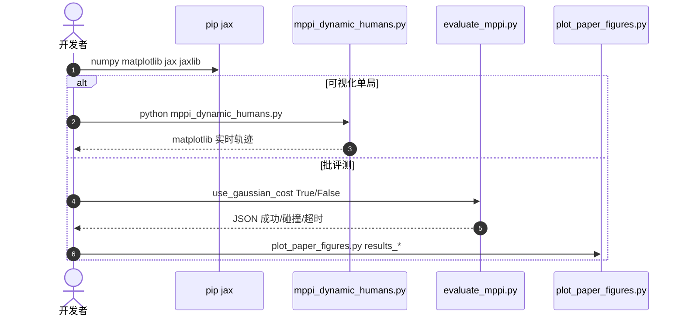

# PGIF-MPPI：社交导航的安全成本必须面向未来

**PGIF**（*Predictive Gaussian Interaction Fields*；[arXiv:2608.08323](https://arxiv.org/abs/2608.08323)，[代码](https://github.com/ChinmayMundane/PGIF_MPPI)）由 **Chinmay Mundane（VJTI）** 提出（HFR 2026）：很多 MPPI 实现把行人当成当前位置的静态点，于是在交叉与汇合里低估风险。

## 一句话定义

**把行人运动学预测沿整个规划时域铺成沿行进方向拉长、随速度变宽的高斯排斥场——从前方进入比从背后靠近更贵，且闭式可并行。**

## 英文缩写速查

| 缩写 | 英文全称 | 简要说明 |
|------|----------|----------|
| PGIF | Predictive Gaussian Interaction Fields | 本文时空代价 |
| MPPI | Model Predictive Path Integral | 采样式滚动规划 |
| SFM | Social Force Model | 反应式对照，无长时域 |
| ORCA | Optimal Reciprocal Collision Avoidance | 互惠避障假设常被打破 |
| JAX | — | 官方实现对 rollouts 做 vmap |

## 为什么重要

- 「人现在在哪」规划出来的轨迹，执行时人已经走进去了。
- 各向同性占用或离散栅格要么过保守、要么吃掉 MPPI 的并行优势。
- 300 场景碰撞率从最高 82% 降到 0%，同时步时仍约 3 ms，说明这条代价几乎免费。

## 核心信息

| 项 | 内容 |
|----|------|
| **机构** | VJTI（印度；机构表无 alias） |
| **评测** | 300 随机走廊场景 × 三密度 |
| **开源** | **已开源**（MIT，JAX 仿真） |

## 核心原理

### 方法栈

unicycle 状态 \([x,y,\psi,v]\)。每步：估计行人位置速度 → 沿 horizon 运动学前向 → 各向异性高斯场（主轴对齐速度，前向 \(\sigma\) 随速率增大）→ MPPI \(K=512\)、\(T=40\)、\(\Delta t=0.1\) s。总代价 = 目标 + 终端 + 路径 + 人（\(w_{\mathrm{human}}=10^6\)）。软代价，不是硬约束，无 CBF 式保证。

### 流程总览

## 源码运行时序图

官方仓 [ChinmayMundane/PGIF_MPPI](https://github.com/ChinmayMundane/PGIF_MPPI)（归档见 [sources/repos/pgif-mppi.md](../../sources/repos/pgif-mppi.md)）：

- **最短复现：** `python mppi_dynamic_humans.py`；或改 `evaluate_mppi.py` 底部 `evaluate_seeds(...)` 后跑 100 seed。

## 工程实践

| 项 | 建议 |
|----|------|
| 权重 | \(w_{\mathrm{human}}\) 过大 → Hard 超时；过小 → 撞人。文中 \(10^6\) |
| 预测器 | 短 horizon 用常速足够；可换成更好的行人模型，场公式不用改 |
| 读超时 | Hard 59% 超时是安全换进度，不是实现 bug |
| 真机 | 仓是仿真走廊；实机还要接行人检测与定位噪声 |

## 实验与评测

| 密度 | Vanilla 成功/碰撞 | PGIF 成功/碰撞/超时 | PGIF 路径 (m) / ms |
|------|------------------:|--------------------:|-------------------:|
| Easy | 78 / 22 | **93 / 0 / 7** | 14.43 / 3.06 |
| Medium | 29 / 71 | **78 / 0 / 22** | 16.87 / 3.23 |
| Hard | 18 / 82 | **41 / 0 / 59** | 18.75 / 3.42 |

Vanilla 的短路径来自提前撞停。PGIF 主动绕行，路径更长。步时略低于 vanilla，与闭式并行一致。

## 与其他工作对比

相对 SFM/ORCA：有长时域，且不假设人会给机器人让路。相对 DRA-MPPI：用连续各向异性场而不是碰撞概率蒙特卡洛。相对 [社交导航正负样本学习](./paper-notebook-learning-social-navigation-from-positive-and-neg.md)：那条是学策略，本条是 **可检查的代价项**。相对 [PEEL](./paper-peel-disassembly.md)：同为采样规划，对象从装配体换成行人。

## 结论

**社交导航里把人写成当前点障碍，等于在用过期地图做 MPPI。**

1. **场要对齐速度** — 各向同性核分不清「迎面」和「从后」。
2. **闭式并行** — 才能在 3 ms 级保住 MPPI 频率。
3. **0 碰撞不是 0 代价** — Hard 超时 59%，要另做解冻策略。
4. **软代价无证明** — 安全宣传应写成实证，不要写成保证。
5. **仿真仓可跑** — 先复现 300 seed，再谈 ROS 接入。

## 局限与风险

- 高密度预测场占满走廊，机器人选择等待（与经典 freezing 成因不同：这里是未来风险过权）。
- 行人状态来自仿真真值；检测漏检会让场消失。
- 未在真机人群验证。

## 关联页面

- [MPPI](../methods/mppi.md)
- [MPC](../methods/model-predictive-control.md)
- [PEEL](./paper-peel-disassembly.md)
- [社交导航正负样本](./paper-notebook-learning-social-navigation-from-positive-and-neg.md)
- [SurgLAT](./paper-surglat.md) — 另一条把「未来/意图」写成可执行成本的闭环

## 参考来源

- [PGIF-MPPI 论文摘录](../../sources/papers/pgif_mppi_arxiv_2608_08323.md)
- [代码仓归档](../../sources/repos/pgif-mppi.md)
- [具身智能小站 9 篇盘点（2026-08-17）](../../sources/blogs/wechat_embodied_station_9_papers_2026-08-17.md)
- [arXiv:2608.08323](https://arxiv.org/abs/2608.08323)

## 推荐继续阅读

- [ChinmayMundane/PGIF_MPPI](https://github.com/ChinmayMundane/PGIF_MPPI)
- Williams et al., MPPI 原论文（文内引用）
