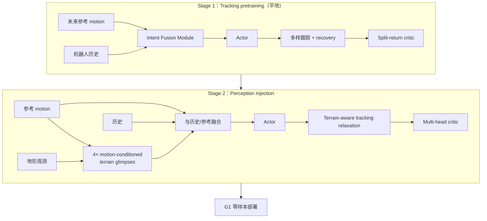

# PGMT：人形感知通用动作跟踪

**PGMT**（*Perceptive General Motion Tracking for Humanoid Robots*，[arXiv:2609.08511](https://arxiv.org/abs/2609.08511)，[项目页](https://luyili.github.io/pgmt/)）由 **浙江大学**（Center of X-Mechanics）、**新加坡国立大学**（MARMot Lab）与 **MirrorMe Technology** 的 Hongyi Li、Peizhuo Li、Yucheng Tao 等提出：在通用全身 motion tracking 已能复现多样动作的前提下，**平地策略在复杂地形上会因参考动作物理不可行而崩溃**。PGMT 用 **独立选取的运动参考与地形** 学习地形适应，把感知注入 tracking 策略而非另起一套 locomotion 控制器。

## 一句话定义

**先学会平地跟踪与跌倒恢复，再用 motion-conditioned terrain glimpses 让同一策略在复杂地形上「偏离参考但保留意图」。**

## 英文缩写速查

| 缩写 | 英文全称 | 简要说明 |
|------|----------|----------|
| PGMT | Perceptive General Motion Tracking | 本文：感知增强的通用动作跟踪 |
| GMT | General Motion Tracking | 地形无关的全身参考跟踪基线类方法 |
| IFM | Intent Fusion Module | 融合机器人历史与未来参考 motion token |
| WBT | Whole-Body Tracking | 全身运动跟踪；与 WBC 低层控制区分 |
| G1 | Unitree G1 Humanoid | 29-DoF 真机验证平台 |
| LiDAR | Light Detection and Ranging | 机载 Livox Mid-360S 地形感知 |

## 为什么重要

- **统一控制器：** 同一策略覆盖地形适应 locomotion、多样全身行为、遥操作与跌倒恢复，避免「平地 tracker + 山地 planner」硬切换。
- **感知注入方式可迁移：** motion-conditioned **terrain glimpses** 只编码与当前动作相关的地形区域，而不是全局高程图硬喂入。
- **真机数字可读：** G1 **零样本** 过最高 **37 cm** 障碍；onboard 为 Mid-360S + Jetson Orin NX，与 [P³](./paper-p3.md) 等同 G1 感知栈可对照。

## 核心信息

| 项 | 内容 |
|----|------|
| **机构** | 浙江大学；新加坡国立大学（NUS）；MirrorMe Technology |
| **平台** | Unitree G1，29 DoF |
| **感知** | Livox Mid-360S LiDAR → 地形观测 |
| **训练** | 两阶段 RL（见流程总览） |
| **开源** | **截至 2026-09-10 未开源**（项目页无 GitHub / 权重） |

## 流程总览

## 核心原理

1. **先验再感知：** Stage 1 在平地学到 **通用跟踪与 recovery**；Stage 2 冻结该能力骨架，只注入地形相关观测与目标，避免从零联合优化导致跟踪退化。
2. **Terrain glimpses：** 四个与 **当前 motion 条件化** 的地形局部编码，把注意力放在「这一步脚/身体将要交互」的区域，而非整张 elevation map。
3. **Tracking relaxation：** 允许下肢为地形接触 **必要偏离参考**，上肢与 motion **意图** 仍被约束——区别于单纯增大 tracking 容差或完全放弃参考。
4. **Split-return critic（Stage 1）：** 把跟踪与 recovery 等子目标在价值学习上拆开，减轻单一 return 在多行为模式间的梯度冲突。

## 源码运行时序图

**不适用** — 截至 **2026-09-10** 项目页未列官方 GitHub 或可运行训练/部署入口。

## 实验与评测

- **真机：** Unitree G1 零样本；复杂真实地形障碍最高 **37 cm**；涵盖遥操作、动态 motion tracking、跌倒恢复（项目页视频）。
- **对照读法：** 相对 **地形无关 GMT**，核心增益在「参考仍多样但地形使参考不可行」的场景，而非平地舞蹈精度。
- **横向：** 与 [WM-LOCO](./paper-wm-loco.md)（世界模型特征 + 踏石）、[P³](./paper-p3.md)（VAE-PPO 边缘似然）同属 G1 复杂地形线，但 PGMT 改的是 **tracking + 感知融合**，不是 PPO 似然或 WM 表征。

## 与其他工作对比

| 对照路线 | 差异 |
|----------|------|
| 地形无关 GMT（平地通用跟踪） | PGMT 的增益集中在「参考仍多样但地形使参考物理不可行」的场景，而非平地舞蹈跟踪精度。 |
| [WM-LOCO](./paper-wm-loco.md) | 同为 G1 复杂地形线，但改的是 **世界模型特征 + 踏石** 表征；PGMT 改的是 tracking 策略内的感知融合。 |
| [P³](./paper-p3.md) | 同为 G1 复杂地形线，走 **VAE-PPO 边缘似然** 的训练目标改造；PGMT 不动 PPO 目标，只加 motion-conditioned glimpses 与 relaxation。 |
| [SONIC](../methods/sonic-motion-tracking.md) / BeyondMimic 类 | 偏 **规模化参考跟踪**（参考库与跟踪保真度）；PGMT 补的是 **地形感知偏离** 这一维，两者可叠。 |
| 单纯放大 tracking 容差 | 只放松约束会同时丢上肢意图；PGMT 的 relaxation 是 **下肢可偏、意图仍受约束** 的分部处理。 |
| 另起一套 locomotion 控制器 | 常见做法是 tracking 与感知行走分两套策略切换；PGMT 保持 **单一策略** 同时覆盖 GMT、复杂地形、遥操作与 recovery。 |

## 结论

**PGMT 把「通用 motion tracking」从平地推到可感知地形，关键不是换参考库，而是在 tracking 策略内用 motion-conditioned glimpses 做选择性地形适应。**

1. **两阶段顺序不能省** — 没有平地 recovery 先验，Stage 2 容易学成保守站立而非跟踪。
2. **glimpses 卖的是选择性** — 全图高程喂入不等于本文贡献；条件是当前 motion。
3. **relaxation 是意图保留** — 下肢可偏、上肢/语义意图应仍在；读 demo 时区分「歪脚」与「丢动作」。
4. **37 cm 是部署锚点** — 零样本 G1 + onboard LiDAR；仿真细节以 PDF 为准。
5. **复现材料未落地** — 截至入库日无代码；数字与视频可引用，训练不能按论文复跑。

## 工程实践

| 项 | 建议 |
|----|------|
| 何时引用 | 需要 **单一策略** 同时做 GMT、复杂地形、遥操作与 recovery |
| 感知栈 | Mid-360S + Orin NX 为论文 onboard；换传感器需重训 glimpses 编码 |
| 与 SONIC/BeyondMimic | 那些偏 **规模化参考跟踪**；PGMT 补 **地形感知偏离** 这一维 |
| 开源跟进 | 盯 [项目页](https://luyili.github.io/pgmt/) Code 区与作者 GitHub |

## 关联页面

- [Whole-Body Tracking Pipeline](../concepts/whole-body-tracking-pipeline.md)
- [SONIC](../methods/sonic-motion-tracking.md)
- [Unitree G1](./unitree-g1.md)
- [WM-LOCO](./paper-wm-loco.md)

## 参考来源

- [`pgmt_arxiv_2609_08511.md`](../../sources/papers/pgmt_arxiv_2609_08511.md)
- [`pgmt.md`](../../sources/sites/pgmt.md)
- [arXiv:2609.08511](https://arxiv.org/abs/2609.08511)

## 推荐继续阅读

- [PGMT 项目页](https://luyili.github.io/pgmt/)
- [原文 PDF](https://arxiv.org/pdf/2609.08511)
