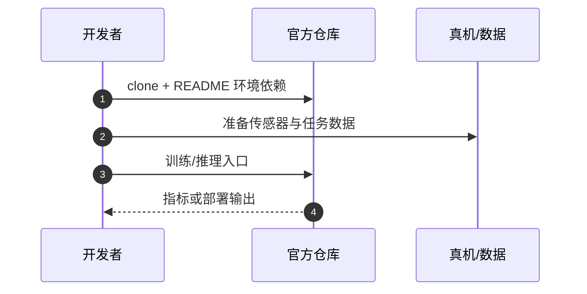

# PhaseLoRA（arXiv:2608.15285）

**PhaseLoRA**（*PhaseLoRA: Control-Regime-Conditioned Low-Rank Adaptation for Continuous-Action Vision-Language-Action Policies*，[arXiv:2608.15285](https://arxiv.org/abs/2608.15285)）收录于 [多模空间 · 一周 VLA 研究趋势简析（2026.08.10–08.16）第四篇](../../sources/blogs/wechat_duomo_vla_weekly_trends_2026-08-10_part4.md) **训练范式** 段。

## 一句话定义

**按操作阶段（精细控制倾向 + 事件强度弱监督）动态调整 action expert 内 LoRA 方向，骨干大多冻结。**

## 英文缩写速查

| 缩写 | 英文全称 | 简要说明 |
|------|----------|----------|
| VLA | Vision-Language-Action | 视觉–语言–动作策略 |
| VLM | Vision-Language Model | 视觉–语言多模态模型 |
| RL | Reinforcement Learning | 强化学习 |
| PRM | Process Reward Model | 过程/进度奖励模型 |
| OOD | Out-of-Distribution | 分布外场景或轨迹 |

## 为什么重要

- 抓取–接触–移动需不同控制律；统一 LoRA 难以分阶段适配。
- 策展机构：清华大学
- 开源结论：**已开源**（步骤 2.5，2026-09-27）。

## 核心机制

| 项 | 内容 |
|----|------|
| **arXiv** | [2608.15285](https://arxiv.org/abs/2608.15285) |
| **开源** | **已开源** |
| **文内评测** | LIBERO；AgileX PiPER 实机 |

## 源码运行时序图

节点对齐 [`sources/repos/phaselora.md`](../../sources/repos/phaselora.md) 与 README 入口。

## 实验与评测

- **文内口径：** LIBERO；AgileX PiPER 实机
- **读法：** 本页为 [公众号策展](../../sources/blogs/wechat_duomo_vla_weekly_trends_2026-08-10_part4.md) 摘要；逐项指标以 **原文 PDF** 为准。

## 与其他工作对比

| 对照 | 差异读法 |
|------|----------|
| [第四篇技术地图](../overview/vla-weekly-trends-2026-08-10-part4-technology-map.md) | 同批 14 篇横向索引；本文属 **训练范式** |
| [VLA 方法页](../methods/vla.md) | 单篇机制细节以原文为准 |

## 结论

**PhaseLoRA 适合作为本期「训练范式」路线的快速索引页。**

1. 核心贡献：按操作阶段（精细控制倾向 + 事件强度弱监督）动态调整 action expert 内 LoRA 方向，骨干大多冻结。
2. 开源结论：**已开源** — 以项目页/仓库实际链接为准。
3. 横向对照见 [第四篇技术地图](../overview/vla-weekly-trends-2026-08-10-part4-technology-map.md)。

## 关联页面

- [VLA（Vision-Language-Action）](../methods/vla.md)
- [一周 VLA 趋势技术地图（第四篇）](../overview/vla-weekly-trends-2026-08-10-part4-technology-map.md)

## 参考来源

- [wechat_duomo_vla_weekly_trends_2026-08-10_part4.md](../../sources/blogs/wechat_duomo_vla_weekly_trends_2026-08-10_part4.md)
- [arXiv:2608.15285](https://arxiv.org/abs/2608.15285)

## 推荐继续阅读

- [VLA 方法页](../methods/vla.md)
- [arXiv PDF](https://arxiv.org/pdf/2608.15285)
