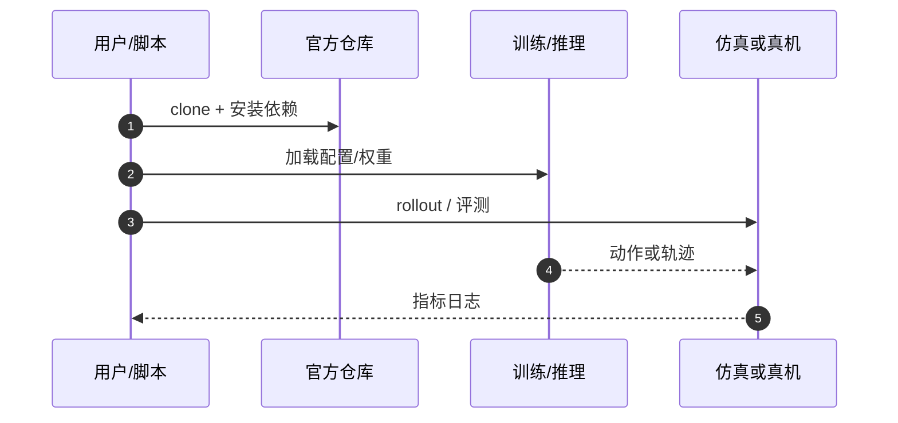

# ϕ-RIE（arXiv:2609.26795）

**ϕ-RIE**（*ϕ-RIE: From Photorealistic Reconstruction to Interactive Environments*，[arXiv:2609.26795](https://arxiv.org/abs/2609.26795)，[项目页](https://insait-institute.github.io/PhiRIE/)，[代码](https://github.com/insait-institute/PhiRIE)）来自 [具身智能小站 12 篇盘点](../../sources/blogs/wechat_embodied_station_12_papers_collab_wm_2026-09-23.md)。

## 一句话定义

**选定物体转可移动 simulator asset，移除并补全原高斯，解决 3DGS 不支持独立运动与遮挡后景暴露。**

## 英文缩写速查

| 缩写 | 英文全称 | 简要说明 |
|------|----------|----------|
| 3DGS | 3D Gaussian Splatting | 三维高斯溅射重建 |
| RIE | Reconstruction to Interactive Environments | 重建到交互环境 |
| F1 | F1 Score | 匹配精度指标 |
| Sim | Simulation | 物理/图形仿真环境 |

## 为什么重要

- 照片级重建不等于可交互仿真；需要物体级资产与背景 inpainting 才能做 manipulation 闭环。
- 开源结论：**已开源**（步骤 2.5，2026-09-23）。
- 与 [12 篇技术地图](../overview/collab-wm-12-papers-technology-map.md) 中同类工作可横向对照。

## 核心机制

| 项 | 内容 |
|----|------|
| **arXiv** | [2609.26795](https://arxiv.org/abs/2609.26795) |
| **开源** | **已开源** |
| **要点** | 高斯场景分解 + 物体 sim asset + 背景补全；ScanNet++ 50 场景评测。 |
| **文内指标** | 20 mm 匹配 F1：0.336→0.383；具体任务以原文为准。 |

## 源码运行时序图

## 实验与评测

- 20 mm 匹配 F1：0.336→0.383；具体任务以原文为准。
- **读法：** 索引级摘要；逐项对照与 baseline 以原文 PDF 为准。

## 与其他工作对比

- 横向索引见 [12 篇技术地图](../overview/collab-wm-12-papers-technology-map.md)；与同 arXiv 节点不重复造页。

## 结论

**ϕ-RIE 桥接重建与交互仿真；开源代码可复现几何/资产管线。**

1. 开源边界：**已开源** — 以项目页实际链接为准（入库日 2026-09-23）。
2. 核心机制：高斯场景分解 + 物体 sim asset + 背景补全；ScanNet++ 50 场景评测。…
3. 部署前核对任务协议与硬件条件，勿直接横比公众号摘录数字。

## 关联页面

- [sim2real](../concepts/sim2real.md)
- [generative-world-models](../methods/generative-world-models.md)
- [manipulation](../tasks/manipulation.md)
- [paper-triworldbench](./paper-triworldbench.md)

## 参考来源

- [phi-rie_arxiv_2609_26795.md](../../sources/papers/phi-rie_arxiv_2609_26795.md)
- [wechat_embodied_station_12_papers_collab_wm_2026-09-23.md](../../sources/blogs/wechat_embodied_station_12_papers_collab_wm_2026-09-23.md)
- [arXiv:2609.26795](https://arxiv.org/abs/2609.26795)

## 推荐继续阅读

- [arXiv PDF](https://arxiv.org/pdf/2609.26795)
- [项目页](https://insait-institute.github.io/PhiRIE/)
- [https://github.com/insait-institute/PhiRIE](https://github.com/insait-institute/PhiRIE)

